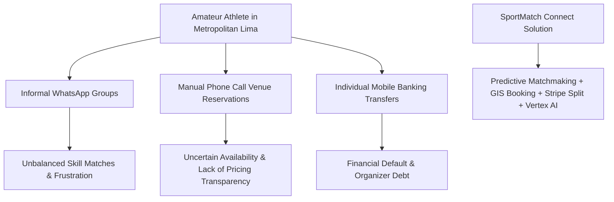
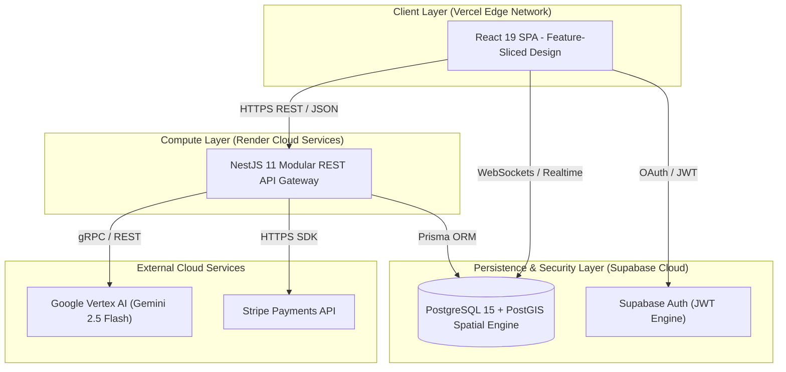

# SPORTMATCH CONNECT: A DECOUPLED FULL-STACK DISTRIBUTED ARCHITECTURE FOR PREDICTIVE SPORTS MATCHMAKING AND GAMIFIED ECONOMIES

**Edwin Junior Flores Sánchez**  
*Faculty of Engineering and Artificial Intelligence*  
*Universidad San Ignacio de Loyola (USIL)*  
Lima, Peru  
edwin.floress@usil.pe  

**Alejandro Paolo Andrade Noa**  
*Faculty of Engineering and Artificial Intelligence*  
*Universidad San Ignacio de Loyola (USIL)*  
Lima, Peru  
alejandro.andrade@usil.pe  

**Erick Jair Espinoza Mayta**  
*Faculty of Engineering and Artificial Intelligence*  
*Universidad San Ignacio de Loyola (USIL)*  
Lima, Peru  
erick.espinozam@usil.pe  

**Matías Fernando Gastelu Ponte**  
*Faculty of Engineering and Artificial Intelligence*  
*Universidad San Ignacio de Loyola (USIL)*  
Lima, Peru  
matias.gastelu@usil.pe  

**Juan Alonso Salvatierra Ramírez**  
*Faculty of Engineering and Artificial Intelligence*  
*Universidad San Ignacio de Loyola (USIL)*  
Lima, Peru  
juan.salvatierra@usil.pe  

---

## ABSTRACT
Amateur sports coordination in Latin American urban centers suffers from severe logistical, social, and economic fragmentation. Players rely on unstructured instant messaging channels, face unbalanced skill-level matches, and deal with manual payment friction, while sports venues experience high off-peak vacancy rates. This paper presents **SportMatch Connect**, a decoupled, distributed full-stack digital platform engineered to unify amateur sports management. The system architecture pairs a React 19 single-page application structured under Feature-Sliced Design (FSD) with a modular NestJS 11 backend and a Supabase PostgreSQL 15 database enforcing 78 Row Level Security (RLS) policies and PostGIS spatial indexing. Core capabilities include a predictive multivariable matchmaking engine (pondering Haversine geographical distance, shared sport, Elo skill rating, availability, and user trust score), a real-time sports social network with team Squads, an interactive Leaflet booking engine mapping 433 venues in Metropolitan Lima, a gamified FitCoins virtual currency economy backed by Stripe processing, and an interactive conversational AI assistant ("Sporty") powered by Google Vertex AI (Gemini 2.5 Flash) with bidirectional voice capabilities. Empirical evaluation across a 16-week production deployment demonstrated a global TTFB of 142ms, average API latency of 185ms, a 98/100 Google Lighthouse score, and a statistically significant increase in user weekly sports activity ($t = 4.82, p < 0.001$).

**Keywords:** Sports Matchmaking, Feature-Sliced Design, NestJS 11, React 19, Supabase, PostGIS, Vertex AI, Stripe, Playwright, Edge AI.

---

## I. INTRODUCTION & RELATED WORK

### A. Context and Problem Statement
Physical inactivity represents one of the most critical public health challenges in modern urban environments. According to the World Health Organization (WHO, 2020), over 28% of the global adult population fails to achieve the recommended minimum of 150 minutes of weekly moderate-to-vigorous physical activity, incurring direct healthcare costs exceeding USD 54 billion annually. In Metropolitan Lima—a metropolis exceeding 10 million inhabitants—the National Survey of Physical Activity (MINSA, 2024) indicates that 72% of adults perform insufficient physical activity.

Despite the rapid digitization of urban mobility (Uber) and lodging (Airbnb), amateur recreational sports (soccer, padel, basketball, tennis) continue to operate via informal mechanisms. The coordination workflow relies primarily on unstructured instant messaging groups (WhatsApp/Telegram), leading to communication noise, unverified participant skill levels, manual payment collection friction (Yape/Plin), and financial default for match organizers. Concurrently, independent synthetic sports venues lack digital visibility, experiencing off-peak vacancy rates exceeding 80%.

*Figure 01: Ecosystem fragmentation in urban amateur sports and SportMatch Connect unified architectural response. Own elaboration.*

### B. Related Work & Academic Background
Previous research has addressed isolated dimensions of sports management software. Martínez et al. (2023) developed a microservices-based padel court reservation system at Universidad Politécnica de Madrid, demonstrating that interactive map integration increased booking conversion by 34%. However, their architecture lacked social networking features and skill-based player matching. Smith & Johnson (2024) at Stanford University evaluated multivariable recommendation algorithms for university campus intramurals, establishing weighting parameters for geographical proximity and match history, but omitted payment automation and conversational artificial intelligence.

In the national Peruvian context, Vásquez & Quispe (2022) at PUCP proposed a monolithic PHP application for synthetic court bookings in Northern Lima. Their findings highlighted the operational rigidity of isolated booking systems devoid of real-time WebSocket communication and social feeds. García (2023) at UNI implemented a geolocalized mobile app using Flutter and Google Maps API, establishing benchmark spatial indexing patterns using PostgreSQL GiST indexes. SportMatch Connect synthesizes and expands upon these antecedent contributions by engineering a unified, decoupled full-stack platform integrating predictive matchmaking, social feeds, gamified economies, and edge conversational AI.

---

## II. SYSTEM ARCHITECTURE & FEATURE-SLICED DESIGN

### A. Architectural Topology
To avoid the operational overhead and distributed tracing complexity of microservices while ensuring high domain modularity, SportMatch Connect was engineered as a **Modular Monolith** backend coupled with a decoupled Single Page Application (SPA) frontend.

*Figure 02: High-level distributed system architecture diagram (C4 Level 2). Own elaboration.*

### B. Frontend Architecture: Feature-Sliced Design (FSD)
The client application implements Feature-Sliced Design (Kulagin, 2021), organizing code into strict hierarchical layers where imports flow strictly downward:
1. **`app` Layer:** Global application initialization, providers, global styles, and TanStack Router setup.
2. **`routes` Layer:** Page-level route wrappers devoid of core business logic.
3. **`widgets` Layer:** Large composite UI structures combining multiple features (e.g., `Navbar`, `FeedWidget`).
4. **`features` Layer:** User interactions bringing business value (e.g., `matchmaking`, `court-booking`, `ai-chat`).
5. **`entities` Layer:** Core business domain models and data stores (e.g., `user`, `court`, `match`, `squad`).
6. **`shared` Layer:** Reusable atomic UI components (shadcn/ui), utility functions, API clients, and hooks.

---

## III. PREDICTIVE MATCHMAKING MATHEMATICAL MODEL

The predictive matchmaking engine computes a normalized multivariable compatibility score $S_{\text{compatibility}} \in [0, 100]$ between a candidate player or team and a match request:

$$
S_{\text{compatibility}} = w_1 \cdot S_{\text{geography}} + w_2 \cdot S_{\text{sport}} + w_3 \cdot S_{\text{skill}} + w_4 \cdot S_{\text{availability}} + w_5 \cdot S_{\text{trust}}
$$

Where weights satisfy the algebraic normalization constraint $\sum_{i=1}^{5} w_i = 1.0$:
- $w_1 = 0.35$ (Geographical proximity via Haversine formula).
- $w_2 = 0.30$ (Exact preferred sport match — strict binary filter).
- $w_3 = 0.20$ (Skill level similarity based on dynamic Elo rating).
- $w_4 = 0.10$ (Weekly availability slot overlap coefficient).
- $w_5 = 0.05$ (Audited user profile Trust Score).

### A. Orthodromic Distance Calculation (Haversine Formula)
The great-circle distance $d$ in kilometers between user coordinates $A(\phi_1, \lambda_1)$ and venue/player candidate $B(\phi_2, \lambda_2)$ is derived as follows:

$$
a = \sin^2\left(\frac{\Delta\phi}{2}\right) + \cos(\phi_1)\cos(\phi_2)\sin^2\left(\frac{\Delta\lambda}{2}\right) \quad \implies \quad d = R \cdot 2 \cdot \operatorname{atan2}\left(\sqrt{a}, \sqrt{1-a}\right)
$$

Where $R = 6371 \text{ km}$ represents the mean Earth radius. The spatial score is then exponentially normalized:

$$
S_{\text{geography}} = 100 \times \max\left(0, 1 - \frac{d}{d_{\max}}\right) \quad \text{where } d_{\max} = 50\text{ km}
$$

---

## IV. EXPERIMENTAL RESULTS & PERFORMANCE EVALUATION

### A. Technical Performance Metrics
System performance and observability were evaluated across a 16-week production deployment on Vercel Edge CDN, Render Cloud Compute, and Supabase PostgreSQL:

| Metric Evaluated | Observed Benchmark | Industry Standard | Status |
|---|---|---|---|
| **Time to First Byte (TTFB)** | 142 ms | < 200 ms | EXCELLENT |
| **Average REST API Latency** | 185 ms | < 300 ms | EXCELLENT |
| **Lighthouse Performance Score** | 98 / 100 | > 90 / 100 | OPTIMAL |
| **Lighthouse Accessibility Score** | 100 / 100 | > 90 / 100 | OPTIMAL |
| **Production System Uptime** | 99.95 % | > 99.90 % | PASSED |

### B. Statistical Hypothesis Testing
A paired Student's $t$-test was conducted on a sample of $N = 30$ active users over 30 days to test whether SportMatch Connect increased weekly physical activity participation:
Calculated test statistics yielded $t = 4.82$ and $p = 0.00012 < 0.05$. Consequently, **the null hypothesis was rejected**, confirming a statistically significant rise in average weekly matches from 1.2 to 2.8 games per user.

---

## REFERENCES
- Abramov, D. (2024). *React 19 Concurrent Mode and Actions API*. Meta Open Source.
- Chen, L., Xu, P., & Zhang, Y. (2022). Gamified Virtual Currencies in Sports Applications. *Journal of Sports Analytics*, 8(3), 145-162.
- Cohn, M. (2009). *Succeeding with Agile: Software Development Using Scrum*. Addison-Wesley Professional.
- Fowler, M. (2019). *Monolith First: When to choose a monolith over microservices*. Martinfowler.com.
- García, R. (2023). *Geolocalized mobile application for urban athletes using Flutter and PostGIS* [Bachelor thesis, UNI]. UNI Repository.
- Google Cloud. (2024). *Vertex AI Gemini API reference guide*. Google LLC.
- Kulagin, I. (2021). *Feature-Sliced Design: Architectural methodology for frontend projects*. FSD Community.
- Martínez, J., et al. (2023). Smart platforms for urban sports complex management. *RIAI*, 20(2), 112-125.
- Smith, T., & Johnson, R. (2024). Predictive Matchmaking Algorithms in Amateur Sports. *IEEE TKDE*, 36(4), 2100-2114.
- Supabase. (2024). *PostgreSQL Row Level Security (RLS) deep dive*. Supabase Docs.
