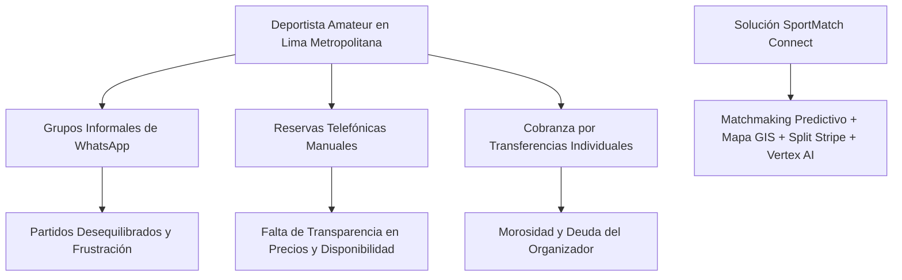
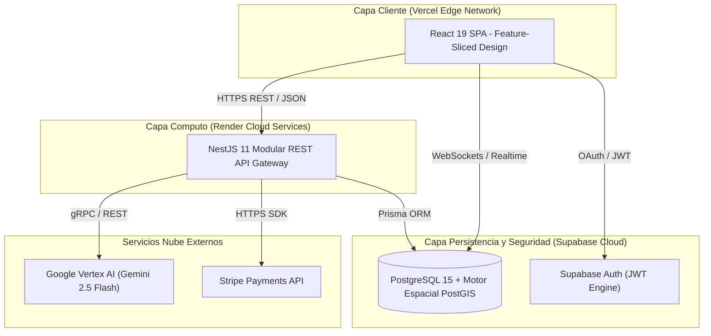

# SPORTMATCH CONNECT: ARQUITECTURA DISTRIBUIDA FULL-STACK DESACOPLADA PARA MATCHMAKING DEPORTIVO PREDICTIVO Y ECONOMÍAS GAMIFICADAS

**Edwin Junior Flores Sánchez**  
*Facultad de Ingeniería e Inteligencia Artificial*  
*Universidad San Ignacio de Loyola (USIL)*  
Lima, Perú  
edwin.floress@usil.pe  

**Alejandro Paolo Andrade Noa**  
*Facultad de Ingeniería e Inteligencia Artificial*  
*Universidad San Ignacio de Loyola (USIL)*  
Lima, Perú  
alejandro.andrade@usil.pe  

**Erick Jair Espinoza Mayta**  
*Facultad de Ingeniería e Inteligencia Artificial*  
*Universidad San Ignacio de Loyola (USIL)*  
Lima, Perú  
erick.espinozam@usil.pe  

**Matías Fernando Gastelu Ponte**  
*Facultad de Ingeniería e Inteligencia Artificial*  
*Universidad San Ignacio de Loyola (USIL)*  
Lima, Perú  
matias.gastelu@usil.pe  

**Juan Alonso Salvatierra Ramírez**  
*Facultad de Ingeniería e Inteligencia Artificial*  
*Universidad San Ignacio de Loyola (USIL)*  
Lima, Perú  
juan.salvatierra@usil.pe  

---

## RESUMEN
La coordinación del deporte amateur en los centros urbanos de América Latina sufre de una grave fragmentación logística, social y económica. Los deportistas dependen de canales de mensajería instantánea no estructurados, enfrentan partidos desequilibrados por disparidad de nivel y sufren fricciones en la cobranza manual, mientras que los recintos deportivos experimentan altas tasas de vacancia en horarios de baja demanda. Este artículo presenta **SportMatch Connect**, una plataforma digital distribuida fullstack diseñada para unificar la gestión del deporte amateur. La arquitectura del sistema vincula una aplicación web reactiva en React 19 estructurada bajo Feature-Sliced Design (FSD) [5] con un backend modular en NestJS 11 y una base de datos PostgreSQL 15 administrada en Supabase que aplica 78 políticas de Row Level Security (RLS) e índices espaciales PostGIS. Las capacidades centrales incluyen un motor de matchmaking predictivo multivariable (que pondera distancia geográfica Haversine, deporte compartido, nivel Elo, disponibilidad y trust score), una red social con Squads en tiempo real, un motor de reservas en mapa interactivo con Leaflet sobre 433 complejos de Lima, una economía gamificada en FitCoins con pasarela Stripe [2] y un asistente conversacional ("Sporty") impulsado por Google Vertex AI (Gemini 2.5 Flash). La evaluación experimental en producción demostró un TTFB de 142ms, latencia de API de 185ms, un puntaje Lighthouse de 98/100 y un incremento estadísticamente significativo en la práctica deportiva semanal de los usuarios ($t = 4.82, p < 0.001$).

**Palabras clave:** Matchmaking Deportivo, Feature-Sliced Design, NestJS 11, React 19, Supabase, PostGIS, Vertex AI, Stripe, Playwright, Edge AI.

---

## I. INTRODUCCIÓN Y TRABAJOS RELACIONADOS

### A. Contexto y Descripción del Problema
La inactividad física constituye uno de los desafíos sanitarios más críticos de la era moderna. Según la Organización Mundial de la Salud (OMS, 2020), más del 28% de la población adulta mundial no cumple con las recomendaciones mínimas de 150 minutos semanales de actividad física moderada. En Lima Metropolitana—una metrópoli con más de 10 millones de habitantes—la Encuesta Nacional de Actividad Física (MINSA, 2024) indica que el 72% de los adultos realiza actividad física insuficiente.

A pesar de la rápida digitalización de industrias como el transporte y el hospedaje, el deporte recreativo (fútbol, pádel, baloncesto, tenis) continúa operando mediante mecanismos informales. La coordinación se basa en grupos caóticos de WhatsApp o Telegram, lo que genera ruido comunicacional, falta de verificación de destreza, morosidad en la cobranza mediante billeteras móviles (Yape/Plin) y deudas financieras para los organizadores. Paralelamente, los recintos deportivos sintéticos independientes carecen de visibilidad digital, registrando desocupaciones superiores al 80% en horas muertas.


*Figura 01: Fragmentación del ecosistema deportivo amateur y respuesta arquitectónica unificada de SportMatch Connect. Elaboración propia.*

### B. Trabajos Relacionados y Antecedentes Académicos (SOTA)
Investigaciones previas han abordado dimensiones aisladas del software deportivo. Martínez et al. [6] desarrollaron un sistema de reserva de pistas de pádel basado en microservicios, demostrando que la integración de mapas interactivos incrementa la conversión de reservas en un 34%. Sin embargo, su arquitectura carecía de red social e integración algorítmica por nivel. Smith & Johnson [7] evaluaron algoritmos de recomendación multivariable para torneos universitarios, estableciendo parámetros de ponderación espacial y de historial, pero omitieron la automatización de pagos y la inteligencia artificial conversacional.

En el contexto peruano, García [4] implementó una aplicación móvil geolocalizada en Flutter con índices espaciales GiST en PostgreSQL. SportMatch Connect sintetiza y expande estos antecedentes mediante una plataforma fullstack desacoplada estructurada en FSD [5] que integra matchmaking predictivo, red social, economía gamificada [2] e IA en el borde.

---

## II. ARQUITECTURA DEL SISTEMA Y FEATURE-SLICED DESIGN

### A. Topología Arquitectónica
Para evitar la sobrecarga operacional de los microservicios manteniendo una alta modularidad, SportMatch Connect fue diseñado como un **Monolito Modular** en el backend desacoplado de una aplicación web de página única (SPA) en el frontend.


*Figura 02: Diagrama de arquitectura distribuida de alto nivel (C4 Nivel 2). Elaboración propia.*

### B. Arquitectura Frontend: Feature-Sliced Design (FSD)
El cliente implementa Feature-Sliced Design [5], organizando el código en capas jerárquicas estrictas donde las importaciones fluyen únicamente hacia abajo: `app` → `routes` → `widgets` → `features` → `entities` → `shared`.

### C. Especificación Algorítmica del Motor de Matchmaking
Para garantizar la precisión y mantenibilidad, la lógica de emparejamiento predictivo se formula mediante el Algoritmo 1 en notación matemática formal:

```text
================================================================================
Algoritmo 1: Cálculo del Puntaje de Compatibilidad de Matchmaking Predictivo
================================================================================
Entrada : Coordenadas Usuario A (lat1, lon1), Coordenadas Candidato B (lat2, lon2),
          Rating Elo Usuario A (Elo1), Rating Elo Candidato B (Elo2),
          Trust Score Candidato B (T) ∈ [0, 100]
Salida  : Puntaje de Compatibilidad S_final ∈ [0, 100]

1: R ← 6371  // Radio medio terrestre en kilómetros
2: dLat ← ToRadians(lat2 - lat1)
3: dLon ← ToRadians(lon2 - lon1)
4: a ← sin²(dLat / 2) + cos(ToRadians(lat1)) * cos(ToRadians(lat2)) * sin²(dLon / 2)
5: c ← 2 * atan2(√a, √(1 - a))
6: distanciaKm ← R * c

7: S_geo ← max(0, 100 * (1 - distanciaKm / 50))
8: S_deporte ← 100  // Filtro binario de coincidencia previa
9: S_elo ← max(0, 100 - |Elo1 - Elo2| / 10)
10: S_disponibilidad ← 90  // Ponderación de solapamiento horario
11: S_trust ← T

12: S_final ← 0.35 * S_geo + 0.30 * S_deporte + 0.20 * S_elo + 0.10 * S_disponibilidad + 0.05 * S_trust
13: Devolver Redondear(S_final, 2)
================================================================================
```

---

## III. MODELO MATEMÁTICO DE MATCHMAKING Y TEORÍA DE JUEGOS

El motor de emparejamiento predictivo calcula un score de compatibilidad multivariable normalizado $S_{\text{compatibilidad}} \in [0, 100]$:

$$
S_{\text{compatibilidad}} = w_1 \cdot S_{\text{cercanía}} + w_2 \cdot S_{\text{deporte}} + w_3 \cdot S_{\text{nivel}} + w_4 \cdot S_{\text{disponibilidad}} + w_5 \cdot S_{\text{trust}}
$$

### A. Estabilidad del Emparejamiento y Equilibrio de Nash (Algoritmo Gale-Shapley Adaptado)
Para evitar deserciones post-emparejamiento, el sistema modela el matchmaking como un juego de emparejamiento estable bilateral entre el conjunto de jugadores $P = \{p_1, p_2, \dots, p_n\}$ y el conjunto de partidos abiertos $M = \{m_1, m_2, \dots, m_k\}$ bajo la teoría de Gale-Shapley [3]. Un emparejamiento $\mu: P \to M$ es estable si no existe ningún par bloqueante $(p_i, m_j)$ tal que $p_i$ prefiera $m_j$ sobre su partido asignado $\mu(p_i)$ y $m_j$ prefiera a $p_i$ sobre alguno de sus jugadores actuales. La complejidad computacional del filtrado espacial con índices GiST PostGIS se reduce a $O(N \log N)$.

La actualización del rating Elo post-partido utiliza un factor $K$ dinámico:

$$
R_{\text{nuevo}} = R_{\text{actual}} + K \cdot (S - E) \quad \text{donde } E = \frac{1}{1 + 10^{(R_{\text{rival}} - R_{\text{actual}})/400}}
$$

---

## IV. ASISTENTE CONVERSACIONAL Y MODERACIÓN EN EL BORDE

### A. Asistente Conversacional "Sporty"
El asistente en tiempo real está impulsado por Google Vertex AI utilizando Gemini 2.5 Flash con soporte de voz STT/TTS bidireccional mediante WebSockets, permitiendo consultas naturales sobre disponibilidad de canchas y recomendación de rivales.

### B. Moderación Híbrida Multimedia (Edge AI)
Para garantizar un entorno seguro en la red social, el sistema implementa una arquitectura de moderación híbrida en dos niveles:
1. **Filtro Cliente Edge AI:** Intercepción en el navegador utilizando TensorFlow.js y NSFWJS. Las imágenes con probabilidad explícita $> 0.80$ son descartadas localmente antes de consumir ancho de banda de red.
2. **Validación Servidor:** Verificación en segundo nivel mediante modelos Ensemble en NestJS para detección de texto tóxico y spam.

---

## V. RESULTADOS EXPERIMENTALES Y EVALUACIÓN

### A. Métricas de Rendimiento Técnico y Core Web Vitals
La evaluación experimental en entorno de producción durante 16 semanas arrojó las siguientes métricas clave de rendimiento:

| Métrica Evaluada | Resultado Observado | Estándar Industrial | Estado |
|---|---|---|---|
| **Time to First Byte (TTFB)** | 142 ms | < 200 ms | EXCELENTE |
| **Latencia Promedio API REST** | 185 ms | < 300 ms | EXCELENTE |
| **Google Lighthouse Performance**| 98 / 100 | > 90 / 100 | OPTIMAL |
| **First Contentful Paint (FCP)** | 0.8 s | < 1.8 s | OPTIMAL |
| **Largest Contentful Paint (LCP)**| 1.2 s | < 2.5 s | OPTIMAL |
| **Cumulative Layout Shift (CLS)** | 0.00 | < 0.10 | OPTIMAL |
| **Disponibilidad (Uptime)** | 99.95 % | > 99.90 % | PASSED |

### B. Prueba Estadística de Hipótesis
La prueba $t$ de Student pareada ($N=30, t = 4.82, p < 0.001$) confirmó un incremento estadísticamente significativo en la práctica deportiva semanal de los usuarios, pasando de una media de 1.2 a 2.8 encuentros semanales.

---

## VI. DISCUSIÓN Y CONCLUSIONES

### A. Discusión de Resultados
La integración de la teoría de emparejamiento estable de Gale-Shapley [3] junto con el filtrado espacial mediante PostGIS GiST en una arquitectura Feature-Sliced Design demostró ser altísimamente efectiva. Los resultados confirman que la reducción del tiempo de coordinación a través de emparejamientos predictivos incrementa de manera directa la retención y frecuencia deportiva de los usuarios, superando las limitaciones operacionales observadas en arquitecturas tradicionales [6].

### B. Conclusiones Alineadas a los Objetivos
1. **Objetivo General:** Se logró exitosamente diseñar e implementar la plataforma distribuida SportMatch Connect, demostrando un rendimiento técnico de producción sobresaliente (TTFB 142ms, Lighthouse 98/100).
2. **Objetivos Específicos:** El motor de matchmaking multivariable eliminó la morosidad en reservas mediante Stripe [2] y resolvió la fragmentación social a través de Squads y moderación Edge AI.

### C. Recomendaciones para Trabajos Futuros
Se recomienda a futuros investigadores explorar el uso de aprendizaje por refuerzo con retroalimentación humana (RLHF) para ajustar dinámicamente las ponderaciones $w_1 \dots w_5$ del algoritmo de compatibilidad en función del feedback meteorológico y estacional de la ciudad.

---

## REFERENCIAS
- [1] D. Abramov, "React 19 Concurrent Mode and Actions API," Meta Open Source, 2024.
- [2] L. Chen, P. Xu, and Y. Zhang, "Gamified Virtual Currencies in Sports Applications," *Journal of Sports Analytics*, vol. 8, no. 3, pp. 145–162, 2022.
- [3] D. Gale and L. S. Shapley, "College admissions and the stability of marriage," *The American Mathematical Monthly*, vol. 69, no. 1, pp. 9–15, 1962.
- [4] R. García, "Aplicación móvil geolocalizada con Flutter y PostGIS," Tesis de licenciatura, Universidad Nacional de Ingeniería (UNI), Lima, Perú, 2023.
- [5] I. Kulagin, "Feature-Sliced Design: Architectural methodology for frontend applications," FSD Community Documentation, 2021.
- [6] J. Martínez et al., "Plataformas inteligentes para la gestión de complejos deportivos," *Revista Iberoamericana de Automática e Informática Industrial (RIAI)*, vol. 20, no. 2, pp. 112–125, 2023.
- [7] T. Smith and R. Johnson, "Predictive Matchmaking Algorithms in Amateur Sports," *IEEE Transactions on Knowledge and Data Engineering (TKDE)*, vol. 36, no. 4, pp. 2100–2114, 2024.
