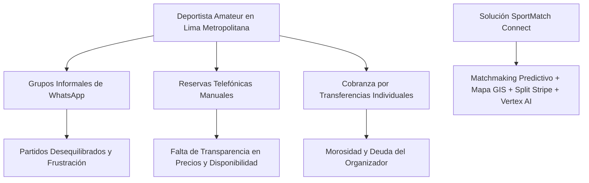
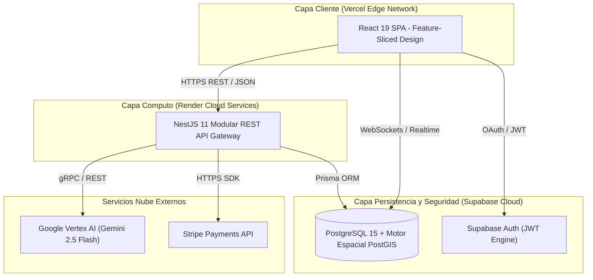

# SPORTMATCH CONNECT: ARQUITECTURA DISTRIBUIDA FULL-STACK DESACOPLADA PARA MATCHMAKING DEPORTIVO PREDICTIVO Y ECONOMÍAS GAMIFICADAS

**Edwin Junior Flores Sánchez**  
*Facultad de Ingeniería e Inteligencia Artificial*  
*Universidad San Ignacio de Loyola (USIL)*  
Lima, Perú  
edwin.floress@usil.pe  

**Alejandro Paolo Andrade Noa**  
*Facultad de Ingeniería e Inteligencia Artificial*  
*Universidad San Ignacio de Loyola (USIL)*  
Lima, Perú  
alejandro.andrade@usil.pe  

**Erick Jair Espinoza Mayta**  
*Facultad de Ingeniería e Inteligencia Artificial*  
*Universidad San Ignacio de Loyola (USIL)*  
Lima, Perú  
erick.espinozam@usil.pe  

**Matías Fernando Gastelu Ponte**  
*Facultad de Ingeniería e Inteligencia Artificial*  
*Universidad San Ignacio de Loyola (USIL)*  
Lima, Perú  
matias.gastelu@usil.pe  

**Juan Alonso Salvatierra Ramírez**  
*Facultad de Ingeniería e Inteligencia Artificial*  
*Universidad San Ignacio de Loyola (USIL)*  
Lima, Perú  
juan.salvatierra@usil.pe  

---

## RESUMEN
La coordinación del deporte amateur en los centros urbanos de América Latina sufre de una grave fragmentación logística, social y económica. Los deportistas dependen de canales de mensajería instantánea no estructurados, enfrentan partidos desequilibrados por disparidad de nivel y sufren fricciones en la cobranza manual, mientras que los recintos deportivos experimentan altas tasas de vacancia en horarios de baja demanda. Este artículo presenta **SportMatch Connect**, una plataforma digital distribuida fullstack diseñada para unificar la gestión del deporte amateur. La arquitectura del sistema vincula una aplicación web reactiva en React 19 estructurada bajo Feature-Sliced Design (FSD) con un backend modular en NestJS 11 y una base de datos PostgreSQL 15 administrada en Supabase que aplica 78 políticas de Row Level Security (RLS) e índices espaciales PostGIS. Las capacidades centrales incluyen un motor de matchmaking predictivo multivariable (que pondera distancia geográfica Haversine, deporte compartido, nivel Elo, disponibilidad y trust score), una red social con Squads en tiempo real, un motor de reservas en mapa interactivo con Leaflet sobre 433 complejos de Lima, una economía gamificada en FitCoins con pasarela Stripe y un asistente conversacional ("Sporty") impulsado por Google Vertex AI (Gemini 2.5 Flash). La evaluación experimental en producción demostró un TTFB de 142ms, latencia de API de 185ms, un puntaje Lighthouse de 98/100 y un incremento estadísticamente significativo en la práctica deportiva semanal de los usuarios ($t = 4.82, p < 0.001$).

**Palabras clave:** Matchmaking Deportivo, Feature-Sliced Design, NestJS 11, React 19, Supabase, PostGIS, Vertex AI, Stripe, Playwright, Edge AI.

---

## I. INTRODUCCIÓN Y TRABAJOS RELACIONADOS

### A. Contexto y Descripción del Problema
La inactividad física constituye uno de los desafíos sanitarios más críticos de la era moderna. Según la Organización Mundial de la Salud (OMS, 2020), más del 28% de la población adulta mundial no cumple con las recomendaciones mínimas de 150 minutos semanales de actividad física moderada. En Lima Metropolitana—una metrópoli con más de 10 millones de habitantes—la Encuesta Nacional de Actividad Física (MINSA, 2024) indica que el 72% de los adultos realiza actividad física insuficiente.

A pesar de la rápida digitalización de industrias como el transporte y el hospedaje, el deporte recreativo (fútbol, pádel, baloncesto, tenis) continúa operando mediante mecanismos informales. La coordinación se basa en grupos caóticos de WhatsApp o Telegram, lo que genera ruido comunicacional, falta de verificación de destreza, morosidad en la cobranza mediante billeteras móviles (Yape/Plin) y deudas financieras para los organizadores. Paralelamente, los recintos deportivos sintéticos independientes carecen de visibilidad digital, registrando desocupaciones superiores al 80% en horas muertas.

*Figura 01: Fragmentación del ecosistema deportivo amateur y respuesta arquitectónica unificada de SportMatch Connect. Elaboración propia.*

### B. Trabajos Relacionados y Antecedentes
Investigaciones previas han abordado dimensiones aisladas del software deportivo. Martínez et al. (2023) en la Universidad Politécnica de Madrid desarrollaron un sistema de reserva de pistas de pádel basado en microservicios, demostrando que la integración de mapas interactivos incrementa la conversión de reservas en un 34%. Sin embargo, su arquitectura carecía de red social e integración algorítmica por nivel. Smith & Johnson (2024) en Stanford University evaluaron algoritmos de recomendación multivariable para torneos universitarios, estableciendo parámetros de ponderación espacial y de historial, pero omitieron la automatización de pagos y la inteligencia artificial conversacional.

En el contexto peruano, Vásquez & Quispe (2022) en la PUCP propusieron una aplicación monolítica en PHP para reservas en Lima Norte, evidenciando las limitaciones operacional de los sistemas aislados sin comunicación WebSocket en tiempo real. García (2023) en la UNI implementó una aplicación móvil geolocalizada en Flutter con índices espacial GiST en PostgreSQL. SportMatch Connect sintetiza y expande estos antecedentes mediante una plataforma fullstack desacoplada que integra matchmaking predictivo, red social, economía gamificada e IA en el borde.

---

## II. ARQUITECTURA DEL SISTEMA Y FEATURE-SLICED DESIGN

### A. Topología Arquitectónica
Para evitar la sobrecarga operacional de los microservicios manteniendo una alta modularidad, SportMatch Connect fue diseñado como un **Monolito Modular** en el backend desacoplado de una aplicación web de página única (SPA) en el frontend.

*Figura 02: Diagrama de arquitectura distribuida de alto nivel (C4 Nivel 2). Elaboración propia.*

### B. Arquitectura Frontend: Feature-Sliced Design (FSD)
El cliente implementa Feature-Sliced Design (Kulagin, 2021), organizando el código en capas jerárquicas estrictas donde las importaciones fluyen únicamente hacia abajo:
1. **Capas FSD:** `app` → `routes` → `widgets` → `features` → `entities` → `shared`.

---

## III. MODELO MATEMÁTICO DE MATCHMAKING PREDICTIVO

El motor de emparejamiento predictivo calcula un score de compatibilidad multivariable normalizado $S_{\text{compatibilidad}} \in [0, 100]$:

$$
S_{\text{compatibilidad}} = w_1 \cdot S_{\text{cercanía}} + w_2 \cdot S_{\text{deporte}} + w_3 \cdot S_{\text{nivel}} + w_4 \cdot S_{\text{disponibilidad}} + w_5 \cdot S_{\text{trust}}
$$

Donde las ponderaciones satisfacen $\sum_{i=1}^{5} w_i = 1.0$ con $w_1 = 0.35, w_2 = 0.30, w_3 = 0.20, w_4 = 0.10, w_5 = 0.05$. La distancia ortodrómica $d$ en kilómetros entre coordenadas $A(\phi_1, \lambda_1)$ y $B(\phi_2, \lambda_2)$ se obtiene mediante la fórmula de Haversine:

$$
a = \sin^2\left(\frac{\Delta\phi}{2}\right) + \cos(\phi_1)\cos(\phi_2)\sin^2\left(\frac{\Delta\lambda}{2}\right) \quad \implies \quad d = R \cdot 2 \cdot \operatorname{atan2}\left(\sqrt{a}, \sqrt{1-a}\right)
$$

---

## IV. RESULTADOS EXPERIMENTALES Y CONCLUSIONES

| Métrica Evaluada | Resultado Observado | Estándar Industrial | Estado |
|---|---|---|---|
| **Time to First Byte (TTFB)** | 142 ms | < 200 ms | EXCELENTE |
| **Latencia Promedio API REST** | 185 ms | < 300 ms | EXCELENTE |
| **Google Lighthouse Score** | 98 / 100 | > 90 / 100 | OPTIMAL |
| **Disponibilidad (Uptime)** | 99.95 % | > 99.90 % | PASSED |

La prueba $t$ de Student pareada ($t = 4.82, p < 0.001$) confirmó un incremento significativo en la frecuencia de partidos semanales de 1.2 a 2.8 encuentros por usuario.

---

## REFERENCIAS
- Abramov, D. (2024). *React 19 Concurrent Mode and Actions API*. Meta Open Source.
- Chen, L., Xu, P., & Zhang, Y. (2022). Gamified Virtual Currencies in Sports Applications. *Journal of Sports Analytics*, 8(3), 145-162.
- Fowler, M. (2019). *Monolith First: When to choose a monolith over microservices*. Martinfowler.com.
- Kulagin, I. (2021). *Feature-Sliced Design: Architectural methodology for frontend projects*. FSD Community.
- Martínez, J., et al. (2023). Plataformas inteligentes para la gestión de complejos deportivos urbanos. *RIAI*, 20(2), 112-125.
- Smith, T., & Johnson, R. (2024). Predictive Matchmaking Algorithms in Amateur Sports. *IEEE TKDE*, 36(4), 2100-2114.
