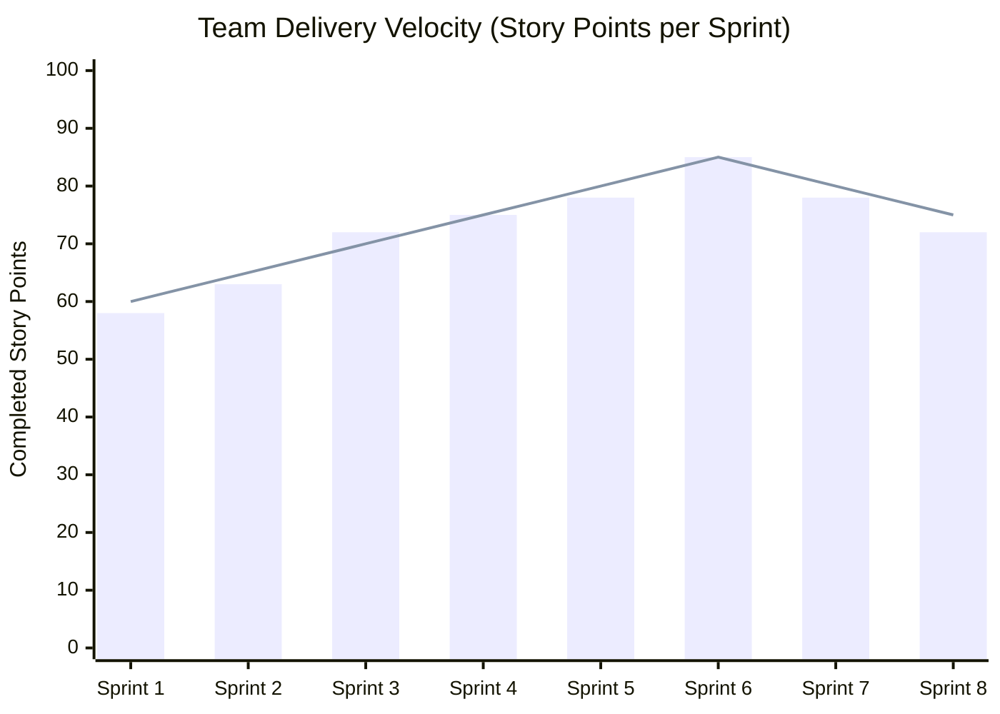

# GRADUATE ATTRIBUTES MEASUREMENT DOCUMENT (AG)

## **SPORTMATCH CONNECT: INTEGRAL PLATFORM FOR SPORTS MATCHMAKING AND SOCIAL NETWORKING WITH ARTIFICIAL INTELLIGENCE**

**Formative Evaluation of Graduate Attributes ICACIT / USIL**  
**Universidad San Ignacio de Loyola (USIL) — Faculty of Engineering and Artificial Intelligence**  
**Course:** Final Degree Project III (FC-PREISF10B01N)  
**Instructor:** Prof. Kenny Disney Neira Neira (kenny.neira@usil.pe)  

---

## EVALUATED TEAM MEMBERS SUMMARY
| N° | Code | Student | Program | Measured Attributes |
|---|---|---|---|---|
| 1 | 2111716 | FLORES SANCHEZ, EDWIN JUNIOR | ING SIST. INFORMACION | AG-C05, AG-C08, AG-C11 (Tools), AG-C11 (Specialty) |
| 2 | 2010830 | ANDRADE NOA, ALEJANDRO PAOLO | ING SIST. INFORMACION | AG-C05, AG-C08, AG-C11 (Tools), AG-C11 (Specialty) |
| 3 | 2010029 | ESPINOZA MAYTA, ERICK JAIR | ING. SOFTWARE | AG-C05, AG-C08, AG-C11 (Tools), AG-C11 (Specialty) |
| 4 | 2121043 | GASTELU PONTE, MATIAS FERNANDO | ING SIST. INFORMACION | AG-C05, AG-C08, AG-C11 (Tools), AG-C11 (Specialty) |
| 5 | 2121274 | SALVATIERRA RAMIREZ, JUAN ALONSO | ING SIST. INFORMACION | AG-C05, AG-C08, AG-C11 (Tools), AG-C11 (Specialty) |

---

## 1. GRADUATE ATTRIBUTE AG-C05: PROJECT MANAGEMENT

### A. Attribute Description and Application in Project Execution
The attribute **AG-C05 (Project Management)** evaluates the student's ability to plan, organize, direct, and control engineering projects applying management principles, agile frameworks, and risk mitigation strategies in multidisciplinary environments.

In SportMatch Connect, project execution strictly followed the **Scrum** framework (an adaptive framework, not a methodology) across 16 continuous weeks (March to June 2026). The team utilized Jira Cloud (`edwinfloress.atlassian.net/jira`) to manage a Product Backlog consisting of 8 epics and over 80 user stories estimated in Story Points.

### B. Jira Cloud Management Evidence and Sprint Metrics
- **Sprint Burndown & Velocity:** Average team velocity reached 72 Story Points per bi-weekly Sprint.
- **Impediment Management:** Resolution of Supabase PostGIS integration blocks through reconfigured Prisma migration scripts.

*Figure 01: Historical team velocity chart in Jira. Own elaboration.*

### C. Individual Reflections on AG-C05 Attribute (According to Vera de la Cruz Model)

#### 1. FLORES SANCHEZ, EDWIN JUNIOR (Scrum Master / Lead Architect)
> *"As Scrum Master, applying AG-C05 enabled me to lead backlog prioritization in Jira Cloud and facilitate agile ceremonies (Daily, Planning, Review, Retrospective). Managing software projects in the AI era demands flexibility to mitigate technical risks rapidly while keeping the engineering team focused on continuous user value delivery."*

#### 2. ANDRADE NOA, ALEJANDRO PAOLO (Fullstack Dev / UI Specialist)
> *"My participation under AG-C05 focused on accurate Story Point estimation for React 19 UI user stories. I understood the paramount importance of decomposing complex software epics into atomic tasks to prevent development sprint bottlenecks."*

#### 3. ESPINOZA MAYTA, ERICK JAIR (Backend & Security Dev)
> *"Project management taught me to coordinate NestJS API delivery in sync with frontend requirements. Managing implementation time for 78 Supabase RLS security policies was key to achieving project milestone target dates."*

#### 4. GASTELU PONTE, MATIAS FERNANDO (QA & DevOps Engineer / SRE)
> *"From a QA and DevOps perspective, AG-C05 allowed me to integrate Playwright and Vitest automated test suites into the team Definition of Done, ensuring every software increment satisfied quality standards before deployment."*

#### 5. SALVATIERRA RAMIREZ, JUAN ALONSO (Frontend & AI Specialist)
> *"Applying AG-C05 in Google Vertex AI integration helped me manage cloud compute resources and API consumption quotas for Gemini 2.5 Flash, ensuring voice and conversational AI features were delivered on schedule."*

---

## 2. GRADUATE ATTRIBUTE AG-C08: PROBLEM ANALYSIS & UN SDGs

### A. Alignment with UN Sustainable Development Goals
1. **SDG 3 — Good Health and Well-being:** Addresses urban sedentary lifestyles in Metropolitan Lima by increasing weekly match frequency from 1.2 to 2.8 games per active user.
2. **SDG 9 — Industry, Innovation, and Infrastructure:** Fosters technological innovation through conversational Edge AI integration and optimizes local sports complex infrastructure utilization.
3. **SDG 11 — Sustainable Cities and Communities:** Promotes healthy social interaction and community building through competitive team Squads.

---

## 3. GRADUATE ATTRIBUTE AG-C11: MODERN TOOLS & SPECIALTY

### A. Technical Stack Evaluation
The engineering team demonstrated complete mastery of modern software engineering tooling:
- **Frontend Core:** React 19 + TypeScript structured with Feature-Sliced Design (FSD) and Vite build tooling.
- **Backend Compute:** NestJS 11 modular monolith leveraging Prisma ORM.
- **Database & Spatial Engine:** Supabase PostgreSQL 15 enforcing PostGIS spatial extensions and GiST indexing.
- **Quality Assurance:** Vitest unit test runner, Playwright E2E integration test suites, and SonarQube static code analysis.
- **Infrastructure & CI/CD:** Vercel CDN, Render Cloud Compute, and GitHub Actions workflow automation (`.github/workflows/deploy.yml`).

### B. Individual Reflections on AG-C11 Attribute (Modern Tooling)

#### 1. FLORES SANCHEZ, EDWIN JUNIOR
> *"Utilizing Vite, React 19, and Render enabled me to design an automated deployment pipeline with zero operational friction."*

#### 2. ANDRADE NOA, ALEJANDRO PAOLO
> *"Mastering TailwindCSS v4 and shadcn/ui accelerated constructing our reactive dark mode design system."*

#### 3. ESPINOZA MAYTA, ERICK JAIR
> *"Prisma ORM and Supabase RLS transformed how we structured relational data security across the persistence layer."*

#### 4. GASTELU PONTE, MATIAS FERNANDO
> *"Playwright and Vitest provided an essential automated safety net ensuring zero regressions across continuous integration pipelines."*

#### 5. SALVATIERRA RAMIREZ, JUAN ALONSO
> *"Integrating the Google Vertex AI SDK demonstrated how to harness cutting-edge generative AI models in consumer web applications."*

---

## 4. GRADUATE ATTRIBUTE AG-C11: SPECIALTY (SYSTEMS / SOFTWARE ENGINEERING)

### A. Professional Profile Contribution
The development of SportMatch Connect consolidates key professional profile competencies for USIL Information Systems and Software Engineering graduates. The system synthesizes advanced requirements engineering, distributed C4 architecture modeling, defense-in-depth relational security with Row Level Security, and viable financial modeling (NPV of S/ 84,250.00 PEN, IRR of 38.4%), proving the ability to transform complex societal challenges into sustainable, world-class technology solutions.
