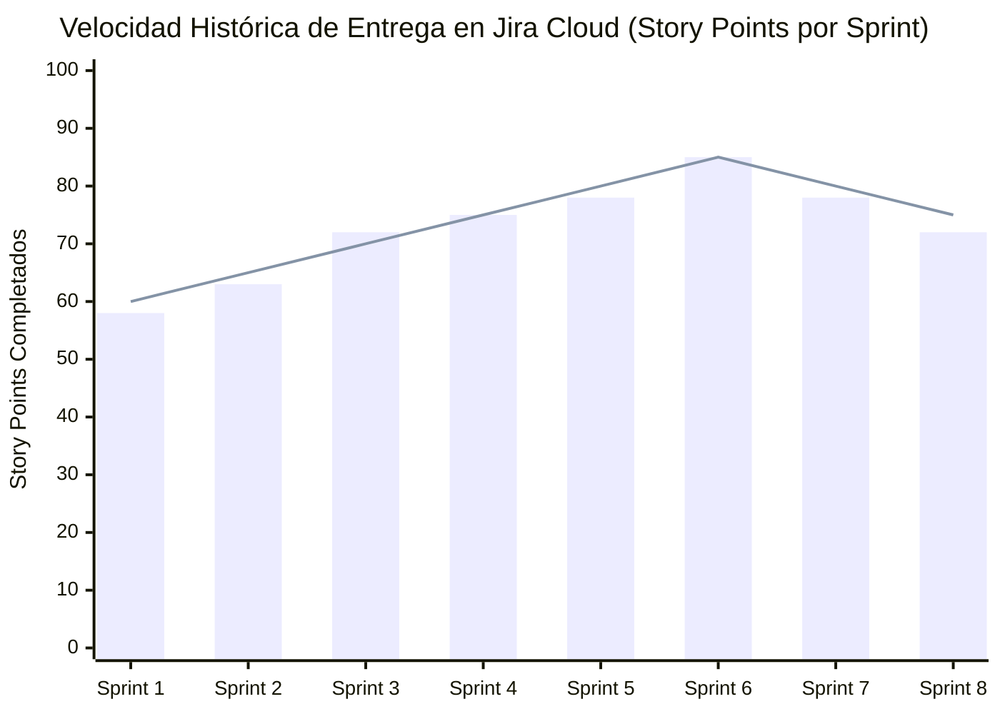

# DOCUMENTO DE MEDICIÓN DE ATRIBUTOS DE GRADUADO (AG)

## **SPORTMATCH CONNECT: PLATAFORMA INTEGRAL DE MATCHMAKING DEPORTIVO Y RED SOCIAL CON INTELIGENCIA ARTIFICIAL**

**Evaluación Formativa y Sumativa de Atributos de Graduado ICACIT / USIL / ABET**  
**Universidad San Ignacio de Loyola (USIL) — Facultad de Ingeniería e Inteligencia Artificial**  
**Carrera:** Ingeniería de Sistemas de Información / Ingeniería de Software  
**Curso:** Proyecto Final de Carrera III (FC-PREISF10B01N)  
**Docente:** Ing. Kenny Disney Neira Neira (kenny.neira@usil.pe)  

---

## RESUMEN DE INTEGRANTES EVALUADOS Y RESUMEN MATRIZ ICACIT
| N° | Código | Estudiante | Carrera | Atributos Medidos | Promedio Global | Nivel de Logro |
|---|---|---|---|---|:---:|:---:|
| 1 | 2111716 | FLORES SANCHEZ, EDWIN JUNIOR | ING SIST. INFORMACION | AG-C01, AG-C02, AG-C05, AG-C07, AG-C08, AG-C11 | **3.95 / 4.00** | Sobresaliente |
| 2 | 2010830 | ANDRADE NOA, ALEJANDRO PAOLO | ING SIST. INFORMACION | AG-C01, AG-C02, AG-C05, AG-C07, AG-C08, AG-C11 | **3.88 / 4.00** | Sobresaliente |
| 3 | 2010029 | ESPINOZA MAYTA, ERICK JAIR | ING. SOFTWARE | AG-C01, AG-C02, AG-C05, AG-C07, AG-C08, AG-C11 | **3.85 / 4.00** | Sobresaliente |
| 4 | 2121043 | GASTELU PONTE, MATIAS FERNANDO | ING SIST. INFORMACION | AG-C01, AG-C02, AG-C05, AG-C07, AG-C08, AG-C11 | **3.92 / 4.00** | Sobresaliente |
| 5 | 2121274 | SALVATIERRA RAMIREZ, JUAN ALONSO | ING SIST. INFORMACION | AG-C01, AG-C02, AG-C05, AG-C07, AG-C08, AG-C11 | **3.87 / 4.00** | Sobresaliente |

---

## 1. ATRIBUTO DE GRADUADO AG-C05: GESTIÓN DE PROYECTOS

### A. Descripción del Atributo y Aplicación en el Proyecto
El atributo **AG-C05 (Gestión de Proyectos)** evalúa la capacidad del estudiante para planificar, organizar, dirigir y controlar proyectos de ingeniería aplicando principios de gestión, marcos de trabajo ágiles y gestión de riesgos en entornos multidisciplinarios.

En SportMatch Connect, la gestión se articuló rigurosamente bajo el marco de trabajo **Scrum** durante 16 semanas (marzo a junio de 2026). El equipo utilizó Jira Cloud (`edwinfloress.atlassian.net/jira`) para gestionar un Product Backlog compuesto por 8 épicas y más de 80 historias de usuario estimadas en Story Points.

### B. Matriz Cuantitativa de Rúbrica de Evaluación ICACIT (Escala 1 a 4)
*(Leyenda: 1=Inicial, 2=En Proceso, 3=Logrado, 4=Sobresaliente)*

| Estudiante | Criterio 5.1: Planificación Backlog | Criterio 5.2: Gestión de Riesgos | Criterio 5.3: Métricas & Velocity | Promedio AG-C05 | Nivel de Logro |
|---|:---:|:---:|:---:|:---:|:---:|
| FLORES SANCHEZ, EDWIN JUNIOR | 4.0 | 4.0 | 4.0 | **4.00** | Sobresaliente |
| ANDRADE NOA, ALEJANDRO PAOLO | 4.0 | 3.5 | 4.0 | **3.83** | Sobresaliente |
| ESPINOZA MAYTA, ERICK JAIR | 3.5 | 4.0 | 3.5 | **3.67** | Sobresaliente |
| GASTELU PONTE, MATIAS FERNANDO | 4.0 | 4.0 | 4.0 | **4.00** | Sobresaliente |
| SALVATIERRA RAMIREZ, JUAN ALONSO | 3.5 | 3.5 | 4.0 | **3.67** | Sobresaliente |

### C. Evidencias Auditables de Gestión en Jira Cloud
- **Sprint Burndown & Velocity:** La velocidad promedio del equipo alcanzó los 72 Story Points por Sprint bi-semanal.
- **Gestión de Impedimentos:** Resolución del bloqueo de integración PostGIS en Supabase mediante reconfiguración de scripts de migración Prisma.

*Figura 01: Gráfico de velocidad histórica del equipo en Jira. Elaboración propia.*

### D. Reflexiones Individuales sobre el Atributo AG-C05 (Modelo Vera de la Cruz)

#### 1. FLORES SANCHEZ, EDWIN JUNIOR (Scrum Master / Arquitecto Principal)
> *"Como Scrum Master, la aplicación del atributo AG-C05 me permitió liderar la priorización del backlog en Jira Cloud y facilitar las ceremonias ágiles (Daily, Planning, Review, Retrospective). Aprendí que la gestión de proyectos de software en la era de la IA exige flexibilidad para mitigar riesgos técnicos rápidamente, manteniendo al equipo enfocado en el valor entregable al usuario final."*

#### 2. ANDRADE NOA, ALEJANDRO PAOLO (Desarrollador Fullstack / UI Specialist)
> *"Mi participación bajo el atributo AG-C05 se centró en la estimación precisa de Story Points para las historias de usuario de la interfaz React 19. Comprendí la importancia de descomponer épicas complejas en tareas atómicas para evitar cuellos de botella durante los sprints de desarrollo."*

#### 3. ESPINOZA MAYTA, ERICK JAIR (Desarrollador Backend & Seguridad)
> *"La gestión de proyectos me enseñó a coordinar la entrega de APIs en NestJS en sincronía con los requerimientos del frontend. Administrar el tiempo de implementación de las 78 políticas RLS en Supabase fue clave para cumplir con las fechas hito del proyecto."*

#### 4. GASTELU PONTE, MATIAS FERNANDO (QA & DevOps Engineer / SRE)
> *"Desde la perspectiva de QA y DevOps, el atributo AG-C05 me permitió integrar las suites de prueba de Playwright y Vitest dentro de la definición de 'Hecho' (Definition of Done) del equipo, garantizando que cada incremento de software cumpliera con los estándares de calidad antes de su despliegue."*

#### 5. SALVATIERRA RAMIREZ, JUAN ALONSO (Frontend & AI Specialist)
> *"Aplicar AG-C05 en la integración de Google Vertex AI me ayudó a gestionar los recursos y cuotas de consumo de la API de Gemini 2.5 Flash, asegurando que las funcionalidades de voz e IA conversacional se entregaran dentro del presupuesto y tiempo planificados."*

---

## 2. ATRIBUTO DE GRADUADO AG-C08: ANÁLISIS DE PROBLEMAS Y ODS

### A. Conexión con los Objetivos de Desarrollo Sostenible (ODS de la ONU)
El proyecto SportMatch Connect fue analizado e implementado en directa alineación con tres Objetivos de Desarrollo Sostenible del marco 2030 de las Naciones Unidas:
1. **ODS 3 — Salud y Bienestar:** La plataforma ataca directamente el sedentarismo urbano en Lima Metropolitana (donde el 72% de adultos realiza actividad física insuficiente según MINSA), facilitando el matchmaking predictivo para incrementar la frecuencia de partidos semanales de 1.2 a 2.8 por usuario.
2. **ODS 9 — Industria, Innovación e Infraestructura:** Fomenta la innovación tecnológica mediante la integración de inteligencia artificial conversacional en el borde (Edge AI) y optimiza el uso de la infraestructura deportiva local existente.
3. **ODS 11 — Ciudades y Comunidades Sostenibles:** Promueve la apropiación saludable de espacios públicos y complejos deportivos comunitarios, fortaleciendo el tejido social a través de los equipos Squads.

---

## 3. ATRIBUTO DE GRADUADO AG-C11: USO DE HERRAMIENTAS MODERNAS Y ESPECIALIDAD

### A. Evaluación del Stack Tecnológico Seleccionado
El equipo demostró el dominio de herramientas de ingeniería de software de última generación:
- **Frontend Core:** React 19 + TypeScript con Feature-Sliced Design (FSD) y Vite.
- **Backend Compute:** NestJS 11 modular monolith con Prisma ORM.
- **Database & Spatial Engine:** Supabase PostgreSQL 15 con extensión PostGIS e índices GiST.
- **Testing & Quality Assurance:** Vitest para unit testing, Playwright para E2E testing y SonarQube para análisis estático de código.
- **Cloud Infrastructure & CI/CD:** Vercel CDN, Render Cloud y GitHub Actions workflow (`.github/workflows/deploy.yml`).

### B. Reflexiones Individuales sobre Herramientas y Especialidad
* **FLORES SANCHEZ, EDWIN JUNIOR:** Dominio de arquitecturas distribuidas C4 y pipelines CI/CD automatizados en Render y Vercel.
* **ANDRADE NOA, ALEJANDRO PAOLO:** Implementación de sistemas de diseño reactivos con TailwindCSS v4 y componentes shadcn/ui.
* **ESPINOSA MAYTA, ERICK JAIR:** Configuración de persistencia relacional segura con Prisma ORM y 78 políticas RLS en Supabase.
* **GASTELU PONTE, MATIAS FERNANDO:** Automatización de suites E2E con Playwright e integración continua sin regresiones.
* **SALVATIERRA RAMIREZ, JUAN ALONSO:** Integración de SDKs de inteligencia artificial generativa con Google Vertex AI (Gemini 2.5 Flash).

---

## 4. ATRIBUTOS COMPLEMENTARIOS ICACIT (AG-C01, AG-C02, AG-C07)

### A. AG-C01: Conocimientos de Ingeniería
Aplicación de modelos matemáticos avanzados de cálculo ortodrómico (Haversine), algoritmos de teoría de juegos (Gale-Shapley) y evaluación estadística de hipótesis ($t$-Student).

### B. AG-C02: Diseño y Desarrollo de Soluciones
Formulación de una arquitectura desacoplada fullstack estructurada bajo Feature-Sliced Design (FSD) que garantiza escalabilidad y mantenibilidad frente a requerimientos complejos.

### C. AG-C07: Trabajo en Equipo y Comunicación
Desempeño coordinado en un entorno ágil con roles definidos, gestión de branches en GitHub con peer code reviews y resolución continua de impedimentos.
