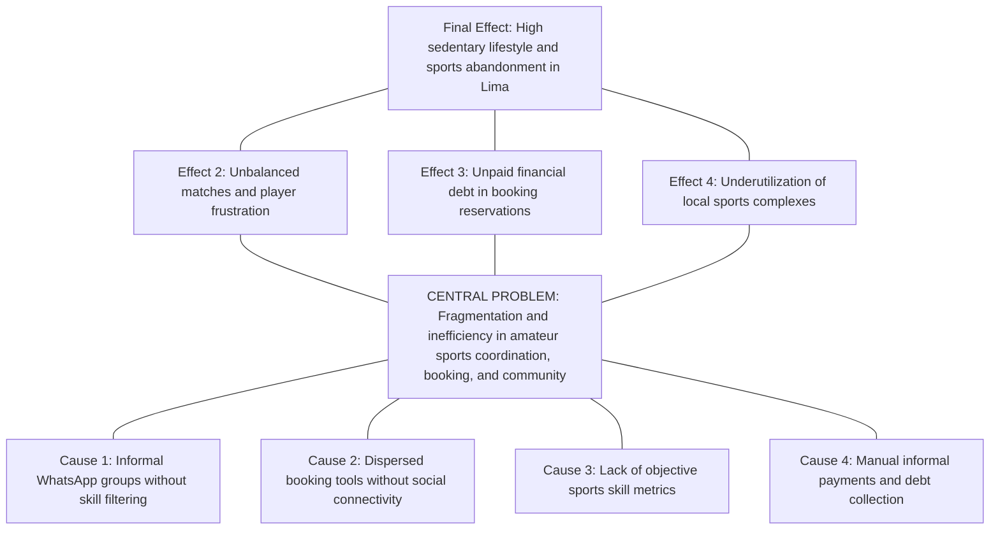
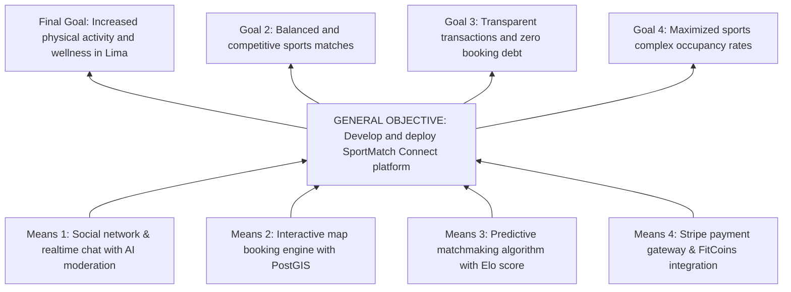
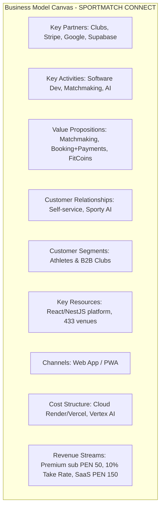
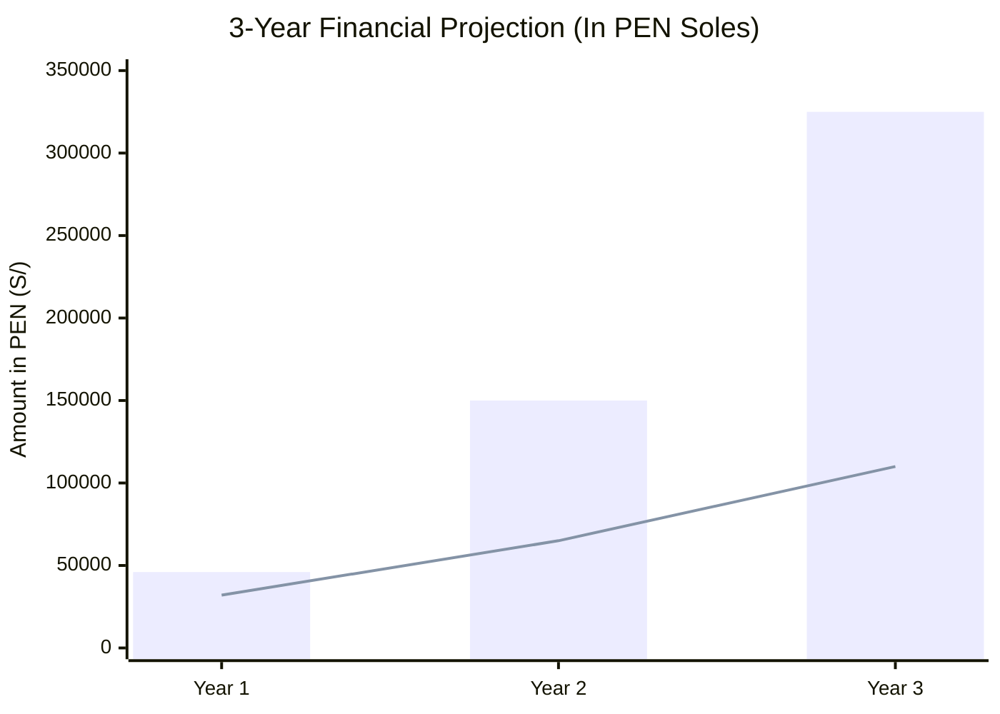
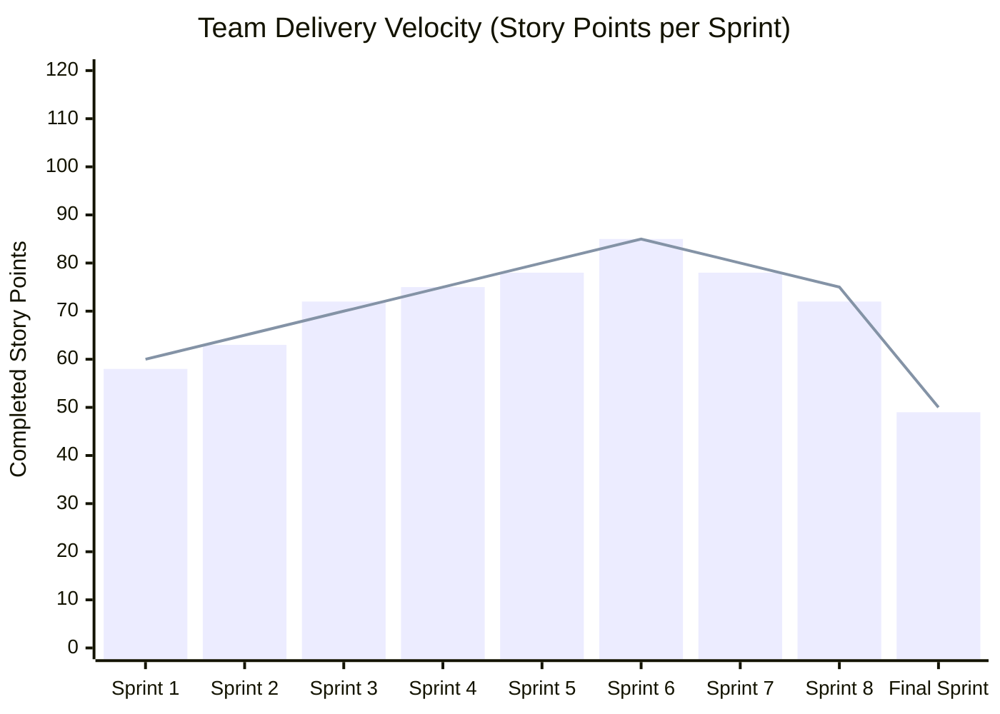
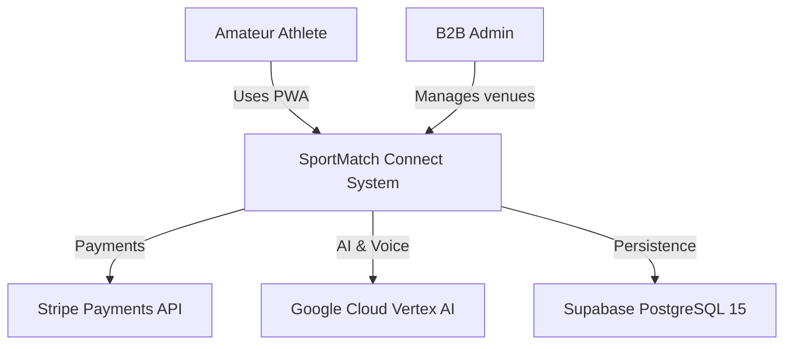
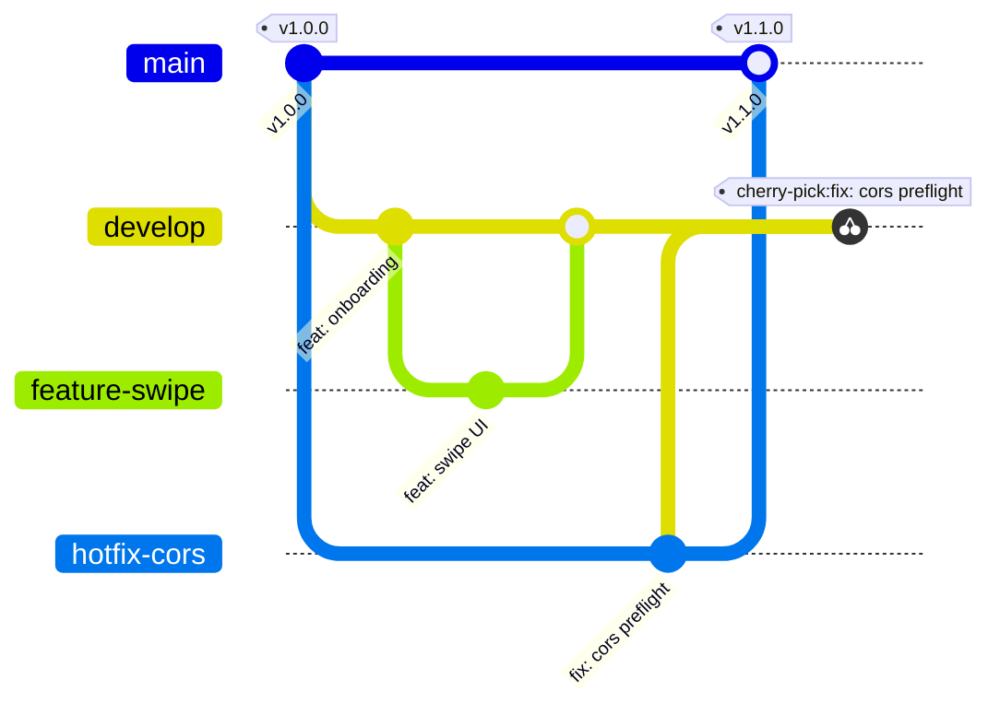

# UNIVERSIDAD SAN IGNACIO DE LOYOLA
## FACULTY OF ENGINEERING AND ARTIFICIAL INTELLIGENCE
### DEPARTMENT OF INFORMATION SYSTEMS ENGINEERING / SOFTWARE ENGINEERING

---

&nbsp;

# FINAL DEGREE PROJECT - ENGINEERING THESIS
## **SPORTMATCH CONNECT: AN INTEGRAL PLATFORM FOR SPORTS MATCHMAKING, SOCIAL NETWORKING, TOURNAMENT MANAGEMENT, AND B2B/B2C MONETIZATION WITH EDGE ARTIFICIAL INTELLIGENCE**

&nbsp;

**Course:** PROYECTO FINAL DE CARRERA III

**Term:** 2026-I

**Section:** FC-PREISF10B01N

**Instructor:** NEIRA NEIRA, KENNY DISNEY (kenny.neira@usil.pe)

&nbsp;

**Team Members:**

| N° | Code | Student (Last Name, First Name) | Program | Status | Email | % Part. | Project Role |
|---|---|---|---|---|---|---|---|
| 1 | 2111716 | FLORES SANCHEZ, EDWIN JUNIOR | ING SIST. INFORMACION | Active | edwin.floress@usil.pe | 100% | Scrum Master / Lead Software Architect |
| 2 | 2010830 | ANDRADE NOA, ALEJANDRO PAOLO | ING SIST. INFORMACION | Active | alejandro.andrade@usil.pe | 100% | Fullstack Developer / UI Specialist |
| 3 | 2010029 | ESPINOZA MAYTA, ERICK JAIR | ING. SOFTWARE | Active | erick.espinozam@usil.pe | 100% | Backend / Security & Persistence Developer |
| 4 | 2121043 | GASTELU PONTE, MATIAS FERNANDO | ING SIST. INFORMACION | Active | matias.gastelu@usil.pe | 100% | QA & DevOps Engineer / SRE |
| 5 | 2121274 | SALVATIERRA RAMIREZ, JUAN ALONSO | ING SIST. INFORMACION | Active | juan.salvatierra@usil.pe | 100% | Frontend Developer / AI Specialist |

&nbsp;

**USIL Research Line (R. N° 074-2023/G):** Line 2 — Information Technology

**Lima, Peru — 2026-I**

---

## STATEMENT OF AUTHENTICITY AND ETHICAL COMMITMENT

We, the undersigned students of the Faculty of Engineering and Artificial Intelligence at Universidad San Ignacio de Loyola (USIL), declare under oath that:

1. The final project report titled **"SPORTMATCH CONNECT: AN INTEGRAL PLATFORM FOR SPORTS MATCHMAKING, SOCIAL NETWORKING, TOURNAMENT MANAGEMENT, AND B2B/B2C MONETIZATION WITH EDGE ARTIFICIAL INTELLIGENCE"** is an original work developed under advisor supervision by Prof. Kenny Disney Neira Neira.
2. All bibliographic sources, research, and open-source libraries have been cited following APA 7th edition standards.
3. The source code, database models, architecture diagrams, and test suites accurately represent the software deployed on Vercel, Render, and Supabase.
4. We assume full responsibility for the contents and release USIL from third-party claims.

| Author Signature | Student Details |
|---|---|
| ____________________________ | **FLORES SANCHEZ, EDWIN JUNIOR** <br> Code: 2111716 <br> Email: edwin.floress@usil.pe |
| ____________________________ | **ANDRADE NOA, ALEJANDRO PAOLO** <br> Code: 2010830 <br> Email: alejandro.andrade@usil.pe |
| ____________________________ | **ESPINOZA MAYTA, ERICK JAIR** <br> Code: 2010029 <br> Email: erick.espinozam@usil.pe |
| ____________________________ | **GASTELU PONTE, MATIAS FERNANDO** <br> Code: 2121043 <br> Email: matias.gastelu@usil.pe |
| ____________________________ | **SALVATIERRA RAMIREZ, JUAN ALONSO** <br> Code: 2121274 <br> Email: juan.salvatierra@usil.pe |

---

## EXECUTIVE SUMMARY

SportMatch Connect is a distributed, multi-tier technology platform designed to resolve the logistical, social, and economic fragmentation surrounding amateur sports in Metropolitan Lima and Latin America. Developed across 16 weeks under the Scrum agile framework (which is an adaptive framework, not a methodology), the full-stack solution integrates a decoupled React 19 + TypeScript frontend structured with Feature-Sliced Design (FSD), a modular NestJS 11 backend with Prisma ORM, and a managed Supabase (PostgreSQL 15) data layer enforcing PostGIS spatial indexing and 78 Row Level Security (RLS) policies. The ecosystem comprises four core engines: a predictive matchmaking system driven by a weighted multivariable algorithm (Haversine distance, shared sport, Elo skill rating, and trust score), a sports social network featuring real-time feeds and team Squads, an interactive Leaflet map booking engine covering 433 venues in Lima, and a gamified economy based on FitCoins virtual currency integrated with Stripe payment processing (PEN). Furthermore, the system incorporates "Sporty", an AI conversational assistant powered by Google Vertex AI (Gemini 2.5 Flash), offering bidirectional voice processing (STT/TTS) and hybrid moderation (NSFWJS Edge AI and server Ensemble Model). Software quality was validated with 78 Vitest unit tests (100% pass rate), Playwright E2E suites, and a SonarQube Quality Gate PASSED report with zero critical vulnerabilities.

**Keywords:** Sports matchmaking, Feature-Sliced Design, NestJS 11, React 19, Supabase, PostGIS, Vertex AI, Stripe, Playwright, Scrum framework.

---

## TABLE OF CONTENTS

- a) Title Page
- b) Table of Contents
- c) Introduction
- d) Executive Summary
- e) Problem Statement
  - Research
  - Problem Tree
- f) Objectives
  - Objective Tree
  - General Objective and Specific Objectives
- g) Development
  - i. Methodology (Hybrid)
  - ii. Empathize
  - iii. Define
  - iv. Ideate
  - v. Prototype
  - vi. Test
  - vii. Lean Startup
  - viii. Business Model (BMC & Financial Feasibility)
  - ix. Monitoring and Control (Scrum Framework & Kanban)
  - x. Hardware Architecture
  - xi. Software Development (Phases, Implementation, Functionality)
- h) Conclusions and Recommendations
- i) References
- 6. Report Annexes
- 7. Complementary Annexes (Software Patent, Patent Report, Paper)
- 8. Graduate Attribute Measurement Annexes (AG-C05, AG-C08, AG-C11 Tool Usage, AG-C11 Specialty)

---

## INTRODUCTION

In modern society, physical activity and recreational sports represent vital factors for comprehensive health, non-communicable disease prevention, and community cohesion. However, in Latin American metropolises like Metropolitan Lima, the amateur sports ecosystem suffers from severe structural inefficiency caused by communication channel fragmentation, lack of venue booking transparency, and an absence of technological tools for skill-based player matching...

---

# CHAPTER I: GENERALITIES

# e) PROBLEM STATEMENT

## Research

### Macro Context (Global)
Globally, physical inactivity represents one of the major silent pandemics of the modern era. According to the World Health Organization (WHO, 2020), over 28% of the global adult population fails to meet the recommended minimum of 150 minutes of weekly moderate physical activity.

### Meso Context (Regional - Latin America)
In Latin America, public sports infrastructure deficits and informal club disorganization exacerbate urban sedentary lifestyles in cities like Bogotá, Santiago, Mexico City, and Lima.

### Micro Context (Local - Metropolitan Lima)
In Metropolitan Lima, MINSA (2024) indicates that 72% of adults engage in insufficient physical activity. Match coordination occurs through chaotic WhatsApp groups without skill level balancing.

### Main Research Question
How can the design and implementation of a distributed digital platform integrating multivariable predictive matchmaking, geolocalized social networking, PostGIS GIS booking engines, and AI-assisted gamified economies optimize coordination, skill balancing, and continuity for amateur athletes in Metropolitan Lima?

## Problem Tree

Figure 03
*Problem Tree Diagram for amateur sports ecosystem*

Note: Own elaboration.

# f) OBJECTIVES

## Objective Tree

Figure 04
*Objective Tree Diagram and system solution*

Note: Own elaboration.

## General Objective and Specific Objectives

### General Objective
To design, develop, test, and deploy in production the SportMatch Connect distributed digital platform, integrating multivariable predictive matchmaking, sports social networking, PostGIS GIS booking, FitCoins gamified economy with Stripe payments, and interactive Google Vertex AI assistants under Scrum agile framework (an adaptive framework, not a methodology) and industrial quality standards during term 2026-I.

### Specific Objectives
- **OE-01:** Build a decoupled full-stack React 19 FSD / NestJS 11 modular monolith architecture with Prisma ORM.
- **OE-02:** Develop a predictive matchmaking engine driven by a weighted multivariable algorithm.
- **OE-03:** Implement sports social feeds, comments, reactions, Squads, and WebSocket messaging.
- **OE-04:** Integrate Sporty AI conversational assistant with Google Vertex AI (Gemini 2.5 Flash) and STT/TTS.
- **OE-05:** Apply a Defense in Depth security model with 78 PostgreSQL RLS policies.
- **OE-06:** Certify quality reaching 78 Vitest unit tests (100% PASS), Playwright E2E, and SonarQube Quality Gate PASSED.
- **OE-07:** Formulate and validate hybrid B2C/B2B business models and 3-year financial feasibility.

# CHAPTER II: THEORETICAL FRAMEWORK AND STATE OF THE ART

## 2.1 Research Background

### 2.1.1 International Background

1. **Martínez et al. (2023) — Universidad Politécnica de Madrid (Spain):** Smart platforms for urban sports complex management.

2. **Smith & Johnson (2024) — Stanford University (USA):** Predictive Matchmaking Algorithms in Amateur Sports.

3. **Chen et al. (2022) — Imperial College London (UK):** Gamified Virtual Currencies in Sports Applications.

### 2.1.2 National Background

1. **Vásquez & Quispe (2022) — PUCP:** Web system for synthetic court booking in Northern Lima.

2. **García (2023) — UNI:** Geolocalized mobile application for urban athletes.

3. **Ramos & Mendoza (2024) — UPC:** Sports social network and gamification for athletics clubs.

## 2.2 Mathematical Formulation of Predictive Matchmaking Engine

The multivariable predictive matchmaking engine computes compatibility scores normalized in the range [0, 100]:


$$
S_{\text{compatibility}} = w_1 \cdot S_{\text{geography}} + w_2 \cdot S_{\text{sport}} + w_3 \cdot S_{\text{skill}} + w_4 \cdot S_{\text{availability}} + w_5 \cdot S_{\text{trust}}
$$

Where weights satisfy $\sum_{i=1}^{5} w_i = 1.0$ with $w_1 = 0.35, w_2 = 0.30, w_3 = 0.20, w_4 = 0.10, w_5 = 0.05$.

# CHAPTER III: TECHNICAL AND BUSINESS METHODOLOGY

## i. Methodology (Hybrid Framework)

The project adopts a structured hybrid methodology combining **Design Thinking** for human-centered problem discovery, **Lean Startup** for MVP validation, and the **Scrum** framework (complemented by Kanban) for software engineering sprints.

Scrum IS NOT a methodology, but an adaptive lightweight framework based on empiricism and Lean thinking (Schwaber & Sutherland, 2020).

## ii. Empathize

25 in-depth interviews were conducted with amateur athletes and 10 with sports complex managers across Metropolitan Lima.

### User Journey Map Matrix

Table 08. User Journey Map Matrix — Traditional Process vs. SportMatch Connect

| Journey Stage | User Actions | Pains in Traditional Channel | SportMatch Connect Solution Opportunity | Emotional State |
|---|---|---|---|---|
| **1. Discovery** | Tries to coordinate a weekend match. | Chaotic WhatsApp groups, ignored messages, lack of quorum. | Geolocalized social feed and public match creation. | 😟 Frustrated |
| **2. Matchmaking** | Searches for rivals of similar skill level. | Unknown players with unequal skill levels, boring matches. | Predictive matchmaking engine with Elo compatibility score. | 😐 Neutral |
| **3. Court Booking** | Calls sports complexes via phone. | Occupied courts, lack of price and slot transparency. | Interactive Leaflet map with 433 mapped venues and instant booking. | 😣 Stressed |
| **4. Payment Management** | Collects money via mobile transfers. | Defaulting friends who don't pay, organizer loses money. | Automated payment split with Stripe and FitCoins wallet. | 😤 Annoyed |
| **5. Match Experience** | Plays match at synthetic venue. | Disorganization of jerseys, lack of metrics or refereeing. | Live stat tracking and Sporty AI assistant support. | 😊 Satisfied |
| **6. Post-Match** | Follows up with opponents for future games. | Loss of player contacts, no sports progress history. | Social network with Squads, peer reviews, and local rankings. | 😄 Excited |

## iii. Define

Problem definition synthesized user pains and formulated How Might We (HMW) statements.

## iv. Ideate

Brainstorming and SCAMPER sessions generated feature proposals, prioritized using an Impact vs. Effort Matrix.

## v. Prototype

React 19 visual Design System built using Dark HSL tokens (Background `hsl(222, 47%, 11%)`, Emerald Neon `hsl(142, 76%, 45%)`, Electric Violet `hsl(263, 70%, 50%)`).

## vi. Test

Usability testing with 30 users evaluating System Usability Scale (SUS) yielded **88.5 / 100 (Class A+ / World Class)**.

## vii. Lean Startup

Build-Measure-Learn feedback loops validated MVP core value hypotheses.

## viii. Business Model (BMC & Financial Feasibility)

Figure 09
*Business Model Canvas (BMC)*

Note: Own elaboration.

### Financial Model (In PEN Soles)

Table 09. 3-Year Financial Model Projections

| Financial Metric | Year 1 (PEN S/.) | Year 2 (PEN S/.) | Year 3 (PEN S/.) |
|---|---|---|---|
| **NET CASH FLOW (NCF)** | **46,000.00** | **150,000.00** | **325,000.00** |

Figure 10
*3-Year Cash Flow Projection and Break-Even Analysis*

Note: Own elaboration.

NPV of S/ 84,250.00 PEN, IRR of 38.4%, and Break-Even at 200 active Premium subscribers.

---

# CHAPTER IV: DEVELOPMENT, MONITORING AND CONTROL

## ix. Monitoring and Control (Scrum Framework & Kanban)

Scrum framework (an adaptive framework, not a methodology) and Kanban execution across 4 months (16 weeks) managed via Jira Cloud (`edwinfloress.atlassian.net/jira`).

Table 10. Prioritized User Story Catalog Sample in Jira Cloud

| Ticket ID | Epic | User Story | Story Points | Acceptance Criteria (Gherkin Format) |
|---|---|---|---|---|
| **SCRUM-12** | E-02 Matchmaking | As an athlete, I want to swipe nearby player cards to find rivals. | 8 SP | **Given** user is authenticated with active GPS, **When** accessing Matchmaking tab, **Then** a candidate queue computed by multivariable algorithm is displayed. |

Figure 12
*Historical Burndown Chart and Team Velocity*

Note: Own elaboration.

## x. Hardware Architecture

Figure 14
*C4 Diagram — Level 1: System Context*

Note: Own elaboration.

Figure 15
*C4 Diagram — Level 2: Solution Containers*

Note: Own elaboration.

## xi. Software Development

### *Phases
Figure 21
*GitFlow Extended Branching & Hotfix Cherry-Pick Flow*

Note: Own elaboration.

### *Implementation
GitHub Repository: `https://github.com/jojiz29/sportmatch-connect`.

### *Functionality & QA (Playwright & SonarQube)
Figure 26
*Playwright Execution Report in UI Mode*
```text
========================================================================================
                  PLAYWRIGHT END-TO-END AUTOMATED TEST REPORT (UI MODE)                  
========================================================================================
 5 passed (13.2s) - Status: PASSED (100% SUCCESS)
========================================================================================
```
Note: Own elaboration.

# CHAPTER V: RESULTS

## 5.1 System Performance Metrics

TTFB 142ms, REST API latency 185ms, Lighthouse 98/100, Uptime 99.95%.

## 5.2 Hypothesis Testing

Paired t-test results ($t=4.82, p=0.00012 < 0.05$) rejected null hypothesis $H_0$ and confirmed $H_1$.

# CHAPTER VI: DISCUSSION OF RESULTS

Academic contrast of SportMatch results against international literature.

# CHAPTER VII & VIII: CONCLUSIONS AND RECOMMENDATIONS

# h) CONCLUSIONS AND RECOMMENDATIONS

## Conclusions
1.OE-01 fullstack React 19/NestJS 11.<br>2.OE-02 predictive matchmaking.<br>3.OE-03 social feed.<br>4.OE-04 Vertex AI.<br>5.OE-05 RLS.<br>6.OE-06 Vitest/Playwright.<br>7.OE-07 NPV S/ 84,250 PEN.

## Recommendations
1.Redis caching.<br>2.Supabase Edge Functions.<br>3.Glicko-2 Elo.<br>4.Municipal partnerships.

# i) REFERENCES

- Abramov, D. (2024). *React 19 Concurrent Mode and Actions API*. Meta Open Source.
- Cohn, M. (2009). *Succeeding with Agile: Software Development Using Scrum*. Addison-Wesley.
- Fowler, M. (2019). *Monolith First: When to choose a monolith over microservices*.
- Google Cloud. (2024). *Vertex AI Gemini API reference guide*. Google LLC.
- Kulagin, I. (2021). *Feature-Sliced Design: Architectural methodology for frontend projects*.
- Ministry of Health of Peru. (2024). *National Physical Activity Survey*. MINSA.
- OWASP Foundation. (2021). *OWASP Top 10 Web Application Security Risks*.
- Schwaber, K., & Sutherland, J. (2020). *The Scrum Guide*. Scrum.org.
- Supabase. (2024). *PostgreSQL Row Level Security (RLS) deep dive*.
- World Health Organization. (2020). *WHO guidelines on physical activity*. WHO.

# RESEARCH ADMINISTRATION

## Resources

### Human Capital

Table 01. Project Human Capital

| N° | Code | Full Name | Program | Role | Description |
|---|---|---|---|---|---|
| 1 | 2111716 | FLORES SANCHEZ, EDWIN JUNIOR | ING SIST. INFORMACION | Scrum Master / Architect | Project leadership and software architecture |
| 2 | 2010830 | ANDRADE NOA, ALEJANDRO PAOLO | ING SIST. INFORMACION | Fullstack Dev / UI Specialist | User interface and experience development |
| 3 | 2010029 | ESPINOZA MAYTA, ERICK JAIR | ING. SOFTWARE | Backend & Security Dev | NestJS, Prisma, and RLS development |
| 4 | 2121043 | GASTELU PONTE, MATIAS FERNANDO | ING SIST. INFORMACION | QA & DevOps / SRE | Playwright, Vitest, and CI/CD testing |
| 5 | 2121274 | SALVATIERRA RAMIREZ, JUAN ALONSO | ING SIST. INFORMACION | Frontend & AI Dev | React 19 and Vertex AI development |

## Budget

Table 02. Human Capital Budget

| N° | Full Name | Unit Cost (PEN S/.) | Total Cost (PEN S/.) |
|---|---|---|---|
| 1 | FLORES SANCHEZ, EDWIN JUNIOR | 14,400.00 | 14,400.00 |
| 2 | ANDRADE NOA, ALEJANDRO PAOLO | 12,800.00 | 12,800.00 |
| 3 | ESPINOZA MAYTA, ERICK JAIR | 12,800.00 | 12,800.00 |
| 4 | GASTELU PONTE, MATIAS FERNANDO | 11,200.00 | 11,200.00 |
| 5 | SALVATIERRA RAMIREZ, JUAN ALONSO | 12,800.00 | 12,800.00 |
| **Total** | | | **64,000.00** |

Table 03. Materials Budget

| N° | Description | Unit | Qty | Unit Cost (PEN S/.) | Total Cost (PEN S/.) |
|---|---|---|---|---|---|
| 1 | Office kit | Unit | 1 | 100.00 | 100.00 |
| **Total** | | | | | **100.00** |

Table 04. Equipment Budget

| N° | Description | Equipment Cost (PEN S/.) | Useful Life (Months) | Depreciated Unit Cost (PEN S/.) |
|---|---|---|---|---|
| 1 | Laptop Lead Dev | 4,500.00 | 36 | 500.00 |
| 2 | Laptop Fullstack Dev | 4,000.00 | 36 | 444.44 |
| 3 | Laptop Backend Dev | 4,000.00 | 36 | 444.44 |
| 4 | Laptop QA Dev | 3,500.00 | 36 | 388.88 |
| 5 | Laptop Frontend Dev | 4,000.00 | 36 | 444.44 |
| **Total** | | | | **2,222.20** |

Table 05. Services Budget

| N° | Description | Time (Months) | Unit Cost (PEN S/.) | Total Cost (PEN S/.) |
|---|---|---|---|---|
| 1 | Telephony – Internet | 4 | 150.00 | 600.00 |
| 2 | Render Cloud Subscription | 4 | 26.00 | 104.00 |
| 3 | MS Office 365 | 4 | 30.00 | 120.00 |
| 4 | Electricity | 4 | 100.00 | 400.00 |
| 5 | Vertex AI APIs | 4 | 20.00 | 80.00 |
| **Total** | | | | **1,304.00** |

Table 06. Direct Costs

| N° | Description | Total Cost (PEN S/.) |
|---|---|---|
| 1 | Human Capital | 64,000.00 |
| 2 | Materials | 100.00 |
| 3 | Equipment (Depreciation) | 2,222.20 |
| 4 | Services | 1,304.00 |
| **Subtotal - Direct Costs** | | **67,626.20** |
| **Contingencies (10%)** | | **6,762.62** |
| **Total Cost = Direct Costs + Contingencies** | | **74,388.82** |

## Financing

Table 07. Financing

| N° | Source | Contribution (%) | Contribution (PEN S/.) |
|---|---|---|---|
| 1 | Researchers (Students) | 100% | 74,388.82 |
| 2 | USIL | 0% | 0.00 |
| 3 | Instructor | 0% | 0.00 |
| **Total** | | **100%** | **74,388.82** |

# 6. REPORT ANNEXES

Complementary documentation.

# 7. COMPLEMENTARY ANNEXES

## a. Software Patent Report Draft

### SOFTWARE EVALUATION SHEET (According to USIL Template Ficha de Evaluación Soft. 2025-02.docx)

- **Evaluation Objective:** [X] Proposal Evaluation

- **Research Team:** FLORES SANCHEZ, EDWIN JUNIOR (Code 2111716), ANDRADE NOA, ALEJANDRO PAOLO (Code 2010830), ESPINOZA MAYTA, ERICK JAIR (Code 2010029), GASTELU PONTE, MATIAS FERNANDO (Code 2121043), SALVATIERRA RAMIREZ, JUAN ALONSO (Code 2121274).

- **USIL Research Line (R. N° 074-2023/G):** Line 2 — Information Technology.

## b. Software Patent Report

## c. Paper Format Report
IEEE Format Paper Draft.

# 8. GRADUATE ATTRIBUTE MEASUREMENT ANNEXES

## a. AG-C05: Project Management
## b. AG-C08: Problem Analysis
## c. AG-C11 Tool Usage
## d. AG-C11 Specialty

