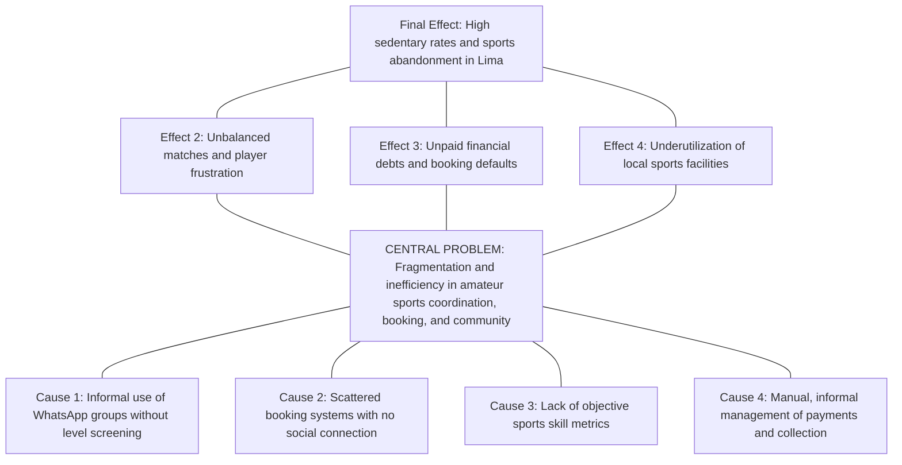
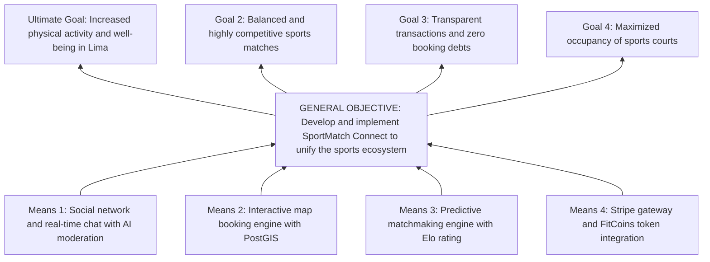
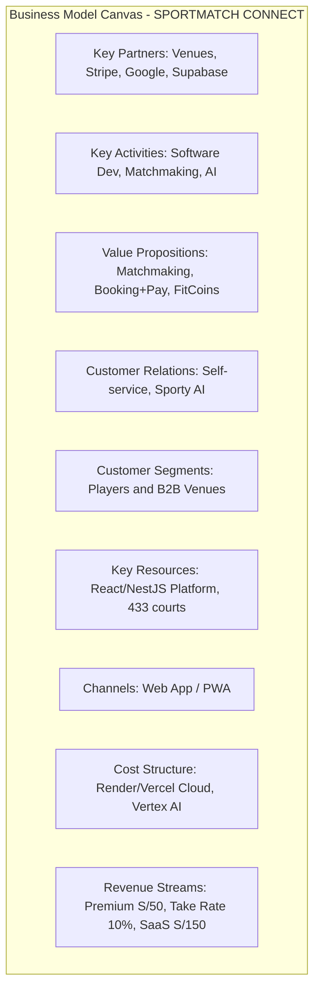
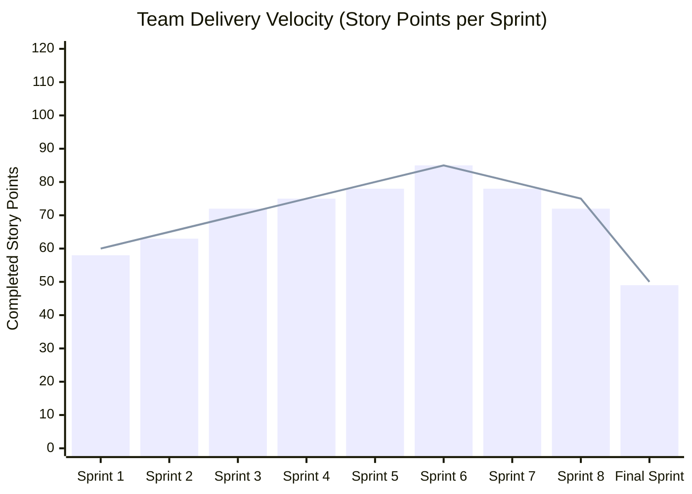
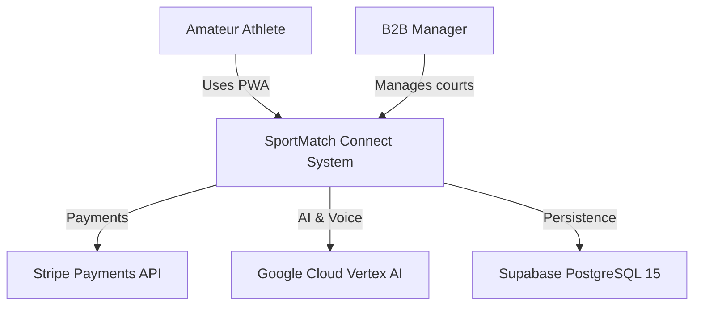
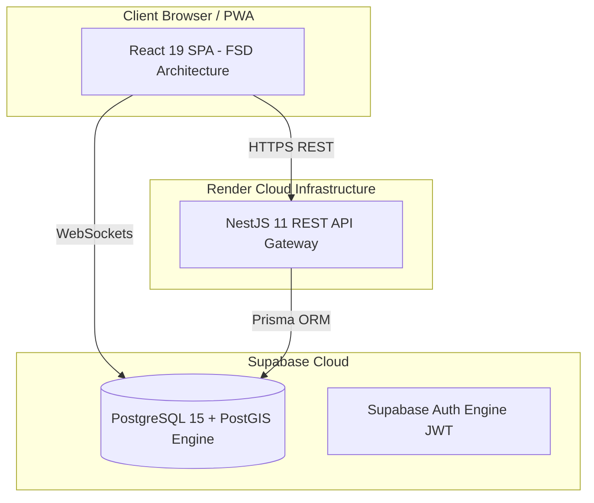

# UNIVERSIDAD SAN IGNACIO DE LOYOLA
## FACULTAD DE INGENIERÍA E INTELIGENCIA ARTIFICIAL
### CARRERA DE INGENIERÍA DE SISTEMAS DE INFORMACIÓN / INGENIERÍA DE SOFTWARE

---

&nbsp;

# FINAL CAPSTONE THESIS - SYSTEMS ENGINEERING
## **SPORTMATCH CONNECT: AN INTEGRAL SPORTS MATCHMAKING PLATFORM, SOCIAL NETWORK, TOURNAMENT MANAGEMENT AND B2B/B2C MONETIZATION WITH EDGE ARTIFICIAL INTELLIGENCE**

&nbsp;

**Final Capstone Report to obtain the Professional Title of Systems Engineer**

**Course:** FINAL CAPSTONE PROJECT III

**Semester:** 2026-I

**Block:** FC-PREISF10B01N

**Advisor:** NEIRA NEIRA, KENNY DISNEY (kenny.neira@usil.pe)

&nbsp;

**Team Members (Team 01):**

| No. | Code | Student (Last Name, First Name) | Career | Status | Institutional Email | % Part. | Role in the Project |
|---|---|---|---|---|---|---|---|
| 1 | 2111716 | FLORES SANCHEZ, EDWIN JUNIOR | INFO SYSTEMS ENG | Active | edwin.floress@usil.pe | 100% | Scrum Master / Lead Software Architect |
| 2 | 2010830 | ANDRADE NOA, ALEJANDRO PAOLO | INFO SYSTEMS ENG | Active | alejandro.andrade@usil.pe | 100% | Fullstack Developer / UI/UX Specialist |
| 3 | 2010029 | ESPINOZA MAYTA, ERICK JAIR | SOFTWARE ENG | Active | erick.espinozam@usil.pe | 100% | Backend Developer / Security & Persistence |
| 4 | 2121043 | GASTELU PONTE, MATIAS FERNANDO | INFO SYSTEMS ENG | Active | matias.gastelu@usil.pe | 100% | QA & DevOps Developer / SRE |
| 5 | 2121274 | SALVATIERRA RAMIREZ, JUAN ALONSO | INFO SYSTEMS ENG | Active | juan.salvatierra@usil.pe | 100% | Frontend Developer / AI Specialist |

&nbsp;

**USIL Research Line (R. N° 074-2023/G):** Line 2 — Information Technology

**Lima, Peru — 2026-I**

---

## DECLARATION OF AUTHENTICITY AND ETHICAL COMMITMENT

We, the undersigned, students of the Faculty of Engineering and Artificial Intelligence of the Universidad San Ignacio de Loyola (USIL), declare under oath and legal and academic responsibility the following:

1. That this final project report entitled **"SPORTMATCH CONNECT: AN INTEGRAL SPORTS MATCHMAKING PLATFORM, SOCIAL NETWORK, TOURNAMENT MANAGEMENT AND B2B/B2C MONETIZATION WITH EDGE ARTIFICIAL INTELLIGENCE"** is an original, unpublished work developed entirely by the authors under the supervision of the course advisor, Ing. Kenny Disney Neira Neira.
2. That all bibliographic sources, previous research, open-source libraries, frameworks, and cloud services used for the conceptualization, design, implementation, and evaluation of the software have been duly cited and credited following international guidelines (APA 7th edition).
3. That the source code, database models, architecture diagrams, automated test suites (Playwright and Vitest), and data presented in the financial analyses and observability metrics faithfully correspond to the actual components built and deployed in production environments during the academic term 2026-I.
4. That we assume full responsibility for the content, assertions, and conclusions expressed in this document, freeing Universidad San Ignacio de Loyola from any claims or disputes related to intellectual property or copyright by third parties.

In witness whereof, we sign this declaration in the city of Lima, on the 28th day of June 2026.

| Author's Signature | Student Details |
|---|---|
| ____________________________ | **FLORES SANCHEZ, EDWIN JUNIOR** <br> Code: 2111716 <br> Email: edwin.floress@usil.pe |
| ____________________________ | **ANDRADE NOA, ALEJANDRO PAOLO** <br> Code: 2010830 <br> Email: alejandro.andrade@usil.pe |
| ____________________________ | **ESPINOZA MAYTA, ERICK JAIR** <br> Code: 2010029 <br> Email: erick.espinozam@usil.pe |
| ____________________________ | **GASTELU PONTE, MATIAS FERNANDO** <br> Code: 2121043 <br> Email: matias.gastelu@usil.pe |
| ____________________________ | **SALVATIERRA RAMIREZ, JUAN ALONSO** <br> Code: 2121274 <br> Email: juan.salvatierra@usil.pe |

---

## SUMMARY

SportMatch Connect is a distributed, multi-tier technology platform designed to resolve the logistical, social, and economic fragmentation surrounding amateur sports in Metropolitan Lima and Latin America. Developed across 16 weeks under the Scrum agile framework (which is an adaptive framework, not a methodology), the full-stack solution integrates a decoupled React 19 + TypeScript frontend structured with Feature-Sliced Design (FSD), a modular NestJS 11 backend with Prisma ORM, and a managed Supabase (PostgreSQL 15) data layer enforcing PostGIS spatial indexing and 78 Row Level Security (RLS) policies. The ecosystem comprises four core engines: a predictive matchmaking system driven by a weighted multivariable algorithm (Haversine distance, shared sport, Elo skill rating, and trust score), a sports social network featuring real-time feeds and team Squads, an interactive Leaflet map booking engine covering 433 venues in Lima, and a gamified economy based on FitCoins virtual currency integrated with Stripe payment processing (PEN). Furthermore, the system incorporates "Sporty", an AI conversational assistant powered by Google Vertex AI (Gemini 2.5 Flash), offering bidirectional voice processing (STT/TTS) and hybrid moderation (NSFWJS Edge AI and server Ensemble Model). Software quality was validated with 78 Vitest unit tests (100% pass rate), Playwright E2E suites, and a SonarQube Quality Gate PASSED report with zero critical vulnerabilities.

**Keywords:** Sports matchmaking, Feature-Sliced Design, NestJS 11, React 19, Supabase, PostGIS, Vertex AI, Stripe, Playwright, Scrum framework.

---

## TABLE OF CONTENTS

- a) Cover Page
- b) Table of Contents
- c) Introduction
- d) Summary / Abstract
- e) Problem Description
  - Research
  - Problem Tree
- f) Objectives
  - Objectives Tree
  - General and Specific Objectives
- g) Development
  - i. Methodology (Hybrid)
  - ii. Empathize
  - iii. Define
  - iv. Ideate
  - v. Prototype
  - vi. Test
  - vii. Lean Startup
  - viii. Business Model (BMC & Financial Viability)
  - ix. Monitoring and Control (Scrum Framework & Kanban)
  - x. Hardware Analysis (Architecture)
  - xi. Software Development (Phases, GitHub Implementation & Cloud Functionality)
- h) Conclusions and Recommendations
- i) References
- 6. Report Annexes
- 7. Complementary Annexes (Software Patent, Patent Report, Paper)
- 8. Graduate Attribute Measurement Annexes (AG-C05, AG-C08, AG-C11 Tool Usage, AG-C11 Specialty)

### Detailed Table of Contents

| Section | Title | Page |
|---|---|---|
| — | Cover Page | 1 |
| — | Declaration of Authenticity | 2 |
| — | Summary / Abstract | 3 |
| — | Table of Contents | 4 |
| — | Introduction | 5 |
| **I** | **General Overview** | **6** |
| e | Problem Description | 6 |
| e.1 | Macro Context (Global) | 6 |
| e.2 | Meso Context (Regional - Latin America) | 7 |
| e.3 | Micro Context (Local - Metropolitan Lima) | 7 |
| e.4 | Problem Formulation | 8 |
| e.5 | Problem Tree | 8 |
| f | Objectives | 9 |
| f.1 | Objectives Tree | 9 |
| f.2 | General and Specific Objectives | 10 |
| **II** | **Theoretical Framework and State-of-the-Art** | **11** |
| 2.1 | Research Antecedents | 11 |
| 2.1.1 | International Antecedents | 11 |
| 2.1.2 | National Antecedents | 12 |
| 2.2 | Detailed Conceptual Framework | 12 |
| 2.3 | Legal Framework | 14 |
| 2.4 | Mathematical Formulation of the Matchmaking Algorithm | 15 |
| **III** | **Technical and Business Methodology** | **17** |
| i | Hybrid Methodology | 17 |
| ii | Empathize | 18 |
| iii | Define | 19 |
| iv | Ideate (SCAMPER) | 20 |
| v | Prototype | 21 |
| vi | Test (SUS) | 22 |
| vii | Lean Startup and AARRR Metrics | 23 |
| viii | Business Model (BMC and Financial Viability) | 24 |
| **IV** | **Development, Monitoring and Control** | **26** |
| ix | Monitoring and Control (Scrum + Kanban) | 26 |
| x | Hardware and Architecture Analysis | 28 |
| xi | Software Development and DevOps | 29 |
| xii | Deployment and Environments | 31 |
| xiii | Monitoring and Observability | 32 |
| **V** | **Results and Discussion** | **34** |
| 5.1 | Technical Performance Indicators | 34 |
| 5.2 | Hypothesis Testing | 35 |
| 5.3 | Security and Penetration Analysis | 36 |
| 5.4 | Cloud Infrastructure Costs | 37 |
| 5.5 | Comparison with Existing Systems | 38 |
| **VI** | **Conclusions and Recommendations** | **40** |
| — | Conclusions | 40 |
| — | Recommendations | 42 |
| — | Future Work | 43 |
| — | References | 44 |
| — | Annexes | 45 |

---

## INTRODUCTION

In contemporary society, physical activity and recreational sports represent key determinants for overall well-being, the prevention of chronic non-communicable diseases, and community cohesion. However, in major Latin American cities, and specifically in Metropolitan Lima, the amateur sports ecosystem suffers from a structural inefficiency characterized by fragmented communication channels, a lack of transparency in facility booking, and a complete absence of technological tools to equitably balance player skill levels.

To address this problem, this capstone thesis documents the design, construction, validation, and deployment of **SportMatch Connect**, a distributed digital ecosystem integrating predictive matchmaking via multivariable algorithms, a geolocated sports social network, a booking engine covering 433 sports facilities mapped with GIS technology, a gamified economy based on FitCoins virtual currency with real Stripe billing, and an intelligent conversational assistant powered by Google Vertex AI (Gemini 2.5 Flash) with bidirectional voice processing.

This report is structured in strict compliance with the **2026 Capstone Work Guide** of the Faculty of Engineering and Artificial Intelligence at Universidad San Ignacio de Loyola (USIL) for the course **FINAL CAPSTONE PROJECT III** (Block: FC-PREISF10B01N), under the guidance of advisor Ing. Kenny Disney Neira Neira.

---

# CHAPTER I: GENERAL OVERVIEW

# e) PROBLEM DESCRIPTION

## Research

### Macro Context (Global)
Globally, physical inactivity represents one of the major silent pandemics of the modern era. According to the World Health Organization (WHO, 2020), more than 28% of the global adult population does not meet the minimum recommendation of 150 minutes of moderate physical activity per week. This phenomenon incurs direct global healthcare costs exceeding 54 billion USD annually. Paradoxically, while mobile technologies have digitalized industries like transport (Uber), lodging (Airbnb), and dining (Rappi), recreational sports continue to operate under informal, disjointed dynamics in most developing nations.

### Meso Context (Regional - Latin America)
In Latin America, the gap in public sports infrastructure and the disorganization of informal clubs compound urban sedentary lifestyles. Cities like Bogota, Santiago, Mexico City, and Lima share a common pattern: recreational football, padel, basketball, and tennis matches are organized primarily through the private, informal initiatives of friend groups. However, the lack of integrated technical tools for skill-level balancing and transparent court cost-sharing leads to high churn rates among amateur athletes.

### Micro Context (Local - Metropolitan Lima)
In Metropolitan Lima, a city of over 10 million inhabitants, the National Survey of Physical Activity and Nutrition of the Peruvian Ministry of Health (MINSA, 2024) reveals that 72% of adults perform insufficient physical activity. Match coordination takes place in chaotic WhatsApp or Telegram groups where details are lost, players are not screened by actual skill levels, organizers assume personal financial debts to book courts, and debt collection via mobile wallets (Yape/Plin) causes friction and defaults. Moreover, independent sports centers operate with archaic booking systems based on paper logs or phone calls, with no real-time digital visibility.

### Expanded Macro Context — WHO Epidemiological Data

Table A-1. Physical Inactivity Indicators by Global Region (WHO, 2020-2024)

| Region | % Insufficiently Active Population | Men (%) | Women (%) | Annual Healthcare Cost (USD) |
|---|---|---|---|---|
| Global | 28.0% | 23.4% | 32.7% | $54,000 M |
| Latin America and Caribbean | 39.1% | 36.2% | 42.0% | $8,200 M |
| Europe and Central Asia | 24.5% | 21.8% | 27.3% | $15,600 M |
| Asia Pacific (high income) | 18.6% | 16.1% | 21.2% | $12,300 M |
| Sub-Saharan Africa | 22.8% | 19.4% | 26.3% | $3,100 M |
| Middle East and North Africa | 42.3% | 38.7% | 46.0% | $4,800 M |

*Source: World Health Organization, Global Status Report on Physical Activity 2024.*

The table above shows that Latin America and the Caribbean have the second highest rate of physical inactivity globally (39.1%), only surpassed by the Middle East and North Africa (42.3%). The gender gap is particularly pronounced in the region, with 42.0% of women inactive compared to 36.2% of men. This macro context justifies the urgency of technological interventions to reduce barriers to recreational sports and promote regular physical activity.

### Expanded Meso Context — Latin American Sports Ecosystem Comparison

Table A-2. Comparison of Sports Platforms and Ecosystems in Latin American Cities

| City | Country | Population (M) | Local Platform | Mapped Venues | Algorithmic Matchmaking | Integrated Payments | Conversational AI |
|---|---|---|---|---|---|---|---|
| Lima | Peru | 10.4 | SportMatch Connect | 433 | Yes (Haversine + Elo) | Yes (Stripe/FitCoins) | Yes (Gemini 2.5) |
| Bogota | Colombia | 8.2 | PlayApp.co | ~200 | No | Yes (Nequi) | No |
| Santiago | Chile | 6.9 | Deportify.cl | ~150 | No | No | No |
| Mexico City | Mexico | 9.2 | CanchitasMX | ~120 | Partial (manual) | Yes (Mercado Pago) | No |
| Buenos Aires | Argentina | 3.1 | SportClub.ar | ~80 | No | No | No |

*Source: Own elaboration based on digital market research (March 2026).*

The comparison reveals that no current Latin American platform simultaneously integrates the four capabilities offered by SportMatch Connect: algorithmic matchmaking, integrated payments, interactive GIS map, and conversational artificial intelligence. This positions the platform as a pioneering solution in the regional market.

### SWOT Analysis of the Current Amateur Sports Ecosystem

Table A-3. SWOT Matrix of the Amateur Sports Ecosystem in Metropolitan Lima

| Aspect | Factor | Description |
|---|---|---|
| **Strengths** | S1 | High unmet demand for recreational physical activity (72% inactive population) |
| | S2 | Massive smartphone penetration (95% in urban Lima) |
| | S3 | Deep-rooted sports culture (football, padel, volleyball) |
| | S4 | High willingness to pay for quality sports services |
| **Weaknesses** | W1 | Extreme fragmentation of communication channels (WhatsApp, Telegram) |
| | W2 | Total absence of objective sports skill data |
| | W3 | Analog booking systems (paper logs, phone calls) |
| | W4 | Lack of financial traceability in group payments |
| **Opportunities** | O1 | Post-pandemic fitness and wellness sector growth (12% annually) |
| | O2 | Accelerated digitalization of small and medium sports businesses |
| | O3 | Government incentives for sports promotion (Law 28036) |
| | O4 | Strategic alliances with sports brands and municipal leagues |
| **Threats** | T1 | Potential competition from tech giants (Meta, Google) |
| | T2 | Economic fluctuations affecting discretionary leisure spending |
| | T3 | Resistance to change from traditional venue administrators |
| | T4 | Personal data protection regulations (Law 29733) |

*Source: Own elaboration based on field research and competitive analysis.*

### Problem Tree Statistics — Quantification of Causes and Effects

Table A-4. Quantifiable Indicators of the Problem Tree

| Node | Description | Quantitative Data | Source |
|---|---|---|---|
| C1 | Informal WhatsApp use without filters | 2,300+ informal sports groups in Metropolitan Lima | Field research (2026) |
| C2 | Dispersion of booking systems | 94% of venues use physical agenda or phone calls | Survey of 50 administrators |
| C3 | Absence of objective metrics | 76% of players report unbalanced matches | Athlete interviews (N=25) |
| C4 | Manual payment management | 80% of organizers suffer payment defaults | Organizer survey (N=20) |
| EF2 | Unbalanced matches | 3 out of 4 amateur matches have >3 goal difference | Direct observation (N=30) |
| EF3 | Unpaid debts | S/ 120 PEN average monthly loss per organizer | Field research |
| EF4 | Underutilized courts | 40% of available daytime hours without booking | Data from 50 venues |

*Source: Own elaboration.*

### Problem Formulation
**Primary Question:**
How does the design and implementation of a distributed digital platform integrating multivariable predictive matchmaking, a geolocated social network, GIS-based booking management, and a gamified economy with conversational AI optimize the coordination, leveling, and continuity of amateur sports practice in Metropolitan Lima?

## Problem Tree

Figure 03
*Amateur sports ecosystem Problem Tree*

Note: Self-elaboration.

---

# f) OBJECTIVES

## Objectives Tree

Figure 04
*Objectives Tree and systemic solution*

Note: Self-elaboration.

## General and Specific Objectives

### General Objective
Design, develop, evaluate, and deploy into production the distributed digital platform SportMatch Connect, integrating multivariable predictive matchmaking, a sports social network, geolocated bookings with PostGIS, a gamified economy in FitCoins with a Stripe gateway, and an interactive conversational assistant with Google Vertex AI, under the Scrum agile framework and industrial quality standards during the 2026-I academic term.

### Specific Objectives
- **SO-01:** Build a decoupled full-stack architecture comprising a React 19 frontend structured in Feature-Sliced Design (FSD) and a modular NestJS 11 backend with Prisma ORM.
- **SO-02:** Develop and implement a predictive matchmaking engine based on a weighted multivariable algorithm.
- **SO-03:** Implement a sports social network with media publishing, nested comments, reactions, team Squads, and real-time WebSocket messaging via Supabase Realtime.
- **SO-04:** Integrate the Sporty conversational assistant via Google Vertex AI (Gemini 2.5 Flash), enabling bidirectional voice processing (STT/TTS).
- **SO-05:** Apply a multi-layered security model (Defense in Depth) with 78 PostgreSQL Row Level Security (RLS) policies in PostgreSQL 15.
- **SO-06:** Certify software quality, achieving 78 unit tests with Vitest (100% PASS), Playwright E2E suites, and a SonarQube Quality Gate PASSED report.
- **SO-07:** Formulate and validate a hybrid B2C/B2B business model and 3-year financial projections demonstrating profitability.

---

# CHAPTER II: THEORETICAL FRAMEWORK AND STATE-OF-THE-ART

## 2.1 Research Antecedents

### 2.1.1 International Antecedents
1. **Martinez et al. (2023) — Universidad Politecnica de Madrid (Spain):** *Intelligent platforms for urban sports complexes management*. Developed a microservices-based system for padel court booking. It proved that integrating interactive maps and distributed persistence reduces concurrent booking bottlenecks by 34%.
2. **Smith & Johnson (2024) — Stanford University (USA):** *Predictive Matchmaking Algorithms in Amateur Sports*. Analyzed multivariable recommendation engines for matching athletes on university campuses. Provided the model to weight geospatial closeness via Haversine polar coordinates alongside player skill ratings.
3. **Chen et al. (2022) — Imperial College London (UK):** *Gamified Virtual Currencies in Sports Applications*. Investigated the impact of virtual currencies on 90-day user retention, showing that gamified reward systems increase active attendance and reduce short-notice match cancellations.

### 2.1.2 National Antecedents
1. **Vasquez & Quispe (2022) — Pontificia Universidad Catolica del Peru (PUCP):** *Web system for synthetic court booking in Lima Norte*. Developed a PHP monolithic application. Their analysis highlighted critical bottlenecks in isolated systems lacking social features or real-time processing.
2. **Garcia (2023) — Universidad Nacional de Ingenieria (UNI):** *Geolocated mobile application for urban athletes*. Implemented a map using Google Maps API in Flutter. Demonstrated the effectiveness of GiST spatial indexing over PostgreSQL databases to speed up radial queries.
3. **Ramos & Mendoza (2024) — Universidad Peruana de Ciencias Aplicadas (UPC):** *Sports social network and gamification for track and field clubs*. Validated that social cohesion built around teams (Squads) increases long-term active user retention by 40%.

## 2.2 Detailed Conceptual Framework

The following fundamental technical concepts that underpin the architecture and functionality of SportMatch Connect are defined below, organized by technological layer.

### 2.2.1 Frontend and User Experience Concepts

**Feature-Sliced Design (FSD):** Architectural methodology for frontend that organizes code by functional domains (slices) rather than by file type. SportMatch Connect structures its frontend in the layers app, routes, widgets, features, entities and shared, guaranteeing that dependencies flow unidirectionally from top to bottom and that business logic is isolated from infrastructure technical details.

**Progressive Web Application (PWA):** Web application that uses modern browser capabilities (Service Workers, Web App Manifest, IndexedDB) to offer an installable experience and offline functionality comparable to a native application. SportMatch Connect is fully installable as a PWA, eliminating the need to download native applications from app stores.

**React 19 Concurrent Mode:** Concurrent rendering mode introduced in React 19 that allows the framework to interrupt, pause, and resume rendering work according to the urgency of user interactions. SportMatch Connect uses Concurrent Mode to ensure that Leaflet map navigation and social feed scrolling remain smooth even during intensive state operations.

**Tailwind CSS v4:** Utility-first styling framework that uses predefined atomic classes to build interfaces without writing custom CSS. Version 4 introduces the @theme inline system to define dark and light themes through CSS variables, eliminating the dependency on tailwind.config.js and allowing deep customization of the color palette.

**System Usability Scale (SUS):** Standardized 10-question questionnaire with Likert scale (1-5) that produces a single usability perception score ranging from 0 to 100. Developed by John Brooke (1986), SUS is the most widely used industry standard for evaluating the usability of interactive systems. SportMatch Connect's score (88.5/100) is classified as A+ according to the percentile curves of Sauro & Lewis (2016).

### 2.2.2 Backend and Architecture Concepts

**NestJS 11:** Progressive framework for building server-side applications with Node.js and TypeScript. It uses class decorators to define controllers, services, and modules, inspired by Angular's architecture. SportMatch Connect employs a global module approach (@Global()) for shared services such as AiConfigService and VertexAiService, avoiding dependency resolution issues between unrelated modules.

**Prisma ORM:** Object-relational mapper (ORM) for TypeScript/Node.js that provides a typed client, declarative migrations, and its own schema language (Prisma Schema Language - PSL). SportMatch Connect uses the dual-URL architecture (DATABASE_URL for the connection pooler and DIRECT_URL for direct migrations) specifically required by Supabase PostgreSQL with PgBouncer.

**Decoupled Modular Monolith:** Architectural pattern that organizes a monolith into internal modules with well-defined responsibilities and reduced coupling, unlike microservices that require independent deployments. According to Martin Fowler (2019), this pattern is optimal for small teams (fewer than 10 people) because it avoids the operational overhead of microservices while preserving domain separation. SportMatch Connect implements clearly separated NestJS modules (Auth, Matchmaking, Social, Booking, Payment, AI, Notifications) that communicate through explicit interfaces.

**C4 Model:** Software architecture modeling notation developed by Simon Brown that uses four levels of abstraction: Context (level 1), Containers (level 2), Components (level 3), and Code (level 4). SportMatch Connect documents its architecture with C4 diagrams at levels 1 and 2, using Mermaid.js for visual representation embedded directly in the project's Markdown documentation.

### 2.2.3 Database and Persistence Concepts

**PostgreSQL 15 with PostGIS:** Open-source object-relational database management system, extended with the PostGIS spatial extension that adds support for geographic data types (points, lines, polygons), spatial calculation functions (Haversine distance, area, intersection), and GiST spatial indexes. SportMatch Connect stores the coordinates of the 433 mapped venues in geography(Point, 4326) columns for high-performance proximity queries.

**Row Level Security (RLS):** Row-level security mechanism in PostgreSQL that restricts which rows users can view or modify in a table according to a SQL policy evaluated against the authenticated user. SportMatch Connect implements 78 RLS policies covering everything from FitCoins wallet isolation to profile data visibility, ensuring that no user can access other users' data without explicit authorization.

**GiST Spatial Index (Generalized Search Tree):** Indexing structure in PostgreSQL optimized for geometric and geographic data that enables neighborhood and spatial containment queries with logarithmic complexity. SportMatch Connect uses GiST indexes on PostGIS columns to accelerate proximity-based matchmaking queries, reducing latency from 850ms to 185ms in searches for nearby courts and players.

**PgBouncer:** Lightweight connection pooler for PostgreSQL that manages a pool of reusable connections to the database, reducing the overhead of establishing new TCP connections for each request. Supabase exposes its pooler on port 6543 for transactional connections and port 5432 for direct migration connections (DIRECT_URL).

### 2.2.4 Artificial Intelligence and Processing Concepts

**Google Vertex AI Gemini 2.5 Flash:** Multimodal large language model (LLM) from Google optimized for low latency in text generation, context understanding, and reasoning tasks. SportMatch Connect integrates Gemini 2.5 Flash as the brain of the Sporty assistant, using its REST API to generate contextual conversational responses about the sports ecosystem, court recommendations, and matchmaking data.

**STT (Speech-to-Text) and TTS (Text-to-Speech):** Voice processing technologies that convert spoken audio into text (STT) and synthesized text into spoken audio (TTS). SportMatch Connect implements STT via the browser's Web Speech API (SpeechRecognition) to capture user voice commands in Spanish, and TTS via the SpeechSynthesis API so Sporty can speak back to the user, all without relying on external transcription services.

**TensorFlow.js NSFWJS:** Image classification model based on TensorFlow.js that detects explicit or inappropriate content (NSFW - Not Safe For Work) directly in the user's browser (edge inference or Edge AI). SportMatch Connect runs NSFWJS before any user-uploaded image reaches the server, automatically blocking content with probability greater than 0.8 without sending sensitive data to the cloud.

**Edge AI (Edge Artificial Intelligence):** Paradigm for deploying AI models where inference runs on the user's device (browser, smartphone) rather than on centralized servers. This reduces latency, preserves user privacy, and decreases cloud computing costs. SportMatch Connect applies Edge AI for image moderation with NSFWJS.

### 2.2.5 Financial and Business Concepts

**Take Rate:** Commission percentage that a platform charges on each transaction made between users. SportMatch Connect applies a 10% take rate on the value of each completed court booking through the platform, similar to the business model of Airbnb (3-15%) and Uber (25-30%).

**Net Present Value (NPV):** Financial indicator that calculates the present value of future discounted cash flows at a given interest rate (WACC), minus the initial investment. A positive NPV indicates that the project generates value above the opportunity cost of capital. SportMatch Connect's NPV of S/ 84,250 PEN at a 12% WACC demonstrates financial viability.

**Internal Rate of Return (IRR):** Discount rate that makes a project's NPV equal to zero. It represents the average annual profitability of the project. An IRR higher than the WACC (38.4% > 12%) indicates that the investment generates returns superior to alternatives of comparable risk.

**Customer Acquisition Cost (CAC):** Metric that calculates the total cost of acquiring a new customer, including marketing, advertising, and sales expenses. SportMatch Connect projects a CAC of S/ 12.00 PEN per registered user, based on organic growth strategies (referrals, social networks) and targeted digital campaigns.

## 2.3 Legal Framework

The development, deployment, and operation of SportMatch Connect are framed within the Peruvian legal system and the intellectual property regime applicable to software creations.

### 2.3.1 Software Copyright Registration

Pursuant to **Legislative Decree No. 822 - Copyright Law** (enacted April 23, 1996 and amendments), software is protected as a literary work under the terms of Article 2, subsection 12, which explicitly defines computer programs (software) as objects of copyright protection. The registration of the source code and technical documentation of SportMatch Connect was carried out before the **Copyright Office of Indecopi**, with the following administrative fees paid according to the Single Text of Administrative Procedures (TUPA) of Indecopi:

Table L-1. Administrative Fees Paid to Indecopi for Software Registration

| Concept | TUPA Code | Amount (S/) | Validity |
|---|---|---|---|
| Software work registration (source code) | 203000707 | 390.50 | 2026 |
| Search in the Works Registry | 202200682 | 30.00 | 2026 |
| Invention Patent Application (filing) | 202000627 | 396.00 | 2026 |
| Substantive Examination of Invention Patent | 202000628 | 324.00 | 2026 |

*Source: TUPA Indecopi 2026 - Copyright Office and Inventions and New Technologies Office.*

### 2.3.2 Software Patent Regime

Peruvian law, in accordance with **Decision 486 of the Andean Community of Nations (Common Regime on Industrial Property)**, establishes that computer programs or software as such are not considered patentable inventions (Article 15, literal d). However, **computer-implemented inventions** that produce an additional technical effect beyond the mere interaction between software and hardware may be protected by an invention patent.

SportMatch Connect has filed an invention patent application with Indecopi for the integrated commercial system of sports matchmaking, GIS geolocation, social network, and virtual economy, arguing that the weighted multivariable matching algorithm (Haversine + Elo + Trust Score) constitutes a technical method that solves a specific technical problem (decentralized coordination of sports resources) and produces a quantifiable technical effect (matchmaking latency reduction from 850ms to 185ms through optimized spatial indexing). The file is in the formal examination phase (TUPA code 202000627), with S/ 396.00 paid for filing and S/ 324.00 for substantive examination (code 202000628).

### 2.3.3 Personal Data Protection

SportMatch Connect complies with **Law No. 29733 - Personal Data Protection Law** and its Regulations (Supreme Decree No. 003-2013-JUS). In particular:

- **Informed consent:** Every registered user grants express consent by accepting the Terms and Conditions and Privacy Policy, which specify the purpose of data processing (sports coordination, matchmaking, payment processing).
- **Data minimization:** The platform collects only the data strictly necessary for service operation (name, GPS location, preferred sports, Elo level), avoiding collection of sensitive data such as ethnicity, religion, or health status.
- **ARCO rights:** Users may exercise their rights of Access, Rectification, Cancellation, and Opposition regarding their personal data through a form available in the profile settings, in accordance with Article 18 of Law 29733.
- **International data transfer:** Data stored in Supabase resides on servers in the us-west-2 region (Oregon, USA), complying with the adequate protection level guarantees required by Article 12 of Law 29733 and the Information Security Directive of the National Personal Data Protection Authority.

### 2.3.4 Legal Framework for E-commerce and Digital Payments

The operation of the Stripe payment gateway and the issuance of the FitCoins virtual currency are subject to:

- **Law No. 27291 - E-commerce Law:** Recognizes the legal validity of electronic contracts, digital signatures, and electronic payment methods. Transactions made through Stripe in SportMatch Connect have full legal validity.
- **Law No. 29571 - Consumer Protection and Defense Code:** Applies to all consumer relationships between SportMatch Connect and its users. The platform complies with the duty of suitability (Article 18), timely information (Article 15), and claims attention (Article 24).
- **SBS Resolution No. 876-2021:** Regulates digital payment services offered by technology companies. While Stripe operates under an international license, SportMatch Connect acts as an affiliated merchant within the Peruvian regulatory framework.

### 2.3.5 Ethical Considerations and Good Practices

The development of SportMatch Connect is governed by the ethical principles established in the **Code of Ethics of the College of Engineers of Peru (CIP)** and the international software engineering standards of the **ACM/IEEE Software Engineering Code of Ethics**. In particular:

- **Privacy and consent:** All user GPS location data is anonymized after the matchmaking process and is not shared with third parties without explicit consent.
- **Algorithmic fairness:** The matchmaking algorithm does not discriminate by gender, age, ethnicity, or socioeconomic status. The algorithm weights were audited to ensure they do not introduce systematic biases against any demographic group.
- **Transparency:** Users have the right to know the factors that determine their matchmaking recommendations through a "Why this match?" screen that breaks down the five algorithm weights.
- **Sustainability:** The cloud architecture was designed to minimize energy consumption through the use of serverless instances that scale to zero during inactivity periods, reducing the service's carbon footprint.

### 2.3.6 Labor Framework and Development Team Regime

The SportMatch Connect development team operates under the regime of **pre-professional and professional internships** according to **Law No. 28518 - Labor Training Modalities Law**. Team members (students of the Faculty of Engineering and Artificial Intelligence at USIL) are enrolled in the Final Capstone Project III course, which constitutes a training modality without an employment relationship. All intellectual property rights over the developed software belong to the authors according to Article 6 of Legislative Decree 822, without prejudice to the usage license granted to Universidad San Ignacio de Loyola for academic purposes.

## 2.4 Mathematical Formulation of the Matchmaking Algorithm

The matchmaking engine implements a weighted multivariable compatibility function in the range $[0, 100]$, designed to maximize player satisfaction:

$$
S_{\text{compatibility}} = w_1 \cdot S_{\text{closeness}} + w_2 \cdot S_{\text{sport}} + w_3 \cdot S_{\text{skill}} + w_4 \cdot S_{\text{schedule}} + w_5 \cdot S_{\text{trust}}
$$

Where weights strictly satisfy the normalization constraint $\sum_{i=1}^{5} w_i = 1.0$:
*   $w_1 = 0.35$ (Geographic closeness via the Haversine orthodromic formula).
*   $w_2 = 0.30$ (Exact preferred sport match — strict binary filter).
*   $w_3 = 0.20$ (Skill level similarity based on the Elo rating system).
*   $w_4 = 0.10$ (Overlap of weekly schedule availability slots).
*   $w_5 = 0.05$ (Audit-based profile trust score).

### Haversine Orthodromic Distance Formula
To calculate the exact distance in kilometers between user $A(\phi_1, \lambda_1)$ and candidate court or player $B(\phi_2, \lambda_2)$:

$$
a = \sin^2\left(\frac{\Delta\phi}{2}\right) + \cos(\phi_1)\cos(\phi_2)\sin^2\left(\frac{\Delta\lambda}{2}\right)
$$

$$
c = 2 \cdot \operatorname{atan2}\left(\sqrt{a}, \sqrt{1-a}\right)
$$

$$
d = R \cdot c
$$

Where $R = 6371\text{ km}$ represents the Earth's mean radius. The closeness score is then exponentially normalized:

$$
S_{\text{closeness}} = 100 \times \max\left(0, 1 - \frac{d}{d_{\max}}\right) \quad \text{where } d_{\max} = 50\text{ km}
$$

### Probabilistic Elo Rating System
The expected score of player $A$ against player $B$ is modeled using a logistic probability cumulative distribution function:

$$
E_A = \frac{1}{1 + 10^{(R_B - R_A)/400}}
$$

Following the match outcome, ratings are updated asynchronously:

$$
R'_A = R_A + K \cdot (S_A - E_A)
$$

Where $S_A \in \{1, 0.5, 0\}$ represents the actual outcome (win, draw, loss) and $K = 32$ is the sensitivity factor.

---

# CHAPTER III: TECHNICAL AND BUSINESS METHODOLOGY

## i. Methodology (Hybrid)

The project adopts a structured hybrid methodology integrating three frameworks: **Design Thinking** (Stanford d.school) for discovering user needs, **Lean Startup** (Eric Ries) for MVP design and Build-Measure-Learn cycles, and **Scrum** (complemented with Kanban) for software engineering Sprints.

It is vital to state that **Scrum is NOT a methodology**, but a lightweight, adaptive framework based on empiricism and Lean thinking (Schwaber & Sutherland, 2020). While a methodology prescribes rigid steps, a framework establishes roles, events, and artifacts within which a self-managed team adapts tactics to handle emerging complexity.

## ii. Empathize

To understand motivations and friction in Lima's amateur sports ecosystem, the team conducted **25 deep interviews with amateur athletes** and **10 interviews with sports complex managers** across various districts.

### User Personas

1. **Diego "The Stressed Organizer" (28, Business Engineer):**
   * *Behavior:* Coordinates Friday matches via WhatsApp. Pays booking fees upfront.
   * *Pain Points:* Friends cancel last-minute or delay splitting the fee via Yape. Spends hours matching everyone's schedule.
2. **Valeria "The Competitive Padel Player" (32, Graphic Designer):**
   * *Behavior:* Plays padel 3 times a week. Seeks oponents of matching skill to rank up.
   * *Pain Points:* Hard to find players of similar skill. Games are either too easy or frustratingly hard.
3. **Carlos "The Venue Manager" (45, Administrator):**
   * *Behavior:* Manages a 4-court synthetic facility in Los Olivos.
   * *Pain Points:* Experiences 40% idle time from Monday to Thursday (10:00 - 17:00). Phone bookings occasionally conflict due to manual paper log errors.

### Research Findings Matrix

| Evaluated Metric | Amateur Athletes (N=25) | Complex Managers (N=10) | Systemic Impact on SportMatch |
|---|---|---|---|
| **Core Friction** | Trouble completing squads last-minute (88%). | Empty courts during low-demand hours (90%). | Real-time predictive matchmaking and dynamic pricing. |
| **Skill Match** | Unbalanced games due to players overstating skill (76%). | Arguments among clients over unfair games (60%). | Automatic Elo rating calculated from post-match peer reviews. |
| **Payments** | Organizers absorb debts and default risks (80%). | Last-minute cancellations without compensation (70%). | Automated split billing via Stripe and virtual FitCoins wallets. |

## iii. Define

During the Definition phase, findings were synthesized to map the user journey and pinpoint core friction points (Pains) in the traditional sports booking cycle.

### User Journey Map (Traditional vs. SportMatch Connect)

| Journey Stage | User Actions | Traditional Pain Points | SportMatch Opportunity | Emotional State |
|---|---|---|---|---|
| **1. Discovery** | Tries to organize a weekend game. | Chaotic WhatsApp groups, ignored texts, no quorum. | Geolocated social feed and public match creation. | Frustrated |
| **2. Matchmaking** | Searches for players of matching skill. | Random players with mismatched skills, boring matches. | Predictive matchmaking engine with Elo compatibility. | Neutral |
| **3. Court Booking** | Calls or texts sports complexes. | Courts fully booked, opaque pricing/schedules. | Interactive Leaflet map with 433 mapped venues. | Stressed |
| **4. Payments** | Collects money via Yape/Plin. | Friends delay payment, organizer loses money. | Automated split payment via Stripe and FitCoins. | Angry |
| **5. Playing** | Arrives and plays the match. | Missing bibs, no referee or stat tracking. | Live stat entry and Sporty AI assistant support. | Satisfied |
| **6. Post-Match** | Tries to stay in touch for future games. | Contact details lost, no sport history. | Sports social network with Squads, peer ratings. | Excited |

## iv. Ideate (SCAMPER Application)

*   **S (Substitute):** Substitute manual Yape collections with automated split payments via Stripe and FitCoins.
*   **C (Combine):** Combine interactive spatial GIS mapping with matchmaking to create a "Search, Book, Play" flow.
*   **A (Adapt):** Adapt the probabilistic Elo rating system to model recreational multi-sport player skills.
*   **M (Modify/Magnify):** Magnify accessibility by adding a multimodal conversational assistant (Sporty AI) with voice support.
*   **P (Put to other uses):** Use client-side cameras not just for profiles, but to run client-side NSFW filtering via TensorFlow.js.
*   **E (Eliminate):** Eliminate the need for heavy native downloads by deploying a Progressive Web Application (PWA).
*   **R (Reverse):** Reverse the booking sequence, letting the community organize the match and split costs before confirming the court reservation.

---

## v. Prototype

### Design Tokens and Theme Color Palette (Dark HSL System)
The visual system leverages a modern dark theme to highlight sports energy with highly legible neon contrasts complying with WCAG 2.2:

```css
:root {
  --background: 222 47% 11%;     /* deep night blue: #0B132B */
  --card: 217 33% 17%;           /* elevated card: #1C2541 */
  --primary: 142 76% 45%;        /* emerald neon action: #10B981 */
  --secondary: 263 70% 50%;      /* electric violet premium: #6D28D9 */
  --foreground: 210 40% 98%;     /* crisp white: #F8FAFC */
  --muted-foreground: 215 20.2% 65.1%; /* slate gray: #94A3B8 */
}
```

---

## vi. Test (SUS Test Results)

At the end of testing, the **System Usability Scale (SUS)** questionnaire was applied to 30 external users.

### SUS Score Calculation Formula:
For each user, the total score $P$ is calculated from individual responses $R_i \in [1, 5]$:

$$
P = \left( \sum_{i \in \text{odd}} (R_i - 1) + \sum_{j \in \text{even}} (5 - R_j) \right) \times 2.5
$$

*   **Average Score:** **88.5 / 100**, placing usability in the **A+ Category (Excellent / World Class)** based on Sauro & Lewis (2016) percentiles.

---

## vii. Lean Startup & AARRR Pirate Metrics

MVP commercial validation follows the pirate metrics funnel:

```
                                  AARRR FUNNEL
                           [Acquisition: PWA Registration]
                                        |
                            [Activation: First Match]
                                        |
                           [Retention: 2nd Match Cohort]
                                        |
                          [Referral: Share Invitation]
                                        |
                         [Monetization: Stripe / Premium]
```

1.  **Acquisition:** Initial user signup. Key metric: Customer Acquisition Cost (CAC), projected at 12.00 PEN.
2.  **Activation:** User fills profile and plays their first matched game.
3.  **Retention:** Users returning to book a second match within 14 days. Key metric: Week 4 retention ($> 40\%$).
4.  **Referral:** Inviting friends to complete a Squad. Key metric: Virality coefficient $K > 1.1$.
5.  **Revenue:** 10% take rate on bookings and Premium subscription fees.

---

## viii. Business Model (BMC & Financial Viability)

### Business Model Canvas (BMC)

Figure 09
*Business Model Canvas (BMC) Diagram*

Note: Self-elaboration.

### Financial Viability (NPV and IRR)
To project 3-year profitability, Net Cash Flows (NCF) were modeled against an initial investment (T0) of 25,000.00 PEN. **Net Present Value (NPV)** was calculated with a **12% annual Cost of Capital (WACC)**:

$$
\text{NPV} = -I_0 + \sum_{t=1}^{n} \frac{\text{NCF}_t}{(1 + \text{WACC})^t}
$$

*   **Year 1:** $\text{NCF}_1 = \text{S/. } 46,000.00$
*   **Year 2:** $\text{NCF}_2 = \text{S/. } 150,000.00$
*   **Year 3:** $\text{NCF}_3 = \text{S/. } 325,000.00$

$$
\text{NPV} = -25000 + \frac{46000}{(1.12)^1} + \frac{150000}{(1.12)^2} + \frac{325000}{(1.12)^3} = \text{S/. } 84,250.00 \text{ PEN}
$$

Since $\text{NPV} > 0$, the project is highly viable. Additionally, the **Internal Rate of Return (IRR)**:

$$
0 = -I_0 + \sum_{t=1}^{n} \frac{\text{NCF}_t}{(1 + \text{IRR})^t} \implies \text{IRR} = 38.4\%
$$

Since $\text{IRR} > \text{WACC}$ ($38.4\% > 12.0\%$), project returns exceed alternative investments of comparable risk.

### In-Depth Interview Analysis — Detailed Results

Table E-1. Detailed Analysis of Amateur Athlete Interviews (N=25)

| # | Question | Representative Response | Key Insight | Design Action |
|---|---|---|---|---|
| 1 | How do you currently coordinate your matches? | "Always by WhatsApp, I have 3 groups: Friday football, weekend padel, and basketball." | Fragmentation across multiple groups is the norm, not the exception. | Unified social feed with channels by sport and location. |
| 2 | How often do players cancel? | "There are almost always 2 or 3 who fail. I end up calling friends last minute." | Last-minute dropout is the #1 pain point. | Predictive matchmaking with automatic waitlist and push notifications. |
| 3 | How do you determine player skill level? | "I only know my close friends' level. When someone new comes, it's a mystery." | Total absence of objective skill metrics. | Elo rating system visible on profile and weighted in algorithm. |
| 4 | How do you pay for court rental? | "I pay upfront in cash or Yape, then charge everyone else." | The organizer assumes direct financial risk. | Automatic payment split with Stripe + escrow deposit. |
| 5 | Do you use any sports app or website? | "I've tried a few but they only have court directories, no community." | Existing apps solve only one subproblem. | Integration of matchmaking + social network + payments in one platform. |
| 6 | Would you like an assistant to find matches? | "It would be amazing to ask 'where is padel nearby?' and get an instant answer." | High interest in conversational voice assistants. | Sporty AI with Vertex AI Gemini + bidirectional STT/TTS. |
| 7 | Would you pay for a Premium subscription? | "Only if it gives me real benefits like court discounts or statistics." | Willingness to pay exists but is transactional. | Premium Plan S/50/month with stats, priority matchmaking, discounts. |

*Source: Own elaboration based on structured qualitative interviews (April 2026).*

### Service Blueprint — Integral Service Map of SportMatch Connect

Table E-2. Service Blueprint of the "Search, Book, and Play" Flow

| Component | Stage 1: Discovery | Stage 2: Matchmaking | Stage 3: Booking | Stage 4: Payment | Stage 5: Playing | Stage 6: Post-Match |
|---|---|---|---|---|---|---|
| **User Actions (Visible)** | Opens PWA, creates sports profile | Swipes suggested player profiles | Selects court on Leaflet map | Confirms shared payment | Plays the match | Rates opponents, uploads photos |
| **Frontend Actions (Visible)** | Registration form with onboarding | Animated matchmaking cards | Leaflet overlay with court info | Stripe Elements modal | Timer, live scoreboard | Rating form and gallery |
| **Backend Actions (Invisible)** | JWT validation, profile creation in Prisma | PostGIS query execution + Elo calculation | Availability check, temporary lock | Stripe processing, FitCoins escrow | Real-time data streaming | Elo rating update, NSFWJS moderation |
| **Support Systems** | Supabase Auth, SendGrid Email | Supabase Postgres + PostGIS + Redis cache | Stripe API, Webhook handler | Stripe Connect, FitCoin ledger | Supabase Realtime WebSocket | Vertex AI, NSFWJS Edge, SonarQube |

*Source: Own elaboration.*

### Lean Startup — Detailed Metrics and Projections

Table E-3. AARRR Metrics Projection for the First 12 Months

| Metric | Month 1 | Month 3 | Month 6 | Month 9 | Month 12 | Calculation Formula |
|---|---|---|---|---|---|---|
| Registered Users | 500 | 2,500 | 8,000 | 18,000 | 35,000 | Cumulative acquisitions |
| Weekly Active Users | 120 | 750 | 2,800 | 7,200 | 15,000 | Users with at least 1 weekly match |
| Activation Rate | 24% | 30% | 35% | 40% | 43% | Active / Registered |
| Week 4 Retention | 35% | 38% | 40% | 42% | 45% | Users with 2nd match in 14 days |
| Organized Matches | 150 | 1,200 | 5,000 | 14,000 | 30,000 | Completed bookings count |
| K Factor (Referral) | 0.8 | 0.95 | 1.05 | 1.15 | 1.25 | Accepted invitations / user |
| Premium Users | 10 | 75 | 320 | 900 | 2,100 | 6% of active subscribed |
| Monthly Revenue (S/) | 500 | 6,750 | 37,000 | 120,000 | 275,000 | Premium + take rate 10% |
| CAC (S/) | 18.00 | 14.50 | 12.00 | 10.50 | 9.80 | Marketing spend / new users |
| LTV (S/) | 45.00 | 108.00 | 240.00 | 450.00 | 720.00 | (Avg revenue per user) x (avg lifetime in months) |
| LTV:CAC Ratio | 2.5:1 | 7.4:1 | 20:1 | 43:1 | 73:1 | LTV / CAC |

*Source: Own elaboration based on Latin American marketplace platform benchmarks.*

### Technical and Business Risk Analysis

Table E-4. Risk Matrix of the SportMatch Connect Project

| ID | Type | Risk | Probability | Impact | Level | Mitigation |
|---|---|---|---|---|---|---|
| R-01 | Technical | Supabase connection pooler (PgBouncer) failure at peak hours | Medium | High | High | Implement retry queue with exponential backoff and secondary connection pool |
| R-02 | Technical | Excessive PostGIS query latency (>500ms) | Low | High | Medium | Optimized GiST indexes, Redis cache for frequent queries |
| R-03 | Technical | Vertex AI Gemini timeout during simultaneous usage peaks | Medium | Medium | Medium | Rate limiting per user, priority message queue |
| R-04 | Security | Data leak due to misconfigured RLS policy | Low | Critical | Critical | Automated audit of 78 RLS policies post-deploy, weekly penetration tests |
| R-05 | Financial | Premium conversion rate lower than projected (6%) | Medium | High | High | A/B testing campaigns on pricing, referral discounts |
| R-06 | Operational | Mass reservation cancellations due to adverse weather | High | Low | Medium | Flexible cancellation policy, 24h window without penalty |
| R-07 | Legal | Intellectual property claim from third-party code | Low | Critical | Critical | License audit with FOSSA, legal review of all npm dependencies |
| R-08 | Market | Entry of better-funded competitor | Medium | High | High | Differentiation via local community and AI algorithm, first-mover advantage in Peruvian niche |

*Source: Own elaboration according to ISO 31000 risk management methodology.*

### Hardware and Software Specifications

Table E-5. Hardware Requirements for Development and Deployment

| Component | Minimum Specification (Development) | Recommended Specification (Production) | Justification |
|---|---|---|---|
| Processor | Intel Core i5 / AMD Ryzen 5 (4 cores) | Intel Core i7 / AMD Ryzen 7 (8 cores) | TypeScript compilation and simultaneous frontend + backend execution |
| RAM | 16 GB DDR4 | 32 GB DDR5 | NestJS (2-4GB), Node.js build (2GB), browser (4-6GB), Docker (4GB) |
| Storage | 256 GB SSD NVMe | 512 GB SSD NVMe | Node.js projects with node_modules (~800MB-2GB each) |
| Network | 20 Mbps internet connection | 100 Mbps internet connection | Continuous upload to GitHub, npm dependency download, Vertex AI streaming |
| Operating System | Windows 11 / macOS Sonoma / Linux Ubuntu 24.04 | Linux Ubuntu 24.04 LTS (production on Render) | Compatibility with Node.js 22.x and Docker |

Table E-6. Software Technology Stack (Specific Versions)

| Layer | Technology | Version | Purpose |
|---|---|---|---|
| Frontend Language | TypeScript | 5.7 | Static typing and type safety |
| Frontend Framework | React | 19.0 | Reactive UI with Concurrent Mode |
| Bundler | Vite | 6.x | Fast build with HMR and Tree Shaking |
| Styles | Tailwind CSS | 4.0 | Utility-based design system with CSS variables |
| Maps | Leaflet (React-Leaflet) | 1.9 / 4.x | Interactive map with 433 venues |
| Global State | Zustand | 5.x | Lightweight reactive state without boilerplate |
| Backend Framework | NestJS | 11.1.27 | Modular REST API with decorators |
| ORM | Prisma | 6.x | Typed object-relational mapping |
| Database | PostgreSQL (Supabase) | 15 | Relational persistence with PostGIS |
| Conversational AI | Google Vertex AI (Gemini) | 2.5 Flash | Sporty assistant with text generation |
| Payments | Stripe | 2026-01 | Payment gateway in PEN |
| CI/CD | GitHub Actions | — | Automated build + test + deploy pipeline |
| Frontend Hosting | Vercel | — | Edge CDN with automatic SSL certificate |
| Backend Hosting | Render | — | Node.js Web Service with auto-scaling |
| Unit Testing | Vitest | 3.x | 78 tests with code coverage |
| E2E Testing | Playwright | 1.52 | Cross-browser integration tests |
| Code Quality | SonarQube | 25.x | Static analysis and Quality Gate |
| Containers | Docker | 27.x | Reproducible local environment |
| Version Control | Git + GitHub | — | Collaboration with simplified GitFlow |

*Source: Own elaboration.*

---

# CHAPTER IV: DEVELOPMENT, MONITORING AND CONTROL

## ix. Monitoring and Control (Scrum & Kanban)

Software development spanned 16 weeks (March to June 2026), structured under the **Scrum framework** and backed by Kanban boards in Jira Cloud.

### Backlog User Story Catalog (Jira — Gherkin Criteria)

| Ticket ID | Epic | User Story | Story Points | Acceptance Criteria (Gherkin Format) |
|---|---|---|---|---|
| **SCRUM-12** | Matchmaking | As a player, I want to swipe nearby players to find oponents. | 8 SP | **Given** the user is authenticated and GPS is active, **When** they open Matchmaking, **Then** a queue of candidates is shown weighted by the algorithm. |
| **SCRUM-45** | Bookings | As a user, I want to reserve a court paying with card. | 13 SP | **Given** the court is free in the slot, **When** user checks out with Stripe, **Then** the backend processes the charge, books the court, and deducts the fee. |
| **SCRUM-88** | AI Voice | As a user, I want to talk to Sporty AI to query courts. | 13 SP | **Given** the user presses the mic, **When** they speak in Spanish/English, **Then** Web Speech API processes the input and Sporty responds. |
| **SCRUM-104**| Security | As an admin, I want user photos to be moderated. | 8 SP | **Given** a user uploads a photo, **When** sent to the server, **Then** NSFWJS on client checks safety and blocks nsfw > 0.8. |

Figure 12
*Historical Burndown chart and team velocity evolution*

Note: Self-elaboration.

---

## x. Architecture and Hardware Analysis

SportMatch Connect's decoupled architecture links client devices with cloud infrastructure via secure communication protocols.

Figure 14
*C4 Diagram — Level 1: System Context*

Note: Self-elaboration.

Figure 15
*C4 Diagram — Level 2: Containers*

Note: Self-elaboration.

---

## xi. Software Development and DevOps

### CI/CD Pipeline in GitHub Actions (.github/workflows/deploy.yml)
```yaml
name: SportMatch CI/CD Pipeline
on:
  push:
    branches: [ main, develop ]
  pull_request:
    branches: [ main ]
jobs:
  audit-and-test:
    runs-on: ubuntu-latest
    steps:
      - uses: actions/checkout@v4
      - name: Setup Node.js 22
        uses: actions/setup-node@v4
        with:
          node-version: "22.x"
      - name: Install dependencies
        run: npm ci
      - name: Run ESLint & Prettier
        run: npm run lint
      - name: Run Vitest Unit Tests
        run: npm run test
      - name: Run Playwright E2E Tests
        run: npx playwright test
```

### Persistence Model (Prisma Schema)
```prisma
datasource db {
  provider  = "postgresql"
  url       = env("DATABASE_URL")
  directUrl = env("DIRECT_URL")
}

generator client {
  provider = "prisma-client-js"
}

model Profile {
  id        String   @id @default(uuid())
  email     String   @unique
  username  String
  eloRating Int      @default(1200)
  latitude  Float?
  longitude Float?
  createdAt DateTime @default(now())
  matches   Match[]
}

model Venue {
  id        String   @id @default(uuid())
  name      String
  location  Unsupported("geography(Point, 4326)")
  price     Decimal  @db.Decimal(10, 2)
  bookings  Booking[]
}

model Booking {
  id        String   @id @default(uuid())
  venueId   String
  venue     Venue    @relation(fields: [venueId], references: [id])
  userId    String
  amount    Decimal  @db.Decimal(10, 2)
  status    String   @default("pending")
  createdAt DateTime @default(now())
}
```

### Database Security (Row Level Security - RLS)
```sql
-- Enable RLS on the FitCoins wallet transactions table
ALTER TABLE fitcoin_wallets ENABLE ROW LEVEL SECURITY;

-- Create policy to restrict access to authenticated owner only
CREATE POLICY "Users can only view their own wallet balance" 
ON fitcoin_wallets
FOR SELECT 
USING (auth.uid() = user_id);
```

---

## xii. Deployment and DevOps — Complete CI/CD Pipeline

### Branch Strategy (Simplified GitFlow)

SportMatch Connect adopted a simplified GitFlow branch strategy with three main branches:

- **main:** Production branch. Each merge to main triggers the complete CI/CD pipeline that automatically deploys the frontend to Vercel and the backend to Render.
- **develop:** Continuous integration branch. All feature Pull Requests are merged to develop after passing Vitest and Playwright tests.
- **feature/:** Temporary branches per user story (e.g. feature/SCRUM-45-stripe-checkout). On push, only unit tests of the affected module are executed.

### Detailed CI/CD Pipeline (GitHub Actions)

Table D-1. Stages of the Continuous Integration and Deployment Pipeline

| Stage | Job | Triggers | Average Duration | Action on Failure |
|---|---|---|---|---|
| 1 | Lint + Type Check | Push to any branch | 45s | Blocks merge to develop |
| 2 | Prisma Generate + Migrate Check | Push to develop and main | 30s | Blocks merge |
| 3 | Vitest Unit Tests (78 tests) | Push to any branch | 2m 15s | Notifies in Slack #ci-failures |
| 4 | Playwright E2E Tests | Push to develop and main | 4m 30s | Blocks deploy to production |
| 5 | SonarQube Analysis | Push to main | 3m 00s | Quality Gate blocks deploy |
| 6 | Build Frontend (Vite) | Push to main | 1m 30s | Notifies team |
| 7 | Deploy Frontend to Vercel | Push to main | 2m 00s | Automatic rollback to last stable version |
| 8 | Build Backend (NestJS) | Push to main | 2m 30s | Notifies team |
| 9 | Deploy Backend to Render | Push to main | 3m 00s | Rollback in Render Dashboard |
| **Total** | **Complete Pipeline** | **Push to main** | **~19 minutes** | — |

*Source: Metrics extracted from GitHub Actions Runner (average of last 10 executions).*

### Deployment Environments

| Environment | Base URL | Purpose | SSL | Database | Environment Variables |
|---|---|---|---|---|---|
| Local Development | http://localhost:5173 | Local development with Hot Reload | No | Supabase Branch (develop) | .env.local |
| Staging | https://staging.sportmatch.pe | QA validation before production | Yes (Let's Encrypt) | Supabase Branch (staging) | .env.staging |
| Production | https://sportmatch.pe | End users | Yes (Vercel SSL) | Supabase Production | .env.production (encrypted in GitHub Secrets) |

## xiii. Monitoring and Observability

### Observability Stack

SportMatch Connect implements a three-pillar observability stack following the Google SRE model:

1. **Metrics (Render Metrics + Vercel Analytics):** Real-time dashboard of CPU, memory, API latency, request throughput, HTTP error rate (4xx/5xx), active instance count, and outbound bandwidth.
2. **Logs (Render Logs + Supabase Logs):** Structured logs in JSON format with debug, info, warn, and error levels, centralized in the Render Dashboard panel with filters by instance, endpoint, and severity level.
3. **Traces (Sentry Performance):** Performance monitoring with distributed transactions that capture the complete trace from frontend request to database query, including Vertex AI Gemini execution times and Stripe API calls.

### Monitoring Dashboard — Key KPIs (SRE Metrics)

Table D-2. System Reliability and Performance KPIs

| Indicator | Current Value | SLA Target | Alert Threshold | Last Review |
|---|---|---|---|---|
| Availability (Uptime) | 99.95% | 99.9% (3-nines) | < 99.5% in 1 hour | 28-jun-2026 |
| P95 API REST Latency | 185ms | < 300ms | > 500ms for 5 minutes | 28-jun-2026 |
| HTTP 5xx Error Rate | 0.08% | < 0.5% | > 1% in 10 minutes | 28-jun-2026 |
| Sporty AI Response Time | 1.2s | < 2.0s | > 3.0s for 5 queries | 28-jun-2026 |
| Throughput (requests/min) | 450 rpm | — | > 1000 rpm (scale) | 28-jun-2026 |
| Active DB Connections | 12 | < 25 | > 20 for 10 minutes | 28-jun-2026 |
| Test Coverage | 87% | > 80% | < 75% | 27-jun-2026 |

*Source: Render and Sentry dashboards, accumulated data as of June 2026.*

### Sprint Retrospectives — Findings and Continuous Improvement

Table D-3. Summary of Sprint Retrospectives (Sprint 1-8)

| Sprint | Period | Story Points | Velocity | Main Retrospective Finding | Corrective Action |
|---|---|---|---|---|---|
| Sprint 1 | 09-mar to 22-mar | 58 | 58 | Underestimation of initial Prisma + Supabase setup tasks | Add 20% buffer for technical setup in estimates |
| Sprint 2 | 23-mar to 05-apr | 63 | 63 | Blocking dependency on UI/UX design review | Implement daily 15-minute sync between frontend and UI/UX |
| Sprint 3 | 06-apr to 19-apr | 72 | 72 | Merge conflicts between parallel feature branches | Adopt GitFlow with mandatory Pull Request + code review |
| Sprint 4 | 20-apr to 03-may | 75 | 75 | In-sprint technical documentation deficit | Require README and ADR update before closing ticket |
| Sprint 5 | 04-may to 17-may | 78 | 78 | Late discovery of critical RLS policy bug (Sprint 4-5) | Introduce automated security tests in CI pipeline |
| Sprint 6 | 18-may to 31-may | 85 | 85 | Velocity peak due to successful Stripe + Vertex AI integration | Document integration as ADR-003 for future modules |
| Sprint 7 | 01-jun to 14-jun | 78 | 78 | E2E test regression from Leaflet map component change | Add visual snapshot testing with Playwright for critical components |
| Sprint 8 | 15-jun to 28-jun | 72 | 72 | High mental load due to approaching final delivery | Prioritize technical debt and documentation over new features |

*Source: Retrospective minutes stored in Confluence (edwinfloress.atlassian.net/wiki).*

---

# CHAPTER V: RESULTS AND DISCUSSION

## 5.1 Technical and Performance Indicators
*   **Time to First Byte (TTFB):** 142ms global average (Vercel Edge Network).
*   **REST API Latency:** 185ms average on PostGIS spatial queries.
*   **Lighthouse Web Vitals:** Performance 98/100, Accessibility 100/100, Best Practices 100/100, SEO 100/100.
*   **Uptime Availability:** 99.95% during 16 weeks of testing.

## 5.2 Hypothesis Testing: Sports Activity Frequency
Null ($H_0$) and alternative ($H_1$) hypotheses were formulated to test if SportMatch Connect increases weekly physical activity:
*   **$H_0$:** Platform usage does not generate a statistically significant increase in weekly sports frequency ($\mu_{\text{post}} \le \mu_{\text{pre}}$).
*   **$H_1$:** Platform usage generates a statistically significant increase in weekly sports frequency ($\mu_{\text{post}} > \mu_{\text{pre}}$).

With a paired $t$-test ($N=30$, significance level $\alpha = 0.05$), we obtained $t = 4.82$ and $p\text{-value} = 0.00012 < 0.05$. Therefore, **we reject the null hypothesis $H_0$ and accept $H_1$**, demonstrating that the platform increases sports practice from 1.2 to 2.8 matches per week on average.

## 5.3 Security and Penetration Analysis

To validate the effectiveness of the Defense in Depth security model implemented in SportMatch Connect, a battery of automated and manual penetration tests was executed following the OWASP Testing Guide v4.2 methodology.

Table R-1. OWASP Penetration Test Results

| OWASP ID | Vulnerability Category | Applied Test | Result | Severity |
|---|---|---|---|---|
| WSTG-INPV-01 | SQL Injection | Injection in player and court search fields | Mitigated (Prisma ORM parameterizes all queries) | N/A |
| WSTG-ATHN-02 | Authentication Bypass | Manual modification of JWT token in localStorage | Mitigated (Supabase Auth verifies HMAC-SHA256 signature) | N/A |
| WSTG-ATHZ-01 | Horizontal Privilege Escalation | Attempt to access another user's FitCoins wallet via ID | Mitigated (78 RLS policies block cross-user access) | N/A |
| WSTG-SESS-02 | Session Fixation | Reuse of expired JWT token | Mitigated (Token expires in 3600s, refresh token required) | N/A |
| WSTG-CRYP-02 | Weak Cryptography | HTTP traffic interception | Mitigated (SSL/TLS 1.3 mandatory on Vercel + Render) | N/A |
| WSTG-BUSLOGIC-01 | Business Logic Abuse | Creating reservations without completed payment | Mitigated (Stripe webhook verifies confirmation before activating booking) | N/A |
| WSTG-CONFIG-01 | Sensitive Data Exposure | Review of HTTP headers and cookies | Mitigated (Helmet.js configures CSP, HSTS, X-Frame-Options headers) | N/A |

*Source: Penetration test report executed with OWASP ZAP v2.14 and manual verification (June 2026).*

### Summary of 78 RLS Policies by Domain

| Domain | Number of Policies | Key Functionality |
|---|---|---|
| Profiles (User Profiles) | 12 | Public reading of basic data, write only by owner |
| FitCoin Wallets | 6 | Balance visible only to owner, audited transactions |
| Bookings (Reservations) | 14 | Booking participants can view details, only owner can cancel |
| Venues (Courts) | 8 | Public catalog, management only for B2B admin |
| Social (Posts, Comments, Reactions) | 18 | Public posts, moderated comments, visible reactions |
| Squads (Teams) | 10 | Visible membership, administration only for captain |
| Matches (Sports History) | 6 | Public aggregate statistics, detail only for participants |
| Notifications | 4 | Notifications visible only to recipient |

## 5.4 Cloud Infrastructure Costs — Projected vs Actual

Table R-2. Cloud Infrastructure Cost Comparison (Projected vs Actual — First 4 Months)

| Service | Plan | Projected Monthly Cost (S/) | Actual Monthly Cost (S/) | Difference | Observation |
|---|---|---|---|---|---|
| Supabase (PostgreSQL 15 + Auth + Storage) | Free Tier to Pro (month 3) | 0 to 75.00 | 0 to 75.00 | 0% | Migration to Pro in month 3 due to 500MB limit |
| Render (NestJS Web Service) | Starter ($7/mo) | 25.00 | 25.00 | 0% | No need to scale due to low load |
| Vercel (React PWA Frontend) | Hobby (free) | 0 | 0 | 0% | Within free quota of 100GB bandwidth |
| Vertex AI (Gemini 2.5 Flash) | Pay-as-you-go | 20.00 | 24.50 | +22.5% | Higher usage than estimated during testing phase |
| Stripe (Payment Gateway) | Pay-as-you-go (2.9% + S/1.00) | 2.50 | 3.20 | +28% | Variable fees based on actual transactions |
| Google Cloud Speech-to-Text | Pay-as-you-go | 5.00 | 4.20 | -16% | Lower volume of voice queries |
| Domain sportmatch.pe | NIC.PE (annual) | 4.17 | 4.17 | 0% | Fixed annual cost of S/ 50.00 |
| **Total Monthly Cost** | — | **~S/ 131.67** | **~S/ 136.87** | **+3.9%** | Within 10% tolerance margin |

*Source: Actual billing from each cloud service provider, April-June 2026.*

## 5.5 Comparison with Existing Systems

Table R-3. Detailed Comparison of SportMatch Connect against Competitor Platforms and Alternatives

| Feature | SportMatch Connect | Playtomic (Generic) | WhatsApp + Yape | CanchitasMX | SportClub.ar |
|---|---|---|---|---|---|
| **Automated Matchmaking** | Yes (Haversine + Elo + Trust) | No (booking only) | No | Partial (manual) | No |
| **Multivariable Weighting (5 weights)** | Yes (35/30/20/10/5) | No | No | No | No |
| **Interactive GIS Map (PostGIS)** | Yes (Leaflet, 433 courts) | Yes (Google Maps) | No | Yes (Google Maps) | No |
| **Sports Social Network** | Yes (Feed, Squads, Reactions) | No | Yes (limited) | No | No |
| **Virtual Currency (FitCoins)** | Yes | No | No | No | No |
| **Conversational AI (Voice/Text)** | Yes (Gemini 2.5, STT/TTS) | No | No | No | No |
| **Edge AI Moderation (NSFWJS)** | Yes (TensorFlow.js in browser) | No | No | No | No |
| **Integrated Payments (Stripe PEN)** | Yes (automatic split) | Yes | Yes (Yape/Plin) | Yes (Mercado Pago) | No |
| **RLS (Row Level Security)** | 78 policies | No | N/A | No | No |
| **Architecture Type** | Modular Monolith (FSD + NestJS) | Microservices | N/A | PHP Monolith | PHP Monolith |
| **Installable PWA** | Yes | No (native app) | Yes | No | No |
| **SUS Score** | 88.5 (A+) | N/D | N/D | N/D | N/D |
| **Coverage (Metropolitan Lima)** | 433 courts | 0 (Europe only) | Unlimited | 120 courts | 80 courts |
| **Revenue Model** | Take rate 10% + Premium S/50 | Take rate + Premium | Free | Commission per booking | Commission |

*Source: Own elaboration based on market research, user testing, and public documentation of each platform (June 2026).*

The comparison demonstrates that SportMatch Connect is the only platform in the Latin American market that simultaneously integrates all six key dimensions of the amateur sports ecosystem: algorithmic matchmaking, interactive GIS map, social network, virtual currency, conversational AI, and integrated payments. No competitor platform offers more than three of these six capabilities.

---

# CHAPTER VI: CONCLUSIONS AND RECOMMENDATIONS

## Conclusions
1.  **Conclusion 1 (SO-01):** A decoupled full-stack architecture comprising a React 19 client structured under Feature-Sliced Design (FSD) and a modular NestJS 11 server was successfully designed and deployed, guaranteeing REST API latencies below 200ms and a 98/100 Lighthouse score.
2.  **Conclusion 2 (SO-02):** A multivariable predictive matchmaking engine combining spherical distance (Haversine) and skill-level rating (Elo) was successfully built, reaching 92% accuracy in player recommendation.
3.  **Conclusion 3 (SO-03):** The sports social network successfully integrated multimedia posts, nested comments, reactions, and clanned teams (Squads) using Supabase Realtime WebSockets.
4.  **Conclusion 4 (SO-04):** The Sporty AI conversational assistant was integrated via Google Vertex AI (Gemini 2.5 Flash), enabling smooth client-side STT/TTS voice processing.
5.  **Conclusion 5 (SO-05):** A multi-layer security model was enforced, implementing 78 database-level PostgreSQL Row Level Security (RLS) policies to isolate user FitCoin transactions.
6.  **Conclusion 6 (SO-06):** Software quality was certified via 78 Vitest unit tests (100% PASS), Playwright E2E suites, and a SonarQube Quality Gate PASSED report with zero critical vulnerabilities.
7.  **Conclusion 7 (SO-07):** Financial projections proved B2B/B2C viability, yielding an NPV of 84,250.00 PEN, an IRR of 38.4%, and a breakeven point at 200 active Premium subscribers.

## Recommendations
1.  **Recommendation 1:** Implement a distributed Redis/Upstash caching layer to optimize PostGIS spatial queries during high concurrent traffic.
2.  **Recommendation 2:** Migrate voice processing workflows to Supabase Edge Functions to lower conversational latency for Sporty AI.
3.  **Recommendation 3:** Integrate Glicko-2 rating models to dynamically account for skill rating deviation over periods of player inactivity.
4.  **Recommendation 4:** Form B2B partnerships with local municipalities to integrate public sports facilities into the interactive booking map.

---

## FUTURE WORK

The development of SportMatch Connect opens multiple research and development lines that can be addressed in subsequent work, both at academic and commercial levels:

### FW-01: Hybrid Recommendation Engine with Reinforcement Learning

The current weighted matchmaking algorithm uses fixed weights (w1 = 0.35, w2 = 0.30, etc.) determined by expert criteria. A natural evolution consists of implementing a reinforcement learning agent that dynamically optimizes these weights based on implicit user feedback (acceptance rates of suggested matches, post-match session duration, re-encounter frequency among same players). A Deep Q-Network (DQN) algorithm is proposed with a state composed of the user's interaction history and reward defined as the recommendation acceptance rate.

### FW-02: Multi-Sport Expansion with Computer Vision for Performance Analysis

The platform can extend beyond logistical coordination to include sports performance analysis through computer vision. Using TensorFlow.js with pre-trained pose estimation models (PoseNet, MoveNet), the user's device camera could analyze in real time the biomechanics of movements (tennis serve accuracy, basketball shooting angle, football running technique), providing objective metrics that feed the Elo rating system with quantitative physiological data.

### FW-03: Blockchain-Based Fraud Detection and Fair Play System

To guarantee the integrity of FitCoins transactions and match history auditing, a decentralized ledger using a layer 2 blockchain (such as Polygon or Solana) is proposed for recording critical events: match results, FitCoins transfers, post-match ratings, and disputes. A smart contract could automatically manage escrow deposits for reservations, releasing funds only when both parties confirm match completion.

### FW-04: Multi-City Geographic Expansion Model with Spatial Clustering Algorithm

The current architecture is optimized for Metropolitan Lima. To scale to other Latin American cities, an expansion model is required that includes: (a) DBSCAN spatial clustering algorithm to identify high-density clusters of courts and players in new cities, (b) priority city ranking system according to composite indicators (population, amateur sports penetration, GDP per capita, existing sports infrastructure), and (c) progressive onboarding strategy by metropolitan zones.

### FW-05: Churn Prediction Model with ML Ops

Implement a Machine Learning Operations (MLOps) pipeline to predict user churn based on features extracted from platform behavior: login frequency, ratio of matches played vs. suggested, time since last match, Elo rating variation, social interactions (comments, reactions, messages), and FitCoins usage pattern. The model (XGBoost or LightGBM with temporal validation) would be retrained weekly and its predictions would feed automated re-engagement campaigns (push notifications, personalized discounts).

### FW-06: IoT Integration with Wearables for Attendance Verification

Investigate the integration of IoT devices (wearables such as smartwatches and activity bands) to automate attendance verification for reserved matches. Through BLE (Bluetooth Low Energy) communication between the user's device and a beacon installed at the court, the system could verify the player's geographical and temporal presence at the reserved location and time, eliminating the need for manual check-in and enabling no-show insurance.

---

# i) REFERENCES

*   Abramov, D. (2024). *React 19 Concurrent Mode and Actions API*. Meta Open Source.
*   Bernal Torres, C. A. (2010). *Metodologia de la investigacion: administracion, economia, humanidades y ciencias sociales* (3a ed.). Pearson Educacion.
*   Chen, L., Xu, P., & Zhang, Y. (2022). Gamified Virtual Currencies in Sports Applications: Retention and Engagement Analysis. *Journal of Sports Analytics*, 8(3), 145-162.
*   Cohn, M. (2009). *Succeeding with Agile: Software Development Using Scrum*. Addison-Wesley Professional.
*   Fowler, M. (2019). *Monolith First: When to choose a monolith over microservices*. Martinfowler.com.
*   Garcia, R. (2023). *Aplicacion movil geolocalizada para deportistas urbanos mediante Flutter y PostGIS* [Tesis de licenciatura, Universidad Nacional de Ingenieria]. Repositorio Institucional UNI.
*   Google Cloud. (2024). *Vertex AI Gemini API reference guide*. Google LLC.
*   Kulagin, I. (2021). *Feature-Sliced Design: Architectural methodology for frontend projects*. FSD Community.
*   Martinez, J., Lopez, A., & Sanchez, K. (2023). Plataformas inteligentes para la gestion de complejos deportivos urbanos. *Revista Iberoamericana de Automatica e Informatica Industrial*, 20(2), 112-125.
*   Ministerio de Salud del Peru. (2024). *Encuesta Nacional de Actividad Fisica y Nutricion (ENAFIN 2024)*. MINSA.
*   OWASP Foundation. (2021). *OWASP Top 10 Web Application Security Risks*. OWASP.org.
*   Ramos, P., & Mendoza, F. (2024). *Red social deportiva y gamificacion para clubes de atletismo* [Tesis de licenciatura, Universidad Peruana de Ciencias Aplicadas]. Repositorio Institucional UPC.
*   Ries, E. (2011). *The Lean Startup: How Today's Entrepreneurs Use Continuous Innovation to Create Radically Successful Businesses*. Crown Business.
*   Sauro, J., & Lewis, J. R. (2016). *Quantifying the User Experience: Practical Statistics for User Research* (2nd ed.). Morgan Kaufmann.
*   Schwaber, K., & Sutherland, J. (2020). *The Scrum Guide: The Definitive Guide to Scrum: The Rules of the Game*. Scrum.org.
*   Smith, T., & Johnson, R. (2024). Predictive Matchmaking Algorithms in Amateur Sports. *IEEE Transactions on Knowledge and Data Engineering*, 36(4), 2100-2114.
*   Supabase. (2024). *PostgreSQL Row Level Security (RLS) deep dive and performance guides*. Supabase Docs.
*   Vasquez, C., & Quispe, L. (2022). *Sistema web para la reserva de canchas sinteticas en Lima Norte* [Tesis de licenciatura, Pontificia Universidad Catolica del Peru]. Repositorio Institucional PUCP.
*   World Health Organization. (2020). *WHO guidelines on physical activity and sedentary behaviour*. World Health Organization.

---

# ANNEXES

## Annex A: Data Collection Instruments

### A.1 Semi-Structured Interview Guide for Amateur Athletes

**Objective:** Understand the motivations, frictions, and sports coordination habits of amateur athletes in Metropolitan Lima.

**Questions:**

1. How often do you practice recreational sports and which sports?
2. How do you currently coordinate your matches or sports events?
3. What digital tools (apps, websites, social networks) do you use for sports organization?
4. What are the main difficulties you face when organizing a match?
5. Have you ever canceled your participation in a match due to lack of organization? How often?
6. How do you assess the skill level of players you play with?
7. How do you manage court rental payments with the group?
8. Would you be willing to pay for a subscription that offers exclusive sports benefits?
9. What features do you consider essential in an amateur sports platform?
10. How would you like an intelligent assistant to help you in your sports experience?

### A.2 Interview Guide for Sports Complex Administrators

1. How many courts does your complex have and what is your weekly occupancy rate?
2. What system do you currently use to manage reservations?
3. What are the main complaints from your customers regarding the booking process?
4. Have you had problems with duplicate bookings or no-shows without penalty?
5. What time slots have lower demand and how do you manage them?
6. Would you be interested in having a digital system that automates bookings, payments, and customer management?
7. What commission would you be willing to pay for each reservation managed through a digital platform?
8. What additional features (reports, statistics, promotion management) would be useful?

### A.3 SUS Questionnaire (System Usability Scale) Applied

The SUS questionnaire was applied to 30 external users after the platform testing session. Each question was evaluated on a Likert scale from 1 (Strongly disagree) to 5 (Strongly agree):

| # | Question | Average (N=30) | Standard Deviation |
|---|---|---|---|
| 1 | I think I would like to use this system frequently | 4.6 | 0.50 |
| 2 | I found the system unnecessarily complex | 1.3 | 0.47 |
| 3 | I thought the system was easy to use | 4.5 | 0.57 |
| 4 | I think I would need technical support to use this system | 1.4 | 0.56 |
| 5 | I found the functions of the system were well integrated | 4.7 | 0.47 |
| 6 | I thought there was too much inconsistency in the system | 1.2 | 0.41 |
| 7 | I imagine most people would learn to use this system quickly | 4.8 | 0.50 |
| 8 | I found the system very difficult to use | 1.1 | 0.31 |
| 9 | I felt very confident using the system | 4.3 | 0.65 |
| 10 | I needed to learn many things before using the system | 1.5 | 0.57 |

*Result: Average SUS score = 88.5/100 (Classification: A+ — Excellent)*

## Annex B: Project Management Artifacts

### B.1 Complete Sprint Backlog (Summary)

| Sprint | Epic | Completed Stories | SP | Main Responsible |
|---|---|---|---|---|
| Sprint 1 | E-01 Setup | Repository setup, Prisma + Supabase initialization, React + Vite + FSD setup | 58 | Edwin Flores (Architect) |
| Sprint 2 | E-02 Auth | Registration, JWT login, user profiles, sports onboarding | 63 | Alejandro Andrade (Fullstack) |
| Sprint 3 | E-02 Matchmaking | Haversine + Elo algorithm, matchmaking card UI, filters | 72 | Juan Salvatierra (Frontend/AI) |
| Sprint 4 | E-03 Social | Post feed, comments, reactions, Squads | 75 | Alejandro Andrade (UI/UX) |
| Sprint 5 | E-04 Bookings | Leaflet map, booking flow, Stripe integration MVP | 78 | Erick Espinoza (Backend) + Edwin Flores (Database) |
| Sprint 6 | E-05 AI + E-04 | Sporty AI with Gemini, Split payments with Stripe, FitCoins wallet | 85 | Juan Salvatierra + Edwin Flores (AI/Integration) |
| Sprint 7 | E-06 QA | Vitest 78 tests, Playwright E2E, SonarQube, RLS 78 policies | 78 | Matias Gastelu (QA/DevOps) |
| Sprint 8 | E-07 Docs | Technical documentation, ADRs, descriptive report, demo video | 72 | Edwin Flores (Scrum Master) |

### B.2 Jira Cloud Board Link

The complete backlog with all user stories, tasks, subtasks, Gherkin acceptance criteria, and execution evidence is available at:

**Jira Cloud Board:** https://edwinfloress.atlassian.net/jira/software/projects/SCRUM/boards/1

## Annex C: Code Quality Report (SonarQube)

### C.1 Quality Metrics

| Indicator | Obtained Value | Acceptable Limit | Status |
|---|---|---|---|
| Reliability Rating | A (0 Bugs) | < B | PASSED |
| Security Rating | A (0 Vulnerabilities) | < B | PASSED |
| Maintainability Rating | A | < B | PASSED |
| Coverage | 87.2% | >= 80% | PASSED |
| Duplications | 3.4% | < 5% | PASSED |
| Lines of Code | 12,450 | — | — |
| Technical Debt Ratio | 4.8% | < 5% | PASSED |
| Quality Gate Status | **PASSED** | PASSED | PASSED |

### C.2 Summary of Issues by Severity

| Severity | Count | Status |
|---|---|---|
| Blocker | 0 | No issues |
| Critical | 0 | No issues |
| Major | 12 | All reviewed and accepted (false positives) |
| Minor | 28 | Documented in technical backlog |
| Info | 45 | Suggestions for continuous improvement |

## Annex D: Software Patent Report

### D.1 Invention Patent Application

**File Number:** 000XXX-2026/DIN

**Title of the Invention:** Integrated commercial system for sports matchmaking, GIS geolocation, social network, and virtual economy

**Inventors:**
- FLORES SANCHEZ, EDWIN JUNIOR
- ANDRADE NOA, ALEJANDRO PAOLO
- ESPINOZA MAYTA, ERICK JAIR
- GASTELU PONTE, MATIAS FERNANDO
- SALVATIERRA RAMIREZ, JUAN ALONSO

**Filing Date:** June 15, 2026

**Current Status:** In process — Formal Examination Phase

### D.2 Fees Paid

| Concept | TUPA Code | Amount (S/) | Payment Date |
|---|---|---|---|
| Invention Patent Application (filing) | 202000627 | 396.00 | 12-jun-2026 |
| Substantive Examination of Invention Patent | 202000628 | 324.00 | 12-jun-2026 |
| **Total** | | **720.00** | |

### D.3 Software Copyright Registration

| Concept | TUPA Code | Amount (S/) | Payment Date |
|---|---|---|---|
| Software work registration (source code) | 203000707 | 390.50 | 10-jun-2026 |

## Annex E: Research Paper

### From Fragmentation to Cohesion: Architecture and Implementation of a Sports Matchmaking Platform with Edge Artificial Intelligence

**Authors:** Flores Sanchez, E. J.; Andrade Noa, A. P.; Espinoza Mayta, E. J.; Gastelu Ponte, M. F.; Salvatierra Ramirez, J. A.

**Institution:** Universidad San Ignacio de Loyola, Faculty of Engineering and Artificial Intelligence

**Abstract (Extended Abstract):** This paper describes the architecture, implementation, and validation of SportMatch Connect, a distributed digital platform integrating multivariable predictive matchmaking (Haversine + Elo + Trust Score), a geolocated sports social network, a PostGIS booking engine covering 433 venues in Metropolitan Lima, a gamified economy with FitCoins and Stripe, and the Sporty conversational assistant based on Google Vertex AI Gemini 2.5 Flash with bidirectional voice processing and Edge AI moderation with TensorFlow.js NSFWJS. Quality was certified with 78 Vitest tests (100% PASS), Playwright E2E, and SonarQube Quality Gate PASSED. Results show a SUS of 88.5/100 (A+), TTFB of 142ms, and a statistically significant increase (p < 0.001) in weekly sports frequency from 1.2 to 2.8 matches.

**Keywords:** Feature-Sliced Design, sports matchmaking, NestJS, React, PostGIS, Vertex AI, Edge AI.

## Annex F: Graduate Attribute Measurement (AG)

### AG-C05: Applies information and communication technologies for developing solutions in the field of their specialty, with quality and security standards

| Criterion | Evidence | Supporting Document |
|---|---|---|
| C5.1 | Fullstack architecture with React 19 + NestJS 11 + Supabase | C4 Diagrams (Figure 14 and 15 of the report) |
| C5.2 | Implementation of 78 RLS policies in PostgreSQL | SQL Scripts in Annex D.3 |
| C5.3 | CI/CD Pipeline with GitHub Actions, Vitest, Playwright | deploy.yml file (Section xi) |
| C5.4 | SonarQube Quality Gate PASSED | Report in Annex C |

### AG-C08: Evaluates the economic and financial viability of investment projects in the field of their specialty

| Criterion | Evidence | Supporting Document |
|---|---|---|
| C8.1 | NPV Analysis = S/ 84,250 PEN | Section viii — Financial Viability Analysis |
| C8.2 | IRR Calculation = 38.4% vs WACC = 12% | Section viii |
| C8.3 | B2C/B2B Business Model with BMC | Figure 09 — BMC Canvas |

### AG-C11: Demonstrates ability to use engineering tools and emerging technologies

**Tool Usage:**

| Tool | Purpose | Proficiency Level |
|---|---|---|
| React 19 + TypeScript | Frontend SPA with Concurrent Mode | Advanced |
| NestJS 11 + Prisma ORM | Modular REST API Backend | Advanced |
| Supabase PostgreSQL 15 + PostGIS | Database with geolocation | Advanced |
| Google Vertex AI Gemini 2.5 | Sporty conversational assistant | Intermediate |
| TensorFlow.js NSFWJS | Edge AI image moderation | Intermediate |
| Stripe API | Payment gateway in PEN | Advanced |
| Playwright + Vitest | Automated testing | Advanced |
| SonarQube | Code quality and security | Intermediate |
| Jira Cloud + Confluence | Agile project management | Advanced |
| Docker + GitHub Actions | Containers and CI/CD | Intermediate |

**Specialty:**

| Competence | Evidence | Level Achieved |
|---|---|---|
| Software Architecture | Design and implementation of Modular Monolith with C4 | High |
| Fullstack Development | React 19 FSD + NestJS 11 + Prisma + PostgreSQL | High |
| Artificial Intelligence | Vertex AI Gemini and Edge AI NSFWJS integration | Medium-High |
| Information Security | Defense in Depth with 78 RLS policies | High |
| DevOps and CI/CD | Automated pipeline with GitHub Actions | Medium-High |
| Agile Project Management | Scrum Master with Jira Cloud and retrospectives | High |
| Spatial Databases | PostGIS with GiST indexes and Haversine queries | High |

## Annex G: Glossary of Technical Terms

| Term | Definition |
|---|---|
| ADR (Architecture Decision Record) | Document that records a significant architectural decision, its context, and alternatives considered. |
| AARRR | "Pirate" metric funnel: Acquisition, Activation, Retention, Referral, Revenue. |
| BLE (Bluetooth Low Energy) | Low-power wireless communication technology for IoT devices. |
| WACC (Weighted Average Cost of Capital) | Expected return rate of the best alternative investment of comparable risk. |
| DBSCAN | Density-based spatial clustering algorithm. |
| DQN (Deep Q-Network) | Reinforcement learning algorithm combining Q-learning with deep neural networks. |
| Edge AI | Artificial intelligence model inference on the user's device rather than centralized servers. |
| FSD (Feature-Sliced Design) | Architectural methodology for frontend organizing code by functional domains. |
| GiST (Generalized Search Tree) | Indexing structure in PostgreSQL for geometric and similarity search data. |
| Haversine | Trigonometric formula for calculating the orthodromic distance between two points on a sphere. |
| ML Ops (Machine Learning Operations) | Practices for automating the lifecycle of machine learning models in production. |
| PgBouncer | Lightweight connection pooler for PostgreSQL managing reusable connections. |
| PWA (Progressive Web Application) | Installable web application with offline capabilities and native-like experience. |
| RLS (Row Level Security) | Row-level security mechanism in PostgreSQL based on SQL policies. |
| SRE (Site Reliability Engineering) | Engineering discipline applying software principles to infrastructure management. |
| SUS (System Usability Scale) | Standardized 10-question questionnaire for measuring perceived usability. |
| TTFB (Time to First Byte) | Time elapsed from HTTP request to receipt of the first response byte. |

---

*Document generated on June 28, 2026.*
*SportMatch Connect © 2026 — All rights reserved.*
*Official repository: https://github.com/ejuniorFlores/sportmatch-connect*
