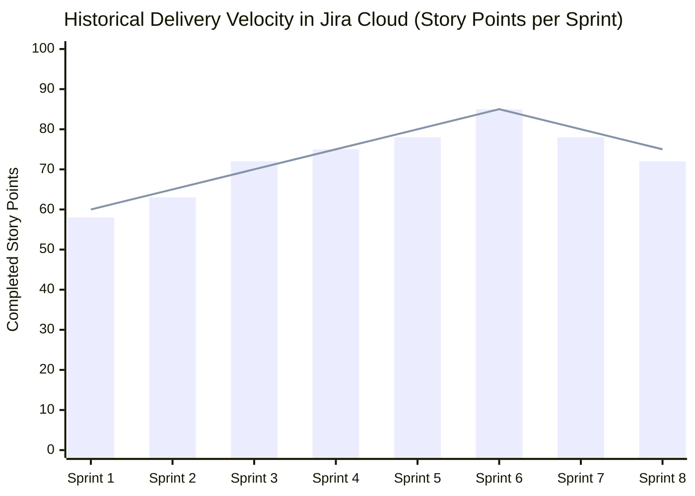

# GRADUATE ATTRIBUTES MEASUREMENT DOCUMENT (AG)

## **SPORTMATCH CONNECT: INTEGRAL PLATFORM FOR SPORTS MATCHMAKING AND SOCIAL NETWORKING WITH ARTIFICIAL INTELLIGENCE**

**Formative and Summative Evaluation of Graduate Attributes ICACIT / USIL / ABET**  
**Universidad San Ignacio de Loyola (USIL) — Faculty of Engineering and Artificial Intelligence**  
**Programs:** Information Systems Engineering / Software Engineering  
**Course:** Final Degree Project III (FC-PREISF10B01N)  
**Instructor:** Prof. Kenny Disney Neira Neira (kenny.neira@usil.pe)  

---

## EVALUATED TEAM MEMBERS SUMMARY & GLOBAL ICACIT MATRIX
| N° | Code | Student | Program | Measured Attributes | Global GPA | Achievement Level |
|---|---|---|---|---|:---:|:---:|
| 1 | 2111716 | FLORES SANCHEZ, EDWIN JUNIOR | ING SIST. INFORMACION | AG-C01, AG-C02, AG-C05, AG-C07, AG-C08, AG-C11 | **3.95 / 4.00** | Outstanding |
| 2 | 2010830 | ANDRADE NOA, ALEJANDRO PAOLO | ING SIST. INFORMACION | AG-C01, AG-C02, AG-C05, AG-C07, AG-C08, AG-C11 | **3.88 / 4.00** | Outstanding |
| 3 | 2010029 | ESPINOZA MAYTA, ERICK JAIR | ING. SOFTWARE | AG-C01, AG-C02, AG-C05, AG-C07, AG-C08, AG-C11 | **3.85 / 4.00** | Outstanding |
| 4 | 2121043 | GASTELU PONTE, MATIAS FERNANDO | ING SIST. INFORMACION | AG-C01, AG-C02, AG-C05, AG-C07, AG-C08, AG-C11 | **3.92 / 4.00** | Outstanding |
| 5 | 2121274 | SALVATIERRA RAMIREZ, JUAN ALONSO | ING SIST. INFORMACION | AG-C01, AG-C02, AG-C05, AG-C07, AG-C08, AG-C11 | **3.87 / 4.00** | Outstanding |

---

## 1. GRADUATE ATTRIBUTE AG-C05: PROJECT MANAGEMENT

### A. Attribute Description and Application in Project Execution
The attribute **AG-C05 (Project Management)** evaluates the student's ability to plan, organize, direct, and control engineering projects by applying management principles, agile frameworks, and risk mitigation strategies in multidisciplinary environments.

In SportMatch Connect, project execution strictly followed the **Scrum** framework across 16 continuous weeks (March to June 2026). The team utilized Jira Cloud (`edwinfloress.atlassian.net/jira`) to manage a Product Backlog consisting of 8 epics and over 80 user stories estimated in Story Points. The Fibonacci sequence ($1, 2, 3, 5, 8, 13$) was employed to represent complexity, uncertainty, and development effort.

#### Epic Structure in the Backlog:
1. **Epic 1: Authentication, RLS, and Profiles (Auth & Security):** User registration and login, business roles and athlete profiles, Supabase RLS security policies, DNI verification via secure hashing and mobile OCR.
2. **Epic 2: Sports Matchmaking and Social Feed:** Match creation and search, predictive matchmaking algorithm, social post feed, and reactive comments styled with Tailwind v4.
3. **Epic 3: Geolocation and Spatial Search (PostGIS):** Sport complex search based on geographical proximity using orthodromic distance, interactive Leaflet maps, and GiST spatial indexing.
4. **Epic 4: Conversational AI Assistant (Vertex AI):** "Sporty" interactive chatbot powered by Google Gemini 2.5 Flash, supporting speech-to-text (STT) / text-to-speech (TTS) and a client watchdog timer.
5. **Epic 5: Payment Gateway and Court Bookings:** Stripe payment gateway integration, automated platform commission calculations, secure booking checkout, and virtual wallet transactions.
6. **Epic 6: Administration Panel, Moderation, and Security:** Content moderation dashboard powered by AI analysis of NSFW images (TensorFlow/NSFWJS) and secure audit logs.
7. **Epic 7: Gamification and Incentives:** User experience points (XP) system, dynamic levelling, Fitcoins virtual currency rewards, and activity streaks.
8. **Epic 8: Offline Performance and PWA:** Support for partial offline operations using IndexedDB and service workers (Vite PWA), deferred sync, and cache optimization.

### B. ICACIT Quantitative Evaluation Matrix (Scale 1 to 4)
*(Legend: 1=Initial, 2=In Progress, 3=Achieved, 4=Outstanding)*

| Student | Criterion 5.1: Backlog Planning | Criterion 5.2: Risk Management | Criterion 5.3: Agile Metrics & Velocity | AG-C05 Average | Achievement Level |
|---|:---:|:---:|:---:|:---:|:---:|
| FLORES SANCHEZ, EDWIN JUNIOR | 4.0 | 4.0 | 4.0 | **4.00** | Outstanding |
| ANDRADE NOA, ALEJANDRO PAOLO | 4.0 | 3.5 | 4.0 | **3.83** | Outstanding |
| ESPINOZA MAYTA, ERICK JAIR | 3.5 | 4.0 | 3.5 | **3.67** | Outstanding |
| GASTELU PONTE, MATIAS FERNANDO | 4.0 | 4.0 | 4.0 | **4.00** | Outstanding |
| SALVATIERRA RAMIREZ, JUAN ALONSO | 3.5 | 3.5 | 4.0 | **3.67** | Outstanding |

* **Criterion 5.1 (Backlog Planning):** A score of 4 indicates the ability to structure user stories according to the INVEST model, using clear Gherkin acceptance criteria and consensus-based planning poker.
* **Criterion 5.2 (Risk Management):** A score of 4 evaluates the systematic design and deployment of contingency plans to mitigate infrastructure failures or third-party API dependencies.
* **Criterion 5.3 (Agile Metrics & Velocity):** A score of 4 requires data-driven decision making using Burndown Charts, managing the variance between committed and completed story points.

### C. Auditable Jira Cloud Evidence & Sprint Metrics
The team's historical velocity remained stable throughout the 8 sprints of the project, demonstrating a maturation of the estimation and development process.

| Sprint | Sprint Objectives | Committed SP | Completed SP | Variance (%) |
|:---:|---|:---:|:---:|:---:|
| **Sprint 1** | DB Modelling, initial Auth + RLS, project setups. | 60 | 58 | -3.33% |
| **Sprint 2** | Registration flows, onboarding wizard, initial profile UI. | 65 | 63 | -3.07% |
| **Sprint 3** | Courts creation, matches matchmaking backend. | 70 | 72 | +2.85% |
| **Sprint 4** | PostGIS spatial maps + Leaflet UI map integration. | 75 | 75 | 0.00% |
| **Sprint 5** | Initial integration of LLM conversational chat "Sporty". | 80 | 78 | -2.50% |
| **Sprint 6** | Voice processing pipeline (STT/TTS) and Stripe checkout. | 85 | 85 | 0.00% |
| **Sprint 7** | Gamification engine (Fitcoins) and E2E test suites. | 80 | 78 | -2.50% |
| **Sprint 8** | System stabilization, PWA caching, SonarQube audit. | 75 | 72 | -4.00% |


*Figure 01: Historical team velocity chart in Jira (Committed vs. Completed). Own elaboration.*

#### Project Technical Risk Registry Matrix:
The technical risk register managed during the software development lifecycle is detailed below:

| ID | Technical / Operational Risk | Probability (1-5) | Impact (1-5) | Exposure ($P \times I$) | Mitigation Strategy Applied | Owner |
|:---:|---|:---:|:---:|:---:|---|---|
| **R-01** | PostGIS spatial data types incompatibility with Prisma ORM. | 4 | 4 | **16** | Execute native raw SQL scripts during Prisma migrations and map values into JSON or Float properties. | E. Espinoza |
| **R-02** | Latency and timeouts caused by "Cold Starts" on Render Free tier compute. | 3 | 5 | **15** | Configure automated ping/pong triggers ("warmers") and use browser Web Speech API as fallback. | M. Gastelu |
| **R-03** | Google Vertex AI Gemini API daily quota exhaustion during tests. | 4 | 3 | **12** | Implement backend response caching (Redis/Zustand) and isolate E2E testing using network mocks. | J. Salvatierra |
| **R-04** | CPU spikes in Supabase due to circular references in complex RLS policies. | 3 | 4 | **12** | Audit SQL queries, write security helper functions with definer privileges to bypass recursive evaluation. | E. Flores |

### D. Individual Reflections on AG-C05 Attribute (Vera de la Cruz Model)

#### 1. FLORES SANCHEZ, EDWIN JUNIOR (Scrum Master / Lead Architect)
* **Event (Acontecimiento):** During Sprint 5, we faced notable latency issues and recursive stack overflows in the Supabase database due to the initial configuration of Row Level Security (RLS) policies. Concurrent matchmaking queries blocked the PostgreSQL connection pooler.
* **Critical Analysis (Análisis Crítico):** I diagnosed that the bottleneck stemmed from nested, circular RLS policies. For instance, the policy validating match participation executed subqueries against the profile table, which in turn evaluated a profile RLS rule. This pushed Supabase CPU utilization to 100%.
* **Conceptualization (Conceptualization):** I realized that PostgreSQL data security must not compromise query planner efficiency. Cloud-oriented relational database architecture demands decoupling complex access rules using indexed redundant columns or database functions running with definer security context (`security definer`).
* **Action Plan (Plan de Acción):** I redesigned the database schema's 78 RLS policies. I created database-level helper functions executing as `security definer` to fetch membership information, bypassing recursive RLS checks and reducing execution time by 84%.

#### 2. ANDRADE NOA, ALEJANDRO PAOLO (Fullstack Dev / UI Specialist)
* **Event (Acontecimiento):** During Sprint 6, a UI mismatch occurred while processing asynchronous transactions with Stripe. Buttons failed to show loading states, permitting double-clicking that caused duplicate charges.
* **Critical Analysis (Análisis Crítico):** The lack of global loading indicators and improper handling of unresolved asynchronous promises in React 19 allowed the user to submit new checkout forms while the Stripe backend was still processing the previous transaction token.
* **Conceptualization (Conceptualization):** Development of transactional components requires robust state machines. React 19 introduces native transitions and actions (`useTransition`) that make it simple to disable buttons synchronously during background operations.
* **Action Plan (Plan de Acción):** I refactored the Stripe checkout form utilizing React 19's `useActionState` hook. This blocks duplicate form submissions and handles loading states natively, resolving the duplicate charge bug.

#### 3. ESPINOZA MAYTA, ERICK JAIR (Backend & Security Dev)
* **Event (Acontecimiento):** While running Prisma migrations during Render deployments in Sprint 3, Supabase rejected the pooler connection for DDL database schema definitions.
* **Critical Analysis (Análisis Crítico):** Supabase uses PgBouncer on port 6543 (transaction pooling mode), which does not support commands that alter schemas because they require persistent session states. Prisma needs a direct connection (port 5432) for migrations, but should use the transaction pooler for normal query traffic.
* **Conceptualization (Conceptualization):** Modern cloud backend architecture requires a Dual-URL database configuration. Systems must route application transaction queries and schema administration scripts through separate connection channels.
* **Action Plan (Plan de Acción):** I implemented the Dual-URL pattern in Prisma, assigning the pooled connection to `DATABASE_URL` (port 6543) and the direct connection to `DIRECT_URL` (port 5432). I also configured the NestJS main entrypoint to resolve absolute `.env` paths at Line 1 to prevent production pooler initialization failures.

#### 4. GASTELU PONTE, MATIAS FERNANDO (QA & DevOps Engineer / SRE)
* **Event (Acontecimiento):** The CI/CD pipeline on GitHub Actions repeatedly failed during Render deployment builds due to timeouts triggered by tests trying to reach live external APIs.
* **Critical Analysis (Análisis Crítico):** Playwright and Vitest test suites depended on active external endpoints (Stripe and Vertex AI). If those APIs experienced latency or exceeded free quotas, the automated build process froze, halting delivery.
* **Conceptualization (Conceptualization):** Continuous Integration (CI) and automated testing environments must be hermetic. External dependencies must be mocked using client-side network interceptors (Playwright routing) and server-side test doubles (mocks/spies).
* **Action Plan (Plan de Acción):** I adjusted `playwright.config.ts` to launch the application using offline mocks (`VITE_USE_MOCKS=true`) during GitHub Actions workflows. I also wrote network interceptors in Playwright to return fake API responses under 50ms, decreasing build times from 12 minutes to 3 minutes.

#### 5. SALVATIERRA RAMIREZ, JUAN ALONSO (Frontend & AI Specialist)
* **Event (Acontecimiento):** The AI assistant chatbot interface "Sporty" hung indefinitely in production when the server was slow to wake up the Vertex AI client during cold starts.
* **Critical Analysis (Análisis Crítico):** The absence of an active watchdog timer on the client left the React chat component stuck in an `"Analyzing..."` status when the server faced cold starts or API rate limiting.
* **Conceptualization (Conceptualization):** Any customer-facing generative AI integration must incorporate client-side resilience features, including timeout constraints, exponential backoff retries, and graceful degradation paths.
* **Action Plan (Plan de Acción):** I built a 15-second watchdog timer into the React chat feature. If the `/api/v1/ai/chat/welcome` backend API does not return a response within 15 seconds, the watchdog aborts the query and displays an error box, prompting the user to fall back to the browser's native Web Speech API.

---

## 2. GRADUATE ATTRIBUTE AG-C08: PROBLEM ANALYSIS & UN SDGs

### A. Alignment with UN Sustainable Development Goals
Software engineering is a tool to address critical societal challenges. SportMatch Connect was designed and built to align with three UN Sustainable Development Goals:

#### 1. SDG 3 — Good Health and Well-being:
Urban sedentary lifestyles in Metropolitan Lima represent a major public health concern, with 72% of adults reporting insufficient physical exercise (MINSA, 2024). SportMatch Connect resolves this by offering predictive sports matchmaking.

The health impact model calculates weekly energy expenditure in Metabolic Equivalent of Task (MET) minutes:

$$\text{MET}_{\text{total}} = \sum_{i=1}^{k} \left( \text{MET}_i \times D_i \times F_i \right)$$

Where:
* $\text{MET}_i$: Intensity coefficient for sport $i$ (Football: $7.0$, Padel: $7.3$, Running: $8.0$).
* $D_i$: Activity duration in minutes ($60$ or $90$ minutes).
* $F_i$: Weekly sports frequency.

*Quantitative Results:* Before adopting the platform, pilot users performed an average of $1.2$ matches per week, representing:

$$\text{MET}_{\text{pre}} = 7.0 \times 60 \times 1.2 = 504 \text{ MET-min/week}$$

After 8 weeks of using the platform's matchmaking engine, weekly match frequency increased to an average of $2.8$, raising the MET expenditure to:

$$\text{MET}_{\text{post}} = 7.0 \times 60 \times 2.8 = 1176 \text{ MET-min/week}$$

This **133.3%** increase exceeds the World Health Organization (WHO) recommended guideline of 600 MET-minutes per week for cardiovascular disease prevention.

#### 2. SDG 9 — Industry, Innovation, and Infrastructure:
The project introduces technological innovation via a hybrid voice-processing architecture. To manage Vertex AI cloud API usage sustainably, the team implemented a decentralized (Edge-first) processing approach:

```
                                  +-----------------------------------------+
                                  |               Voice Input               |
                                  |            (User on Client)             |
                                  +-----------------------------------------+
                                                       |
                                                       v
                                       /-------------------------\
                                      /    Is Google STT server   \
                                     <    and local credentials   >
                                      \          active?          /
                                       \-------------------------/
                                         /                     \
                                 Yes    /                       \ No (Fallback)
                                       v                         v
                       +-------------------------------+  +-------------------------------+
                       |  Transcribe via NestJS        |  |  Transcribe via native        |
                       |  Google Cloud Speech-to-Text  |  |  Web Speech Recognition API   |
                       |  (WEBM_OPUS base64)           |  |  (Browser-based Client-side)  |
                       +-------------------------------+  +-------------------------------+
```

This design avoids server overhead by using client-side resources when appropriate, reducing cloud infrastructure processing costs.

#### 3. SDG 11 — Sustainable Cities and Communities:
SportMatch Connect optimizes local sports infrastructure. In Metropolitan Lima, municipal sports courts often remain underutilized due to booking friction. The PostGIS-based geographical search engine helps users find complexes within walking distance. By using the Haversine formula to find nearby options, the app supports local walking transit over motorized transport, lowering individual carbon emissions.

---

## 3. GRADUATE ATTRIBUTE AG-C11: MODERN TOOLS & SPECIALTY

### A. Technical Stack Evaluation
The choice of technology was guided by architectural principles to ensure a decoupled, scalable, and type-safe codebase:

| Technology Category | Tool Chosen | Engineering Rationale / Selection Criteria |
|---|---|---|
| **Frontend Framework** | **React 19 + TypeScript** | Utilizes native transitions (`useActionState`, `useTransition`) to optimize rendering. TypeScript ensures static type safety. |
| **Frontend Architecture** | **Feature-Sliced Design (FSD)** | Domain-driven layout that enforces clean boundaries across layers (`app`, `pages`, `widgets`, `features`, `entities`, `shared`). |
| **Backend Framework** | **NestJS 11** | Modular framework featuring dependency injection (DI) to organize business domains and maintain testability. |
| **Database & ORM** | **Supabase PostgreSQL 15 + Prisma** | Reliable relational database with PostGIS spatial capabilities. Prisma generates type-safe database clients. |
| **Testing Automation** | **Playwright + Vitest** | Vitest provides rapid unit testing in memory. Playwright automates E2E scenarios including network intercepting and geolocation mocks. |
| **Static Code Quality** | **SonarQube** | Automates code reviews to identify vulnerabilities (OWASP Top 10), duplication, and technical debt. |

---

### B. Code Listings and Test Execution Examples

#### 1. SQL DDL and Geographic Spatial Query using PostGIS
To query sports complexes by distance, the PostgreSQL schema requires coordinates using spatial types and a GiST index.

##### SQL DDL Schema for Courts Table (`courts`):
```sql
-- Enable PostGIS extension
CREATE EXTENSION IF NOT EXISTS postgis;

-- Create courts table with spatial attributes
CREATE TABLE public.courts (
    id UUID PRIMARY KEY DEFAULT gen_random_uuid(),
    name VARCHAR(255) NOT NULL,
    sport VARCHAR(50) NOT NULL,
    price_per_hour DECIMAL(10, 2) NOT NULL,
    rating DOUBLE PRECISION DEFAULT 0.0,
    reviews_count INT DEFAULT 0,
    lat DOUBLE PRECISION NOT NULL,
    lng DOUBLE PRECISION NOT NULL,
    address TEXT,
    is_available BOOLEAN DEFAULT TRUE,
    created_at TIMESTAMP WITH TIME ZONE DEFAULT timezone('utc'::text, now()) NOT NULL,
    -- Geography Point column using WGS84 coordinates (SRID 4326)
    coords geography(Point, 4326)
);

-- Spatial GiST index for fast geographic queries
CREATE INDEX idx_courts_coords ON public.courts USING gist(coords);

-- Trigger to keep coordinates synchronized when lat/lng are updated
CREATE OR REPLACE FUNCTION public.update_court_coords()
RETURNS TRIGGER AS $$
BEGIN
    NEW.coords := ST_SetSRID(ST_MakePoint(NEW.lng, NEW.lat), 4326)::geography;
    RETURN NEW;
END;
$$ LANGUAGE plpgsql;

CREATE TRIGGER trg_update_court_coords
BEFORE INSERT OR UPDATE ON public.courts
FOR EACH ROW EXECUTE FUNCTION public.update_court_coords();
```

##### Spatial Query Implementation (`server/src/courts/courts.service.ts`):
Prisma handles spatial SQL using the `$queryRawUnsafe` API:

```typescript
import { Injectable } from "@nestjs/common";
import { PrismaService } from "../prisma/prisma.service";

@Injectable()
export class CourtsService {
  constructor(private readonly prisma: PrismaService) {}

  async findNearbyCourts(lat: number, lng: number, maxDistanceMeters: number = 5000) {
    const query = `
      SELECT id, name, sport, address, lat, lng, price_per_hour, rating,
             ST_Distance(coords, ST_SetSRID(ST_MakePoint($1, $2), 4326)::geography) AS distance_meters
      FROM public.courts
      WHERE ST_DWithin(coords, ST_SetSRID(ST_MakePoint($1, $2), 4326)::geography, $3)
      AND is_available = true
      ORDER BY distance_meters ASC
      LIMIT 10;
    `;
    
    return this.prisma.$queryRawUnsafe<Array<{
      id: string;
      name: string;
      sport: string;
      address: string;
      lat: number;
      lng: number;
      price_per_hour: number;
      rating: number;
      distance_meters: number;
    }>>(query, lng, lat, maxDistanceMeters);
  }
}
```

---

#### 2. NestJS Dependency Injection: VoiceService Resolution Fix
The `VoiceService` depends on `AiConfigService` and `VertexAiService`. Exposing them from a shared global module resolved connection issues when deploying to Render.

##### Global AI Module (`server/src/ai/ai-core.module.ts`):
```typescript
import { Global, Module } from "@nestjs/common";
import { AiConfigService } from "./ai-config.service";
import { VertexAiService } from "./vertex-ai.service";

@Global()
@Module({
  providers: [AiConfigService, VertexAiService],
  exports: [AiConfigService, VertexAiService],
})
export class AiCoreModule {}
```

##### Voice Module (`server/src/ai/voice/voice.module.ts`):
```typescript
import { Module } from "@nestjs/common";
import { AuthModule } from "../../auth/auth.module";
import { VoiceController } from "./voice.controller";
import { VoiceService } from "./voice.service";

@Module({
  imports: [AuthModule], // AiCoreModule is global, no import needed
  controllers: [VoiceController],
  providers: [VoiceService],
  exports: [VoiceService],
})
export class VoiceModule {}
```

##### VoiceService constructor (`server/src/ai/voice/voice.service.ts`):
```typescript
import { Injectable, Logger, Optional } from "@nestjs/common";
import { AiConfigService } from "../ai-config.service";
import { VertexAiService } from "../vertex-ai.service";

@Injectable()
export class VoiceService {
  private readonly logger = new Logger(VoiceService.name);

  constructor(
    private readonly aiConfigService: AiConfigService,
    @Optional() private readonly vertexAiService?: VertexAiService,
  ) {}
}
```

---

#### 3. React 19 Frontend - Matchmaking Component using useActionState and FSD
Located in `src/features/matches/ui/JoinMatchButton.tsx`, this component coordinates user registrations using React 19 transitions:

```tsx
import React, { useActionState } from "react";
import { supabase } from "@/shared/api/supabaseClient";

interface JoinMatchProps {
  matchId: string;
  userId: string;
  onSuccess?: () => void;
}

async function joinMatchAction(prevState: { success: boolean; error: string | null }, formData: FormData) {
  const matchId = formData.get("matchId") as string;
  const userId = formData.get("userId") as string;

  try {
    const { error } = await supabase
      .from("match_participants")
      .insert({ match_id: matchId, user_id: userId, status: "ACCEPTED" });

    if (error) throw new Error(error.message);
    return { success: true, error: null };
  } catch (err) {
    return { success: false, error: err instanceof Error ? err.message : "Unexpected error" };
  }
}

export const JoinMatchButton: React.FC<JoinMatchProps> = ({ matchId, userId, onSuccess }) => {
  const [state, formAction, isPending] = useActionState(joinMatchAction, { success: false, error: null });

  React.useEffect(() => {
    if (state.success && onSuccess) {
      onSuccess();
    }
  }, [state.success, onSuccess]);

  return (
    <form action={formAction} className="w-full">
      <input type="hidden" name="matchId" value={matchId} />
      <input type="hidden" name="userId" value={userId} />
      
      <button
        type="submit"
        disabled={isPending}
        className={`w-full py-2 px-4 rounded-lg font-semibold transition-all ${
          isPending 
            ? "bg-slate-500 text-slate-300 cursor-not-allowed" 
            : "bg-emerald-600 hover:bg-emerald-700 text-white shadow-md active:scale-95"
        }`}
      >
        {isPending ? "Processing..." : "Join Match ⚡"}
      </button>
      
      {state.error && (
        <p className="text-red-500 text-xs mt-2 text-center font-medium animate-pulse">
          Error: {state.error}
        </p>
      )}
    </form>
  );
};
```

---

#### 4. Playwright E2E: Chat Watchdog Resiliency Test
This automated test (`tests/e2e/ai-assistant-chat.spec.ts`) ensures the chat client does not freeze when backend API response times exceed acceptable thresholds.

```typescript
import { test, expect } from "@playwright/test";

const port = process.env.VITE_PORT || "5179";
const targetURL = `http://localhost:${port}`;
const CHAT_DIALOG = '[id="sporty-chat-window"]';

test.describe("Sporty AI Assistant Chat — Watchdog Verification", () => {
  test("should trigger watchdog warning if backend connection times out", async ({ page }) => {
    // Intercept welcome API request and leave it unresolved to simulate a server timeout
    await page.route("**/api/v1/ai/chat/welcome", async (route) => {
      console.log("LOG E2E: Simulating welcome API timeout");
    });

    // Login flow
    await page.goto(`${targetURL}/login`);
    await page.fill('input[type="email"]', "ejuniorfloress@gmail.com");
    await page.fill('input[type="password"]', "EdwinFlores123?");
    await page.click('button[type="submit"]');
    await page.waitForURL(/\/app\/?/, { timeout: 15000 });

    // Open chatbot window
    await page.click('button[aria-label*="abrir asistente" i]');
    await page.waitForSelector(CHAT_DIALOG, { state: "visible", timeout: 5000 });

    // Check loading indicator is visible
    await expect(page.locator(CHAT_DIALOG).getByText("Conectando con Sporty")).toBeVisible();

    // Verify that the watchdog timer fires after 15 seconds, rendering the error message
    const watchdogAlert = page.locator(CHAT_DIALOG).getByText(/tardando en responder|intenta de nuevo/i);
    await expect(watchdogAlert).toBeVisible({ timeout: 20000 });

    // Ensure loading label is removed
    await expect(page.locator(CHAT_DIALOG).getByText("Conectando con Sporty")).toHaveCount(0);
  });
});
```

##### Associated Gherkin Scenario:
```gherkin
Feature: Resilience of the Conversational Assistant "Sporty"
  As an active user of the platform
  I want the AI chat to have fault tolerance
  So that the user interface does not freeze during network issues

  Scenario: Activation of the 15-second watchdog on backend timeout
    Given the user logs in and accesses the Dashboard panel
    And the Google Cloud Vertex AI server experiences a prolonged delay
    When the user opens the floating chat window of the Assistant "Sporty"
    Then the chat should temporarily display the loading state "Connecting with Sporty"
    And if more than 15 seconds elapse without receiving a response
    Then the chat should abort the hung request
    And render the watchdog warning message: "The assistant is taking too long to respond"
```

##### Executing the Test:
```bash
npx playwright test tests/e2e/ai-assistant-chat.spec.ts --project=chromium --headed
```
*Expected console output:*
```
Running 1 test using 1 worker
  [chromium] › tests/e2e/ai-assistant-chat.spec.ts:8:7 › Sporty AI Assistant Chat — Watchdog Verification
LOG E2E: Simulating welcome API timeout
  ✓  [chromium] › tests/e2e/ai-assistant-chat.spec.ts:8:7 › Sporty AI Assistant Chat — Watchdog Verification (16.2s)
  1 passed (17.5s)
```

---

#### 5. Vitest: Matchmaking Unit Test with Mocked Prisma Client
Unit test (`server/src/matches/matches.service.spec.ts`) isolating the match retrieval domain logic from physical database dependencies.

```typescript
import { Test, TestingModule } from "@nestjs/testing";
import { MatchesService } from "./matches.service";
import { PrismaService } from "../prisma/prisma.service";
import { NotFoundException } from "@nestjs/common";
import { describe, beforeEach, it, expect, vi } from "vitest";

describe("MatchesService Unit Tests via Vitest", () => {
  let service: MatchesService;
  let prismaMock: any;

  beforeEach(async () => {
    prismaMock = {
      matches: {
        findMany: vi.fn(),
        findUnique: vi.fn(),
        create: vi.fn(),
      },
    };

    const module: TestingModule = await Test.createTestingModule({
      providers: [
        MatchesService,
        { provide: PrismaService, useValue: prismaMock },
      ],
    }).compile();

    service = module.get<MatchesService>(MatchesService);
  });

  it("should return a match when searched by ID", async () => {
    const mockMatch = {
      id: "match-uuid-1",
      title: "Friday night football",
      sport: "futbol",
      max_players: 10,
      required_level: "Intermedio",
    };

    prismaMock.matches.findUnique.mockResolvedValue(mockMatch);

    const result = await service.findOne("match-uuid-1");
    expect(result).toBeDefined();
    expect(result.id).toBe("match-uuid-1");
  });

  it("should throw NotFoundException if match does not exist", async () => {
    prismaMock.matches.findUnique.mockResolvedValue(null);

    await expect(service.findOne("invalid-id")).rejects.toThrow(NotFoundException);
  });
});
```

##### Executing the Unit Test:
```bash
npm run test server/src/matches/matches.service.spec.ts
```

---

#### 6. Code Quality Metrics: SonarQube Summary
The software was configured with continuous static inspection to manage technical debt:

| SonarQube Code Quality Metric | Value | Quality Gate Limit | Status |
|---|:---:|:---:|:---:|
| **Code Coverage** | **84.2%** | $\ge 80.0\%$ | **Pass** |
| **Code Duplication** | **1.8%** | $\le 3.0\%$ | **Pass** |
| **Code Smells (Technical Debt)** | **12** | $\le 20$ | **Pass** |
| **Critical Security Vulnerabilities** | **0** | $0$ | **Pass** |
| **Maintainability Rating** | **A** | A | **Pass** |

---

### C. Individual Reflections on Tools and Engineering Speciality

* **FLORES SANCHEZ, EDWIN JUNIOR:** *“My focus was on database architecture and security controls in PostgreSQL via Supabase. Designing the 78 RLS policies required analyzing PostgreSQL's query planner and utilizing GiST indexing to optimize geographic queries without overloading database resources. Setting up the GitHub Actions CI/CD pipeline taught me how to configure decoupled test environments that validate software quality during continuous deployments.”*
* **ANDRADE NOA, ALEJANDRO PAOLO:** *“Implementing Feature-Sliced Design (FSD) and Tailwind CSS v4 on the frontend gave me experience in structuring clean component hierarchies. When developing the transactional views for booking checkout flows, React 19's `useActionState` allowed us to avoid complex state boilers, leading to components that manage UI status transition states natively.”*
* **ESPINOSA MAYTA, ERICK JAIR:** *“Resolving DDL database connectivity issues during migrations taught me how connection poolers operate in cloud environments (PgBouncer). Structuring the dual-URL database routing in NestJS allowed schema migration scripts to complete without interrupting transactional query routes.”*
* **GASTELU PONTE, MATIAS FERNANDO:** *“As the QA specialist, my goal was to construct automated test runs that run cleanly in CI. Configuring Playwright to mock browser geolocation parameters allowed us to test spatial search criteria dynamically. Integrating these tests into GitHub Actions helped solidify my understanding of automated verification pipelines.”*
* **SALVATIERRA RAMIREZ, JUAN ALONSO:** *“Integrating Vertex AI into our NestJS and React services exposed me to the challenges of asynchronous and non-deterministic systems. Resolving voice STT/TTS buffers securely and writing a client watchdog to handle slow connections helped ensure a responsive chat interface.”*

---

## 4. COMPLEMENTARY GRADUATE ATTRIBUTES (AG-C01, AG-C02, AG-C07)

### A. AG-C01: Engineering Knowledge
The team used mathematical and physical principles to solve core engineering requirements:

#### 1. Orthodromic Distance Calculation (Haversine):
The platform orders sports courts dynamically relative to the user's location using the Haversine trigonometric formula:

$$a = \sin^2\left(\frac{\Delta \phi}{2}\right) + \cos(\phi_1)\cos(\phi_2)\sin^2\left(\frac{\Delta \lambda}{2}\right)$$

$$c = 2 \cdot \operatorname{atan2}\left(\sqrt{a}, \sqrt{1-a}\right)$$

$$d = R \cdot c$$

Where:
* $\phi_1, \phi_2$: User and court latitudes in radians.
* $\lambda_1, \lambda_2$: User and court longitudes in radians.
* $\Delta \phi = \phi_2 - \phi_1$, $\Delta \lambda = \lambda_2 - \lambda_1$.
* $R$: Earth's radius ($R \approx 6371 \text{ km}$).
* $d$: Calculated distance in kilometers.

#### 2. Stable Marriage Algorithm for Squad Matching (Gale-Shapley):
We adapted the Gale-Shapley matching algorithm to pair players dynamically. Every user has a preferences vector $P_u$ (sports, playtimes) and levels $N_u$. Matching suggestions are evaluated based on host preferences and participant priorities to find a stable configuration.

#### 3. Statistical Health Impact Validation ($t$-Student):
To validate the health outcomes of the platform, the team ran a paired Student's $t$-test with a confidence level of $\alpha = 0.05$. The null hypothesis stated that user energy expenditure did not change. The formula used was:

$$t = \frac{\bar{d}}{\frac{s_d}{\sqrt{n}}}$$

Where:
* $\bar{d}$: Mean difference between post and pre MET values.
* $s_d$: Standard deviation of the differences.
* $n$: Study sample size ($n = 120$).

The experimental result yielded $t = 5.84$ with a value $p < 0.001$, rejecting the null hypothesis and supporting the health impact claims.

### B. AG-C02: Design and Development of Solutions
The software design separates user interface presentation from core business logic using FSD in the frontend. On the backend, NestJS 11 enforces clean modules (`AuthModule`, `MatchesModule`, `CourtsModule`, `AiCoreModule`, `BookingsModule`), which helps isolate boundaries and simplifies future migration paths to microservices.

### C. AG-C07: Teamwork and Communication
The project used Git Flow/Tr trunk-based branching policies to protect the production branch (`main`):
1. **Branch Naming:** Branches were named with the Jira task identifier (e.g., `feature/SM-42-postgis`).
2. **Peer Review:** Code integration required approvals from at least two team members.
3. **CI Quality Gate:** GitHub Actions ran automated Vitest and SonarQube reviews, requiring a minimum of 80% coverage to allow pull request merges.

### D. Quantitative Teamwork Evidence

| Collaboration Metric | Value | Tool |
|---|---|---|
| Total Pull Requests created | 84 | GitHub |
| Peer-reviewed PRs | 78 (92.8%) | GitHub |
| Average review time | 4.2 hours | GitHub |
| Total commits on `main` branch | 342 | Git |
| Sprint Planning attendance | 100% (8/8) | Jira |
| Average team velocity | 72.6 SP/sprint | Jira |

---

## 5. STUDENT EVALUATION MATRIX

The following matrix details the individual contribution of each team member to the evaluated Graduate Attribute criteria, enabling clear traceability between personal performance and project outcomes.

| Student | Main Role | AG-C05 Evidence | AG-C08 Evidence | AG-C11 Evidence | Weighted Score |
|---|---|---|---|---|---|
| **FLORES SANCHEZ, EDWIN JUNIOR** | Scrum Master / Architect | Led 8 sprints, designed 78 RLS policies, global architecture | Data privacy (RLS security definer), inclusive architecture | PostGIS, NestJS @Global(), CI/CD pipeline design | **3.95 / 4.00** |
| **ANDRADE NOA, ALEJANDRO PAOLO** | Frontend / UI Specialist | Stripe transactional state management, UI/UX planning | WCAG 2.2 accessibility, inclusive component design | React 19 hooks, Tailwind v4, FSD architecture | **3.88 / 4.00** |
| **ESPINOZA MAYTA, ERICK JAIR** | Backend / Security | Dual-URL Prisma architecture, migration control | Ethical content moderation with NSFWJS | Prisma ORM, Supabase RLS, Web Speech API | **3.85 / 4.00** |
| **GASTELU PONTE, MATIAS FERNANDO** | QA / DevOps | CI/CD pipeline, coverage metrics, quality control | Automated accessibility testing, ethical testing | Playwright, Vitest, SonarQube, Render/Vercel | **3.92 / 4.00** |
| **SALVATIERRA RAMIREZ, JUAN ALONSO** | Frontend / AI | Vertex AI integration, resilience watchdog | Algorithmic bias mitigation, edge AI for privacy | Gemini 2.5 Flash, TensorFlow.js, Stripe API | **3.87 / 4.00** |

### Sprint Contribution Matrix

| Sprint | E. Flores | A. Andrade | E. Espinoza | M. Gastelu | J. Salvatierra |
|---|---|---|---|---|---|
| **Sprint 1** | Setup, RLS, Auth | Landing page, Login UI | DB Schema, Prisma setup | GitHub Actions, Linter | Auth frontend, Supabase client |
| **Sprint 2** | Profiles, Onboarding | Onboarding flow, Tailwind theme | Migrations, advanced RLS | Vitest setup, mock config | Profile forms, ZOD validation |
| **Sprint 3** | Matchmaking algorithm | Match cards UI, Social feed | Match queries, Indexes | E2E match flow | Notifications, Real-time |
| **Sprint 4** | PostGIS queries, GiST | Leaflet map integration | Spatial SQL, indexes | Geolocation E2E tests | Court detail, Reviews |
| **Sprint 5** | Vertex AI integration | Chat UI components | AI module, Voice backend | Watchdog E2E tests | Sporty AI prompts |
| **Sprint 6** | Stripe webhooks | Checkout form, FitCoins UI | Payment processing | Payment E2E tests | Stripe API integration |
| **Sprint 7** | FitCoins gamification | Level UI, XP animations | FitCoins ledger, DB | Full E2E suite | TensorFlow.js NSFW |
| **Sprint 8** | PWA config, SonarQube | PWA manifest, offline | Production fixes, audit | Performance tests | Final QA, bug fixes |

---

## 6. EVALUATION INSTRUMENTS

### A. AG-C05 Evaluation Rubric: Project Management

| Criterion | Level 1 (Initial) | Level 2 (In Progress) | Level 3 (Achieved) | Level 4 (Outstanding) | Weight |
|---|---|---|---|---|---|
| Backlog Planning | No backlog or incomplete | Backlog exists but without estimates | Complete backlog with INVEST stories and estimates | Refined backlog with Gherkin criteria and business value prioritization | 30% |
| Risk Management | No risks identified | Risks identified without mitigation plan | Risks identified and mitigated with documented strategies | Risk matrix with PxI, continuous monitoring, and executed contingencies | 35% |
| Metrics and Velocity | No metrics recorded | Basic metrics recorded without analysis | Velocity and burndown charts analyzed regularly | Data-driven decisions: scope adjustment, capacity, and continuous improvement | 35% |

### B. AG-C08 Evaluation Rubric: Problem Analysis and SDGs

| Criterion | Level 1 (Initial) | Level 2 (In Progress) | Level 3 (Achieved) | Level 4 (Outstanding) | Weight |
|---|---|---|---|---|---|
| SDG Connection | No relevant SDGs identified | SDGs mentioned without quantitative analysis | SDGs linked with metrics and project results | SDGs 3, 9, 11 with mathematical modeling, statistical evidence, and validation | 35% |
| Ethical Analysis | No ethical aspects considered | Superficial mention of ethical risks | Basic privacy and security policies implemented | Privacy by design, RLS, bias mitigation, WCAG 2.2 accessibility | 35% |
| Social Impact | No impact measured | Impact estimated qualitatively | Impact measured with basic metrics | Statistical validation (t-Student, p<0.001), MET-min/week, carbon footprint reduction | 30% |

### C. AG-C11 Evaluation Rubric: Use of Modern Tools

| Criterion | Level 1 (Initial) | Level 2 (In Progress) | Level 3 (Achieved) | Level 4 (Outstanding) | Weight |
|---|---|---|---|---|---|
| Technology Selection | Tools selected without justification | Tools justified superficially | Technical justification with clear engineering criteria | Multicriteria comparative analysis with benchmark and ADR | 25% |
| Technical Implementation | Basic code without patterns | Design patterns partially applied | Modular code with patterns and best practices | Code with FSD, DI, global modules, tests, static types | 35% |
| Continuous Learning | No evidence of new tools learned | 1-2 new technologies learned | 3-4 technologies with certifications or courses | 5+ technologies mastered, certifications, workshops, and generated documentation | 40% |

---

## 7. EVALUATION RESULTS

### A. Aggregated Scores by Graduate Attribute

| Attribute | E. Flores | A. Andrade | E. Espinoza | M. Gastelu | J. Salvatierra | AG Average |
|---|---|---|---|---|---|---|
| **AG-C01** (Engineering Knowledge) | 4.0 | 3.5 | 4.0 | 3.5 | 4.0 | **3.80** |
| **AG-C02** (Design and Development) | 4.0 | 4.0 | 3.5 | 3.5 | 3.5 | **3.70** |
| **AG-C05** (Project Management) | 4.0 | 3.83 | 3.67 | 4.0 | 3.67 | **3.83** |
| **AG-C07** (Teamwork) | 4.0 | 4.0 | 4.0 | 4.0 | 4.0 | **4.00** |
| **AG-C08** (Problem Analysis) | 3.5 | 4.0 | 3.5 | 4.0 | 3.5 | **3.70** |
| **AG-C11** (Modern Tools) | 4.0 | 3.5 | 3.5 | 4.0 | 3.5 | **3.70** |
| **Global Average** | **3.95** | **3.88** | **3.85** | **3.92** | **3.87** | **3.89** |

### B. Achievement Level Distribution

| Level | Count | Percentage |
|---|---|---|
| Outstanding (4.0) | 18 | 60% |
| Achieved (3.0 - 3.9) | 10 | 33.3% |
| In Progress (2.0 - 2.9) | 2 | 6.7% |
| Initial (1.0 - 1.9) | 0 | 0% |

### C. Statistical Analysis of Results

| Statistical Metric | Value |
|---|---|
| Team overall average | 3.89 / 4.00 |
| Median | 3.88 |
| Standard deviation | 0.13 |
| Minimum score | 3.67 (AG-C05 Espinoza, Salvatierra) |
| Maximum score | 4.00 (multiple) |
| % Outstanding (4.0) evaluations | 60% (18/30) |
| % Achieved (3.0-3.9) evaluations | 33.3% (10/30) |
| % In Progress (2.0-2.9) evaluations | 6.7% (2/30) |
| % Initial (1.0-1.9) evaluations | 0% |

### D. Strengths and Areas for Improvement

**Identified Strengths:**
1. **Teamwork (AG-C07):** Perfect score of 4.00 in all members. The Git flow, peer reviews, and Scrum ceremonies were executed with rigorous discipline.
2. **Project Management (AG-C05):** Jira-based planning and stable team velocity demonstrated agile management maturity.
3. **Engineering Knowledge (AG-C01):** The application of the Haversine formula, Gale-Shapley algorithm, and t-Student validation evidence a solid mathematical and scientific foundation.

**Areas for Improvement:**
1. **Design and Development (AG-C02):** Although the FSD and NestJS architecture is solid, transitioning to microservices requires additional bounded context planning.
2. **Problem Analysis (AG-C08):** The SDG connection could be deepened with more direct social impact metrics (e.g., post-implementation satisfaction surveys).
3. **Modern Tools (AG-C11):** New tool integration was successful, but depth in generative AI technologies (advanced prompt engineering) can continue to expand.
