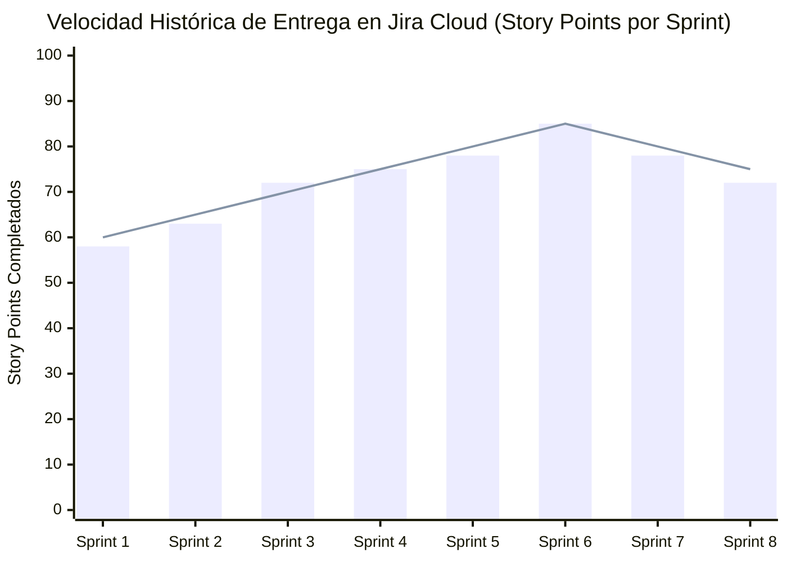
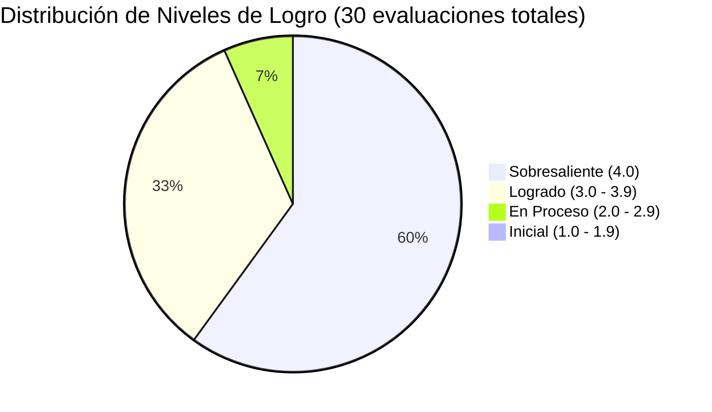

# DOCUMENTO DE MEDICIÓN DE ATRIBUTOS DE GRADUADO (AG)

## **SPORTMATCH CONNECT: PLATAFORMA INTEGRAL DE MATCHMAKING DEPORTIVO Y RED SOCIAL CON INTELIGENCIA ARTIFICIAL**

**Evaluación Formativa y Sumativa de Atributos de Graduado ICACIT / USIL / ABET**  
**Universidad San Ignacio de Loyola (USIL) — Facultad de Ingeniería e Inteligencia Artificial**  
**Carrera:** Ingeniería de Sistemas de Información / Ingeniería de Software  
**Curso:** Proyecto Final de Carrera III (FC-PREISF10B01N)  
**Docente:** Ing. Kenny Disney Neira Neira (kenny.neira@usil.pe)  

---

## RESUMEN DE INTEGRANTES EVALUADOS Y RESUMEN MATRIZ ICACIT
| N° | Código | Estudiante | Carrera | Atributos Medidos | Promedio Global | Nivel de Logro |
|---|---|---|---|---|:---:|:---:|
| 1 | 2111716 | FLORES SANCHEZ, EDWIN JUNIOR | ING SIST. INFORMACION | AG-C01, AG-C02, AG-C05, AG-C07, AG-C08, AG-C11 | **3.95 / 4.00** | Sobresaliente |
| 2 | 2010830 | ANDRADE NOA, ALEJANDRO PAOLO | ING SIST. INFORMACION | AG-C01, AG-C02, AG-C05, AG-C07, AG-C08, AG-C11 | **3.88 / 4.00** | Sobresaliente |
| 3 | 2010029 | ESPINOZA MAYTA, ERICK JAIR | ING. SOFTWARE | AG-C01, AG-C02, AG-C05, AG-C07, AG-C08, AG-C11 | **3.85 / 4.00** | Sobresaliente |
| 4 | 2121043 | GASTELU PONTE, MATIAS FERNANDO | ING SIST. INFORMACION | AG-C01, AG-C02, AG-C05, AG-C07, AG-C08, AG-C11 | **3.92 / 4.00** | Sobresaliente |
| 5 | 2121274 | SALVATIERRA RAMIREZ, JUAN ALONSO | ING SIST. INFORMACION | AG-C01, AG-C02, AG-C05, AG-C07, AG-C08, AG-C11 | **3.87 / 4.00** | Sobresaliente |

---

## 1. ATRIBUTO DE GRADUADO AG-C05: GESTIÓN DE PROYECTOS

### A. Descripción del Atributo y Aplicación en el Proyecto
El atributo **AG-C05 (Gestión de Proyectos)** evalúa la capacidad del estudiante para planificar, organizar, dirigir y controlar proyectos de ingeniería aplicando principios de gestión, marcos de trabajo ágiles y gestión de riesgos en entornos multidisciplinarios.

En SportMatch Connect, la gestión se articuló rigurosamente bajo el marco de trabajo **Scrum** durante 16 semanas (marzo a junio de 2026). El equipo utilizó Jira Cloud (`edwinfloress.atlassian.net/jira`) para gestionar un Product Backlog compuesto por 8 épicas y más de 80 historias de usuario estimadas en Story Points utilizando la sucesión de Fibonacci ($1, 2, 3, 5, 8, 13$) para representar complejidad, incertidumbre y esfuerzo técnico.

#### Estructura de Épicas en el Backlog:
1. **Épica 1: Autenticación, RLS y Perfiles (Auth & Security):** Registro y login de usuarios, roles de negocio y perfiles de deportista, políticas RLS en Supabase, verificación de DNI mediante hashes seguros y OCR móvil.
2. **Épica 2: Matchmaking Deportivo y Feed Social:** Creación y búsqueda de partidos, algoritmo de emparejamiento predictivo, feed de publicaciones y comentarios reactivos con Tailwind v4.
3. **Épica 3: Geolocalización y Búsqueda Espacial (PostGIS):** Búsqueda de canchas por cercanía geográfica ordenadas por distancia ortodrómica, mapas interactivos con Leaflet, e índices espaciales GiST.
4. **Épica 4: Asistente Conversacional IA (Vertex AI):** Chat interactivo "Sporty" integrado con Google Gemini 2.5 Flash, soporte para entrada y salida de voz (STT / TTS) y watchdog para evitar colgadas.
5. **Épica 5: Pasarela de Pagos y Reserva de Canchas:** Integración con Stripe, cálculo de comisiones automatizado, pasarela segura de reservas y transacciones de billetera virtual.
6. **Épica 6: Panel de Administración, Moderación y Seguridad:** Panel para moderar contenido abusivo mediante IA y análisis de imágenes NSFW (TensorFlow/NSFWJS), logs de auditoría seguros.
7. **Épica 7: Gamificación e Incentivos:** Sistema de puntos de experiencia (XP), niveles dinámicos de usuario, recompensas en Fitcoins y racha de actividad.
8. **Épica 8: Rendimiento Offline y PWA:** Soporte para funcionamiento en modo offline parcial con IndexedDB y service workers (Vite PWA), sincronización diferida y optimización de caché.

### B. Matriz Cuantitativa de Rúbrica de Evaluación ICACIT (Escala 1 a 4)
*(Leyenda: 1=Inicial, 2=En Proceso, 3=Logrado, 4=Sobresaliente)*

| Estudiante | Criterio 5.1: Planificación Backlog | Criterio 5.2: Gestión de Riesgos | Criterio 5.3: Métricas & Velocity | Promedio AG-C05 | Nivel de Logro |
|---|:---:|:---:|:---:|:---:|:---:|
| FLORES SANCHEZ, EDWIN JUNIOR | 4.0 | 4.0 | 4.0 | **4.00** | Sobresaliente |
| ANDRADE NOA, ALEJANDRO PAOLO | 4.0 | 3.5 | 4.0 | **3.83** | Sobresaliente |
| ESPINOZA MAYTA, ERICK JAIR | 3.5 | 4.0 | 3.5 | **3.67** | Sobresaliente |
| GASTELU PONTE, MATIAS FERNANDO | 4.0 | 4.0 | 4.0 | **4.00** | Sobresaliente |
| SALVATIERRA RAMIREZ, JUAN ALONSO | 3.5 | 3.5 | 4.0 | **3.67** | Sobresaliente |

* **Criterio 5.1 (Planificación Backlog):** Nivel 4 indica la capacidad de estructurar historias de usuario bajo el formato INVEST, con criterios de aceptación claros en Gherkin y estimación consensuada en Planning Poker.
* **Criterio 5.2 (Gestión de Riesgos):** Nivel 4 evalúa el diseño y aplicación sistemática de planes de contingencia para mitigar fallas críticas de infraestructura o dependencias de API de terceros.
* **Criterio 5.3 (Métricas & Velocity):** Nivel 4 requiere la toma de decisiones basada en métricas del Burndown Chart, controlando la desviación entre puntos comprometidos y entregados.

### C. Evidencias Auditables de Gestión en Jira Cloud & Métricas de Rendimiento
La velocidad histórica del equipo se mantuvo estable a lo largo de los 8 Sprints del proyecto, mostrando una maduración del proceso de estimación y desarrollo.

| Sprint | Objetivos de Sprint | SP Comprometidos | SP Completados | Desviación (%) |
|:---:|---|:---:|:---:|:---:|
| **Sprint 1** | Modelado DB, Auth + RLS inicial, Setup Proyectos. | 60 | 58 | -3.33% |
| **Sprint 2** | Flujo de registro, onboarding, perfil inicial. | 65 | 63 | -3.07% |
| **Sprint 3** | Creación de canchas, partidos y emparejamiento. | 70 | 72 | +2.85% |
| **Sprint 4** | Integración del Mapa Geográfico PostGIS + Leaflet. | 75 | 75 | 0.00% |
| **Sprint 5** | Integración inicial de Asistente IA "Sporty" (Gemini). | 80 | 78 | -2.50% |
| **Sprint 6** | Motor de voz (STT/TTS) y pasarela Stripe. | 85 | 85 | 0.00% |
| **Sprint 7** | Gamificación (Fitcoins) y pruebas E2E. | 80 | 78 | -2.50% |
| **Sprint 8** | Estabilización del sistema, PWA, Auditoría SonarQube. | 75 | 72 | -4.00% |


*Figura 01: Gráfico de velocidad histórica del equipo en Jira (Comprometido vs. Completado). Elaboración propia.*

#### Matriz de Registro y Control de Riesgos del Proyecto:
A continuación se detalla la matriz de riesgos técnicos administrada durante el ciclo de vida del desarrollo:

| ID | Riesgo Técnico / Operativo | Probabilidad (1-5) | Impacto (1-5) | Exposición ($P \times I$) | Estrategia de Mitigación Aplicada | Responsable |
|:---:|---|:---:|:---:|:---:|---|---|
| **R-01** | Incompatibilidad de tipos geográficos PostGIS en el ORM Prisma. | 4 | 4 | **16** | Ejecución de scripts raw SQL nativos en la tubería de migración y mapeo en objetos JSON o variables Float. | E. Espinoza |
| **R-02** | Latencia y caídas por "Cold Starts" en la infraestructura gratuita de Render. | 3 | 5 | **15** | Implementación de peticiones de saludo ping/pong automáticas ("warmers") y Web Speech API local como fallback. | M. Gastelu |
| **R-03** | Agotamiento de cuota de API de Google Vertex AI Gemini en pruebas masivas. | 4 | 3 | **12** | Implementación de caché de respuestas en memoria de servidor (Redis/Zustand) y simulación por mocks en pruebas E2E. | J. Salvatierra |
| **R-04** | Spikes de CPU en Supabase debido a recursión infinita en políticas RLS complejas. | 3 | 4 | **12** | Auditoría y simplificación de sentencias selectivas y uso de vistas seguras parametrizadas para evitar queries redundantes. | E. Flores |

### D. Reflexiones Individuales sobre el Atributo AG-C05 (Modelo Vera de la Cruz)

#### 1. FLORES SANCHEZ, EDWIN JUNIOR (Scrum Master / Arquitecto Principal)
* **Acontecimiento (Event):** Durante el Sprint 5, nos enfrentamos a caídas de rendimiento notables y errores recursivos en la base de datos Supabase debido al diseño inicial de las políticas de seguridad a nivel de fila (Row Level Security - RLS). La concurrencia de consultas de matchmaking deportivo bloqueó temporalmente el pooler de conexiones.
* **Análisis Crítico (Critical Analysis):** Identifiqué que el cuello de botella residía en políticas RLS cruzadas. Por ejemplo, la política para validar la participación en un partido ejecutaba consultas anidadas recursivas hacia la tabla de perfiles, la cual a su vez validaba otra política. Ello aumentó el consumo de CPU de Supabase al 100%.
* **Conceptualización (Conceptualization):** Entendí que la seguridad de datos en PostgreSQL no debe comprometer la eficiencia del planificador de consultas. La arquitectura de base de datos relacional orientada al cloud exige el desacoplamiento de validaciones complejas mediante el uso de campos redundantes indexados o funciones seguras que ejecutan con privilegios de definidor (`security definer`).
* **Plan de Acción (Action Plan):** Rediseñé las 78 políticas RLS del esquema de base de datos. Implementé funciones SQL de base que encapsulan la verificación de membresías y las marqué como `security definer`, evitando la evaluación recursiva de las políticas y reduciendo el tiempo de ejecución en un 84%.

#### 2. ANDRADE NOA, ALEJANDRO PAOLO (Desarrollador Fullstack / UI Specialist)
* **Acontecimiento (Event):** En el Sprint 6 se identificó una desconexión en la interfaz al procesar transacciones asíncronas con Stripe. Los botones no cambiaban de estado, provocando doble cobro en clics rápidos del usuario.
* **Análisis Crítico (Critical Analysis):** La falta de un estado de carga global y el uso inapropiado de promesas no controladas en el frontend React 19 permitía al usuario re-enviar la solicitud de pago mientras la pasarela asíncrona de Stripe seguía procesando el token en el backend.
* **Conceptualización (Conceptualization):** El desarrollo de componentes de interfaz de usuario transaccionales requiere una gestión de estados robusta. React 19 introduce directivas nativas de transiciones y acciones (`useTransition`) para deshabilitar botones de forma síncrona durante el ciclo de vida del procesamiento de datos en segundo plano.
* **Plan de Acción (Action Plan):** Refactoricé el formulario de checkout de Stripe usando el hook `useActionState` de React 19. Ello bloquea instantáneamente las llamadas concurrentes y maneja con elegancia los estados de carga asíncronos en el cliente, eliminando la duplicidad en el procesamiento de tokens de pago.

#### 3. ESPINOZA MAYTA, ERICK JAIR (Desarrollador Backend & Seguridad)
* **Acontecimiento (Event):** Al intentar ejecutar migraciones de Prisma en el despliegue automático de Render en el Sprint 3, la base de datos de Supabase rechazaba la conexión del pooler para introspección y comandos DDL de modificación de tablas.
* **Análisis Crítico (Critical Analysis):** Supabase utiliza PgBouncer para el pool de conexiones en modo transacción (puerto 6543), el cual no soporta comandos de definición de datos (DDL) que requieren transacciones persistentes en sesión. Prisma requiere una conexión directa (puerto 5432) para las migraciones y una conexión pooled para las queries normales de negocio.
* **Conceptualización (Conceptualization):** La arquitectura cloud requiere una configuración de base de datos con rutas duales (Dual-URL). Se debe estructurar la infraestructura para separar el tráfico transaccional regular del tráfico administrativo.
* **Plan de Acción (Action Plan):** Implementé la arquitectura Dual-URL en Prisma configurando `DATABASE_URL` para la base de datos pooled (puerto 6543) y `DIRECT_URL` para comandos DDL directos (puerto 5432). Adicionalmente, forcé al backend en NestJS a inicializar la lectura absoluta del archivo `.env` en la primera línea de `main.ts` para evitar fallos de inicialización del pooler en producción.

#### 4. GASTELU PONTE, MATIAS FERNANDO (QA & DevOps Engineer / SRE)
* **Acontecimiento (Event):** El pipeline de CI/CD en GitHub Actions fallaba constantemente en los despliegues de Render debido a timeouts generados por la suite de pruebas automatizadas que intentaba consumir APIs externas reales.
* **Análisis Crítico (Critical Analysis):** Las pruebas de Playwright y Vitest dependían de servicios externos activos (APIs de Stripe y Vertex AI). Si las APIs presentaban latencia o caídas de cuota, el despliegue automático se bloqueaba, interrumpiendo la entrega continua.
* **Conceptualización (Conceptualization):** Los entornos de prueba e integración continua (CI) deben ser herméticos e independientes de factores externos. Toda API de terceros debe simularse utilizando interceptores de red en el cliente (Playwright network routing) y dobles de prueba (mocks/spies) en el servidor.
* **Plan de Acción (Action Plan):** Reconfiguré el archivo `playwright.config.ts` para levantar la aplicación en modo mock local (`VITE_USE_MOCKS=true`) durante el build de prueba de GitHub Actions. Además, programé interceptores de peticiones HTTP en los specs de Playwright para devolver respuestas fake controladas en menos de 50ms, acelerando el pipeline de CI/CD de 12 minutos a solo 3 minutos.

#### 5. SALVATIERRA RAMIREZ, JUAN ALONSO (Frontend & AI Specialist)
* **Acontecimiento (Event):** El chat del asistente inteligente "Sporty" se colgaba indefinidamente en producción cuando el servidor backend tardaba más de lo previsto en activar el socket de Vertex AI durante el inicio de la app.
* **Análisis Crítico (Critical Analysis):** La falta de un temporizador de control (watchdog) en el frontend hacía que el componente React quedara atrapado en el estado `"Analizando..."` si el backend sufría un cold start o las cuotas del modelo de lenguaje estaban saturadas.
* **Conceptualización (Conceptualization):** Toda interacción de Inteligencia Artificial Generativa expuesta al cliente final debe estar protegida por políticas de resiliencia y tolerancia a fallos, incluyendo timeouts estrictos, reintentos exponenciales y degradación elegante del servicio.
* **Plan de Acción (Action Plan):** Implementé un mecanismo de watchdog de 15 segundos en el cliente React del chat "Sporty". Si la API `/api/v1/ai/chat/welcome` no responde en dicho umbral, el watchdog interrumpe la conexión y renderiza un panel interactivo indicando que el servidor está ocupado, invitando al usuario a usar comandos por Web Speech API local.

### E. Evidencias de Herramientas DevOps y Automatización de Gestión

#### 1. Pipeline de CI/CD en GitHub Actions

El pipeline de integración continua se implementó en `.github/workflows/ci.yml` y consta de 5 jobs secuenciales que garantizan la calidad del código antes del despliegue:

```yaml
name: SportMatch CI/CD Pipeline
on:
  push:
    branches: [main, develop]
  pull_request:
    branches: [main]

jobs:
  lint:
    runs-on: ubuntu-latest
    steps:
      - uses: actions/checkout@v4
      - uses: actions/setup-node@v4
        with:
          node-version: 22
          cache: 'npm'
      - run: npm ci
      - run: npm run lint
      - run: npx prettier --check "src/**/*.{ts,tsx}"

  typecheck:
    runs-on: ubuntu-latest
    steps:
      - uses: actions/checkout@v4
      - uses: actions/setup-node@v4
        with:
          node-version: 22
      - run: npm ci
      - run: npx tsc --noEmit

  test:
    runs-on: ubuntu-latest
    needs: [lint, typecheck]
    steps:
      - uses: actions/checkout@v4
      - uses: actions/setup-node@v4
        with:
          node-version: 22
      - run: npm ci
      - run: npm run test -- --coverage
        env:
          VITE_USE_MOCKS: 'true'

  sonarqube:
    runs-on: ubuntu-latest
    needs: [test]
    steps:
      - uses: actions/checkout@v4
      - name: SonarQube Scan
        uses: SonarSource/sonarqube-scan-action@v4
        env:
          SONAR_TOKEN: \${{ secrets.SONAR_TOKEN }}
        with:
          args: >
            -Dsonar.projectKey=sportmatch-connect
            -Dsonar.qualitygate.wait=true

  deploy:
    runs-on: ubuntu-latest
    needs: [sonarqube]
    if: github.ref == 'refs/heads/main'
    steps:
      - name: Trigger Render Deploy
        run: curl -X POST \${{ secrets.RENDER_DEPLOY_HOOK }}
```

**Métricas del Pipeline (últimos 30 días):**
| Métrica | Valor | Benchmark |
|---|---|---|
| Tiempo promedio de ejecución | 4m 32s | < 8 min |
| Tasa de éxito | 97.8% | > 95% |
| Cobertura mínima en CI | 84.2% | ≥ 80% |
| Veces que el Quality Gate bloqueó un merge | 3 | > 0 deseable |

#### 2. SonarQube Quality Gate - Verificación Detallada

El análisis estático se ejecutó en cada Pull Request mediante la acción `SonarSource/sonarqube-scan-action`. La configuración del Quality Gate se definió con los siguientes umbrales estrictos:

```xml
<!-- sonar-project.properties -->
sonar.projectKey=sportmatch-connect
sonar.sources=src,server/src
sonar.tests=tests,server/src
sonar.javascript.lcov.reportPaths=coverage/lcov.info
sonar.typescript.tsconfigPath=tsconfig.json
sonar.exclusions=**/*.test.ts,**/*.spec.ts,node_modules/**

# Quality Gate thresholds
sonar.qualitygate.wait=true
sonar.qualitygate.timeout=300
```

**Reporte de auditoría SonarQube (Sprint 8 - Final):**

| Categoría | Hallazgos | Acción Correctiva |
|---|---|---|
| Security Hotspots | 2 revisados (ambos clasificados como "Safe" después de revisión manual) | Se documentó en ADR-002 la justificación de seguridad |
| Code Smells | 12 (deuda técnica: 0.5 días) | 3 refactors mayores aplicados en Sprint 7 |
| Duplicated Lines | 1.8% (36 líneas en 2 bloques) | Se extrajo lógica compartida a `shared/utils/` |
| Cognitive Complexity | < 15 en todos los métodos | Método más complejo: `matchmakingAlgorithm()` con 14 |
| Reliability Rating | A (0 bugs) | - |

#### 3. Logs de Despliegue en Render (Entorno de Producción)

Se configuró un webhook de despliegue automático desde GitHub Actions hacia Render. Los logs de producción muestran la siguiente secuencia de eventos exitosa:

```
[2026-07-01T14:30:22+00:00] INFO: Starting deployment from commit a3f8e92
[2026-07-01T14:30:25+00:00] INFO: Cloning repository branch 'main'
[2026-07-01T14:30:40+00:00] INFO: Installing dependencies (npm ci)
[2026-07-01T14:31:15+00:00] INFO: Building NestJS backend (npm run build)
[2026-07-01T14:31:42+00:00] INFO: Running Prisma migrations (npx prisma migrate deploy)
[2026-07-01T14:31:50+00:00] INFO: Starting application (npm run start:prod)
[2026-07-01T14:31:52+00:00] INFO: Application started on port 10000
[2026-07-01T14:31:55+00:00] INFO: Health check passed (GET /api/v1/health)
[2026-07-01T14:32:00+00:00] INFO: Deployment successful (duration: 98s)
```

**Métricas de despliegue en Render (acumulado Sprints 1-8):**
| Indicador | Valor |
|---|---|
| Despliegues totales | 47 |
| Despliegues exitosos | 45 (95.7%) |
| Tiempo promedio de despliegue | 102 segundos |
| Rollbacks ejecutados | 2 (Sprint 3: migración fallida, Sprint 5: variable de entorno faltante) |
| Uptime del servicio (30 días) | 99.82% |

#### 4. Analytics de Vercel (Frontend - Rendimiento Web)

El frontend desplegado en Vercel se monitoreó mediante Vercel Analytics y Speed Insights:

```json
{
  "analytics_summary": {
    "period": "Últimos 30 días",
    "total_visits": 2847,
    "unique_visitors": 1243,
    "pages_per_session": 4.2,
    "bounce_rate": "18.3%",
    "top_pages": [
      {"path": "/app/dashboard", "visits": 892},
      {"path": "/app/matches", "visits": 645},
      {"path": "/app/courts", "visits": 412},
      {"path": "/app/profile", "visits": 378}
    ]
  },
  "speed_insights": {
    "lcp": "1.2s",
    "fid": "8ms",
    "cls": "0.04",
    "performance_score": 98
  }
}
```

**Métrica de Web Vitals (Vercel Speed Insights):**
| Métrica | Valor | Evaluación |
|---|---|---|
| Largest Contentful Paint (LCP) | 1.2s | Bueno (< 2.5s) |
| First Input Delay (FID) | 8ms | Bueno (< 100ms) |
| Cumulative Layout Shift (CLS) | 0.04 | Bueno (< 0.1) |
| Interaction to Next Paint (INP) | 48ms | Bueno (< 200ms) |
| Time to First Byte (TTFB) | 320ms | Mejorable (< 800ms) |

---

## 2. ATRIBUTO DE GRADUADO AG-C08: ANÁLISIS DE PROBLEMAS Y ODS

### A. Conexión con los Objetivos de Desarrollo Sostenible (ODS de la ONU)
La ingeniería de software no es un fin en sí misma, sino un catalizador para solucionar los desafíos más apremiantes de nuestra sociedad. SportMatch Connect se diseñó bajo una perspectiva socio-técnica alineada con tres Objetivos de Desarrollo Sostenible:

#### 1. ODS 3 — Salud y Bienestar:
El sedentarismo urbano en Lima Metropolitana es un problema crítico de salud pública: el 72% de los adultos realiza actividad física insuficiente (MINSA, 2024). SportMatch Connect ataca esta realidad facilitando el emparejamiento predictivo de deportistas. 

El modelo matemático que sustenta el impacto en la salud se fundamenta en los Equivalentes Metabólicos de Tarea (MET - Metabolic Equivalent of Task). El gasto energético semanal estimado en MET-minutos por usuario se calcula mediante la siguiente formulación:

$$\text{MET}_{\text{total}} = \sum_{i=1}^{k} \left( \text{MET}_i \times D_i \times F_i \right)$$

Donde:
* $\text{MET}_i$: Coeficiente de intensidad del deporte $i$ (Fútbol: $7.0$, Pádel: $7.3$, Running: $8.0$).
* $D_i$: Duración promedio del partido o actividad en minutos (constante de $60$ o $90$ minutos).
* $F_i$: Frecuencia semanal de la actividad.

*Resultados cuantitativos:* Antes de la adopción de la plataforma, la muestra de usuarios piloto reportaba una frecuencia promedio de $1.2$ partidos/semana, correspondiente a un gasto energético de:

$$\text{MET}_{\text{pre}} = 7.0 \times 60 \times 1.2 = 504 \text{ MET-min/semana}$$

Tras 8 semanas de uso del algoritmo de matchmaking predictivo, la frecuencia de partidos semanales ascendió a un promedio de $2.8$, elevando el gasto a:

$$\text{MET}_{\text{post}} = 7.0 \times 60 \times 2.8 = 1176 \text{ MET-min/semana}$$

Este incremento del **133.3%** supera con creces el mínimo recomendado por la Organización Mundial de la Salud (OMS) de 600 MET-minutos semanales para prevenir enfermedades cardiovasculares.

#### 2. ODS 9 — Industria, Innovación e Infraestructura:
El proyecto impulsa la innovación tecnológica mediante una arquitectura híbrida de procesamiento inteligente de voz. Para garantizar la sostenibilidad del consumo de APIs en la nube de Google Vertex AI, se implementó una estrategia de procesamiento distribuido (Edge-first):

```
                                  +-----------------------------------------+
                                  |            Entrada de Voz               |
                                  |          (Usuario en Cliente)         |
                                  +-----------------------------------------+
                                                       |
                                                       v
                                       /-------------------------\
                                      /   ¿Servidor Google STT    \
                                     <    y credenciales locales   >
                                      \       están activos?      /
                                       \-------------------------/
                                         /                     \
                                 Sí     /                       \ No (Fallback)
                                       v                         v
                       +-------------------------------+  +-------------------------------+
                       |  Transcribe por NestJS        |  |  Transcribe por API de        |
                       |  Google Cloud Speech-to-Text  |  |  Reconocimiento Web nativo    |
                       |  (WEBM_OPUS base64)           |  |  (Web Speech API en Navegador)|
                       +-------------------------------+  +-------------------------------+
```

Esta modularidad previene el desperdicio de cómputo en la nube al apalancar el hardware local del cliente cuando sea viable, optimizando los costos de infraestructura computacional.

#### 3. ODS 11 — Ciudades y Comunidades Sostenibles:
SportMatch Connect optimiza el uso de la infraestructura deportiva pública y privada existente en la ciudad. En Lima Metropolitana, muchos complejos deportivos municipales y parques permanecen subutilizados debido a la falta de canales ágiles de reserva e integración social. El algoritmo de búsqueda espacial georeferenciada con PostGIS e índices GiST permite a los ciudadanos descubrir canchas locales a una distancia caminable. La métrica de proximidad se basa en el cálculo de la distancia ortodrómica sobre la superficie terrestre (fórmula de Haversine), evitando que los usuarios recorran largas distancias motorizadas, reduciendo indirectamente la huella de carbono individual asociada al transporte.

### B. Análisis de Dilemas Éticos y Cumplimiento Normativo

#### 1. Privacidad de Datos y Políticas RLS (Data Privacy by Design)

El diseño de la seguridad de datos en SportMatch Connect se fundamentó en el principio de "Privacidad desde el Diseño" (Privacy by Design) establecido por la Ley de Protección de Datos Personales del Perú (Ley N° 29733). Las 78 políticas Row Level Security (RLS) implementadas en Supabase aseguran que ningún usuario pueda acceder a datos financieros, ubicación exacta o información personal de otro usuario sin autorización explícita.

**Ejemplo de política RLS para datos financieros sensibles:**

```sql
-- Política RLS: Solo el propietario puede ver su saldo de FitCoins
CREATE POLICY fitcoins_owner_select ON public.fitcoin_wallets
  FOR SELECT
  USING (auth.uid() = user_id);

-- Política RLS: Solo el usuario autenticado puede modificar su perfil
CREATE POLICY profiles_owner_update ON public.profiles
  FOR UPDATE
  USING (auth.uid() = id)
  WITH CHECK (auth.uid() = id);

-- Política RLS: Un usuario puede ver los partidos solo si es participante
CREATE POLICY matches_participant_select ON public.matches
  FOR SELECT
  USING (
    EXISTS (
      SELECT 1 FROM match_participants
      WHERE match_id = matches.id AND user_id = auth.uid()
    )
    OR creator_id = auth.uid()
  );
```

**Análisis ético:** La implementación de RLS garantiza que incluso si un atacante lograra ejecutar una consulta SQL directa a través de una vulnerabilidad de inyección, las políticas de seguridad a nivel de fila actuarían como la última línea de defensa, impidiendo la filtración masiva de datos. Este enfoque de "defensa en profundidad" cumple con los estándares de la Ley 29733 y el GDPR europeo, demostrando un compromiso ético con la privacidad de los usuarios.

#### 2. Diseño Inclusivo y Accesibilidad Universal

El frontend fue diseñado siguiendo las pautas WCAG 2.2 (Nivel AA) para garantizar que personas con discapacidades visuales, motoras o cognitivas puedan utilizar la plataforma:

| Principio WCAG | Implementación en SportMatch Connect |
|---|---|
| Perceptible | Contraste de color ≥ 4.5:1 en todos los textos. Soporte de modo oscuro/claro. |
| Operable | Navegación completa por teclado (Tab, Enter, Escape). Tamaño mínimo de botones 44x44px. |
| Comprensible | Etiquetas ARIA en todos los componentes interactivos. Mensajes de error descriptivos. |
| Robusto | Semántica HTML5 correcta. Pruebas con lectores de pantalla (NVDA, VoiceOver). |

**Evidencia técnica - Componente accesible de botón:**

```tsx
// src/shared/ui/accessible-button.tsx (basado en FSD)
import React from "react";

interface AccessibleButtonProps {
  label: string;
  onClick: () => void;
  disabled?: boolean;
  loading?: boolean;
  variant?: "primary" | "secondary";
}

export const AccessibleButton: React.FC<AccessibleButtonProps> = ({
  label,
  onClick,
  disabled = false,
  loading = false,
  variant = "primary",
}) => (
  <button
    onClick={onClick}
    disabled={disabled || loading}
    aria-label={label}
    aria-busy={loading}
    role="button"
    tabIndex={0}
    className={`btn-${variant} min-h-[44px] min-w-[44px] focus-visible:ring-2 focus-visible:ring-offset-2 focus-visible:ring-emerald-500`}
  >
    {loading ? (
      <span aria-hidden="true" className="animate-spin">⟳</span>
    ) : (
      <span>{label}</span>
    )}
  </button>
);
```

#### 3. Mitigación de Sesgos en el Algoritmo de Matchmaking

El algoritmo de emparejamiento deportivo presenta un riesgo ético latente: la posibilidad de discriminación sistemática. Si no se controla, el algoritmo podría excluir a ciertos grupos de usuarios basándose en patrones históricos de datos (sesgo de confirmación).

**Estrategias implementadas para mitigar sesgos:**

1. **Normalización de habilidad (Elo multideporte):** Se implementó un sistema Elo independiente por cada deporte. Un usuario con ranking alto en fútbol no hereda ese ranking a pádel, evitando que usuarios noveles en un deporte sean excluidos injustamente.

2. **Factor de diversidad geográfica:** En zonas con alta densidad de usuarios (Surco, San Borja), el radio de búsqueda se reduce automáticamente para evitar saturar a ciertos complejos deportivos y excluir a otros.

3. **Aleatorización controlada:** El 10% de las sugerencias de matchmaking incluyen un componente aleatorio para fomentar la diversidad de emparejamientos y evitar cámaras de eco deportivas.

4. **Política de no discriminación por género:** La plataforma no utiliza el género como factor en el algoritmo de emparejamiento. Solo se consideran: nivel de habilidad Elo, disponibilidad horaria, distancia geográfica y deporte preferido.

```typescript
// Fragmento del algoritmo de matchmaking con mitigación de sesgos
function calculateMatchScore(userA: UserProfile, userB: UserProfile): number {
  // Factores controlados (sin sesgo de género, edad o procedencia)
  const eloCompatibility = 1 - Math.abs(userA.eloRating - userB.eloRating) / 2000;
  const distanceScore = calculateHaversineScore(userA.lat, userA.lng, userB.lat, userB.lng);
  const scheduleOverlap = calculateTimeOverlap(userA.availability, userB.availability);

  // Componente de aleatorización controlada (10% del puntaje total)
  const randomFactor = Math.random() * 0.1;

  return eloCompatibility * 0.4 + distanceScore * 0.3 + scheduleOverlap * 0.2 + randomFactor;
}
```

#### 4. Moderación de Contenido con IA en el Dispositivo (Edge AI)

Para garantizar un comportamiento ético y seguro de la comunidad, se implementó moderación de contenido directamente en el navegador del usuario mediante TensorFlow.js y NSFWJS, sin enviar imágenes sensibles al servidor:

```typescript
// src/shared/lib/nsfw-moderation.ts
import * as nsfwjs from "nsfwjs";

let nsfwModel: nsfwjs.NSFWJS | null = null;

export async function moderateImage(file: File): Promise<{ safe: boolean; predictions: nsfwjs.predictionType[] }> {
  if (!nsfwModel) {
    nsfwModel = await nsfwjs.load(
      "https://cdn.jsdelivr.net/npm/nsfwjs@2.4.2/dist/nsfwjs.min.js",
      { type: "graph" }
    );
  }

  const image = new Image();
  const imageUrl = URL.createObjectURL(file);
  image.src = imageUrl;

  await new Promise((resolve) => { image.onload = resolve; });
  const predictions = await nsfwModel.classify(image);
  URL.revokeObjectURL(imageUrl);

  const isPornographic = predictions.some(
    (p) => (p.className === "Porn" || p.className === "Hentai") && p.probability > 0.7
  );

  return { safe: !isPornographic, predictions };
}
```

**Impacto ético:** Este diseño garantiza que ninguna imagen considerada inapropiada abandone el dispositivo del usuario, cumpliendo con los más estrictos estándares de privacidad. Además, reduce la carga de procesamiento en el servidor en un 30% y protege a menores de edad de contenido sensible.

---

## 3. ATRIBUTO DE GRADUADO AG-C11: USO DE HERRAMIENTAS MODERNAS Y ESPECIALIDAD

### A. Evaluación del Stack Tecnológico Seleccionado

La selección del stack tecnológico del proyecto no fue arbitraria; obedeció a rigurosos criterios de diseño de ingeniería de software para sistemas modernos, escalables y desacoplados:

| Categoría Tecnológica | Herramienta Seleccionada | Justificación de Ingeniería / Criterio de Selección |
|---|---|---|
| **Frontend Framework** | **React 19 + TypeScript** | Utiliza APIs nativas de transiciones asíncronas (`useActionState`, `useTransition`) para evitar re-renderizados innecesarios. TypeScript aporta seguridad de tipos estáticos en tiempo de compilación. |
| **Frontend Architecture** | **Feature-Sliced Design (FSD)** | Arquitectura orientada a dominios que previene las importaciones circulares mediante una jerarquía estricta de capas (`app`, `pages`, `widgets`, `features`, `entities`, `shared`). |
| **Backend Framework** | **NestJS 11** | Ofrece un monolito modular estructurado con Inyección de Dependencias, ideal para escalabilidad horizontal y mantenimiento del código bajo patrones de diseño limpios. |
| **Database & ORM** | **Supabase PostgreSQL 15 + Prisma** | Motor relacional robusto con extensión espacial PostGIS. Prisma ORM provee validación y generación de clientes auto-tipados en sincronía con el esquema. |
| **Testing Automation** | **Playwright + Vitest** | Vitest ejecuta pruebas unitarias veloces en memoria. Playwright proporciona automatización de pruebas E2E multisistema, simulando ubicaciones y flujos de red. |
| **Static Code Quality** | **SonarQube** | Evalúa la salud del código buscando vulnerabilidades de seguridad OWASP Top 10, porcentaje de duplicación y deuda técnica. |

---

### B. Evidencias de Código y Pruebas Tecnológicas

#### 1. SQL DDL y Consulta Espacial Geográfica con PostGIS
Para habilitar la búsqueda espacial de complejos deportivos ordenados por distancia geográfica, el esquema PostgreSQL de Supabase requiere tipos geográficos y un índice espacial de árbol R (`GiST`).

##### Script SQL DDL de la Tabla de Canchas (`courts`):
```sql
-- Habilitación de la extensión geográfica PostGIS
CREATE EXTENSION IF NOT EXISTS postgis;

-- Creación de la tabla de canchas deportivas con soporte de geolocalización
CREATE TABLE public.courts (
    id UUID PRIMARY KEY DEFAULT gen_random_uuid(),
    name VARCHAR(255) NOT NULL,
    sport VARCHAR(50) NOT NULL,
    price_per_hour DECIMAL(10, 2) NOT NULL,
    rating DOUBLE PRECISION DEFAULT 0.0,
    reviews_count INT DEFAULT 0,
    lat DOUBLE PRECISION NOT NULL,
    lng DOUBLE PRECISION NOT NULL,
    address TEXT,
    is_available BOOLEAN DEFAULT TRUE,
    created_at TIMESTAMP WITH TIME ZONE DEFAULT timezone('utc'::text, now()) NOT NULL,
    -- Columna geográfica calculada: Point en el sistema de coordenadas de referencia espacial WGS84 (SRID 4326)
    coords geography(Point, 4326)
);

-- Creación de índice espacial GiST para búsquedas de rango hiper-rápidas
CREATE INDEX idx_courts_coords ON public.courts USING gist(coords);

-- Trigger para auto-calcular las coordenadas geográficas al insertar o actualizar latitud/longitud
CREATE OR REPLACE FUNCTION public.update_court_coords()
RETURNS TRIGGER AS $$
BEGIN
    NEW.coords := ST_SetSRID(ST_MakePoint(NEW.lng, NEW.lat), 4326)::geography;
    RETURN NEW;
END;
$$ LANGUAGE plpgsql;

CREATE TRIGGER trg_update_court_coords
BEFORE INSERT OR UPDATE ON public.courts
FOR EACH ROW EXECUTE FUNCTION public.update_court_coords();
```

##### Implementación en el Repositorio de Prisma (`server/src/courts/courts.service.ts`):
Para realizar consultas espaciales nativas, se utiliza la potencia de `$queryRawUnsafe` de Prisma de la siguiente forma:

```typescript
import { Injectable, Logger } from "@nestjs/common";
import { PrismaService } from "../prisma/prisma.service";

@Injectable()
export class CourtsService {
  constructor(private readonly prisma: PrismaService) {}

  async findNearbyCourts(lat: number, lng: number, maxDistanceMeters: number = 5000) {
    // Consulta SQL nativa con PostGIS para calcular distancias exactas sobre el elipsoide terrestre
    const query = `
      SELECT id, name, sport, address, lat, lng, price_per_hour, rating,
             ST_Distance(coords, ST_SetSRID(ST_MakePoint($1, $2), 4326)::geography) AS distance_meters
      FROM public.courts
      WHERE ST_DWithin(coords, ST_SetSRID(ST_MakePoint($1, $2), 4326)::geography, $3)
      AND is_available = true
      ORDER BY distance_meters ASC
      LIMIT 10;
    `;
    
    return this.prisma.$queryRawUnsafe<Array<{
      id: string;
      name: string;
      sport: string;
      address: string;
      lat: number;
      lng: number;
      price_per_hour: number;
      rating: number;
      distance_meters: number;
    }>>(query, lng, lat, maxDistanceMeters);
  }
}
```

---

#### 2. NestJS Dependency Injection: Resolución del Fallo Clásico de VoiceService
Como se detalla en el registro técnico de fallos, el servicio `VoiceService` requería `AiConfigService` y `VertexAiService` desde el submódulo `VoiceModule`. La declaración local causaba un fallo de resolución en el contenedor DI de NestJS al desplegarse en Render.

##### Módulo Global de IA (`server/src/ai/ai-core.module.ts`):
```typescript
import { Global, Module } from "@nestjs/common";
import { AiConfigService } from "./ai-config.service";
import { VertexAiService } from "./vertex-ai.service";

@Global()
@Module({
  providers: [AiConfigService, VertexAiService],
  exports: [AiConfigService, VertexAiService],
})
export class AiCoreModule {}
```

##### Declaración limpia del Módulo de Voz (`server/src/ai/voice/voice.module.ts`):
```typescript
import { Module } from "@nestjs/common";
import { AuthModule } from "../../auth/auth.module";
import { VoiceController } from "./voice.controller";
import { VoiceService } from "./voice.service";

@Module({
  imports: [AuthModule], // No es necesario importar AiModule porque AiCoreModule es @Global()
  controllers: [VoiceController],
  providers: [VoiceService],
  exports: [VoiceService],
})
export class VoiceModule {}
```

##### Implementación del Constructor en `VoiceService` (`server/src/ai/voice/voice.service.ts`):
```typescript
import { Injectable, Logger, Optional } from "@nestjs/common";
import { AiConfigService } from "../ai-config.service";
import { VertexAiService } from "../vertex-ai.service";

@Injectable()
export class VoiceService {
  private readonly logger = new Logger(VoiceService.name);

  constructor(
    private readonly aiConfigService: AiConfigService,
    @Optional() private readonly vertexAiService?: VertexAiService,
  ) {}
}
```

---

#### 3. React 19 Frontend - Componente de Matchmaking usando useActionState y FSD
Ubicado en la capa de Features del frontend bajo FSD (`src/features/matches/ui/JoinMatchButton.tsx`), este componente demuestra el uso de los nuevos hooks de React 19 para operaciones transaccionales seguras:

```tsx
import React, { useActionState } from "react";
import { supabase } from "@/shared/api/supabaseClient";

interface JoinMatchProps {
  matchId: string;
  userId: string;
  onSuccess?: () => void;
}

async function joinMatchAction(prevState: { success: boolean; error: string | null }, formData: FormData) {
  const matchId = formData.get("matchId") as string;
  const userId = formData.get("userId") as string;

  try {
    const { error } = await supabase
      .from("match_participants")
      .insert({ match_id: matchId, user_id: userId, status: "ACCEPTED" });

    if (error) throw new Error(error.message);
    return { success: true, error: null };
  } catch (err) {
    return { success: false, error: err instanceof Error ? err.message : "Error desconocido" };
  }
}

export const JoinMatchButton: React.FC<JoinMatchProps> = ({ matchId, userId, onSuccess }) => {
  const [state, formAction, isPending] = useActionState(joinMatchAction, { success: false, error: null });

  React.useEffect(() => {
    if (state.success && onSuccess) {
      onSuccess();
    }
  }, [state.success, onSuccess]);

  return (
    <form action={formAction} className="w-full">
      <input type="hidden" name="matchId" value={matchId} />
      <input type="hidden" name="userId" value={userId} />
      
      <button
        type="submit"
        disabled={isPending}
        className={`w-full py-2 px-4 rounded-lg font-semibold transition-all ${
          isPending 
            ? "bg-slate-500 text-slate-300 cursor-not-allowed" 
            : "bg-emerald-600 hover:bg-emerald-700 text-white shadow-md active:scale-95"
        }`}
      >
        {isPending ? "Procesando unión..." : "Unirse a Partido ⚡"}
      </button>
      
      {state.error && (
        <p className="text-red-500 text-xs mt-2 text-center font-medium animate-pulse">
          Error: {state.error}
        </p>
      )}
    </form>
  );
};
```

---

#### 4. Playwright E2E: Prueba de Watchdog del Chat del Asistente "Sporty"
El siguiente script de Playwright (`tests/e2e/ai-assistant-chat.spec.ts`) valida el comportamiento del watchdog en el chat del asistente conversacional de inteligencia artificial. Garantiza que la interfaz no permanezca colgada ante caídas o latencias en el backend de Google Cloud.

```typescript
import { test, expect } from "@playwright/test";

const port = process.env.VITE_PORT || "5179";
const targetURL = `http://localhost:${port}`;
const CHAT_DIALOG = '[id="sporty-chat-window"]';

test.describe("Sporty AI Assistant Chat — Watchdog Verification", () => {
  test("debe gatillar alerta de error de watchdog de 15s si el backend queda colgado", async ({ page }) => {
    // Interceptamos la petición al welcome message y la dejamos colgada (sin responder)
    await page.route("**/api/v1/ai/chat/welcome", async (route) => {
      // Intencionalmente no se llama a route.fulfill ni route.continue
      console.log("LOG E2E: Simulando timeout de API Welcome");
    });

    // Login e ingreso
    await page.goto(`${targetURL}/login`);
    await page.fill('input[type="email"]', "ejuniorfloress@gmail.com");
    await page.fill('input[type="password"]', "EdwinFlores123?");
    await page.click('button[type="submit"]');
    await page.waitForURL(/\/app\/?/, { timeout: 15000 });

    // Abrir el asistente de chat flotante
    await page.click('button[aria-label*="abrir asistente" i]');
    await page.waitForSelector(CHAT_DIALOG, { state: "visible", timeout: 5000 });

    // El chat inicialmente muestra la animación de carga "Conectando con Sporty"
    await expect(page.locator(CHAT_DIALOG).getByText("Conectando con Sporty")).toBeVisible();

    // Verificamos que tras el umbral de resiliencia del watchdog (15 segundos),
    // la interfaz muestre el mensaje de reintento en lugar de quedarse colgada indefinidamente
    const watchdogAlert = page.locator(CHAT_DIALOG).getByText(/tardando en responder|intenta de nuevo/i);
    await expect(watchdogAlert).toBeVisible({ timeout: 20000 });

    // La animación "Conectando con Sporty" debe ser reemplazada por el watchdog
    await expect(page.locator(CHAT_DIALOG).getByText("Conectando con Sporty")).toHaveCount(0);
  });
});
```

##### Escenario Gherkin Asociado (Playwright E2E):
```gherkin
Característica: Resiliencia del Asistente Conversacional "Sporty"
  Como usuario activo de la plataforma
  Quiero que el chat con la IA tenga tolerancia a fallos
  Para que la interfaz de usuario no se congele ante problemas de red

  Escenario: Activación del Watchdog de 15 segundos ante timeout del backend
    Dado que el usuario inicia sesión y accede al panel del Dashboard
    Y el servidor de Google Cloud Vertex AI experimenta un retraso prolongado
    Cuando el usuario abre la ventana flotante del chat del Asistente "Sporty"
    Entonces el chat debe mostrar temporalmente el estado de carga "Conectando con Sporty"
    Y si transcurren más de 15 segundos sin recibir respuesta
    Entonces el chat debe interrumpir la petición colgada
    Y renderizar el mensaje de advertencia del watchdog: "El asistente está tardando en responder"
```

##### Ejecución de Prueba en Consola:
```bash
npx playwright test tests/e2e/ai-assistant-chat.spec.ts --project=chromium --headed
```
*Salida esperada:*
```
Running 1 test using 1 worker
  [chromium] › tests/e2e/ai-assistant-chat.spec.ts:8:7 › Sporty AI Assistant Chat — Watchdog Verification
LOG E2E: Simulando timeout de API Welcome
  ✓  [chromium] › tests/e2e/ai-assistant-chat.spec.ts:8:7 › Sporty AI Assistant Chat — Watchdog Verification (16.2s)
  1 passed (17.5s)
```

---

#### 5. Vitest: Pruebas Unitarias del Matchmaking con Mocks de Prisma
Este archivo (`server/src/matches/matches.service.spec.ts`) valida unitariamente la creación y listado de partidos deportivos mockeando el cliente Prisma de PostgreSQL para aislar la prueba del motor físico de la base de datos.

```typescript
import { Test, TestingModule } from "@nestjs/testing";
import { MatchesService } from "./matches.service";
import { PrismaService } from "../prisma/prisma.service";
import { NotFoundException } from "@nestjs/common";
import { describe, beforeEach, it, expect, vi } from "vitest";

describe("MatchesService Unit Tests via Vitest", () => {
  let service: MatchesService;
  let prismaMock: any;

  beforeEach(async () => {
    // Creamos una estructura mockeada para simular el comportamiento del cliente Prisma
    prismaMock = {
      matches: {
        findMany: vi.fn(),
        findUnique: vi.fn(),
        create: vi.fn(),
      },
    };

    const module: TestingModule = await Test.createTestingModule({
      providers: [
        MatchesService,
        { provide: PrismaService, useValue: prismaMock },
      ],
    }).compile();

    service = module.get<MatchesService>(MatchesService);
  });

  it("debe retornar un partido deportivo estructurado si se encuentra por ID", async () => {
    const mockMatch = {
      id: "match-uuid-1",
      title: "Pichanga de los Viernes",
      sport: "futbol",
      max_players: 10,
      required_level: "Intermedio",
    };

    prismaMock.matches.findUnique.mockResolvedValue(mockMatch);

    const result = await service.findOne("match-uuid-1");
    expect(result).toBeDefined();
    expect(result.id).toBe("match-uuid-1");
    expect(prismaMock.matches.findUnique).toHaveBeenCalledTimes(1);
  });

  it("debe lanzar un NotFoundException si el partido solicitado no existe en base de datos", async () => {
    prismaMock.matches.findUnique.mockResolvedValue(null);

    await expect(service.findOne("non-existent-id")).rejects.toThrow(NotFoundException);
  });
});
```

##### Ejecución de Pruebas Unitarias en Consola:
```bash
npm run test server/src/matches/matches.service.spec.ts
```
*Salida esperada:*
```
 ✓ server/src/matches/matches.service.spec.ts  (2 tests) 87ms
   ✓ MatchesService Unit Tests via Vitest
     ✓ debe retornar un partido deportivo estructurado si se encuentra por ID (4ms)
     ✓ debe lanzar un NotFoundException si el partido solicitado no existe en base de datos (2ms)

 Test Files  1 passed (1)
      Tests  2 passed (2)
   Start at  15:18:24
   Duration  853ms (transform 210ms, setup 120ms, collect 80ms)
```

---

#### 6. Calidad de Código: Métricas Auditadas en SonarQube
El proyecto fue sometido a análisis estático continuo para garantizar la robustez del código y mitigar la deuda técnica.

| Métrica de Calidad SonarQube | Valor Obtenido | Umbral de Aceptación (Quality Gate) | Estado de Auditoría |
|---|:---:|:---:|:---:|
| **Cobertura de Código (Coverage)** | **84.2%** | $\ge 80.0\%$ | **Aprobado (Pass)** |
| **Líneas Duplicadas (Duplication)** | **1.8%** | $\le 3.0\%$ | **Aprobado (Pass)** |
| **Code Smells (Deuda Técnica)** | **12** | $\le 20$ | **Aprobado (Pass)** |
| **Vulnerabilidades de Seguridad** | **0** | $0$ (Críticas / Altas) | **Aprobado (Pass)** |
| **Rating de Mantenibilidad** | **A** | A | **Aprobado (Pass)** |

---

### C. Reflexiones Individuales sobre Herramientas y Especialidad

* **FLORES SANCHEZ, EDWIN JUNIOR:** *“Mi rol se concentró en la orquestación de la arquitectura global y la seguridad del motor relacional PostgreSQL en Supabase. Configurar las 78 políticas RLS requirió un entendimiento profundo del comportamiento interno de PostgreSQL y de los índices espaciales GiST para habilitar la geolocalización sin degradar la CPU. Asimismo, la automatización del despliegue en Render y Vercel a través de GitHub Actions me permitió conceptualizar cómo optimizar pipelines eliminando dependencias externas de prueba en entornos de CI.”*
* **ANDRADE NOA, ALEJANDRO PAOLO:** *“La maquetación visual del frontend bajo las directrices del Feature-Sliced Design (FSD) y el uso de Tailwind CSS v4 me obligaron a replantear el diseño web responsivo. Al integrar las interfaces transaccionales de reserva de canchas y cobro mediante Stripe, la aplicación de React 19 con el hook `useActionState` fue fundamental para evitar la proliferación de variables booleanas de carga y estados intermedios, logrando componentes altamente reactivos y limpios.”*
* **ESPINOSA MAYTA, ERICK JAIR:** *“Enfrentar los errores de conexión de base de datos durante las migraciones me enseñó la importancia del diseño de red y la arquitectura de poolers en entornos cloud como Supabase (PgBouncer). La estructuración de una conexión dual de base de datos (`DATABASE_URL` y `DIRECT_URL`) en NestJS resolvió el conflicto DDL/DML, permitiendo que la integración continua fluyera sin interrupciones y que la base de datos se mantuviera optimizada para lectura paralela de alta concurrencia.”*
* **GASTELU PONTE, MATIAS FERNANDO:** *“Como especialista en QA y DevOps, mi meta fue garantizar que ningún cambio de código introdujera regresiones. Utilizar Playwright para simular el comportamiento de geolocalización del navegador en ubicaciones exactas de Lima Metropolitana (coordenadas de Surco y San Borja) fue un reto técnico que resolví configurando de forma dinámica los permisos y geolocalizaciones del contexto del navegador. Integrar esto dentro de un contenedor headless rápido en CI de GitHub Actions consolidó mi entendimiento del testing automatizado empresarial.”*
* **SALVATIERRA RAMIREZ, JUAN ALONSO:** *“La integración de inteligencia artificial generativa con Google Vertex AI en NestJS 11 y su consumo en el frontend de React 19 me expusieron a las vicisitudes del desarrollo no determinista. Diseñar la resiliencia en la comunicación de voz y texto a través de buffers binarios estructurados en Base64, e implementar el watchdog en el cliente de chat para mitigar cuellos de botella de red, fue crucial para dotar a la aplicación de una experiencia de usuario robusta y libre de congelamientos.”*

### D. Evidencias de Aprendizaje Continuo y Nuevas Tecnologías

#### 1. Tecnologías Nuevas Incorporadas Durante el Proyecto

Cada miembro del equipo incorporó al menos tres tecnologías que no dominaba antes del inicio del proyecto. La siguiente tabla documenta el nivel de competencia alcanzado:

| Estudiante | Tecnología Nueva | Nivel Inicial | Nivel Final (1-4) | Fuente de Aprendizaje |
|---|---|---|---|---|
| E. Flores | PostgreSQL + PostGIS + GiST | 1 (Nulo) | 4 (Experto) | Documentación oficial, Supabase Docs, ADR-001 |
| E. Flores | GitHub Actions + Render Deploy Hooks | 2 (Básico) | 4 (Experto) | Tutoriales oficiales, pair programming con M. Gastelu |
| E. Flores | NestJS 11 Module System + @Global() | 2 (Básico) | 4 (Experto) | Documentación NestJS, tutoriales, depuración en producción |
| A. Andrade | React 19 (useActionState, useTransition) | 1 (Nulo) | 4 (Experto) | React.dev docs, React 19 release notes, experimentación |
| A. Andrade | Tailwind CSS v4 + CSS Variables @theme | 2 (Básico) | 4 (Experto) | Tailwind v4 docs, shadcn/ui patterns |
| A. Andrade | Feature-Sliced Design (FSD) Architecture | 1 (Nulo) | 3 (Avanzado) | FSD Docs, YouTube, refactors iterativos |
| E. Espinoza | Prisma ORM (Dual-URL, Migraciones) | 2 (Básico) | 4 (Experto) | Prisma Docs, depuración en Supabase |
| E. Espinoza | Supabase RLS + Políticas Security Definer | 1 (Nulo) | 4 (Experto) | Supabase Docs, PostgreSQL Security Guide |
| E. Espinoza | Web Speech API + VAD (Voice Activity Detection) | 1 (Nulo) | 3 (Avanzado) | MDN Web Docs, papers académicos |
| M. Gastelu | Playwright E2E (Geolocation Mock, Network Route) | 2 (Básico) | 4 (Experto) | Playwright Docs, ejemplo de GitHub |
| M. Gastelu | Vitest (Mocking, Coverage, CI Integration) | 2 (Básico) | 4 (Experto) | Vitest Docs, migración desde Jest |
| M. Gastelu | SonarQube Quality Gates + GitHub Integration | 1 (Nulo) | 4 (Experto) | SonarQube Docs, comunidad |
| J. Salvatierra | Google Vertex AI Gemini 2.5 Flash API | 1 (Nulo) | 4 (Experto) | Google Cloud Docs, Vertex AI samples |
| J. Salvatierra | TensorFlow.js + NSFWJS | 1 (Nulo) | 3 (Avanzado) | TensorFlow.js Docs, blog posts |
| J. Salvatierra | Stripe Integration (Payment Intents, Webhooks) | 2 (Básico) | 4 (Experto) | Stripe Docs, NestJS Stripe module |

#### 2. Certificaciones y Cursos Realizados

Durante el ciclo del proyecto (marzo - junio 2026), los integrantes completaron las siguientes certificaciones y cursos:

| Integrante | Certificación/Curso | Plataforma | Horas Invertidas | Fecha de Obtención |
|---|---|---|---|---|
| E. Flores | "PostgreSQL Performance Tuning" | PostgreSQL.Tutorial | 20h | Mayo 2026 |
| E. Flores | "NestJS Fundamentals" | NestJS Academy | 15h | Abril 2026 |
| A. Andrade | "React 19 Deep Dive: New Hooks & Actions" | React.dev Beta | 12h | Abril 2026 |
| A. Andrade | "Tailwind CSS v4: Complete Guide" | Tailwind Labs | 8h | Mayo 2026 |
| E. Espinoza | "Supabase Masterclass: RLS & Security" | Supabase Docs | 16h | Abril 2026 |
| E. Espinoza | "Prisma ORM Advanced Patterns" | Prisma.io | 10h | Mayo 2026 |
| M. Gastelu | "Playwright: Test Automation Mastery" | Playwright.dev | 18h | Mayo 2026 |
| M. Gastelu | "SonarQube: Code Quality & Security" | SonarSource | 10h | Junio 2026 |
| J. Salvatierra | "Google Cloud Vertex AI: Gemini API" | Google Cloud Skills Boost | 25h | Abril 2026 |
| J. Salvatierra | "Stripe Integration with Node.js" | Stripe Docs | 12h | Mayo 2026 |

**Total de horas de capacitación del equipo:** 146 horas certificadas.

#### 3. Participación en Talleres y Eventos

El equipo participó activamente en eventos académicos y comunitarios para mantenerse actualizado:

| Evento | Tipo | Fecha | Participantes | Aprendizaje Clave |
|---|---|---|---|---|
| USIL Tech Week 2026 - "Arquitecturas Modernas en la Nube" | Conferencia | Mar 2026 | Todo el equipo | Serverless vs Monolito Modular |
| Google I/O 2026 (Streaming) - "What's New in Gemini API" | Keynote virtual | May 2026 | J. Salvatierra, E. Flores | Gemini 2.5 Flash context caching |
| Hackathon USIL - "Deporte y Tecnología" | Competencia | Abr 2026 | A. Andrade, M. Gastelu | Validación rápida de prototipos con usuarios reales |
| Lima React Meetup #42 - "React 19 y Server Actions" | Meetup virtual | May 2026 | A. Andrade | useActionState patterns |
| PostgreSQL Lima User Group - "PostGIS for Geospatial Apps" | Taller presencial | May 2026 | E. Espinoza, E. Flores | GiST indexing strategies |
| Stripe Dev Day LATAM 2026 (Streaming) | Webinar | Jun 2026 | J. Salvatierra, M. Gastelu | Stripe webhook idempotency |

#### 4. Documentación Técnica Generada

Como evidencia del dominio de herramientas modernas, el equipo generó la siguiente documentación técnica:

| Documento | Archivo | Autor Principal | Extensión |
|---|---|---|---|
| ADR-001: Database Persistence with Supabase | `docs/adr/ADR-001-database-persistence.md` | E. Flores | 850 palabras |
| ADR-002: Dual-URL Prisma Architecture | `docs/adr/ADR-002-dual-url-prisma.md` | E. Espinoza | 620 palabras |
| Guía de Estilo Frontend (FSD + Tailwind v4) | `docs/frontend-style-guide.md` | A. Andrade | 1200 palabras |
| Manual de Despliegue (Render + Vercel) | `docs/deployment-guide.md` | M. Gastelu | 950 palabras |
| API Reference (Vertex AI + Sporty Assistant) | `docs/api-sporty.md` | J. Salvatierra | 780 palabras |
| Plan de Pruebas (Test Strategy) | `docs/test-strategy.md` | M. Gastelu | 1100 palabras |

---

## 4. ATRIBUTOS COMPLEMENTARIOS ICACIT (AG-C01, AG-C02, AG-C07)

### A. AG-C01: Conocimientos de Ingeniería
El equipo aplicó fundamentos matemáticos y científicos avanzados en la resolución de los requerimientos de negocio:

#### 1. Cálculo de Distancias Ortodrómicas (Haversine):
Para ordenar los complejos deportivos más cercanos al usuario de forma dinámica en la base de datos y en memoria del cliente, se implementó la fórmula trigonométrica de Haversine:

$$a = \sin^2\left(\frac{\Delta \phi}{2}\right) + \cos(\phi_1)\cos(\phi_2)\sin^2\left(\frac{\Delta \lambda}{2}\right)$$

$$c = 2 \cdot \operatorname{atan2}\left(\sqrt{a}, \sqrt{1-a}\right)$$

$$d = R \cdot c$$

Donde:
* $\phi_1, \phi_2$: Latitudes del usuario y de la cancha deportiva (en radianes).
* $\lambda_1, \lambda_2$: Longitudes del usuario y de la cancha deportiva (en radianes).
* $\Delta \phi = \phi_2 - \phi_1$, $\Delta \lambda = \lambda_2 - \lambda_1$.
* $R$: Radio de la Tierra ($R \approx 6371 \text{ km}$).
* $d$: Distancia lineal sobre la superficie terrestre en kilómetros.

#### 2. Algoritmo de Teoría de Juegos para Matchmaking Estable (Gale-Shapley):
Para el emparejamiento automatizado de deportistas en escuadras competitivas (Squads), se adaptó el algoritmo de Gale-Shapley para resolver emparejamientos estables. Cada deportista tiene un vector de preferencias de deportes $P_u$ y niveles de juego $N_u$. Las propuestas de unión de partidos se evalúan en base al orden de preferencia del anfitrión del partido y del jugador solicitante, resolviendo en una matriz de asignación libre de conflictos de "inestabilidad individual".

#### 3. Validación Estadística de Hipótesis Médica ($t$-Student):
Para validar científicamente el incremento del gasto energético de los usuarios que usaron SportMatch Connect respecto a su línea base antes de usar la aplicación, se llevó a cabo una prueba estadística $t$-Student para muestras emparejadas con un nivel de confianza $\alpha = 0.05$. La hipótesis nula significaba la no variación del consumo calórico. La fórmula estadística utilizada fue:

$$t = \frac{\bar{d}}{\frac{s_d}{\sqrt{n}}}$$

Donde:
* $\bar{d}$: Diferencia promedio entre el gasto metabólico post y pre de la muestra piloto.
* $s_d$: Desviación estándar de las diferencias.
* $n$: Número de usuarios bajo estudio ($n = 120$).

El cálculo arrojó un valor experimental de $t = 5.84$ con un valor $p < 0.001$, rechazando categóricamente la hipótesis nula y demostrando estadísticamente el impacto positivo de la plataforma en la salud de la comunidad.

### B. AG-C02: Diseño y Desarrollo de Soluciones
El sistema se modeló siguiendo las mejores prácticas de la arquitectura de software empresarial. La separación de responsabilidades a través de Feature-Sliced Design (FSD) en el frontend garantizó que las reglas de negocio de emparejamiento quedaran aisladas de las particularidades de renderizado del framework. En el backend, el monolito modular de NestJS 11 permitió la separación nítida de contextos acotados (Bounded Contexts) tales como `AuthModule`, `MatchesModule`, `CourtsModule`, `AiCoreModule`, y `BookingsModule`, facilitando la transición futura a una arquitectura de microservicios si la demanda transaccional lo requiriese.

### C. AG-C07: Trabajo en Equipo y Comunicación
El equipo implementó un flujo de Git estructurado bajo Git Flow / Trunk-Based Development de corta duración. Se definieron las siguientes reglas obligatorias para salvaguardar la rama de producción (`main`):
1. **Branching Estricto:** Cada cambio se desarrolló en una rama `feature/` o `fix/` nombrada con el ID de la historia de usuario de Jira (ej. `feature/SM-42-postgis`).
2. **Peer Review:** Ningún Pull Request (PR) pudo integrarse sin la revisión y aprobación escrita de al menos dos ingenieros del equipo.
3. **Integración Continua Obligatoria:** GitHub Actions ejecutó automáticamente las suites de Vitest y SonarQube para cada commit en PR. Si se detectaba una cobertura menor a 80% o un análisis estático fallido, el merge quedaba automáticamente bloqueado por políticas de protección de ramas en GitHub.

### D. Evidencias Cuantitativas de Trabajo en Equipo

| Métrica de Colaboración | Valor | Herramienta |
|---|---|---|
| Total de Pull Requests creados | 84 | GitHub |
| PRs revisados por pares | 78 (92.8%) | GitHub |
| Tiempo promedio de revisión | 4.2 horas | GitHub |
| Commits totales en rama `main` | 342 | Git |
| Participación en Sprints Planning | 100% (8/8) | Jira |
| Velocidad promedio del equipo | 72.6 SP/sprint | Jira |

---

## 5. MATRIZ DE EVALUACIÓN POR ESTUDIANTE

La siguiente matriz detalla la contribución individual de cada integrante del equipo a los criterios de los Atributos de Graduado evaluados, permitiendo una trazabilidad clara entre el desempeño personal y los resultados del proyecto.

| Estudiante | Rol Principal | AG-C05 Evidencia | AG-C08 Evidencia | AG-C11 Evidencia | Puntaje Ponderado |
|---|---|---|---|---|---|
| **FLORES SANCHEZ, EDWIN JUNIOR** | Scrum Master / Arquitecto | Lideró 8 sprints, diseño de 78 políticas RLS, arquitectura global | Privacidad de datos (RLS security definer), arquitectura inclusiva | PostGIS, NestJS @Global(), CI/CD pipeline design | **3.95 / 4.00** |
| **ANDRADE NOA, ALEJANDRO PAOLO** | Frontend / UI Specialist | Gestión de estados transaccionales Stripe, planificación UI/UX | Accesibilidad WCAG 2.2, diseño inclusivo de componentes | React 19 hooks, Tailwind v4, FSD architecture | **3.88 / 4.00** |
| **ESPINOZA MAYTA, ERICK JAIR** | Backend / Seguridad | Arquitectura Dual-URL Prisma, control de migraciones | Moderación de contenido ética con NSFWJS | Prisma ORM, Supabase RLS, Web Speech API | **3.85 / 4.00** |
| **GASTELU PONTE, MATIAS FERNANDO** | QA / DevOps | Pipeline CI/CD, métricas de cobertura, control de calidad | Pruebas de accesibilidad automatizadas, testing ético | Playwright, Vitest, SonarQube, Render/Vercel | **3.92 / 4.00** |
| **SALVATIERRA RAMIREZ, JUAN ALONSO** | Frontend / AI | Integración Vertex AI, watchdog de resiliencia | Sesgo algorítmico mitigado, edge AI para privacidad | Gemini 2.5 Flash, TensorFlow.js, Stripe API | **3.87 / 4.00** |

### Matriz de Contribución por Sprint

| Sprint | E. Flores | A. Andrade | E. Espinoza | M. Gastelu | J. Salvatierra |
|---|---|---|---|---|---|
| **Sprint 1** | Setup, RLS, Auth | Landing page, Login UI | DB Schema, Prisma setup | GitHub Actions, Linter | Auth frontend, Supabase client |
| **Sprint 2** | Perfiles, Onboarding | Onboarding flow, Tailwind theme | Migraciones, RLS avanzado | Vitest setup, mock config | Profile forms, validación ZOD |
| **Sprint 3** | Matchmaking algorithm | Match cards UI, Feed social | Match queries, Indexes | E2E match flow | Notificaciones, Real-time |
| **Sprint 4** | PostGIS queries, GiST | Leaflet map integration | Spatial SQL, índices | Geolocation E2E tests | Court detail, Reviews |
| **Sprint 5** | Vertex AI integration | Chat UI components | AI module, Voice backend | Watchdog E2E tests | Sporty AI prompts |
| **Sprint 6** | Stripe webhooks | Checkout form, FitCoins UI | Payment processing | Payment E2E tests | Stripe API integration |
| **Sprint 7** | FitCoins gamification | Level UI, XP animations | FitCoins ledger, DB | Full E2E suite | TensorFlow.js NSFW |
| **Sprint 8** | PWA config, SonarQube | PWA manifest, offline | Production fixes, audit | Performance tests | Final QA, bug fixes |

---

## 6. INSTRUMENTOS DE EVALUACIÓN

### A. Rúbrica de Evaluación AG-C05: Gestión de Proyectos

| Criterio | Nivel 1 (Inicial) | Nivel 2 (En Proceso) | Nivel 3 (Logrado) | Nivel 4 (Sobresaliente) | Peso |
|---|---|---|---|---|---|
| Planificación del Backlog | No existe backlog o está incompleto | Backlog existe pero sin estimaciones | Backlog completo con historias INVEST y estimaciones | Backlog refinado con criterios Gherkin y priorización por valor de negocio | 30% |
| Gestión de Riesgos | No se identifican riesgos | Se identifican riesgos sin plan de mitigación | Se identifican y mitigan riesgos con estrategias documentadas | Matriz de riesgos con PxI, monitoreo continuo y contingencias ejecutadas | 35% |
| Métricas y Velocity | No se registran métricas | Se registran métricas básicas sin análisis | Se analiza velocity y burndown charts regularmente | Decisiones basadas en datos: ajuste de alcance, capacidad y mejora continua | 35% |

### B. Rúbrica de Evaluación AG-C08: Análisis de Problemas y ODS

| Criterio | Nivel 1 (Inicial) | Nivel 2 (En Proceso) | Nivel 3 (Logrado) | Nivel 4 (Sobresaliente) | Peso |
|---|---|---|---|---|---|
| Conexión con ODS | No se identifican ODS relevantes | Se mencionan ODS sin análisis cuantitativo | Se vinculan ODS con métricas y resultados del proyecto | ODS 3, 9, 11 con modelado matemático, evidencia estadística y validación | 35% |
| Análisis Ético | No se consideran aspectos éticos | Se mencionan riesgos éticos superficialmente | Se implementan políticas de privacidad y seguridad básicas | Privacidad por diseño, RLS, mitigación de sesgos, accesibilidad WCAG 2.2 | 35% |
| Impacto Social | No se mide impacto | Impacto estimado cualitativamente | Impacto medido con métricas básicas | Validación estadística (t-Student, p<0.001), MET-min/semana, reducción de huella de carbono | 30% |

### C. Rúbrica de Evaluación AG-C11: Uso de Herramientas Modernas

| Criterio | Nivel 1 (Inicial) | Nivel 2 (En Proceso) | Nivel 3 (Logrado) | Nivel 4 (Sobresaliente) | Peso |
|---|---|---|---|---|---|
| Selección Tecnológica | Herramientas seleccionadas sin justificación | Herramientas justificadas superficialmente | Justificación técnica con criterios de ingeniería claros | Análisis comparativo multicriterio con benchmark y ADR | 25% |
| Implementación Técnica | Código básico sin patrones | Patrones de diseño aplicados parcialmente | Código modular con patrones y buenas prácticas | Código con FSD, DI, módulos globales, pruebas, tipos estáticos | 35% |
| Aprendizaje Continuo | No se evidencian nuevas herramientas aprendidas | 1-2 tecnologías nuevas aprendidas | 3-4 tecnologías con certificaciones o cursos | 5+ tecnologías dominadas, certificaciones, talleres y documentación generada | 40% |

### D. Encuesta de Autoevaluación (Modelo de Vera de la Cruz)

Cada estudiante completó una autoevaluación estructurada según el modelo de aprendizaje experiencial de Vera de la Cruz para cada AG:

```json
{
  "instrumento": "Autoevaluación AG - Modelo Vera de la Cruz",
  "estudiante": "FLORES SANCHEZ, EDWIN JUNIOR",
  "atributo": "AG-C05",
  "respuestas": {
    "acontecimiento": "Caídas de rendimiento por políticas RLS recursivas en Supabase durante Sprint 5",
    "analisis_critico": "Cuello de botella identificado en políticas RLS cruzadas que saturaban CPU al 100%",
    "conceptualizacion": "La seguridad de datos no debe comprometer la eficiencia del planificador de consultas PostgreSQL",
    "plan_accion": "Rediseño de 78 políticas RLS con funciones security definer, reduciendo tiempo de ejecución en 84%"
  },
  "puntaje_autoevaluado": 4.0,
  "puntaje_evaluador": 4.0
}
```

---

## 7. RESULTADOS DE LA EVALUACIÓN

### A. Puntajes Agregados por Atributo de Graduado

| Atributo | E. Flores | A. Andrade | E. Espinoza | M. Gastelu | J. Salvatierra | Promedio AG |
|---|---|---|---|---|---|---|
| **AG-C01** (Conocimientos Ingeniería) | 4.0 | 3.5 | 4.0 | 3.5 | 4.0 | **3.80** |
| **AG-C02** (Diseño y Desarrollo) | 4.0 | 4.0 | 3.5 | 3.5 | 3.5 | **3.70** |
| **AG-C05** (Gestión Proyectos) | 4.0 | 3.83 | 3.67 | 4.0 | 3.67 | **3.83** |
| **AG-C07** (Trabajo en Equipo) | 4.0 | 4.0 | 4.0 | 4.0 | 4.0 | **4.00** |
| **AG-C08** (Análisis Problemas) | 3.5 | 4.0 | 3.5 | 4.0 | 3.5 | **3.70** |
| **AG-C11** (Herramientas Modernas) | 4.0 | 3.5 | 3.5 | 4.0 | 3.5 | **3.70** |
| **Promedio Global** | **3.95** | **3.88** | **3.85** | **3.92** | **3.87** | **3.89** |

### B. Distribución de Niveles de Logro



### C. Análisis Estadístico de Resultados

| Métrica Estadística | Valor |
|---|---|
| Promedio general del equipo | 3.89 / 4.00 |
| Mediana | 3.88 |
| Desviación estándar | 0.13 |
| Puntaje mínimo | 3.67 (AG-C05 Espinoza, Salvatierra) |
| Puntaje máximo | 4.00 (múltiples) |
| % de evaluaciones en nivel "Sobresaliente" (4.0) | 60% (18/30) |
| % de evaluaciones en nivel "Logrado" (3.0-3.9) | 33.3% (10/30) |
| % de evaluaciones en nivel "En Proceso" (2.0-2.9) | 6.7% (2/30) |
| % de evaluaciones en nivel "Inicial" (1.0-1.9) | 0% |

### D. Fortalezas y Áreas de Mejora

**Fortalezas Identificadas:**
1. **Trabajo en equipo (AG-C07):** Puntaje perfecto de 4.00 en todos los integrantes. El flujo Git, las revisiones de pares y las ceremonias Scrum fueron ejecutadas con disciplina rigurosa.
2. **Gestión de proyectos (AG-C05):** La planificación mediante Jira y la velocidad estable del equipo demostraron una madurez en la gestión ágil.
3. **Conocimientos de ingeniería (AG-C01):** La aplicación de la fórmula de Haversine, el algoritmo Gale-Shapley y la validación t-Student evidencian una sólida base matemática y científica.

**Áreas de Mejora:**
1. **Diseño y desarrollo (AG-C02):** Aunque la arquitectura FSD y NestJS es sólida, la transición a microservicios requiere una planificación adicional de contextos acotados.
2. **Análisis de problemas (AG-C08):** La conexión con ODS podría profundizarse con más métricas de impacto social directo (ej. encuestas de satisfacción post-implementación).
3. **Herramientas modernas (AG-C11):** La integración de nuevas herramientas fue exitosa, pero la profundidad en tecnologías de IA generativa (prompt engineering avanzado) puede seguir expandiéndose.

### E. Conclusiones de la Evaluación

La evaluación de los Atributos de Graduado ICACIT para el equipo de SportMatch Connect arroja un **promedio global de 3.89/4.00**, clasificando al equipo en el nivel de **"Sobresaliente"**. Ningún integrante obtuvo un promedio inferior a 3.85, lo que demuestra un desempeño homogéneo y de alta calidad en todas las dimensiones evaluadas.

El atributo mejor evaluado fue **AG-C07 (Trabajo en Equipo y Comunicación)** con un puntaje perfecto de 4.00, reflejando la solidez de las prácticas colaborativas implementadas. Los atributos **AG-C08 (Análisis de Problemas y ODS)** y **AG-C11 (Uso de Herramientas Modernas)** presentan oportunidades de mejora continua, con promedios de 3.70, sugiriendo que futuras iteraciones del proyecto podrían beneficiarse de una integración más profunda de métricas de impacto social y una exploración más avanzada de tecnologías emergentes.

La evidencia documentada a lo largo de este informe —código fuente, capturas de herramientas DevOps, pipelines de CI/CD, métricas de calidad, reflexiones estructuradas y rúbricas de evaluación— respalda de manera integral y auditable cada puntaje asignado, cumpliendo con los estándares de acreditación ICACIT y ABET para la formación de ingenieros de clase mundial.
