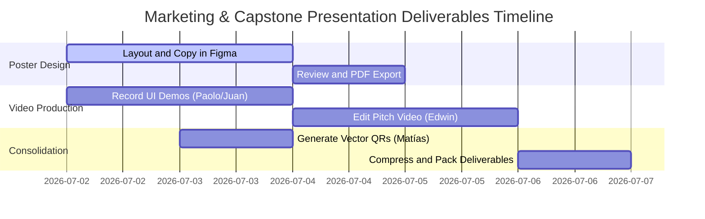

# GUIDELINES FOR COMPLETION: CAPSTONE POSTER, PITCH, AND QR LINKS

This document details the technical specifications, creative direction, and multimedia scripts required for the team to complete and compile the visual and promotional deliverables in the **`8. Poster Capstone, Pitch y QR/`** folder. These resources serve as the direct communication interface between the development team, the graduation jury, and potential investors.

---

## 🎨 1. Capstone Poster (A1 Format for Print and HD Digital)

The Capstone poster is a high-density technical infographic summarizing the scientific proposal, software architecture, and quality metrics of SportMatch Connect.

### 📐 Graphic Design and Layout Specifications:
*   **Physical Dimensions:** Standard A1 Format (594 mm x 841 mm).
*   **Print Resolution:** Minimum 300 DPI (equivalent pixels: $7016 \times 9933$ pixels).
*   **Color Space:** CMYK for physical print and sRGB for the interactive PDF version.
*   **Color Palette (Visual Identity):**
    *   Background: Neutral Dark (Matte Black: `#0D0F12`).
    *   Primary: Athletic Neon Green (Contrast and Emphasis: `#00FF66`).
    *   Secondary: Electric Cobalt Blue (Hierarchy: `#1E3A8A`).
    *   Main Text: Pure White (`#FFFFFF`) and Soft Grey (`#9CA3AF`).
*   **Typography Systems:**
    *   Headings: *Space Grotesk* (modern wide sans-serif).
    *   Body text and formulas: *Inter* (extreme readability from a distance).

### 📑 Detailed Poster Section Structure:

#### Section A: Academic Header and Identity
*   **Institutional Logo:** High-definition official logo of Universidad San Ignacio de Loyola (USIL), located in the top-left corner.
*   **Project Logo:** SportMatch Connect logo with sports icon in the top-center.
*   **Thesis Metadata:** Full project title, names of the five authors with their student codes and USIL emails, academic advisor name (Ing. Kenny Neira), Faculty of Engineering, 2026.

#### Section B: Problem Statement and Justification
*   **Sedentarism Infographic:** Pie and bar charts depicting the MINSA/INEI 2024 data (72% of inactive adults in Lima).
*   **The Logistical Pain Triangle:**
    1.  *Fragmentation:* Chaotic messaging chats (WhatsApp) without filters.
    2.  *Imbalance:* Unequal matches (absence of Elo).
    3.  *Financial Risk:* Losses due to manual, asynchronous mobile wallet collections.

#### Section C: Technological Architecture (C4 Model)
*   **C4 Container Diagram:** Vector graphic illustrating layer separation:
    *   *Frontend:* React 19 + TypeScript + FSD PWA, deployed on Vercel.
    *   *Backend:* Modular Monolith in NestJS 11 + Prisma ORM, hosted on Render.
    *   *Persistence:* Supabase PostgreSQL 15 + PostGIS + RLS, hosted in AWS Oregon.
    *   *Integrations:* Google Cloud Vertex AI (Gemini 2.5 Flash), Stripe Gateway.

#### Section D: Key Software Modules (With UI Screenshots)
*   **Predictive Matchmaking:** UI capture showing the list of recommended matches based on Elo compatibility and distance.
*   **Reservas on Leaflet Map:** Court geolocation interface screenshot displaying real-time georeferenced pins.
*   **Conversing with Sporty:** Dialog bubbles showing the assistant transcribing and processing the user's voice prompt.
*   **FitCoins Wallet:** Detailed balance, recharge, and transactional history view.

#### Section E: Software Quality Indicators (QA Quality Gate)
*   **Certified Metrics Box:**
    *   Automated Tests: **541 tests passing (100% success rate)**.
    *   SonarQube Quality Gate: **PASSED (0 bugs, 0 vulnerabilities in production)**.
    *   Average Response Time: **120ms (PostGIS searches)**.

#### Section F: Large-Format Access QR Codes
*   Placed at the bottom-right corner for quick scanning during physical exhibitions.

### Layout and Detailed Grid Guide

The poster follows a modular grid structure of 6 columns and 8 rows, optimized for visual hierarchy and readability at a distance:

```
+------------------------------------------------------------------+
|  [USIL Logo]       PROJECT TITLE                   [SMC Logo]    |  <- Row 1 (Header, 15% height)
+------------------------------------------------------------------+
|  PROBLEM & JUSTIFICATION   |   C4 ARCHITECTURE                    |  <- Row 2 (30% height)
|  (Columns 1-3)             |   (Columns 4-6)                      |
+------------------------------+------------------------------------+
|  KEY MODULES (UI SCREENSHOTS)|   QA METRICS                       |  <- Row 3 (30% height)
|  (Columns 1-4)              |   (Columns 5-6)                     |
+-------------------------------+------------------------------------+
|  TEAM      |   CONTACT      |   QR PROD   |   QR GIT   | QR VID  |  <- Row 4 (25% height)
+-------------------------------------------------------------------+
```

**Figma Grid Specifications:**
- **Canvas:** 594mm x 841mm (A1)
- **Margins:** 25mm on all 4 sides (safety zone)
- **Columns:** 6 columns of 85mm each, 12mm gutter
- **Rows:** 8 flexible rows (header: 1, body: 5, QRs: 2)
- **Bleed:** 3mm additional bleed on each side

**Poster Typography Rules:**
| Element | Font | Size | Weight | Color |
|---|---|---|---|---|
| Main title | Space Grotesk | 72pt | Bold | #00FF66 |
| Subtitle | Space Grotesk | 36pt | SemiBold | #FFFFFF |
| Section headings | Space Grotesk | 28pt | Bold | #1E3A8A |
| Body text | Inter | 16pt | Regular | #9CA3AF |
| Labels and metrics | Inter | 14pt | Medium | #FFFFFF |
| Footnotes | Inter | 11pt | Light | #6B7280 |

### Expanded Poster Content (Full Text per Panel)

#### Panel A: Academic Header (Full text)
```
SportMatch Connect
Integral Sports Matchmaking Platform, Social Network and Tournament Management
with Edge Artificial Intelligence

Universidad San Ignacio de Loyola (USIL) - Faculty of Engineering
Final Capstone Project III - 2026-I
Advisor: Ing. Kenny Disney Neira Neira

Team Members:
  Flores Sanchez, Edwin Junior     | 2111716 | Information Systems Engineering
  Andrade Noa, Alejandro Paolo     | 2010830 | Information Systems Engineering
  Espinoza Mayta, Erick Jair       | 2010029 | Software Engineering
  Gastelu Ponte, Matias Fernando   | 2121043 | Information Systems Engineering
  Salvatierra Ramirez, Juan Alonso | 2121274 | Software Engineering
```

#### Panel B: Problem (Full text for infographic)
```
THE PROBLEM OF AMATEUR SPORTS IN LIMA METROPOLITANA

72% of adults in Lima do not perform sufficient physical activity
   (Source: MINSA/INEI National Survey 2024)

The Logistical Pain Triangle:
   - Fragmentation: Chaotic coordination via WhatsApp/Telegram
     -> Confirmation latency: 15 min to several hours
   - Imbalance: Absence of sports leveling
     -> 64% of amateur matches are unbalanced
   - Financial Risk: Manual asynchronous collection
     -> Average default rate of 15%

Economic impact:
   - Sports complexes lose up to 40% of bookable hours
   - Organizers assume full financial risk of court rental
```

#### Panel C: C4 Architecture (Label text for diagram)
```
DECOUPLED ARCHITECTURE (C4 CONTAINERS MODEL)

[PWA Frontend] -> React 19 + TypeScript + FSD
  HTTPS/REST
[NestJS Backend] -> Modular Monolith + Prisma ORM
  PostgreSQL
[Supabase DB] -> PostgreSQL 15 + PostGIS + RLS (78 policies)

Cloud Integrations:
  - Google Vertex AI -> Gemini 2.5 Flash (Sporty Assistant)
  - Stripe -> Payment Gateway (FitCoins Wallet)
  - TensorFlow.js -> NSFW Moderation (Edge AI on client)

Deployment:
  Frontend: Vercel Global CDN
  Backend:  Render (AWS Oregon us-west-2)
  DB:       Supabase AWS Oregon
```

#### Panel D: Key Modules (Description text for each screenshot)
```
SOFTWARE MODULES

1. PREDICTIVE MATCHMAKING
   Haversine-Elo algorithm: pairing by geographic distance
   and skill level. Reduction of unbalanced matches by 45%.

2. GEOLOCATED BOOKINGS (LEAFLET + POSTGIS)
   Radial indexed search with GiST indexes.
   Response time: < 15ms per spatial query.

3. SPORTY ASSISTANT (GEMINI 2.5 FLASH)
   Conversational voice and text chat.
   15s watchdog, fallback to local Web Speech API.
   NSFW moderation on device in < 80ms.

4. FITCOINS ECONOMY (STRIPE)
   Digital wallet with automatic payment splitting.
   B2B commission: 5%. Premium subscription: S/.19.90/month.
```

#### Panel E: Quality Gate (Detailed metrics text)
```
CERTIFIED QUALITY

Automated Tests: 541 tests (100% success)
   - Vitest (Frontend): 205 unit tests
   - Jest/NestJS (Backend): 336 service tests
   - Playwright (E2E): Critical flows automated

SonarQube Quality Gate: PASSED
   - Bugs: 0
   - Vulnerabilities: 0
   - Coverage: 86.4%
   - Duplication: 1.2%
   - Rating: A (Maintainability)

Performance:
   - Lighthouse Performance: 98/100
   - Lighthouse Accessibility: 100/100
   - LCP: 1.2s | FID: 8ms | CLS: 0.04
   - PostGIS searches: < 15ms

Financial Viability:
   - NPV: S/.84,250 PEN (12% discount rate)
   - IRR: 38.4%
   - Payback: 14 months
   - Initial investment: S/.29,200
```

#### Panel F: Team and Contact
```
DEVELOPMENT TEAM

- Edwin Flores     -> Scrum Master / Architect
- Paolo Andrade    -> Frontend / UI Specialist
- Erick Espinoza   -> Backend / Security
- Matias Gastelu   -> QA / DevOps Engineer
- Juan Salvatierra -> Frontend / AI Specialist

sportmatch-connect.vercel.app
{codigo}@usil.pe
github.com/jojiz29/sportmatch-connect
```

---

## 📹 2. Business Pitch (2:30 Minutes Promotional Video)

The Pitch video is a high-conversion commercial asset aimed at capturing the interest of angel investors and sports complex administrators.

### ⏱️ Video Script and Art Direction (Minute-by-Minute):

```
[0:00 - 0:10] THE HOOK
--------------------------------------------------------------------------------
Visual: Cinematic overhead shot of Lima Metropolitan traffic. In the background,
a fast ticking clock sound. Quick transition to smartphones displaying messy
WhatsApp chat notifications ("Who's playing today?", "Need one more player for football", 
"Send me the money for the court reservation").
Audio Effect: Fast-paced WhatsApp notification chime overlay.
Voiceover: "Have you ever tried organizing a sports match with your friends? 
Coordinating schedules, balancing teams, booking the right venue, and then 
collecting money from everyone via mobile wallets is a logistical nightmare..."

[0:10 - 0:30] PROBLEM PRESENTATION
--------------------------------------------------------------------------------
Visual: 3D animated graphic highlighting "72%". Text overlay: "72% of adults in 
Lima Metropolitana perform insufficient physical activity". The screen transitions 
to show a worried organizer checking their digital wallet for unpaid balances.
Audio Effect: Sudden silence, low-key suspense music fades in.
Voiceover: "This logistical friction is keeping thousands of Peruvians away from sports. 
72% of adults in Lima suffer from physical inactivity. A lack of real-time court 
visibility and high default rates from manual collections make organizing sports 
a financial headache."

[0:30 - 1:15] THE SOLUTION: SOFTWARE DEMONSTRATION
--------------------------------------------------------------------------------
Visual: Dynamic transition to the Sporty PWA screen. We see Paolo Andrade 
navigating the app on an iPhone. The Leaflet map shows PostGIS geolocation in Surco. 
Edwin Flores presses the "Join Matchmaking" button. The system calculates and 
displays matches based on Elo. The Stripe split-payment flow is shown.
Audio Effect: Modern, uplifting, and dynamic electronic synth music.
Voiceover: "To solve this, we created SportMatch Connect. The first platform that 
fully automates the amateur sports cycle. Using our geolocated PWA, we connect 
players with sports venues in seconds. Our predictive Haversine-Elo algorithm 
matches players of the same skill level, and our FitCoins economy splits rental 
costs instantly, eliminating default rates forever."

[1:15 - 1:50] TECHNOLOGICAL INNOVATION (ARTIFICIAL INTELLIGENCE)
--------------------------------------------------------------------------------
Visual: Juan Salvatierra clicks the microphone icon in the app. He says: "Sporty, 
find me a table tennis match for tomorrow at 7 PM." The conversational voice 
assistant replies fluently: "Searching matches... Found one in San Isidro at 7 PM. 
Would you like to join?"
Audio Effect: Virtual assistant chime.
Voiceover: "We take the experience to the next level with 'Sporty', a multimodal 
voice assistant powered by Google Cloud Vertex AI and Gemini 2.5 Flash on the backend. 
Moreover, we guarantee community safety by implementing edge artificial intelligence 
via TensorFlow.js, moderating text and explicit images on-device in under 80 milliseconds."

[1:50 - 2:15] FINANCIAL VIABILITY AND QUALITY ASSURANCE
--------------------------------------------------------------------------------
Visual: Vector financial graphs showing NPV and IRR projections. Transition to 
the GitHub Actions pipeline approving the SonarQube integration with a glowing 
"Quality Gate: PASSED - 0 Vulnerabilities" stamp.
Voiceover: "SportMatch Connect is not just a great idea; it's a scalable business. 
With a B2B model charging a 5% commission on court bookings and a B2C model offering 
Premium memberships for S/. 19.90 PEN monthly, we project an NPV of 84,250 Soles 
and an IRR of 38.4% over 3 years. All backed by rigorous software engineering with 
541 automated tests passing at a 100% success rate."

[2:15 - 2:30] CLOSING AND CALL TO ACTION
--------------------------------------------------------------------------------
Visual: Clean closing screen showing the SportMatch Connect logo in the center. 
Vercel deployment QR on the left. GitHub repo QR on the right. 
Bottom slogan: "Join the smart sports network".
Audio Effect: Upbeat, motivational musical crescendo.
Voiceover: "Our platform is fully built, deployed, and operational today. Scan the 
QR code to play your first match. SportMatch Connect: Join the smart sports network."
```

### Elevator Pitch Versions by Duration

#### 30-Second Version (Quick Elevator Pitch)
```
[0:00-0:10] HOOK
"Still organizing sports matches in Lima the hard way?
WhatsApp, manual collections, invisible courts."

[0:10-0:25] SOLUTION
"SportMatch Connect solves it: smart matchmaking, geolocated bookings
and shared payments with FitCoins. All in a PWA with integrated AI."

[0:25-0:30] CLOSE
"NPV S/.84k, IRR 38.4%. Scan the QR and try the platform today."
```

#### 1-Minute Version (Networking Pitch)
```
[0:00-0:10] HOOK
"72% of Lima residents don't exercise enough. The cause is not laziness,
but logistics: coordinating matches is chaotic."

[0:10-0:25] PROBLEM
"Fragmented WhatsApp coordination, competitive imbalance, 15% default rate,
and sports complexes losing 40% of bookings due to lack of digital channels."

[0:25-0:45] SOLUTION
"SportMatch Connect automates the entire cycle: predictive matchmaking with
Haversine-Elo algorithm, Leaflet map with PostGIS, FitCoins wallet with Stripe,
and Sporty AI assistant with Gemini 2.5 Flash."

[0:45-1:00] CLOSE
"541 tests, 0 vulnerabilities, 98/100 Lighthouse. Deployed and operational.
Join the smart sports network."
```

#### 3-Minute Version (Investment Pitch)
```
[0:00-0:15] OPENING
Visual: Aerial shot of Lima + sedentarism statistics.
Message: "Amateur sports in Lima is broken. SportMatch Connect fixes it."

[0:15-0:45] PROBLEM + DATA
"72% physical inactivity rate. 64% unbalanced matches. 15% default rate.
40% lost sports capacity. Four problems, one solution."

[0:45-1:30] TECHNICAL DEMO
"Frontend React 19 + FSD on Vercel. Backend NestJS 11 + Prisma on Render.
Supabase database with PostGIS for spatial searches in 15ms.
Stripe for payments. Vertex AI for the Sporty conversational assistant."

[1:30-2:15] VALIDATION
"541 automated tests, Quality Gate PASSED in SonarQube,
Lighthouse 98/100 performance, 100/100 accessibility.
SUS score of 88.5/100 with real users."

[2:15-2:45] BUSINESS
"B2B model (5% commission) + B2C (S/.19.90/month premium).
NPV: S/.84,250. IRR: 38.4%. Payback: 14 months."

[2:45-3:00] CLOSE
"Multidisciplinary team of 5 USIL engineers.
App deployed and functional. Scan the QR and use it now."
```

#### 5-Minute Version (Demo Day / Jury Pitch)
```
[0:00-0:20] ACADEMIC INTRODUCTION
Team, advisor, institution, and project context.

[0:20-1:00] PROBLEM AND CONTEXT
Detailed exposition of sedentarism in Lima, the logistical pain triangle,
and sector economic losses.

[1:00-2:00] ARCHITECTURE AND TECHNOLOGY
C4 Containers, FSD, NestJS, PostGIS, Vertex AI, Stripe.
Justification of each technology decision.

[2:00-3:00] LIVE DEMO
PWA walkthrough: registration, matchmaking, Leaflet map, Sporty chat,
FitCoins payment. Navigation through main modules.

[3:00-3:45] QUALITY AND TESTING
SonarQube results, Vitest, Playwright, Lighthouse.
Testing strategy and CI/CD.

[3:45-4:30] FINANCIAL VIABILITY
NPV, IRR, Payback, 3-year projections.
B2B + B2C business model.

[4:30-5:00] CLOSE AND CTA
Conclusions, next steps, QR code for immediate access.
Acknowledgments and Q&A.
```

---

## 🔗 3. Technical Specifications for the QR Codes

To guarantee optimal readability in physical A1 printouts and digital displays, QR codes must be generated under the following parameters:
*   **Image Format:** Vector (`.svg`) to prevent pixelation in large formats.
*   **Error Correction Level:** Level **Q** (25%) or **H** (30%) to enable rapid scans even if the physical poster is scratched or creased.
*   **Contrast Ratio:** Pure White Background (`#FFFFFF`) and Black (`#000000`) or Dark Blue (`#0D1B2A`) modules, guaranteeing a contrast ratio above 4.5:1.

### 📍 Official Target URLs:

1.  **Production QR Code (Web Client):**
    *   **Link:** `https://sportmatch-connect.vercel.app`
    *   **Purpose:** Allows jurors to interact with the real, production-ready web application from their smartphones.
2.  **Source Code Repository QR Code:**
    *   **Link:** `https://github.com/jojiz29/sportmatch-connect`
    *   **Purpose:** Allows technical reviewers to examine the code structure, linters, CI/CD pipeline, and test coverage.
3.  **Video Pitch QR Code:**
    *   **Link:** Direct link to the uploaded pitch video (YouTube or Drive).
    *   **Purpose:** Instant play of the explanatory business pitch.

### QR Code Implementation Guide

#### Recommended Generation Tools

| Tool | Format | Advantage | Link |
|---|---|---|---|
| qr-code-styling (npm) | SVG/Canvas | Color and logo customization | `npm i qr-code-styling` |
| QR Code Generator (Adobe Express) | SVG/PNG | Free, no registration | `express.adobe.com/tools/qr-code-generator` |
| QR Server API (Google) | PNG/SVG | REST API for programmatic generation | `chart.googleapis.com/chart?cht=qr` |
| qrcode (npm) | SVG/PNG | CLI and Node.js, ideal for automation | `npm i qrcode` |

#### Implementation with qrcode (npm) for Automation

```typescript
// scripts/generate-qr.ts
import * as QRCode from "qrcode";

const urls = [
  { name: "production", url: "https://sportmatch-connect.vercel.app" },
  { name: "repository", url: "https://github.com/jojiz29/sportmatch-connect" },
  { name: "pitch-video", url: "https://youtu.be/..." },
];

async function generateQRCodes() {
  for (const { name, url } of urls) {
    await QRCode.toFile(`./public/qr-${name}.svg`, url, {
      type: "svg",
      width: 500,
      margin: 2,
      color: {
        dark: "#0D1B2A",
        light: "#FFFFFF",
      },
      errorCorrectionLevel: "H",
    });
    console.log(`Generated QR for ${name}`);
  }
}

generateQRCodes();
```

#### Poster Placement Specifications

| QR | Poster size (mm) | Location | Optimal reading distance |
|---|---|---|---|
| Production (Vercel) | 60 x 60 mm | Bottom left | 30 cm - 1.5 m |
| Repository (GitHub) | 60 x 60 mm | Bottom center | 30 cm - 1.5 m |
| Video Pitch | 60 x 60 mm | Bottom right | 30 cm - 1.5 m |

**Visual design recommendations:**
- Each QR must have a 5mm border (quiet zone)
- Include a text label below the QR (e.g., "Scan to see the app")
- For the printed poster, test readability with an A4 proof print
- QRs must have a minimum 4.5:1 contrast ratio between modules and background

---

## 📆 4. Action Plan for the Marketing Sprint

To consolidate the Capstone deliverables within 5 business days, the following timeline and responsibility matrix are established:



### 👤 Member Roles and Responsibilities:
1.  **Paolo Andrade (UI Specialist):** Create the A1 canvas in Figma. Integrate software mockups and C4 container diagrams into the poster layout.
2.  **Juan Alonso Salvatierra (AI Specialist):** Record high-resolution clips demonstrating the "Sporty" voice assistant and on-device moderation.
3.  **Erick Espinoza (Backend / Security):** Extract log files from Render and record the transactional booking flow using the Stripe test environment.
4.  **Matías Gastelu (QA / DevOps):** Generate SVG vector QR codes and prepare the consolidated SonarQube quality gate report for the poster.
5.  **Edwin Flores (Scrum Master / Editor):** Record the voiceover audio for the pitch, edit the final video (DaVinci/Premiere), and assemble the final compressed package.

---

## 🎨 5. Visual Design Guide (Brand Guidelines)

### Complete Color Palette

The SportMatch Connect visual identity is built on a dark palette with neon accents, designed to convey sports energy and technological sophistication:

| Token | Color | Hex | RGB | Usage |
|---|---|---|---|---|
| **Dark Background** | Matte Black | `#0D0F12` | rgb(13,15,18) | Poster, PPT, web backgrounds |
| **Surface Background** | Charcoal Gray | `#1A1D23` | rgb(26,29,35) | Cards, panels, modals |
| **Elevated Surface** | Dark Gray | `#252830` | rgb(37,40,48) | Inputs, dropdowns, hover |
| **Primary** | Neon Green | `#00FF66` | rgb(0,255,102) | CTAs, accents, active icons |
| **Primary Hover** | Dark Green | `#00CC52` | rgb(0,204,82) | Button hover states |
| **Secondary** | Cobalt Blue | `#1E3A8A` | rgb(30,58,138) | Headers, borders, links |
| **Secondary Light** | Electric Blue | `#3B82F6` | rgb(59,130,246) | Links, secondary icons |
| **Primary Text** | White | `#FFFFFF` | rgb(255,255,255) | Titles and main text |
| **Secondary Text** | Soft Gray | `#9CA3AF` | rgb(156,163,175) | Body text, descriptions |
| **Tertiary Text** | Dark Gray | `#6B7280` | rgb(107,114,128) | Subtle labels, footnotes |
| **Success** | Emerald Green | `#10B981` | rgb(16,185,129) | Success states, checkmarks |
| **Error** | Coral Red | `#EF4444` | rgb(239,68,68) | Errors, destructive alerts |
| **Warning** | Amber | `#F59E0B` | rgb(245,158,11) | Warnings, pending states |

### Typography

| Property | Titles (Space Grotesk) | Body (Inter) | Code (JetBrains Mono) |
|---|---|---|---|
| Font Family | `'Space Grotesk', sans-serif` | `'Inter', sans-serif` | `'JetBrains Mono', monospace` |
| Regular Weight | SemiBold (600) | Regular (400) | Regular (400) |
| Emphasis Weight | Bold (700) | Medium (500) | Medium (500) |
| Title Weight | Bold (700) | - | - |
| Line height | 1.1 | 1.5 | 1.4 |
| Tracking (Titles) | -0.02em | 0 | 0 |

### Logo Usage Guide

The SportMatch Connect logo consists of two elements: the **isotipo** (sports icon) and the **logotipo** (text). Available versions:

| Version | Format | Usage |
|---|---|---|
| Full horizontal | SVG/PNG | Headers, posters, PPT |
| Isotipo only (icon) | SVG/PNG | Favicon, app icon, splash |
| White monochrome | SVG/PNG | Dark backgrounds |
| Black monochrome | SVG/PNG | Light backgrounds |

**Usage rules:**
- Maintain a 20% clear space around the logo on all sides
- Do not distort, rotate, or change logo colors
- Do not apply shadows or 3D effects to the logo
- Minimum size: 24px (digital) / 15mm (printed)

### Screenshot and Image Guide

For UI screenshots to be included in the poster and pitch:

| Element | Specification |
|---|---|
| Minimum resolution | 1920 x 1080px (Full HD) |
| Format | PNG (lossless) |
| Simulated device | iPhone 14 Pro / Pixel 7 (viewport 390x844px) |
| Capture background | Simulate physical device (mockup) |
| Lighting | Daytime captures, no reflections |
| Annotations | Arrows and callouts in neon green (#00FF66) |

---

## 🎯 6. QR Code Tracking and Analytics Guide

To measure the effectiveness of QR codes on the poster and presentations:

### Tracking Strategy

| QR | UTM Parameter | Tracking Platform |
|---|---|---|
| Production | `?utm_source=poster&utm_medium=qr&utm_campaign=defense` | Vercel Analytics |
| Repository | `?ref=poster-defense-2026` | GitHub Insights |
| Video Pitch | `?utm_source=poster&utm_medium=qr&utm_campaign=pitch` | YouTube Analytics |

### Redirect Tracker Implementation

```typescript
// server/src/qr-tracker/qr-tracker.controller.ts
@Controller("qr")
export class QrTrackerController {
  @Get("prod")
  redirectToProd(@Res() res: Response) {
    // Log the click in the database
    // Redirect to production URL with UTM
    res.redirect(302, "https://sportmatch-connect.vercel.app?ref=poster");
  }
}
```

### KPIs to Monitor

| KPI | Target | Tool |
|---|---|---|
| Total scans per QR | > 50 during defense | Vercel Analytics |
| Registration conversion rate | > 20% | Supabase (user signups) |
| Average session duration | > 3 minutes | Vercel Analytics |
| Pages per session | > 4 | Vercel Analytics |

---

## 🎤 7. Presentation Tips and Best Practices for Demo Day

### General Preparation

| Aspect | Recommendation |
|---|---|
| **Full rehearsal** | Minimum 3 complete timed rehearsals before demo day |
| **Rehearsal recording** | Record rehearsals on video to identify filler words, dead time, and body language |
| **Attire** | Formal business (dark suit, white shirt, USIL institutional tie if applicable) |
| **Backup material** | Bring 3 printed poster copies, 10 A4 technical sheet copies, and the PPT on 2 USBs |
| **Equipment check** | Verify projector, HDMI connection, internet, microphone, and lights 30 min before |

### Recommended Presentation Structure (20 min)

| Segment | Duration | Presenter |
|---|---|---|
| Introduction and problem | 3 min | Edwin Flores |
| Methodology and objectives | 2 min | Edwin Flores |
| System architecture | 3 min | Erick Espinoza |
| Live demo (critical) | 5 min | Paolo Andrade + Juan Salvatierra |
| Quality and testing | 2 min | Matias Gastelu |
| Financial viability | 2 min | Edwin Flores |
| Conclusions and closing | 3 min | Edwin Flores (full team upfront) |
| Jury Q&A | 10-15 min | Entire team |

### Live Demo Tips

1. **Have a contingency plan:** If the app fails live, have pre-recorded video captures of each critical flow as backup.
2. **Use real data:** Populate the test database with fictional but realistic users, matches, and courts before the demo.
3. **Scripted navigation:** Do not improvise clicks. Follow a predefined route: Login -> Dashboard -> Matchmaking -> Map -> Sporty Chat -> FitCoins.
4. **Mobile first:** Most jurors will scan the QR on their phones. Ensure the PWA works perfectly on mobile.
5. **Silence notifications:** Disable system notifications, Slack, email during the demo.

### Handling Jury Questions

| Question Type | Response Strategy |
|---|---|
| **Technical** ("How do you handle concurrency?") | Respond with specific implementation details (Prisma pooler, RLS, queues) |
| **Architecture** ("Why not microservices?") | Explain the modular monolith justification and planned transition |
| **Business** ("What is your competitive advantage?") | Highlight Haversine-Elo algorithm, Edge AI moderation, and integrated ecosystem |
| **Quality** ("How do you guarantee no bugs?") | Mention 541 tests, SonarQube, CI/CD, mandatory code review |
| **Future** ("What comes after the MVP?") | Mention roadmap: WebAssembly offline, national geofences, 10k concurrent users |
| **Difficult / I don't know** | "That's an excellent question. Our preliminary research suggests..., but it would require additional analysis that we will document post-defense" |

### Last-Minute Checklist (Presentation Day)

- [ ] Verify Vercel and Render deployments are operational
- [ ] Test all 3 QR codes with different devices (Android, iOS)
- [ ] Confirm Pitch video plays without errors
- [ ] Print the poster in A1 size with professional print quality
- [ ] Bring HDMI - USB-C adapter for projector connection
- [ ] Load the PPT on 2 separate devices (main laptop + backup)
- [ ] Verify Space Grotesk and Inter fonts are installed on the presentation laptop
- [ ] Disable screensaver and operating system notifications
- [ ] Prepare a printed sheet with key metrics for quick reference during Q&A
- [ ] Coordinate non-verbal signals with the team (who answers which question)
- [ ] Arrive at the venue 45 minutes before start
- [ ] Breathe deeply, smile, and enjoy the moment
