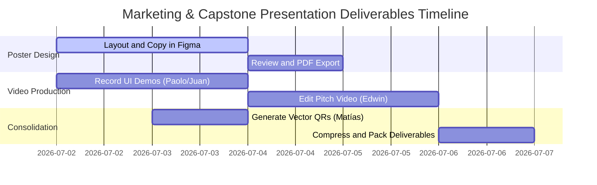

# GUIDELINES FOR COMPLETION: CAPSTONE POSTER, PITCH, AND QR LINKS

This document details the technical specifications, creative direction, and multimedia scripts required for the team to complete and compile the visual and promotional deliverables in the **`8. Poster Capstone, Pitch y QR/`** folder. These resources serve as the direct communication interface between the development team, the graduation jury, and potential investors.

---

## 🎨 1. Capstone Poster (A1 Format for Print and HD Digital)

The Capstone poster is a high-density technical infographic summarizing the scientific proposal, software architecture, and quality metrics of SportMatch Connect.

### 📐 Graphic Design and Layout Specifications:
*   **Physical Dimensions:** Standard A1 Format (594 mm x 841 mm).
*   **Print Resolution:** Minimum 300 DPI (equivalent pixels: $7016 \times 9933$ pixels).
*   **Color Space:** CMYK for physical print and sRGB for the interactive PDF version.
*   **Color Palette (Visual Identity):**
    *   Background: Neutral Dark (Matte Black: `#0D0F12`).
    *   Primary: Athletic Neon Green (Contrast and Emphasis: `#00FF66`).
    *   Secondary: Electric Cobalt Blue (Hierarchy: `#1E3A8A`).
    *   Main Text: Pure White (`#FFFFFF`) and Soft Grey (`#9CA3AF`).
*   **Typography Systems:**
    *   Headings: *Space Grotesk* (modern wide sans-serif).
    *   Body text and formulas: *Inter* (extreme readability from a distance).

### 📑 Detailed Poster Section Structure:

#### Section A: Academic Header and Identity
*   **Institutional Logo:** High-definition official logo of Universidad San Ignacio de Loyola (USIL), located in the top-left corner.
*   **Project Logo:** SportMatch Connect logo with sports icon in the top-center.
*   **Thesis Metadata:** Full project title, names of the five authors with their student codes and USIL emails, academic advisor name (Ing. Kenny Neira), Faculty of Engineering, 2026.

#### Section B: Problem Statement and Justification
*   **Sedentarism Infographic:** Pie and bar charts depicting the MINSA/INEI 2024 data (72% of inactive adults in Lima).
*   **The Logistical Pain Triangle:**
    1.  *Fragmentation:* Chaotic messaging chats (WhatsApp) without filters.
    2.  *Imbalance:* Unequal matches (absence of Elo).
    3.  *Financial Risk:* Losses due to manual, asynchronous mobile wallet collections.

#### Section C: Technological Architecture (C4 Model)
*   **C4 Container Diagram:** Vector graphic illustrating layer separation:
    *   *Frontend:* React 19 + TypeScript + FSD PWA, deployed on Vercel.
    *   *Backend:* Modular Monolith in NestJS 11 + Prisma ORM, hosted on Render.
    *   *Persistence:* Supabase PostgreSQL 15 + PostGIS + RLS, hosted in AWS Oregon.
    *   *Integrations:* Google Cloud Vertex AI (Gemini 2.5 Flash), Stripe Gateway.

#### Section D: Key Software Modules (With UI Screenshots)
*   **Predictive Matchmaking:** UI capture showing the list of recommended matches based on Elo compatibility and distance.
*   **Reservas on Leaflet Map:** Court geolocation interface screenshot displaying real-time georeferenced pins.
*   **Conversing with Sporty:** Dialog bubbles showing the assistant transcribing and processing the user's voice prompt.
*   **FitCoins Wallet:** Detailed balance, recharge, and transactional history view.

#### Section E: Software Quality Indicators (QA Quality Gate)
*   **Certified Metrics Box:**
    *   Automated Tests: **541 tests passing (100% success rate)**.
    *   SonarQube Quality Gate: **PASSED (0 bugs, 0 vulnerabilities in production)**.
    *   Average Response Time: **120ms (PostGIS searches)**.

#### Section F: Large-Format Access QR Codes
*   Placed at the bottom-right corner for quick scanning during physical exhibitions.

---

## 📹 2. Business Pitch (2:30 Minutes Promotional Video)

The Pitch video is a high-conversion commercial asset aimed at capturing the interest of angel investors and sports complex administrators.

### ⏱️ Video Script and Art Direction (Minute-by-Minute):

```
[0:00 - 0:10] THE HOOK
--------------------------------------------------------------------------------
Visual: Cinematic overhead shot of Lima Metropolitan traffic. In the background,
a fast ticking clock sound. Quick transition to smartphones displaying messy
WhatsApp chat notifications ("Who's playing today?", "Need one more player for football", 
"Send me the money for the court reservation").
Audio Effect: Fast-paced WhatsApp notification chime overlay.
Voiceover: "Have you ever tried organizing a sports match with your friends? 
Coordinating schedules, balancing teams, booking the right venue, and then 
collecting money from everyone via mobile wallets is a logistical nightmare..."

[0:10 - 0:30] PROBLEM PRESENTATION
--------------------------------------------------------------------------------
Visual: 3D animated graphic highlighting "72%". Text overlay: "72% of adults in 
Lima Metropolitana perform insufficient physical activity". The screen transitions 
to show a worried organizer checking their digital wallet for unpaid balances.
Audio Effect: Sudden silence, low-key suspense music fades in.
Voiceover: "This logistical friction is keeping thousands of Peruvians away from sports. 
72% of adults in Lima suffer from physical inactivity. A lack of real-time court 
visibility and high default rates from manual collections make organizing sports 
a financial headache."

[0:30 - 1:15] THE SOLUTION: SOFTWARE DEMONSTRATION
--------------------------------------------------------------------------------
Visual: Dynamic transition to the Sporty PWA screen. We see Paolo Andrade 
navigating the app on an iPhone. The Leaflet map shows PostGIS geolocation in Surco. 
Edwin Flores presses the "Join Matchmaking" button. The system calculates and 
displays matches based on Elo. The Stripe split-payment flow is shown.
Audio Effect: Modern, uplifting, and dynamic electronic synth music.
Voiceover: "To solve this, we created SportMatch Connect. The first platform that 
fully automates the amateur sports cycle. Using our geolocated PWA, we connect 
players with sports venues in seconds. Our predictive Haversine-Elo algorithm 
matches players of the same skill level, and our FitCoins economy splits rental 
costs instantly, eliminating default rates forever."

[1:15 - 1:50] TECHNOLOGICAL INNOVATION (ARTIFICIAL INTELLIGENCE)
--------------------------------------------------------------------------------
Visual: Juan Salvatierra clicks the microphone icon in the app. He says: "Sporty, 
find me a table tennis match for tomorrow at 7 PM." The conversational voice 
assistant replies fluently: "Searching matches... Found one in San Isidro at 7 PM. 
Would you like to join?"
Audio Effect: Virtual assistant chime.
Voiceover: "We take the experience to the next level with 'Sporty', a multimodal 
voice assistant powered by Google Cloud Vertex AI and Gemini 2.5 Flash on the backend. 
Moreover, we guarantee community safety by implementing edge artificial intelligence 
via TensorFlow.js, moderating text and explicit images on-device in under 80 milliseconds."

[1:50 - 2:15] FINANCIAL VIABILITY AND QUALITY ASSURANCE
--------------------------------------------------------------------------------
Visual: Vector financial graphs showing NPV and IRR projections. Transition to 
the GitHub Actions pipeline approving the SonarQube integration with a glowing 
"Quality Gate: PASSED - 0 Vulnerabilities" stamp.
Voiceover: "SportMatch Connect is not just a great idea; it's a scalable business. 
With a B2B model charging a 5% commission on court bookings and a B2C model offering 
Premium memberships for S/. 19.90 PEN monthly, we project an NPV of 84,250 Soles 
and an IRR of 38.4% over 3 years. All backed by rigorous software engineering with 
541 automated tests passing at a 100% success rate."

[2:15 - 2:30] CLOSING AND CALL TO ACTION
--------------------------------------------------------------------------------
Visual: Clean closing screen showing the SportMatch Connect logo in the center. 
Vercel deployment QR on the left. GitHub repo QR on the right. 
Bottom slogan: "Join the smart sports network".
Audio Effect: Upbeat, motivational musical crescendo.
Voiceover: "Our platform is fully built, deployed, and operational today. Scan the 
QR code to play your first match. SportMatch Connect: Join the smart sports network."
```

---

## 🔗 3. Technical Specifications for the QR Codes

To guarantee optimal readability in physical A1 printouts and digital displays, QR codes must be generated under the following parameters:
*   **Image Format:** Vector (`.svg`) to prevent pixelation in large formats.
*   **Error Correction Level:** Level **Q** (25%) or **H** (30%) to enable rapid scans even if the physical poster is scratched or creased.
*   **Contrast Ratio:** Pure White Background (`#FFFFFF`) and Black (`#000000`) or Dark Blue (`#0D1B2A`) modules, guaranteeing a contrast ratio above 4.5:1.

### 📍 Official Target URLs:

1.  **Production QR Code (Web Client):**
    *   **Link:** `https://sportmatch-connect.vercel.app`
    *   **Purpose:** Allows jurors to interact with the real, production-ready web application from their smartphones.
2.  **Source Code Repository QR Code:**
    *   **Link:** `https://github.com/jojiz29/sportmatch-connect`
    *   **Purpose:** Allows technical reviewers to examine the code structure, linters, CI/CD pipeline, and test coverage.
3.  **Video Pitch QR Code:**
    *   **Link:** Direct link to the uploaded pitch video (YouTube or Drive).
    *   **Purpose:** Instant play of the explanatory business pitch.

---

## 📆 4. Action Plan for the Marketing Sprint

To consolidate the Capstone deliverables within 5 business days, the following timeline and responsibility matrix are established:



### 👤 Member Roles and Responsibilities:
1.  **Paolo Andrade (UI Specialist):** Create the A1 canvas in Figma. Integrate software mockups and C4 container diagrams into the poster layout.
2.  **Juan Alonso Salvatierra (AI Specialist):** Record high-resolution clips demonstrating the "Sporty" voice assistant and on-device moderation.
3.  **Erick Espinoza (Backend / Security):** Extract log files from Render and record the transactional booking flow using the Stripe test environment.
4.  **Matías Gastelu (QA / DevOps):** Generate SVG vector QR codes and prepare the consolidated SonarQube quality gate report for the poster.
5.  **Edwin Flores (Scrum Master / Editor):** Record the voiceover audio for the pitch, edit the final video (DaVinci/Premiere), and assemble the final compressed package.
