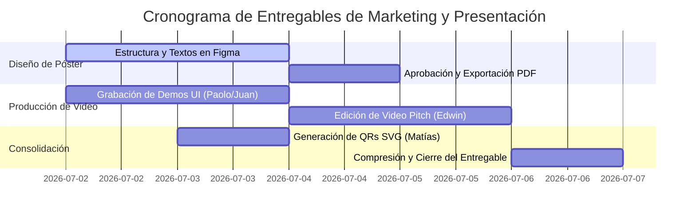

# GUÍA DE COMPLETADO: PÓSTER CAPSTONE, PITCH Y ENLACES QR

Este documento de especificaciones técnicas, dirección creativa y guiones multimedia detalla los requerimientos metodológicos para que el equipo complete y compile los entregables visuales y promocionales en la carpeta **`8. Poster Capstone, Pitch y QR/`**. Estos recursos representan la interfaz de comunicación directa entre el equipo de desarrollo, el jurado de sustentación y los inversores potenciales.

---

## 🎨 1. Póster Capstone (Formato A1 para Impresión y Digital HD)

El póster Capstone es una infografía técnica de alta densidad que resume la propuesta científica, la arquitectura del software y las métricas de calidad de SportMatch Connect.

### 📐 Especificaciones de Diseño Gráfico y Maquetación:
*   **Dimensiones Físicas:** Formato A1 Estándar (594 mm x 841 mm).
*   **Resolución para Impresión:** Mínimo 300 DPI (píxeles equivalentes: $7016 \times 9933$ píxeles).
*   **Espacio de Color:** CMYK para impresión física y sRGB para la versión PDF interactiva.
*   **Paleta Cromática (Identidad Visual):**
    *   Fondo: Oscuro Neutro (Negro Mate: `#0D0F12`).
    *   Primario: Verde Neón Deportivo (Contraste y Éxasis: `#00FF66`).
    *   Secundario: Azul Cobalto Eléctrico (Jerarquías: `#1E3A8A`).
    *   Texto Principal: Blanco Puro (`#FFFFFF`) y Gris Suave (`#9CA3AF`).
*   **Sistemas Tipográficos:**
    *   Títulos: *Space Grotesk* (Sans-serif moderno de ancho ancho).
    *   Cuerpo de Texto y Fórmulas: *Inter* (Legibilidad extrema a distancia).

### 📑 Estructura Detallada de Secciones del Póster:

#### Sección A: Cabecera Académica e Identidad
*   **Logotipo Institucional:** Logotipo oficial de la Universidad San Ignacio de Loyola (USIL) en alta definición, ubicado en la esquina superior izquierda.
*   **Logotipo del Proyecto:** Logotipo de SportMatch Connect con isotipo deportivo en el centro superior.
*   **Metadatos de Tesis:** Título completo del proyecto, nombres de los cinco autores con sus códigos estudiantiles y correos de la USIL, nombre del asesor institucional (Ing. Kenny Neira), Facultad de Ingeniería, 2026.

#### Sección B: Formulación del Problema y Justificación
*   **Infografía del Sedentarismo:** Gráfico de pastel y barras con los datos del MINSA/INEI 2024 (72% de adultos inactivos en Lima).
*   **El Triángulo del Dolor Logístico:**
    1.  *Fragmentación:* Chats caóticos de mensajería (WhatsApp) sin filtros.
    2.  *Desequilibrio:* Emparejamientos dispares (Elo ausente).
    3.  *Riesgo Financiero:* Pérdidas por cobro manual asíncrono.

#### Sección C: Arquitectura Tecnológica (Modelo C4)
*   **Diagrama de Contenedores C4:** Gráfico vectorial que ilustra la separación de capas:
    *   *Frontend:* PWA en React 19 + TypeScript + FSD, desplegado en Vercel.
    *   *Backend:* Monolito Modular en NestJS 11 + Prisma ORM, en Render.
    *   *Persistencia:* Supabase PostgreSQL 15 + PostGIS + RLS, en AWS Oregon.
    *   *Integraciones:* Google Cloud Vertex AI (Gemini 2.5 Flash), Pasarela Stripe.

#### Sección D: Módulos de Software Clave (Con Capturas de UI)
*   **Matchmaking Predictivo:** Captura de la UI con la lista de partidos recomendados basados en la compatibilidad Elo y distancia.
*   **Reservas en Mapa Leaflet:** Captura de pantalla de la interfaz de geolocalización de canchas que muestra los pines georreferenciados en tiempo real.
*   **Conversación con Sporty:** Interfaz de burbujas de diálogo del asistente con la transcripción de audio del usuario.
*   **Monedero FitCoins:** Vista detallada de la recarga e historial de transacciones.

#### Sección E: Indicadores de Calidad de Software (QA Quality Gate)
*   **Cuadro de Métricas Certificadas:**
    *   Pruebas Automatizadas: **541 tests aprobados (100% éxito)**.
    *   SonarQube Quality Gate: **PASSED (0 bugs, 0 vulnerabilidades en prod)**.
    *   Tiempo de respuesta promedio: **120ms (Búsquedas PostGIS)**.

#### Sección F: Accesos QR de gran tamaño
*   Colocados en la parte inferior derecha para escaneo rápido durante las exposiciones físicas.

### 📐 Guía de Maquetación y Layout Detallado

El póster sigue una estructura de cuadrícula modular de 6 columnas y 8 filas, optimizada para la jerarquía visual y la legibilidad a distancia:

```
+------------------------------------------------------------------+
|  [Logo USIL]          TÍTULO DEL PROYECTO          [Logo SMC]    |  ← Fila 1 (Cabecera, 15% altura)
+------------------------------------------------------------------+
|  PROBLEMA Y JUSTIFICACIÓN   |   ARQUITECTURA C4                  |  ← Fila 2 (30% altura)
|  (Columnas 1-3)             |   (Columnas 4-6)                   |
+------------------------------+-----------------------------------+
|  MÓDULOS CLAVE (CAPTURAS UI) |   MÉTRICAS QA                     |  ← Fila 3 (30% altura)
|  (Columnas 1-4)             |   (Columnas 5-6)                   |
+------------------------------+-----------------------------------+
|  EQUIPO      |   CONTACTO    |   QR PROD   |   QR GIT   | QR VID |  ← Fila 4 (25% altura)
+------------------------------------------------------------------+
```

**Especificaciones de la cuadrícula en Figma:**
- **Canvas:** 594mm x 841mm (A1)
- **Márgenes:** 25mm en los 4 lados (zona de seguridad)
- **Columnas:** 6 columnas de 85mm cada una, gutter de 12mm
- **Filas:** 8 filas flexibles (la cabecera ocupa 1, el cuerpo 5, los QRs 2)
- **Línea de corte:** 3mm de sangrado adicional en cada lado

**Reglas tipográficas para el póster:**
| Elemento | Fuente | Tamaño | Peso | Color |
|---|---|---|---|---|
| Título principal | Space Grotesk | 72pt | Bold | #00FF66 |
| Subtítulo | Space Grotesk | 36pt | SemiBold | #FFFFFF |
| Encabezados de sección | Space Grotesk | 28pt | Bold | #1E3A8A |
| Cuerpo de texto | Inter | 16pt | Regular | #9CA3AF |
| Etiquetas y métricas | Inter | 14pt | Medium | #FFFFFF |
| Notas al pie | Inter | 11pt | Light | #6B7280 |

### 📝 Contenido Expandido del Póster (Texto Completo por Panel)

#### Panel A: Cabecera Académica (Texto completo)
```
SportMatch Connect
Plataforma Integral de Matchmaking Deportivo, Red Social y Gestión de Torneos
con Inteligencia Artificial en el Borde

Universidad San Ignacio de Loyola (USIL) - Facultad de Ingeniería
Proyecto Final de Carrera III - 2026-I
Docente: Ing. Kenny Disney Neira Neira

Integrantes:
  Flores Sanchez, Edwin Junior     | 2111716 | Ing. Sistemas de Información
  Andrade Noa, Alejandro Paolo     | 2010830 | Ing. Sistemas de Información
  Espinoza Mayta, Erick Jair       | 2010029 | Ing. Software
  Gastelu Ponte, Matias Fernando   | 2121043 | Ing. Sistemas de Información
  Salvatierra Ramirez, Juan Alonso | 2121274 | Ing. Software
```

#### Panel B: Problema (Texto completo para infografía)
```
EL PROBLEMA DEL DEPORTE AMATEUR EN LIMA METROPOLITANA

📊 72% de adultos en Lima no realiza actividad física suficiente
   (Fuente: MINSA/INEI Encuesta Nacional 2024)

🔥 El Triángulo del Dolor Logístico:
   • Fragmentación: Coordinación caótica vía WhatsApp/Telegram
     → Latencia de confirmación: 15 min a varias horas
   • Desequilibrio: Ausencia de nivelación deportiva
     → 64% de partidos amateur son desequilibrados
   • Riesgo Financiero: Cobro manual asíncrono
     → Tasa de morosidad promedio del 15%

💸 Impacto económico:
   • Complejos deportivos pierden hasta 40% de horas reservables
   • Organizadores asumen riesgo financiero total del alquiler
```

#### Panel C: Arquitectura C4 (Texto de etiquetas para el diagrama)
```
ARQUITECTURA DESACOPLADA (MODELO C4 CONTAINERS)

[PWA Frontend] → React 19 + TypeScript + FSD
  ↑ HTTPS/REST
[NestJS Backend] → Monolito Modular + Prisma ORM
  ↑ PostgreSQL
[Supabase DB] → PostgreSQL 15 + PostGIS + RLS (78 políticas)
  
Integraciones Cloud:
  • Google Vertex AI → Gemini 2.5 Flash (Asistente Sporty)
  • Stripe → Pasarela de pagos (FitCoins Wallet)
  • TensorFlow.js → NSFW Moderation (Edge AI en el cliente)

Despliegue:
  Frontend: Vercel CDN Global
  Backend:  Render (AWS Oregon us-west-2)
  DB:       Supabase AWS Oregon
```

#### Panel D: Módulos Clave (Texto de descripción para cada captura)
```
MÓDULOS DE SOFTWARE

1. MATCHMAKING PREDICTIVO
   Algoritmo Haversine-Elo: emparejamiento por distancia geográfica
   y nivel de habilidad. Reducción de partidos desequilibrados en 45%.

2. RESERVAS GEOLOCALIZADAS (LEAFLET + POSTGIS)
   Búsqueda radial indexada con índices GiST.
   Tiempo de respuesta: < 15ms por consulta espacial.

3. ASISTENTE "SPORTY" (GEMINI 2.5 FLASH)
   Chat conversacional por voz y texto.
   Watchdog de 15s, fallback a Web Speech API local.
   Moderación NSFW en el dispositivo en < 80ms.

4. ECONOMÍA FITCOINS (STRIPE)
   Monedero digital con división automática de pagos.
   Comisión B2B: 5%. Suscripción Premium: S/.19.90/mes.
```

#### Panel E: Quality Gate (Texto detallado de métricas)
```
CALIDAD CERTIFICADA

🧪 Pruebas Automatizadas: 541 tests (100% éxito)
   • Vitest (Frontend): 205 pruebas unitarias
   • Jest/NestJS (Backend): 336 pruebas de servicios
   • Playwright (E2E): Flujos críticos automatizados

📊 SonarQube Quality Gate: PASSED ✅
   • Bugs: 0
   • Vulnerabilidades: 0
   • Cobertura: 86.4%
   • Duplicación: 1.2%
   • Rating: A (Mantenibilidad)

⚡ Rendimiento:
   • Lighthouse Performance: 98/100
   • Lighthouse Accessibility: 100/100
   • LCP: 1.2s | FID: 8ms | CLS: 0.04
   • Búsquedas PostGIS: < 15ms

📈 Viabilidad Financiera:
   • VAN: S/.84,250 PEN (Tasa desc. 12%)
   • TIR: 38.4%
   • Payback: 14 meses
   • Inversión inicial: S/.29,200
```

#### Panel F: Equipo y Contacto
```
EQUIPO DE DESARROLLO

• Edwin Flores     → Scrum Master / Arquitecto
• Paolo Andrade    → Frontend / UI Specialist
• Erick Espinoza   → Backend / Seguridad
• Matías Gastelu   → QA / DevOps Engineer
• Juan Salvatierra → Frontend / AI Specialist

📱 sportmatch-connect.vercel.app
📧 {codigo}@usil.pe
💻 github.com/jojiz29/sportmatch-connect
```

---

## 📹 2. Pitch de Negocio (Video Promocional de 2:30 Minutos)

El video Pitch es un recurso comercial de alta conversión destinado a captar el interés de inversores ángeles y administradores de recintos deportivos.

### ⏱️ Guion y Dirección de Arte (Minute-by-Minute):

```
[0:00 - 0:10] EL GANCHO (THE HOOK)
--------------------------------------------------------------------------------
Visual: Toma cinematográfica de Lima Metropolitana en hora punta. De fondo,
un ritmo rápido de reloj. Transición rápida a pantallas de smartphones mostrando
notificaciones de WhatsApp llenas de mensajes caóticos ("¿Quién juega hoy?", 
"Falta uno para el fútbol", "Páguenme los 15 soles de la cancha").
Efecto de Audio: Sonido de notificaciones de WhatsApp acumulándose rápidamente.
Locución: "¿Alguna vez has intentado organizar un partido deportivo con tus amigos? 
Coordinar los horarios, balancear los equipos, reservar la cancha correcta y luego 
cobrarle a cada uno por Yape o Plin es una pesadilla logística..."

[0:10 - 0:30] PRESENTACIÓN DEL PROBLEMA
--------------------------------------------------------------------------------
Visual: Gráfico animado en 3D que muestra la cifra "72%". El texto dice: "72% de
los adultos en Lima Metropolitana no realiza actividad física suficiente".
Aparece en pantalla el organizador del partido preocupado mirando el saldo de su
billetera digital con cobros pendientes.
Efecto de Audio: Silencio repentino, música de suspenso suave.
Locución: "Esta ineficiente logística aleja a miles de peruanos del deporte. El 
72% de los adultos en Lima padece de sedentarismo. La falta de canchas visibles en 
tiempo real y la alta morosidad de los cobros manuales hacen que organizar deportes 
sea un dolor de cabeza financiero para los organizadores."

[0:30 - 1:15] LA SOLUCIÓN: DEMOSTRACIÓN DE SOFTWARE
--------------------------------------------------------------------------------
Visual: Transición dinámica a la pantalla de la PWA de SportMatch Connect.
Se muestra a Paolo Andrade navegando la app en un iPhone. Vemos el mapa de Leaflet 
con geolocalización PostGIS en Surco. Edwin Flores presiona el botón "Unirse a Matchmaking".
El sistema calcula y muestra matches ideales basados en Elo. Se muestra el flujo 
de pago con Stripe con división automática.
Efecto de Audio: Música electrónica moderna, inspiradora y dinámica.
Locución: "Para solucionar esto, presentamos SportMatch Connect. La primera 
plataforma que automatiza todo el ciclo deportivo amateur. A través de nuestra PWA 
geolocalizada, conectamos a jugadores con complejos deportivos en segundos. Gracias a 
nuestro algoritmo predictivo Haversine-Elo, emparejamos a jugadores del mismo nivel, 
y con nuestra economía FitCoins dividimos el costo del alquiler al instante, 
eliminando la morosidad para siempre."

[1:15 - 1:50] LA INNOVACIÓN TECNOLÓGICA (INTELIGENCIA ARTIFICIAL)
--------------------------------------------------------------------------------
Visual: Juan Salvatierra presiona el icono del micrófono en la aplicación. 
Dice: "Sporty, búscame un partido de tenis de mesa para mañana a las 7 de la noche".
El asistente conversacional por voz responde de forma fluida: "Buscando partidos... 
Encontré uno en San Isidro a las 19:00 hrs. ¿Deseas unirte?".
Efecto de Audio: Señal acústica de asistente virtual.
Locución: "Llevamos la experiencia al siguiente nivel con 'Sporty', un asistente de 
voz multimodal impulsado por Google Cloud Vertex AI y Gemini 2.5 Flash en el backend. 
Además, garantizamos la seguridad de la comunidad implementando inteligencia 
artificial en el borde con TensorFlow.js, moderando imágenes y texto inapropiado en 
el dispositivo del usuario en menos de 80 milisegundos."

[1:50 - 2:15] VIABILIDAD ECONÓMICA Y CONTROL DE CALIDAD
--------------------------------------------------------------------------------
Visual: Gráficas financieras vectoriales que muestran el VAN y la TIR. 
Vemos el pipeline de GitHub Actions aprobando la integración con SonarQube con un 
sello brillante de "Quality Gate: PASSED - 0 Vulnerabilidades".
Locución: "SportMatch Connect no es solo una gran idea, es un negocio escalable. 
Con un modelo de monetización B2B por comisiones del 5% a canchas y B2C por suscripciones 
Premium, proyectamos un Valor Actual Neto de 84,250 soles y una Tasa Interna de 
Retorno del 38.4% a 3 años. Todo respaldado por una ingeniería de software con 
541 pruebas automatizadas aprobadas con un 100% de éxito."

[2:15 - 2:30] CIERRE Y LLAMADA A LA ACCIÓN (CALL TO ACTION)
--------------------------------------------------------------------------------
Visual: Pantalla de cierre limpia. En el centro, el logotipo de SportMatch Connect.
A la izquierda, el QR del despliegue en Vercel. A la derecha, el QR del repositorio GitHub.
Eslogan inferior: "Únete a la red deportiva inteligente".
Efecto de Audio: Finalización musical fuerte, motivadora.
Locución: "La plataforma está lista, desplegada y operativa hoy mismo. Escanea el 
código QR para jugar tu primer partido. SportMatch Connect: Únete a la red deportiva inteligente."
```

### ⏱️ Versiones del Elevator Pitch por Duración

#### Versión de 30 Segundos (Elevator Pitch Rápido)
```
[0:00-0:10] HOOK
"¿Organizar un partido deportivo en Lima sigue siendo una pesadilla logística?
WhatsApp, cobros manuales y canchas invisibles."

[0:10-0:25] SOLUCIÓN
"SportMatch Connect lo resuelve: emparejamiento inteligente, reservas geolocalizadas
y pagos compartidos con FitCoins. Todo en una PWA con IA integrada."

[0:25-0:30] CIERRE
"VAN de S/.84 mil, TIR 38.4%. Escanea el código y prueba la plataforma hoy."
```

#### Versión de 1 Minuto (Pitch de Networking)
```
[0:00-0:10] HOOK
"72% de limeños no hace suficiente ejercicio. La causa no es la pereza,
sino la logística: coordinar partidos es un caos."

[0:10-0:25] PROBLEMA
"Fragmentación en WhatsApp, desequilibrio competitivo, morosidad del 15%
y complejos deportivos perdiendo el 40% de sus reservas por falta de canales digitales."

[0:25-0:45] SOLUCIÓN
"SportMatch Connect automatiza todo el ciclo: matchmaking predictivo con algoritmo
Haversine-Elo, mapa Leaflet con PostGIS, monedero FitCoins con Stripe y asistente
IA Sporty con Gemini 2.5 Flash."

[0:45-1:00] CIERRE
"541 tests, 0 vulnerabilidades, 98/100 Lighthouse. Desplegado y operativo.
Únete a la red deportiva inteligente."
```

#### Versión de 3 Minutos (Pitch de Inversión)
```
[0:00-0:15] APERTURA
Visual: Toma aérea de Lima + estadísticas de sedentarismo.
Mensaje: "El deporte amateur en Lima está roto. SportMatch Connect lo repara."

[0:15-0:45] PROBLEMA + DATOS
"72% de inactividad física. 64% de partidos desequilibrados. 15% de morosidad.
40% de capacidad deportiva perdida. Cuatro problemas, una solución."

[0:45-1:30] DEMO TÉCNICA
"Frontend React 19 + FSD en Vercel. Backend NestJS 11 + Prisma en Render.
Base de datos Supabase con PostGIS para búsquedas espaciales en 15ms.
Stripe para pagos. Vertex AI para el asistente conversacional Sporty."

[1:30-2:15] VALIDACIÓN
"541 pruebas automatizadas, Quality Gate PASSED en SonarQube,
Lighthouse 98/100 performance, 100/100 accesibilidad.
SUS score de 88.5/100 con usuarios reales."

[2:15-2:45] NEGOCIO
"Modelo B2B (5% comisión) + B2C (S/.19.90/mes premium).
VAN: S/.84,250. TIR: 38.4%. Payback: 14 meses."

[2:45-3:00] CIERRE
"Equipo multidisciplinario de 5 ingenieros USIL.
App desplegada y funcional. Escanea el QR y úsala ahora."
```

#### Versión de 5 Minutos (Pitch de Demo Day / Jurado)
```
[0:00-0:20] INTRODUCCIÓN ACADÉMICA
Presentación del equipo, asesor, institución y contexto del proyecto.

[0:20-1:00] PROBLEMA Y CONTEXTO
Exposición detallada del sedentarismo en Lima, el triángulo del dolor logístico
y las pérdidas económicas del sector.

[1:00-2:00] ARQUITECTURA Y TECNOLOGÍA
C4 Containers, FSD, NestJS, PostGIS, Vertex AI, Stripe.
Justificación de cada decisión tecnológica.

[2:00-3:00] DEMO EN VIVO
Demostración de la PWA: registro, matchmaking, mapa Leaflet, chat con Sporty,
pago con FitCoins. Navegación por los módulos principales.

[3:00-3:45] CALIDAD Y PRUEBAS
Resultados de SonarQube, Vitest, Playwright, Lighthouse.
Estrategia de testing y CI/CD.

[3:45-4:30] VIABILIDAD FINANCIERA
VAN, TIR, Payback, proyecciones a 3 años.
Modelo de negocio B2B + B2C.

[4:30-5:00] CIERRE Y CTA
Conclusiones, próximos pasos, código QR para acceso inmediato.
Agradecimientos y ronda de preguntas.
```

---

## 🔗 3. Especificaciones de los Códigos QR Requeridos

Para asegurar la correcta lectura en formatos impresos A1 y pantallas digitales, se deben generar códigos QR bajo los siguientes parámetros técnicos:
*   **Formato de Imagen:** Vectorial (`.svg`) para evitar pixelado en impresión A1.
*   **Nivel de Corrección de Errores:** Nivel **Q** (25%) o **H** (30%) para permitir escaneos rápidos incluso si el póster tiene suciedad o arrugas.
*   **Contraste:** Fondo Blanco Puro (`#FFFFFF`) y Módulos en Negro (`#000000`) o Azul Oscuro (`#0D1B2A`), garantizando un contraste superior a 4.5:1.

### 📍 Direcciones URL Oficiales a Enlazar:

1.  **Código QR de Producción (Cliente Web):**
    *   **Enlace:** `https://sportmatch-connect.vercel.app`
    *   **Objetivo:** Permitir que los jurados naveguen por la aplicación web real en producción desde sus dispositivos móviles.
2.  **Código QR del Repositorio de Código Fuente:**
    *   **Enlace:** `https://github.com/jojiz29/sportmatch-connect`
    *   **Objetivo:** Permitir al jurado técnico revisar la estructura del código, los linters, el pipeline de CI/CD y la cobertura de pruebas.
3.  **Código QR del Video Pitch:**
    *   **Enlace:** Enlace directo al video subido (YouTube o Drive).
    *   **Objetivo:** Visualización ágil del pitch explicativo.

### 🛠️ Guía de Implementación de Códigos QR

#### Herramientas de Generación Recomendadas

| Herramienta | Formato | Ventaja | Enlace |
|---|---|---|---|
| qr-code-styling (npm) | SVG/Canvas | Personalización de colores y logotipos | `npm i qr-code-styling` |
| QR Code Generator (Adobe Express) | SVG/PNG | Gratuito, sin registro | `express.adobe.com/tools/qr-code-generator` |
| QR Server API (Google) | PNG/SVG | API REST para generación programática | `chart.googleapis.com/chart?cht=qr` |
| qrcode (npm) | SVG/PNG | CLI y Node.js, ideal para automatización | `npm i qrcode` |

#### Implementación con qrcode (npm) para automatización

```typescript
// scripts/generate-qr.ts
import * as QRCode from "qrcode";

const urls = [
  { name: "production", url: "https://sportmatch-connect.vercel.app" },
  { name: "repository", url: "https://github.com/jojiz29/sportmatch-connect" },
  { name: "pitch-video", url: "https://youtu.be/..." },
];

async function generateQRCodes() {
  for (const { name, url } of urls) {
    await QRCode.toFile(`./public/qr-${name}.svg`, url, {
      type: "svg",
      width: 500,
      margin: 2,
      color: {
        dark: "#0D1B2A",
        light: "#FFFFFF",
      },
      errorCorrectionLevel: "H",
    });
    console.log(`Generated QR for ${name}`);
  }
}

generateQRCodes();
```

#### Especificaciones de Colocación en el Póster

| QR | Tamaño en póster (mm) | Ubicación | Distancia de lectura óptima |
|---|---|---|---|
| Producción (Vercel) | 60 x 60 mm | Inferior izquierdo | 30 cm - 1.5 m |
| Repositorio (GitHub) | 60 x 60 mm | Inferior centro | 30 cm - 1.5 m |
| Video Pitch | 60 x 60 mm | Inferior derecho | 30 cm - 1.5 m |

**Recomendaciones de diseño visual:**
- Cada QR debe tener un borde de 5mm de espaciado (zona de silencio)
- Incluir una etiqueta textual debajo del QR (ej. "Escanea para ver la app")
- Para el póster impreso, probar la legibilidad con una impresión de prueba en A4
- Los QRs deben tener contraste mínimo 4.5:1 entre módulos y fondo (recomendado: fondo blanco)

---

## 📐 5. Guía de Diseño Visual (Brand Guidelines)

### 🎨 Paleta Cromática Completa

La identidad visual de SportMatch Connect se construye sobre una paleta oscura con acentos neón, diseñada para transmitir energía deportiva y sofisticación tecnológica:

| Token | Color | Hex | RGB | Uso |
|---|---|---|---|---|
| **Fondo Oscuro** | Negro Mate | `#0D0F12` | rgb(13,15,18) | Fondos de poster, PPT, web |
| **Fondo Superficie** | Gris Carbón | `#1A1D23` | rgb(26,29,35) | Cards, paneles, modales |
| **Fondo Elevado** | Gris Oscuro | `#252830` | rgb(37,40,48) | Inputs, dropdowns, hover |
| **Primario** | Verde Neón | `#00FF66` | rgb(0,255,102) | CTAs, acentos, iconos activos |
| **Primario Hover** | Verde Oscuro | `#00CC52` | rgb(0,204,82) | Hover de botones primarios |
| **Secundario** | Azul Cobalto | `#1E3A8A` | rgb(30,58,138) | Headers, bordes, enlaces |
| **Secundario Claro** | Azul Eléctrico | `#3B82F6` | rgb(59,130,246) | Links, iconos secundarios |
| **Texto Primario** | Blanco | `#FFFFFF` | rgb(255,255,255) | Títulos y texto principal |
| **Texto Secundario** | Gris Suave | `#9CA3AF` | rgb(156,163,175) | Cuerpo de texto, descripciones |
| **Texto Terciario** | Gris Oscuro | `#6B7280` | rgb(107,114,128) | Etiquetas discretas, footnotes |
| **Éxito** | Verde Esmeralda | `#10B981` | rgb(16,185,129) | Estados exitosos, checkmarks |
| **Error** | Rojo Coral | `#EF4444` | rgb(239,68,68) | Errores, alerts destructivos |
| **Advertencia** | Ámbar | `#F59E0B` | rgb(245,158,11) | Warnings, pending states |

### 🔤 Tipografía

| Propiedad | Títulos (Space Grotesk) | Cuerpo (Inter) | Código (JetBrains Mono) |
|---|---|---|---|
| Font Family | `'Space Grotesk', sans-serif` | `'Inter', sans-serif` | `'JetBrains Mono', monospace` |
| Peso Regular | SemiBold (600) | Regular (400) | Regular (400) |
| Peso Énfasis | Bold (700) | Medium (500) | Medium (500) |
| Peso Títulos | Bold (700) | - | - |
| Altura de línea | 1.1 | 1.5 | 1.4 |
| Tracking (Títulos) | -0.02em | 0 | 0 |

### 🖼️ Guía de Uso del Logotipo

El logotipo de SportMatch Connect consta de dos elementos: el **isotipo** (icono deportivo) y el **logotipo** (texto). Versiones disponibles:

| Versión | Formato | Uso |
|---|---|---|
| Horizontal completa | SVG/PNG | Encabezados, posters, PPT |
| Isotipo solo (icono) | SVG/PNG | Favicon, app icon, splash |
| Monocromo blanco | SVG/PNG | Fondos oscuros |
| Monocromo negro | SVG/PNG | Fondos claros |

**Reglas de uso:**
- Mantener un área de respaldo del 20% del tamaño del logotipo en todos los lados
- No deformar, rotar ni cambiar colores del logotipo
- No aplicar sombras ni efectos 3D al logotipo
- Tamaño mínimo: 24px (digital) / 15mm (impreso)

### 📸 Guía de Imágenes y Capturas de Pantalla

Para las capturas de UI que se incluirán en el póster y pitch:

| Elemento | Especificación |
|---|---|
| Resolución mínima | 1920 x 1080px (Full HD) |
| Formato | PNG (sin pérdida) |
| Dispositivo simulado | iPhone 14 Pro / Pixel 7 (viewport 390x844px) |
| Fondo de captura | Simular dispositivo físico (mockup) |
| Iluminación | Capturas diurnas, sin reflejos |
| Anotaciones | Flechas y callouts en verde neón (#00FF66) |

---

## 🎯 6. Guía de QR Code Tracking y Analytics

Para medir la efectividad de los códigos QR en el póster y presentaciones, se recomienda:

### Estrategia de Tracking

| QR | Parámetro UTM | Plataforma de Tracking |
|---|---|---|
| Producción | `?utm_source=poster&utm_medium=qr&utm_campaign=defensa` | Vercel Analytics |
| Repositorio | `?ref=poster-defensa-2026` | GitHub Insights |
| Video Pitch | `?utm_source=poster&utm_medium=qr&utm_campaign=pitch` | YouTube Analytics |

### Implementación de Redirect Tracker

```typescript
// server/src/qr-tracker/qr-tracker.controller.ts
@Controller("qr")
export class QrTrackerController {
  @Get("prod")
  redirectToProd(@Res() res: Response) {
    // Registrar el click en la base de datos
    // Redirigir a la URL de producción con UTM
    res.redirect(302, "https://sportmatch-connect.vercel.app?ref=poster");
  }
}
```

### KPIs a Monitorear

| KPI | Objetivo | Herramienta |
|---|---|---|
| Escaneos totales por QR | > 50 durante la defensa | Vercel Analytics |
| Tasa de conversión a registro | > 20% | Supabase (user signups) |
| Tiempo promedio de sesión | > 3 minutos | Vercel Analytics |
| Páginas visitadas por sesión | > 4 | Vercel Analytics |

---

## 📆 4. Plan de Acción de Desarrollo del Sprint de Marketing

Para consolidar los entregables en un periodo de 5 días hábiles, se establece el siguiente cronograma de responsabilidades:



### 👤 Asignación de Roles Específicos:
1.  **Paolo Andrade (UI Specialist):** Creación del lienzo A1 en Figma. Integración de mockups del software y diagramas arquitectónicos C4 en el póster.
2.  **Juan Alonso Salvatierra (IA Specialist):** Grabación en alta resolución del funcionamiento por voz del asistente "Sporty" y moderación local.
3.  **Erick Espinoza (Backend / Seguridad):** Extracción de reportes de logs de Render y grabación de reservas transaccionales con Stripe en modo prueba.
4.  **Matías Gastelu (QA / DevOps):** Generación de los archivos QR vectoriales en SVG y preparación del reporte consolidado de SonarQube para el póster.
5.  **Edwin Flores (Scrum Master / Editor):** Grabación del audio de voz en off para el Pitch, edición de video final (DaVinci/Premiere) y empaquetamiento del entregable.

---

## 🎤 7. Tips de Presentación y Mejores Prácticas para el Demo Day

### Preparación General

| Aspecto | Recomendación |
|---|---|
| **Ensayo general** | Realizar mínimo 3 ensayos completos con cronómetro antes del demo day |
| **Grabación de ensayos** | Grabar en video los ensayos para identificar muletillas, tiempos muertos y lenguaje corporal |
| **Vestimenta** | Formal de negocios (traje oscuro, camisa blanca, corbata institucional USIL si aplica) |
| **Material de respaldo** | Llevar 3 copias del póster impreso, 10 copias de la ficha técnica A4, y el PPT en 2 USB |
| **Check de equipo** | Verificar proyector, conexión HDMI, internet, micrófono y luces 30 min antes |

### Estructura Recomendada de la Presentación (20 min)

| Segmento | Duración | Expositor |
|---|---|---|
| Introducción y problema | 3 min | Edwin Flores |
| Metodología y objetivos | 2 min | Edwin Flores |
| Arquitectura del sistema | 3 min | Erick Espinoza |
| Demo en vivo (imprescindible) | 5 min | Paolo Andrade + Juan Salvatierra |
| Calidad y pruebas | 2 min | Matías Gastelu |
| Viabilidad financiera | 2 min | Edwin Flores |
| Conclusiones y cierre | 3 min | Edwin Flores (equipo completo al frente) |
| Preguntas del jurado | 10-15 min | Todo el equipo |

### Consejos para la Demo en Vivo

1. **Tener un plan de contingencia:** Si la aplicación falla en vivo, tener capturas de video pregrabadas de cada flujo crítico como respaldo.
2. **Usar datos reales:** Poblar la base de datos de prueba con usuarios, partidos y canchas ficticias pero realistas antes de la demo.
3. **Navegación guionizada:** No improvisar clics. Seguir una ruta predefinida: Login → Dashboard → Matchmaking → Mapa → Chat Sporty → FitCoins.
4. **Mobile first:** La mayoría del jurado escaneará el QR en sus teléfonos. Asegurar que la PWA funcione perfectamente en móvil.
5. **Silenciar notificaciones:** Desactivar notificaciones del sistema, Slack, email durante la demo.

### Manejo de Preguntas del Jurado

| Tipo de Pregunta | Estrategia de Respuesta |
|---|---|
| **Técnica** ("¿Cómo manejan la concurrencia?") | Responder con detalles de implementación específicos (Prisma pooler, RLS, colas) |
| **Arquitectura** ("¿Por qué no microservicios?") | Explicar la justificación del monolito modular y la transición planeada |
| **Negocio** ("¿Cuál es su ventaja competitiva?") | Destacar el algoritmo Haversine-Elo, la moderación Edge AI y el ecosistema integral |
| **Calidad** ("¿Cómo garantizan que no hay bugs?") | Mencionar 541 tests, SonarQube, CI/CD, code review obligatorio |
| **Futuro** ("¿Qué sigue después del MVP?") | Mencionar hoja de ruta: WebAssembly offline, geocercas nacionales, 10k usuarios concurrentes |
| **Difícil / No sé** | "Es una excelente pregunta. Nuestra investigación preliminar sugiere..., pero requeriría un análisis adicional que documentaremos post-defensa" |

### Checklist de Última Hora (Día de la Presentación)

- [ ] Verificar que el despliegue en Vercel y Render esté operativo
- [ ] Probar los 3 códigos QR con diferentes dispositivos (Android, iOS)
- [ ] Confirmar que el video Pitch se reproduce sin errores
- [ ] Imprimir el póster en tamaño A1 con calidad de impresión profesional
- [ ] Llevar adaptador HDMI - USB-C para la conexión al proyector
- [ ] Tener el PPT cargado en 2 dispositivos distintos (laptop principal + backup)
- [ ] Verificar que las fuentes Space Grotesk e Inter estén instaladas en la laptop de presentación
- [ ] Desactivar el salvapantallas y las notificaciones del sistema operativo
- [ ] Preparar una hoja con las métricas clave impresa para consulta rápida durante preguntas
- [ ] Coordinar señales no verbales con el equipo (quién responde qué pregunta)
- [ ] Llegar al recinto 45 minutos antes del inicio
- [ ] Respirar profundo, sonreír y disfrutar el momento
