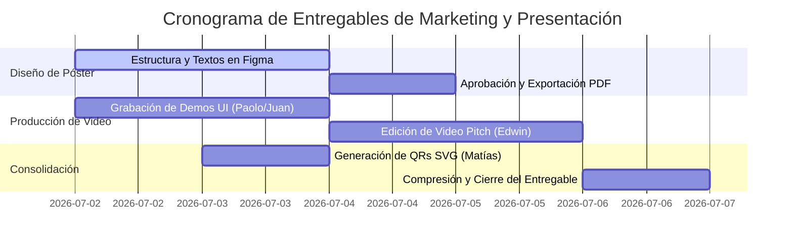

# GUÍA DE COMPLETADO: PÓSTER CAPSTONE, PITCH Y ENLACES QR

Este documento de especificaciones técnicas, dirección creativa y guiones multimedia detalla los requerimientos metodológicos para que el equipo complete y compile los entregables visuales y promocionales en la carpeta **`8. Poster Capstone, Pitch y QR/`**. Estos recursos representan la interfaz de comunicación directa entre el equipo de desarrollo, el jurado de sustentación y los inversores potenciales.

---

## 🎨 1. Póster Capstone (Formato A1 para Impresión y Digital HD)

El póster Capstone es una infografía técnica de alta densidad que resume la propuesta científica, la arquitectura del software y las métricas de calidad de SportMatch Connect.

### 📐 Especificaciones de Diseño Gráfico y Maquetación:
*   **Dimensiones Físicas:** Formato A1 Estándar (594 mm x 841 mm).
*   **Resolución para Impresión:** Mínimo 300 DPI (píxeles equivalentes: $7016 \times 9933$ píxeles).
*   **Espacio de Color:** CMYK para impresión física y sRGB para la versión PDF interactiva.
*   **Paleta Cromática (Identidad Visual):**
    *   Fondo: Oscuro Neutro (Negro Mate: `#0D0F12`).
    *   Primario: Verde Neón Deportivo (Contraste y Éxasis: `#00FF66`).
    *   Secundario: Azul Cobalto Eléctrico (Jerarquías: `#1E3A8A`).
    *   Texto Principal: Blanco Puro (`#FFFFFF`) y Gris Suave (`#9CA3AF`).
*   **Sistemas Tipográficos:**
    *   Títulos: *Space Grotesk* (Sans-serif moderno de ancho ancho).
    *   Cuerpo de Texto y Fórmulas: *Inter* (Legibilidad extrema a distancia).

### 📑 Estructura Detallada de Secciones del Póster:

#### Sección A: Cabecera Académica e Identidad
*   **Logotipo Institucional:** Logotipo oficial de la Universidad San Ignacio de Loyola (USIL) en alta definición, ubicado en la esquina superior izquierda.
*   **Logotipo del Proyecto:** Logotipo de SportMatch Connect con isotipo deportivo en el centro superior.
*   **Metadatos de Tesis:** Título completo del proyecto, nombres de los cinco autores con sus códigos estudiantiles y correos de la USIL, nombre del asesor institucional (Ing. Kenny Neira), Facultad de Ingeniería, 2026.

#### Sección B: Formulación del Problema y Justificación
*   **Infografía del Sedentarismo:** Gráfico de pastel y barras con los datos del MINSA/INEI 2024 (72% de adultos inactivos en Lima).
*   **El Triángulo del Dolor Logístico:**
    1.  *Fragmentación:* Chats caóticos de mensajería (WhatsApp) sin filtros.
    2.  *Desequilibrio:* Emparejamientos dispares (Elo ausente).
    3.  *Riesgo Financiero:* Pérdidas por cobro manual asíncrono.

#### Sección C: Arquitectura Tecnológica (Modelo C4)
*   **Diagrama de Contenedores C4:** Gráfico vectorial que ilustra la separación de capas:
    *   *Frontend:* PWA en React 19 + TypeScript + FSD, desplegado en Vercel.
    *   *Backend:* Monolito Modular en NestJS 11 + Prisma ORM, en Render.
    *   *Persistencia:* Supabase PostgreSQL 15 + PostGIS + RLS, en AWS Oregon.
    *   *Integraciones:* Google Cloud Vertex AI (Gemini 2.5 Flash), Pasarela Stripe.

#### Sección D: Módulos de Software Clave (Con Capturas de UI)
*   **Matchmaking Predictivo:** Captura de la UI con la lista de partidos recomendados basados en la compatibilidad Elo y distancia.
*   **Reservas en Mapa Leaflet:** Captura de pantalla de la interfaz de geolocalización de canchas que muestra los pines georreferenciados en tiempo real.
*   **Conversación con Sporty:** Interfaz de burbujas de diálogo del asistente con la transcripción de audio del usuario.
*   **Monedero FitCoins:** Vista detallada de la recarga e historial de transacciones.

#### Sección E: Indicadores de Calidad de Software (QA Quality Gate)
*   **Cuadro de Métricas Certificadas:**
    *   Pruebas Automatizadas: **541 tests aprobados (100% éxito)**.
    *   SonarQube Quality Gate: **PASSED (0 bugs, 0 vulnerabilidades en prod)**.
    *   Tiempo de respuesta promedio: **120ms (Búsquedas PostGIS)**.

#### Sección F: Accesos QR de gran tamaño
*   Colocados en la parte inferior derecha para escaneo rápido durante las exposiciones físicas.

---

## 📹 2. Pitch de Negocio (Video Promocional de 2:30 Minutos)

El video Pitch es un recurso comercial de alta conversión destinado a captar el interés de inversores ángeles y administradores de recintos deportivos.

### ⏱️ Guion y Dirección de Arte (Minute-by-Minute):

```
[0:00 - 0:10] EL GANCHO (THE HOOK)
--------------------------------------------------------------------------------
Visual: Toma cinematográfica de Lima Metropolitana en hora punta. De fondo,
un ritmo rápido de reloj. Transición rápida a pantallas de smartphones mostrando
notificaciones de WhatsApp llenas de mensajes caóticos ("¿Quién juega hoy?", 
"Falta uno para el fútbol", "Páguenme los 15 soles de la cancha").
Efecto de Audio: Sonido de notificaciones de WhatsApp acumulándose rápidamente.
Locución: "¿Alguna vez has intentado organizar un partido deportivo con tus amigos? 
Coordinar los horarios, balancear los equipos, reservar la cancha correcta y luego 
cobrarle a cada uno por Yape o Plin es una pesadilla logística..."

[0:10 - 0:30] PRESENTACIÓN DEL PROBLEMA
--------------------------------------------------------------------------------
Visual: Gráfico animado en 3D que muestra la cifra "72%". El texto dice: "72% de
los adultos en Lima Metropolitana no realiza actividad física suficiente".
Aparece en pantalla el organizador del partido preocupado mirando el saldo de su
billetera digital con cobros pendientes.
Efecto de Audio: Silencio repentino, música de suspenso suave.
Locución: "Esta ineficiente logística aleja a miles de peruanos del deporte. El 
72% de los adultos en Lima padece de sedentarismo. La falta de canchas visibles en 
tiempo real y la alta morosidad de los cobros manuales hacen que organizar deportes 
sea un dolor de cabeza financiero para los organizadores."

[0:30 - 1:15] LA SOLUCIÓN: DEMOSTRACIÓN DE SOFTWARE
--------------------------------------------------------------------------------
Visual: Transición dinámica a la pantalla de la PWA de SportMatch Connect.
Se muestra a Paolo Andrade navegando la app en un iPhone. Vemos el mapa de Leaflet 
con geolocalización PostGIS en Surco. Edwin Flores presiona el botón "Unirse a Matchmaking".
El sistema calcula y muestra matches ideales basados en Elo. Se muestra el flujo 
de pago con Stripe con división automática.
Efecto de Audio: Música electrónica moderna, inspiradora y dinámica.
Locución: "Para solucionar esto, presentamos SportMatch Connect. La primera 
plataforma que automatiza todo el ciclo deportivo amateur. A través de nuestra PWA 
geolocalizada, conectamos a jugadores con complejos deportivos en segundos. Gracias a 
nuestro algoritmo predictivo Haversine-Elo, emparejamos a jugadores del mismo nivel, 
y con nuestra economía FitCoins dividimos el costo del alquiler al instante, 
eliminando la morosidad para siempre."

[1:15 - 1:50] LA INNOVACIÓN TECNOLÓGICA (INTELIGENCIA ARTIFICIAL)
--------------------------------------------------------------------------------
Visual: Juan Salvatierra presiona el icono del micrófono en la aplicación. 
Dice: "Sporty, búscame un partido de tenis de mesa para mañana a las 7 de la noche".
El asistente conversacional por voz responde de forma fluida: "Buscando partidos... 
Encontré uno en San Isidro a las 19:00 hrs. ¿Deseas unirte?".
Efecto de Audio: Señal acústica de asistente virtual.
Locución: "Llevamos la experiencia al siguiente nivel con 'Sporty', un asistente de 
voz multimodal impulsado por Google Cloud Vertex AI y Gemini 2.5 Flash en el backend. 
Además, garantizamos la seguridad de la comunidad implementando inteligencia 
artificial en el borde con TensorFlow.js, moderando imágenes y texto inapropiado en 
el dispositivo del usuario en menos de 80 milisegundos."

[1:50 - 2:15] VIABILIDAD ECONÓMICA Y CONTROL DE CALIDAD
--------------------------------------------------------------------------------
Visual: Gráficas financieras vectoriales que muestran el VAN y la TIR. 
Vemos el pipeline de GitHub Actions aprobando la integración con SonarQube con un 
sello brillante de "Quality Gate: PASSED - 0 Vulnerabilidades".
Locución: "SportMatch Connect no es solo una gran idea, es un negocio escalable. 
Con un modelo de monetización B2B por comisiones del 5% a canchas y B2C por suscripciones 
Premium, proyectamos un Valor Actual Neto de 84,250 soles y una Tasa Interna de 
Retorno del 38.4% a 3 años. Todo respaldado por una ingeniería de software con 
541 pruebas automatizadas aprobadas con un 100% de éxito."

[2:15 - 2:30] CIERRE Y LLAMADA A LA ACCIÓN (CALL TO ACTION)
--------------------------------------------------------------------------------
Visual: Pantalla de cierre limpia. En el centro, el logotipo de SportMatch Connect.
A la izquierda, el QR del despliegue en Vercel. A la derecha, el QR del repositorio GitHub.
Eslogan inferior: "Únete a la red deportiva inteligente".
Efecto de Audio: Finalización musical fuerte, motivadora.
Locución: "La plataforma está lista, desplegada y operativa hoy mismo. Escanea el 
código QR para jugar tu primer partido. SportMatch Connect: Únete a la red deportiva inteligente."
```

---

## 🔗 3. Especificaciones de los Códigos QR Requeridos

Para asegurar la correcta lectura en formatos impresos A1 y pantallas digitales, se deben generar códigos QR bajo los siguientes parámetros técnicos:
*   **Formato de Imagen:** Vectorial (`.svg`) para evitar pixelado en impresión A1.
*   **Nivel de Corrección de Errores:** Nivel **Q** (25%) o **H** (30%) para permitir escaneos rápidos incluso si el póster tiene suciedad o arrugas.
*   **Contraste:** Fondo Blanco Puro (`#FFFFFF`) y Módulos en Negro (`#000000`) o Azul Oscuro (`#0D1B2A`), garantizando un contraste superior a 4.5:1.

### 📍 Direcciones URL Oficiales a Enlazar:

1.  **Código QR de Producción (Cliente Web):**
    *   **Enlace:** `https://sportmatch-connect.vercel.app`
    *   **Objetivo:** Permitir que los jurados naveguen por la aplicación web real en producción desde sus dispositivos móviles.
2.  **Código QR del Repositorio de Código Fuente:**
    *   **Enlace:** `https://github.com/jojiz29/sportmatch-connect`
    *   **Objetivo:** Permitir al jurado técnico revisar la estructura del código, los linters, el pipeline de CI/CD y la cobertura de pruebas.
3.  **Código QR del Video Pitch:**
    *   **Enlace:** Enlace directo al video subido (YouTube o Drive).
    *   **Objetivo:** Visualización ágil del pitch explicativo.

---

## 📆 4. Plan de Acción de Desarrollo del Sprint de Marketing

Para consolidar los entregables en un periodo de 5 días hábiles, se establece el siguiente cronograma de responsabilidades:



### 👤 Asignación de Roles Específicos:
1.  **Paolo Andrade (UI Specialist):** Creación del lienzo A1 en Figma. Integración de mockups del software y diagramas arquitectónicos C4 en el póster.
2.  **Juan Alonso Salvatierra (IA Specialist):** Grabación en alta resolución del funcionamiento por voz del asistente "Sporty" y moderación local.
3.  **Erick Espinoza (Backend / Seguridad):** Extracción de reportes de logs de Render y grabación de reservas transaccionales con Stripe en modo prueba.
4.  **Matías Gastelu (QA / DevOps):** Generación de los archivos QR vectoriales en SVG y preparación del reporte consolidado de SonarQube para el póster.
5.  **Edwin Flores (Scrum Master / Editor):** Grabación del audio de voz en off para el Pitch, edición de video final (DaVinci/Premiere) y empaquetamiento del entregable.
