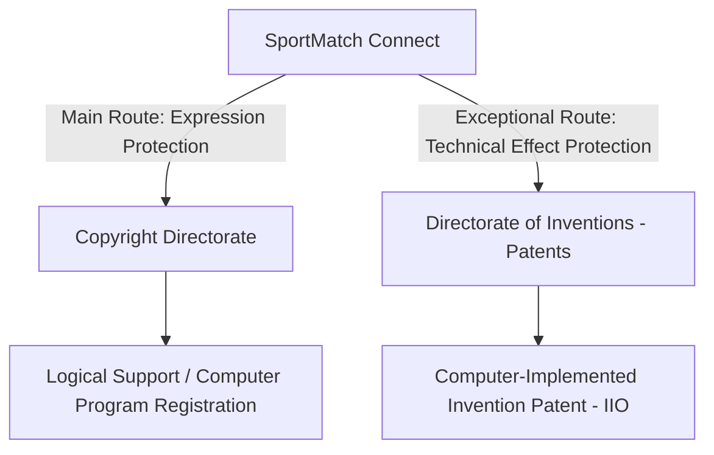

# SOFTWARE COPYRIGHT AND PATENT REGISTRATION GUIDE (INDECOPI - PERU)

This guide details the legal, administrative, and technical guidelines under the regulations of the **National Institute for the Defense of Competition and Intellectual Property Protection (INDECOPI)** of Peru, and the decisions of the **Andean Community (CAN)**, to safeguard the technological sovereignty and source code of the **SportMatch Connect** project.

---

## ⚖️ 1. The Dual Protection Framework for Software in Peru

In Peru, software has a dual protection mechanism, divided between the **Copyright Directorate** and the **Directorate of Inventions and New Technologies**:

---

## 📂 2. Route 1: Copyright Registration (Soporte Lógico)

Protects the source code, object code, and user manuals against unauthorized copying or reproduction. It is equivalent to the protection of literary works (Decreto Legislativo No. 822).

### Presentation Requirements before INDECOPI:
1.  **Official Form (F-DDA-02):** Logical Support Registration (Computer Program).
2.  **Authors and Applicant Identification:** Full data of the team members (Edwin, Paolo, Erick, Matías, Juan) and the Universidad San Ignacio de Loyola (in case of financial rights transfer).
3.  **Technical Descriptive Memory:** Summary of architecture, data flow, and dependencies. Detailed in [2_DOCUMENTO_AUTORIA_SOFTWARE_EN.md](file:///c:/Users/ejuni/OneDrive%20-%20SEIDOR%20SOLUTIONS%20S.L/Documentos/GitHub/sportmatch-connect/ENTREGABLE/4.1%20Informe%20de%20Derechos%20de%20Autor/2_DOCUMENTO_AUTORIA_SOFTWARE_EN.md).
4.  **Representative Source Code Deposit:** INDECOPI requires the **first 10 and last 10 pages of the source code** printed or on CD/USB. This extract has been automated in [Codigo_Representativo_INDECOPI_EN.md](file:///c:/Users/ejuni/OneDrive%20-%20SEIDOR%20SOLUTIONS%20S.L/Documentos/GitHub/sportmatch-connect/ENTREGABLE/4.5%20C%C3%B3digo%20Fuente%20Representativo%20INDECOPI/Codigo_Representativo_INDECOPI_EN.md).
5.  **User Manual:** Visual guide of screens and user flows.
6.  **Registration Fee:** Payment of the INDECOPI fee (Payment code: `02047`, Approximate amount: S/. 390.50 PEN).

---

## 📂 3. Route 2: Patent of Invention Registration

According to **Article 15 of Decision 486 of the CAN**, software *as such* (pure lines of code) is not considered a patentable invention. However, it is patentable if it qualifies as a **Computer-Implemented Invention (IIO)**.

### Conditions for Patentability in Peru:
*   **Technical Effect:** The software must control hardware or process physical world signals achieving a novel technical effect that solves a problem (e.g., real-time geolocated processing and edge image moderation with memory optimization).
*   **Classic Requirements:** Global novelty, inventive step, and industrial application.

### Required Documentation for Patents:
1.  **Patent Report (Description):** Technical document describing the technical problem and how the invention solves it, detailed in [4_INFORME_PATENTE_SOFTWARE_EN.md](file:///c:/Users/ejuni/OneDrive%20-%20SEIDOR%20SOLUTIONS%20S.L/Documentos/GitHub/sportmatch-connect/ENTREGABLE/4.2%20Informe%20de%20patente%20de%20software/4_INFORME_PATENTE_SOFTWARE_EN.md).
2.  **Patent Claims Report:** Clear definition of the legal protection limits of the invention (predictive matchmaking algorithm and edge moderation), detailed in [5_REPORTE_PATENTE_SOFTWARE_EN.md](file:///c:/Users/ejuni/OneDrive%20-%20SEIDOR%20SOLUTIONS%20S.L/Documentos/GitHub/sportmatch-connect/ENTREGABLE/4.3%20Reporte%20de%20patente%20de%20Software/5_REPORTE_PATENTE_SOFTWARE_EN.md).
3.  **Drawings/Plans:** Architecture diagrams (C4 Container), data flow, and database schema.
