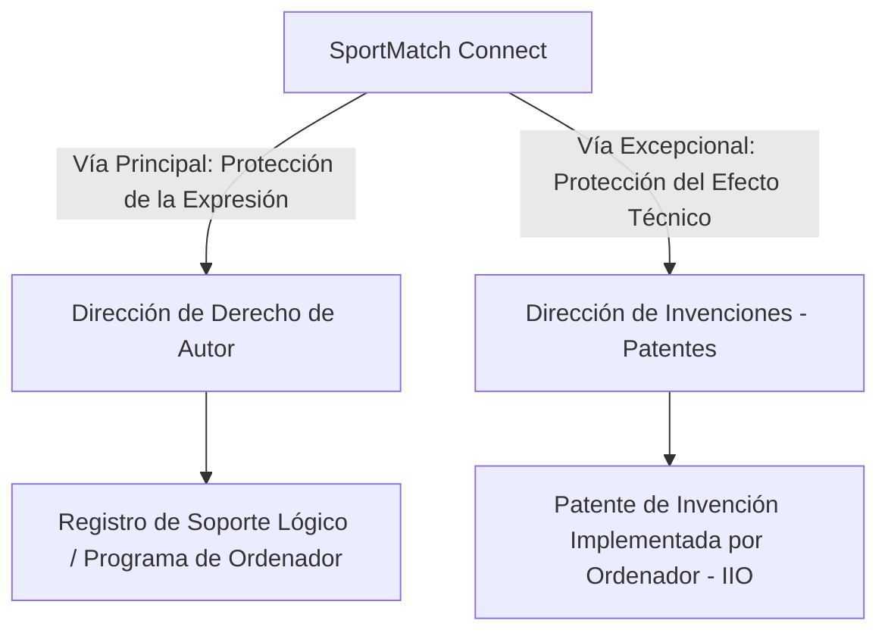

# GUÍA DE REGISTRO DE DERECHO DE AUTOR Y PATENTE DE SOFTWARE (INDECOPI - PERÚ)

Esta guía detalla los lineamientos legales, administrativos y técnicos bajo la normativa del **Instituto Nacional de Defensa de la Competencia y de la Protección de la Propiedad Intelectual (INDECOPI)** del Perú, y las decisiones de la **Comunidad Andina (CAN)**, para salvaguardar la soberanía tecnológica y el código del proyecto **SportMatch Connect**.

---

## ⚖️ 1. El Marco Dual de Protección del Software en el Perú

En el Perú, el software cuenta con un mecanismo de protección dual, dividido entre la **Dirección de Derecho de Autor** y la **Dirección de Invenciones y Nuevas Tecnologías**:

---

## 📂 2. Vía 1: Registro de Derecho de Autor (Soporte Lógico)

Protege el código fuente, código objeto y manuales de usuario contra copias o reproducciones no autorizadas. Equivale a la protección de obras literarias (Decreto Legislativo N° 822).

### Requisitos de Presentación ante INDECOPI:
1.  **Formulario Oficial (F-DDA-02):** Registro de Soporte Lógico (Programa de Ordenador).
2.  **Identificación de los Autores y Solicitante:** Datos completos de los integrantes (Edwin, Paolo, Erick, Matías, Juan) y de la Universidad San Ignacio de Loyola (en caso de cesión patrimonial).
3.  **Memoria Descriptiva Técnica:** Resumen de arquitectura, flujo de datos y dependencias. Se encuentra en [2_DOCUMENTO_AUTORIA_SOFTWARE_ES.md](file:///c:/Users/ejuni/OneDrive%20-%20SEIDOR%20SOLUTIONS%20S.L/Documentos/GitHub/sportmatch-connect/ENTREGABLE/4.1%20Informe%20de%20Derechos%20de%20Autor/2_DOCUMENTO_AUTORIA_SOFTWARE_ES.md).
4.  **Depósito de Código Fuente Representativo:** INDECOPI requiere obligatoriamente las **primeras 10 y últimas 10 páginas del código fuente** impresas o en CD/USB. Este extracto ha sido automatizado en [Codigo_Representativo_INDECOPI_ES.md](file:///c:/Users/ejuni/OneDrive%20-%20SEIDOR%20SOLUTIONS%20S.L/Documentos/GitHub/sportmatch-connect/ENTREGABLE/4.5%20C%C3%B3digo%20Fuente%20Representativo%20INDECOPI/Codigo_Representativo_INDECOPI_ES.md).
5.  **Manual de Usuario:** Guía visual de pantallas y flujos de usuario.
6.  **Tasa de Registro:** Pago del arancel de INDECOPI (Código de pago: `02047`, Monto aproximado: S/. 390.50 PEN).

---

## 📂 3. Vía 2: Registro de Patente de Invención

De acuerdo con el **Artículo 15 de la Decisión 486 de la CAN**, el software *en sí mismo* (las líneas de código puras) no se considera una invención patentable. Sin embargo, sí es patentable si califica como una **Invención Implementada por Ordenador (IIO)**.

### Condiciones para Patentabilidad en Perú:
*   **Efecto Técnico:** El software debe controlar un hardware o procesar señales del mundo físico logrando un efecto técnico novedoso que resuelva un problema (e.g. procesamiento geolocalizado en tiempo real y moderación en el borde con optimización de memoria).
*   **Requisitos Clásicos:** Novedad mundial, nivel inventivo y aplicación industrial.

### Documentación requerida para Patentes:
1.  **Informe de Patente (Descripción):** Documento técnico que describe el problema técnico y cómo la invención lo soluciona, detallado en [4_INFORME_PATENTE_SOFTWARE_ES.md](file:///c:/Users/ejuni/OneDrive%20-%20SEIDOR%20SOLUTIONS%20S.L/Documentos/GitHub/sportmatch-connect/ENTREGABLE/4.2%20Informe%20de%20patente%20de%20software/4_INFORME_PATENTE_SOFTWARE_ES.md).
2.  **Reporte de Patente (Reivindicaciones):** Definición clara del límite de protección legal del invento (algoritmo de matchmaking predictivo y moderación en el borde), detallado en [5_REPORTE_PATENTE_SOFTWARE_ES.md](file:///c:/Users/ejuni/OneDrive%20-%20SEIDOR%20SOLUTIONS%20S.L/Documentos/GitHub/sportmatch-connect/ENTREGABLE/4.3%20Reporte%20de%20patente%20de%20Software/5_REPORTE_PATENTE_SOFTWARE_ES.md).
3.  **Dibujos/Planos:** Diagramas de arquitectura (C4 Container), flujo de datos y base de datos.
