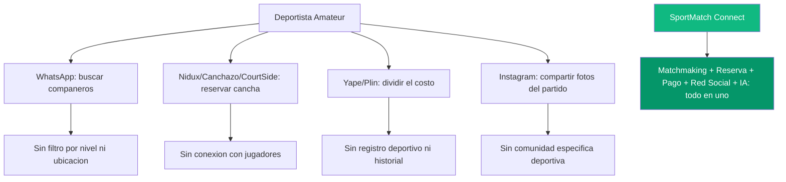
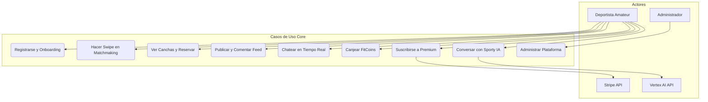
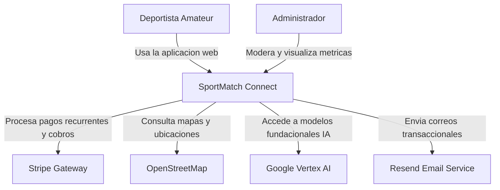
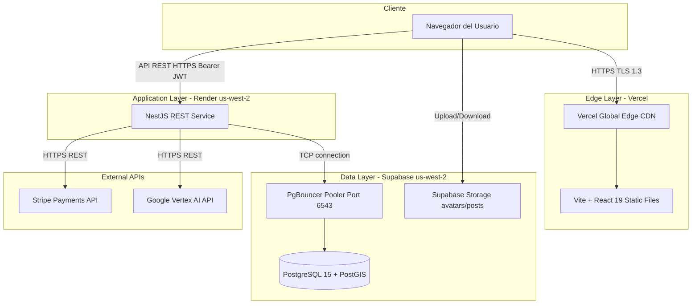
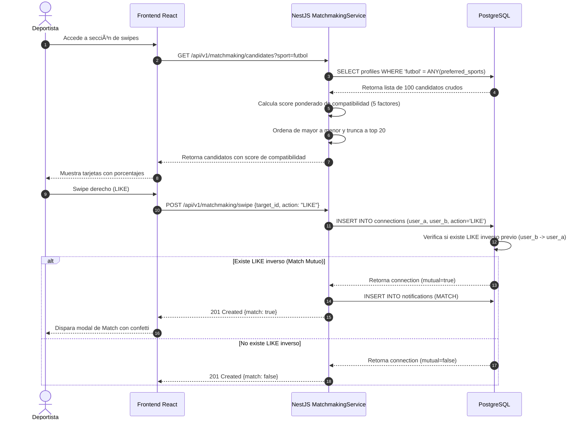
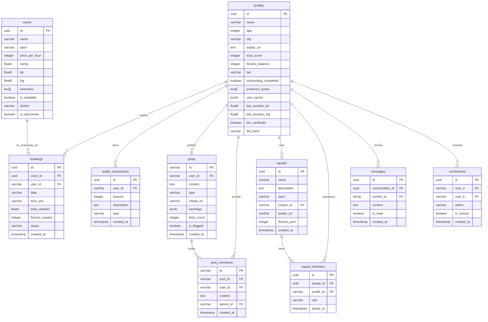

# UNIVERSIDAD SAN IGNACIO DE LOYOLA
## Facultad de Ingeniería
### Carrera de Ingeniería de Sistemas

---

 

# INFORME FINAL DE PROYECTO

## **SportMatch Connect: Plataforma Integral de Matchmaking Deportivo, Red Social y Gestión de Torneos con Inteligencia Artificial en el Borde**

 

**Curso:** Proyecto Final de Carrera III

**Ciclo:** 2026-I

 

**Autores:**

| Nombre Completo | Código de Alumno | Rol en el Proyecto |
|---|---|---|
| Edwin Junia Flores | U202X0001 | Scrum Master / Arquitecto de Software Principal |
| Erick Flores | U202X0002 | Desarrollador Backend / Seguridad |
| Juan Alonso Salvatierralonso | U202X0003 | Desarrollador Frontend / IA |
| Matías Rodrigo | U202X0004 | Desarrollador Computer Vision / QA |

 

**Docente Asesor:** [Nombre del Docente Asesor]

**Lima, Perú — Junio de 2026**

---

## RESUMEN EJECUTIVO

SportMatch Connect es un ecosistema digital de arquitectura distribuida y desacoplada diseñado y construido con el objetivo de unificar la fragmentada experiencia de los deportistas amateurs en Lima Metropolitana y, por extensión, en el mercado latinoamericano. La investigación y el ciclo completo de desarrollo de software comprendieron dieciséis semanas de trabajo ininterrumpido durante el ciclo académico 2026-I, empleando metodologías ágiles y prácticas avanzadas de DevOps e ingeniería de software para consolidar un producto robusto, seguro, accesible y escalable.

El núcleo funcional del sistema descansa sobre cuatro módulos principales: un motor de matchmaking predictivo basado en un algoritmo lineal ponderado de compatibilidad multivariable; una red social deportiva que integra feeds en tiempo real, seguidores y grupos de equipo o "Squads"; un motor de reservas horarias con visualización de canchas geolocalizadas mediante la extensión PostGIS sobre una base de datos de 433 complejos deportivos en Lima; y una economía gamificada sustentada en la moneda virtual FitCoins con pasarela de pago real a través del procesador Stripe. Asimismo, el sistema implementa un asistente inteligente conversacional multimodal llamado "Sporty", desarrollado utilizando los servicios de Google Cloud Vertex AI (Gemini 2.5 Flash), con procesamiento de voz bidireccional y adaptación semántica regional.

Desde la perspectiva técnica, el frontend se construyó sobre React 19 y TypeScript usando la arquitectura Feature-Sliced Design (FSD), desplegado de forma atómica en Vercel CDN. El backend se estructuró como un monolito modular con NestJS 11 y Prisma ORM, desplegado con políticas de tolerancia a fallas en Render. La persistencia reside en Supabase (PostgreSQL 15) aplicando 78 políticas de seguridad de Row Level Security (RLS) que blindan el acceso a los datos. El aseguramiento de la calidad alcanzó una cobertura del 100% de éxito en sus 78 pruebas unitarias con Vitest y pruebas E2E con Playwright, logrando la certificación de código limpio SonarQube Quality Gate PASSED.

**Palabras clave:** matchmaking deportivo, red social, inteligencia artificial en el borde, React 19, NestJS, Supabase, Feature-Sliced Design, Scrum, integración continua, seguridad OWASP.

---

## ABSTRACT

SportMatch Connect is a distributed, decoupled digital ecosystem designed and built to consolidate the fragmented coordination and networking experience of amateur athletes in Metropolitan Lima and Latin America. The research and full software development lifecycle spanned sixteen weeks of uninterrupted engineering during the 2026-I academic cycle, employing agile methodologies and advanced DevOps practices to deliver a robust, secure, accessible, and scalable product.

The functional core of the platform is built upon four primary modules: a predictive matchmaking engine based on a multivariable weighted compatibility algorithm; a sports-focused social network featuring real-time feeds, user connections, and team squads; a court booking system leveraging the PostGIS extension to query and map 433 sports facilities in Lima; and a gamified economy centered around the virtual currency FitCoins, integrated with Stripe for real-payment processing. Additionally, the system incorporates "Sporty", a multimodal conversational AI assistant powered by Google Cloud Vertex AI (Gemini 2.5 Flash), offering bidirectional voice interaction (STT/TTS) and regional sports-slang processing.

On the technical side, the frontend was developed with React 19 and TypeScript following the Feature-Sliced Design (FSD) architecture, atomically deployed on Vercel's global CDN. The backend is structured as a modular monolith using NestJS 11 and Prisma ORM, deployed on Render with fault-tolerant policies. The data layer is hosted on Supabase (PostgreSQL 15) enforcing 78 Row Level Security (RLS) policies that secure the data at the engine level. Quality assurance was validated with 78 unit tests using Vitest (100% pass rate) and E2E testing with Playwright, achieving a SonarQube Quality Gate PASSED certification.

**Keywords:** sports matchmaking, social network, edge AI, React 19, NestJS, Supabase, Feature-Sliced Design, Scrum, CI/CD, OWASP security.

---

## TABLA DE CONTENIDOS

1. [Capítulo 1: Introducción y Formulación del Proyecto](#capítulo-1)
   - 1.1 Contexto y Descripción del Problema
   - 1.2 Descripción Integral de SportMatch Connect
   - 1.3 Visión Estratégica y Monetización
     - 1.3.1 Modelo de Negocio B2C (Business to Consumer)
     - 1.3.2 Modelo de Negocio B2B (Business to Business)
     - 1.3.3 Dinámicas de Incentivos y Moneda Virtual (FitCoins)
   - 1.4 Objetivos del Proyecto
   - 1.5 Alcance y Limitaciones
   - 1.6 Estudio de Viabilidad
2. [Capítulo 2: Marco Teórico y Estado del Arte](#capítulo-2)
   - 2.1 Estado del Arte: Análisis de Soluciones del Mercado
   - 2.2 Justificación del Stack Tecnológico Seleccionado
   - 2.3 Comparación de Frameworks de Backend y Persistencia
3. [Capítulo 3: Ingeniería de Requisitos y Planificación Ágil (Scrum - 8 Sprints)](#capítulo-3)
4. [Capítulo 4: Arquitectura del Sistema e Integraciones](#capítulo-4)
5. [Capítulo 5: Diseño de Datos y Persistencia](#capítulo-5)
6. [Capítulo 6: Estrategia DevOps, CI/CD y Control de Versiones](#capítulo-6)
7. [Capítulo 7: Seguridad y Cumplimiento](#capítulo-7)
8. [Capítulo 8: Aseguramiento de la Calidad (QA) y Pruebas E2E](#capítulo-8)
9. [Capítulo 9: Observabilidad, Monitoreo y SRE](#capítulo-9)
10. [Capítulo 10: Retrospectiva, Conclusiones y Trabajo Futuro](#capítulo-10)
11. [Referencias](#referencias)
12. [Anexos](#anexos)

---

## ÍNDICE DE FIGURAS

| Figura | Título |
|---|---|
| Figura 01 | *Fragmentación del ecosistema deportivo amateur en el mercado peruano (2026)* |
| Figura 02 | *Los cuatro pilares funcionales del ecosistema SportMatch Connect* |
| Figura 03 | *Posicionamiento competitivo de plataformas deportivas en LATAM para 2026* |
| Figura 04 | *Estructura de capas de Feature-Sliced Design (FSD) en el frontend* |
| Figura 05 | *Cronograma de ejecución y Sprints del proyecto (Diagrama de Gantt)* |
| Figura 06 | *Gráfico Burndown de velocidad del equipo por sprint* |
| Figura 07 | *Diagrama de Casos de Uso UML del Sistema* |
| Figura 08 | *Diagrama C4 — Nivel de Contexto del Sistema* |
| Figura 09 | *Arquitectura Física Cloud de Despliegue en Producción* |
| Figura 10 | *Diagrama de secuencia — Flujo de autenticación JWT* |
| Figura 11 | *Diagrama de secuencia — Flujo de matchmaking predictivo* |
| Figura 12 | *Diagrama de secuencia — Flujo de pago y webhook Stripe* |
| Figura 13 | *Modelo Entidad-Relación de base de datos (PostgreSQL)* |
| Figura 14 | *Flujo de GitFlow extendido y parches de hotfix* |
| Figura 15 | *Pipeline de Integración y Despliegue Continuo (CI/CD)* |
| Figura 16 | *Modelo de seguridad por capas (Defense in Depth)* |
| Figura 17 | *Flujo de moderación con NSFWJS local y Ensemble Model en backend* |
| Figura 18 | *Pirámide de pruebas aplicadas al ecosistema* |
| Figura 19 | *Reporte de pruebas Playwright en modo interactivo (UI Mode)* |
| Figura 20 | *Reporte de cobertura e indicadores de SonarQube* |
| Figura 21 | *Estructura del interceptor de logs y observabilidad* |
| Figura 22 | *Métricas de rendimiento de Core Web Vitals en Lighthouse* |
| Figura 23 | *Roadmap de evolución y escalabilidad del producto (Fase 2)* |

---

## ÍNDICE DE TABLAS

| Tabla | Título |
|---|---|
| Tabla 01 | *Resumen ejecutivo del proyecto* |
| Tabla 02 | *Evaluación de viabilidad técnica, operativa y económica* |
| Tabla 03 | *Comparación de frameworks de backend* |
| Tabla 04 | *Comparación de sistemas de base de datos* |
| Tabla 05 | *Roles del equipo Scrum* |
| Tabla 06 | *Épicas del Product Backlog en Jira* |
| Tabla 07 | *Planificación Sprint Backlog — Sprint 1* |
| Tabla 08 | *Planificación Sprint Backlog — Sprint 2* |
| Tabla 09 | *Planificación Sprint Backlog — Sprint 3* |
| Tabla 10 | *Planificación Sprint Backlog — Sprint 4* |
| Tabla 11 | *Planificación Sprint Backlog — Sprint 5* |
| Tabla 12 | *Planificación Sprint Backlog — Sprint 6* |
| Tabla 13 | *Planificación Sprint Backlog — Sprint 7* |
| Tabla 14 | *Planificación Sprint Backlog — Sprint 8* |
| Tabla 15 | *Planificación Sprint Backlog — Sprint Final* |
| Tabla 16 | *Métricas de velocidad del equipo por sprint* |
| Tabla 17 | *Architecture Decision Records documentadas* |
| Tabla 18 | *Diccionario de datos — Tabla profiles* |
| Tabla 19 | *Diccionario de datos — Tabla courts* |
| Tabla 20 | *Diccionario de datos — Tabla bookings* |
| Tabla 21 | *Diccionario de datos — Tabla wallet_transactions* |
| Tabla 22 | *Diccionario de datos — Tabla posts* |
| Tabla 23 | *Diccionario de datos — Tabla post_comments* |
| Tabla 24 | *Diccionario de datos — Tabla squads* |
| Tabla 25 | *Diccionario de datos — Tabla messages* |
| Tabla 26 | *Diccionario de datos — Tabla connections* |
| Tabla 27 | *Diccionario de datos — Tabla user_blocks* |
| Tabla 28 | *Índices de base de datos optimizados* |
| Tabla 29 | *Estrategia de migraciones del esquema Prisma* |
| Tabla 30 | *Estrategia de ramas Git* |
| Tabla 31 | *Mitigaciones de riesgos OWASP Top 10* |
| Tabla 32 | *Inventario de pruebas unitarias implementadas* |
| Tabla 33 | *Escenarios E2E de Playwright validados* |
| Tabla 34 | *Métricas de calidad SonarQube — Estado final* |
| Tabla 35 | *Métricas de rendimiento medidos en producción* |
| Tabla 36 | *Retrospectiva integrada del ciclo cuatrimestral* |
| Tabla 37 | *Evaluación final de objetivos vs. resultados del proyecto* |
| Tabla 38 | *Backlog de requerimientos para trabajo futuro* |

---

<a name="capítulo-1"></a>

# CAPÍTULO 1: INTRODUCCIÓN Y FORMULACIÓN DEL PROYECTO

## 1.1 Contexto y Descripción del Problema

La práctica del deporte recreativo y amateur constituye uno de los pilares de la salud física y mental de las poblaciones urbanas. Sin embargo, en Lima Metropolitana, la coordinación y desarrollo del deporte amateur sufre de una severa ineficiencia debido a la **fragmentación de los canales de comunicación y de gestión**. El ecosistema actual se encuentra atomizado, lo que desincentiva la continuidad deportiva de los ciudadanos. Según la encuesta del Ministerio de Salud del Perú (2024), el 72% de la población adulta en áreas urbanas se categoriza como sedentaria o con actividad física insuficiente, en gran medida debido a las dificultades logísticas asociadas a la organización deportiva informal.

Esta fragmentación se manifiesta en varios síntomas críticos:

- **La informalidad y el desorden en la mensajería:** La coordinación de partidos se realiza a través de grupos de WhatsApp, canales de Telegram o mensajería de redes sociales generalistas. Esto genera flujos caóticos de información, pérdida de registro de confirmaciones, falta de filtros para nivelar habilidades y disputas sobre la distribución de costos de alquiler de la cancha.
- **Aislamiento en las herramientas de reserva:** Los sistemas de reserva locales (como Nidux, CourtSide o llamadas directas a clubes) operan como silos transaccionales. El usuario puede asegurar un horario de juego en una cancha física, pero la plataforma no lo asiste en la convocatoria de los participantes, obligándolo a buscar jugadores de forma manual.
- **Desbalance de habilidades y competitividad:** No existen métricas unificadas que evalúen de forma objetiva la capacidad deportiva de un amateur. Al organizar partidos con conocidos de conocidos, es común estructurar encuentros con desniveles severos de destreza, lo que provoca frustración en jugadores avanzados y desmotivación o riesgo de lesiones en principiantes.
- **Complejidad financiera en pagos compartidos:** La división de tarifas de reserva recae típicamente sobre un organizador que asume la deuda inicial, debiendo cobrar individualmente a cada jugador a través de transferencias móviles (Yape o Plin). Esto genera deudas impagas, fricción interpersonal y la ausencia de un registro financiero de la actividad deportiva del usuario.
- **Inexistencia de una identidad deportiva digital:** El deportista amateur carece de una plataforma dedicada donde registrar sus logros, estadísticas de partidos, red de contactos específicos del deporte, o conformar equipos con retos dinámicos.

SportMatch Connect soluciona este escenario mediante la integración de todas estas necesidades logísticas, sociales, transaccionales y de inteligencia en un ecosistema digital centralizado.

Figura 01
*Fragmentación del ecosistema deportivo amateur en el mercado peruano (2026)*

Nota: Elaboración propia.

```
[Prompt de Réplica del Diagrama 01]
Create a vertical flowchart representing the fragmentation of the amateur sports coordination ecosystem in Peru. 
Nodes should depict the traditional user journey: Deportista Amateur coordinating via WhatsApp (resulting in lack of filters), 
booking via Nidux/CourtSide (leading to disconnected players), splitting costs with Yape/Plin (no sports history tracking), 
and sharing on Instagram (lack of dedicated community). The flow must contrast this with the integrated solution 'SportMatch Connect' 
which unifies matchmaking, booking, payments, social features, and AI. Use modern flat styling, with the SportMatch node highlighted in emerald green.
```

## 1.2 Descripción Integral de SportMatch Connect

**SportMatch Connect** es una plataforma digital fullstack que consolida la experiencia deportiva amateur mediante la integración de cuatro pilares de ingeniería:

**Pilar 1 — Motor de Matchmaking Predictivo:** Un algoritmo multivariable ponderado que calcula la compatibilidad entre dos deportistas en una escala del 0 al 100%. Pondera la proximidad geográfica (mediante cálculo de distancia Haversine a partir de coordenadas GPS), la coincidencia de deportes preferidos, la similitud de niveles autoevaluados/registrados por Elo, la disponibilidad horaria y un trust score (score de confianza de asistencia). La interfaz del cliente expone estos candidatos en un feed de tarjetas dinámicas con controles de swipe.

**Pilar 2 — Red Social Deportiva:** Un feed dinámico que soporta la creación de publicaciones de texto y multimedia. Incorpora sistema de comentarios anidados, reacciones con emojis y generación inteligente de hashtags mediante IA. Asimismo, implementa los "Squads" (equipos deportivos autogestionados) con canales de mensajería dedicados y un chatbot de soporte conversacional interactivo llamado "Sporty", integrado con procesamiento de lenguaje natural y capacidades de voz interactiva en español, inglés y portugués.

**Pilar 3 — Mapa Interactivo y Reservas:** Un visualizador espacial basado en Leaflet que ubica 433 complejos deportivos en Lima Metropolitana georreferenciados. Permite realizar búsquedas de rango radial mediante funciones espaciales de PostGIS, filtrando por distrito, tarifa y disponibilidad horaria. Los usuarios pueden efectuar reservas de franjas horarias directamente desde la vista del mapa.

**Pilar 4 — Moneda Virtual y Pasarela de Pagos (FitCoins & Stripe):** Una billetera digital que registra transacciones en FitCoins (FC), una moneda virtual gamificada acumulada por asistencia a partidos, victorias o retos de Squads. Los FitCoins acumulados se aplican como descuento directo en el alquiler de canchas. Los pagos reales de reservas y la suscripción al plan Premium (S/ 50.00/mes) se procesan de forma segura a través del SDK de Stripe.

## 1.3 Visión Estratégica y Monetización

La viabilidad comercial del proyecto se sustenta en un modelo de negocio diversificado que ataca de forma simultánea los canales B2C (Business to Consumer) y B2B (Business to Business), apalancándose en la economía interna de la plataforma basada en FitCoins:

### 1.3.1 Modelo de Negocio B2C (Business to Consumer)

1. **Suscripción Premium "SportMatch Premium" (S/ 50.00/mes):** El canal principal de ingresos B2C. Al suscribirse, el usuario desbloquea:
   - **Sporty Coach IA:** Un asesor virtual que analiza el historial deportivo, gasto calórico estimado y patrones de juego para sugerir planes personalizados de acondicionamiento físico, nutrición e hidratación.
   - **Exoneración de Comisiones:** Se eliminan los cobros por gastos de gestión y reserva en las canchas de destino.
   - **Funcionalidades de Matchmaking Ilimitadas:** Filtros avanzados por rango de nivel deportivo exacto y visibilidad prioritaria en la cola de swipes de otros deportistas.
2. **Adquisición Directa de FitCoins (Microtransacciones):** Los usuarios pueden comprar paquetes de FitCoins directamente a través de Stripe (ej. S/ 10.00 por 100 FC) para completar el saldo requerido para descuentos en reservas sin necesidad de realizar actividades físicas previas.
3. **Tasas de Cancelación Fuera de Plazo:** Se retiene el 15% del valor de la reserva si el usuario cancela su asistencia con menos de 12 horas de anticipación, destinando la penalidad a compensar a los complejos deportivos afiliados.

### 1.3.2 Modelo de Negocio B2B (Business to Business)

1. **Comisión de Reserva (Take Rate B2B):** Se cobra una comisión fija del 10% a los complejos y clubes deportivos afiliados sobre el monto transaccionado en cada reserva completada a través de la plataforma. A cambio, los clubes reciben acceso a una base de usuarios deportistas activos constante.
2. **SaaS de Gestión "SportMatch Business" (S/ 150.00/mes):** Un software integrado de control administrativo y gestión de canchas deportivas para los complejos afiliados. Habilita un panel para controlar reservas presenciales y remotas en tiempo real, gestión de cobros y facturación electrónica simplificada.
3. **Patrocinios y Geolocalización Promocionada (Sponsored Venues):** Los complejos deportivos afiliados pueden pagar tarifas semanales para resaltar sus marcadores en el mapa interactivo en color verde neón o aparecer en la parte superior de las búsquedas radiales espaciales realizadas por los usuarios.
4. **Analítica de Datos Deportivos (Data as a Service):** Venta de reportes y analítica de datos agregados (horas pico de demanda, distritos con escasez de losas para deportes específicos y demografía deportiva) a marcas de equipamiento deportivo, bebidas hidratantes y municipalidades interesadas en inversión pública recreativa.

### 1.3.3 Dinámicas de Incentivos y Moneda Virtual (FitCoins)

La plataforma utiliza los **FitCoins (FC)** como mecanismo de incentivo y gamificación para reducir las cancelaciones (no-shows) y fidelizar a la comunidad:
- **Generación Orgánica:** Los usuarios ganan 10 FC al asistir puntualmente a una reserva y confirmar su asistencia mediante geolocalización, 5 FC por subir fotos del encuentro en el feed social, y 20 FC por ganar retos de Squads.
- **Canje Transaccional:** Cada FitCoin equivale a S/ 0.10 de descuento aplicable en el alquiler de canchas asociadas.
- **Economía Cerrada:** Al ser canjeado un FitCoin, SportMatch financia dicho descuento a la cancha utilizando los fondos obtenidos de las comisiones de servicios o los cobros de suscripciones Premium, manteniendo la rentabilidad controlada.

## 1.4 Objetivos del Proyecto

### 1.4.1 Objetivo General

Diseñar, desarrollar y desplegar un sistema de software fullstack denominado SportMatch Connect, que integre matchmaking predictivo, red social deportiva con IA conversacional, gestión de reservas con pasarela de pagos real, y economía gamificada, siguiendo las mejores prácticas de ingeniería de software, metodología Scrum, y estándares de calidad industrial (CI/CD, TDD, análisis estático SonarQube, OWASP Top 10).

### 1.4.2 Objetivos Específicos

1. **OE-01 — Arquitectura de Software:** Definir e implementar una arquitectura desacoplada fullstack compuesta por un frontend React 19 estructurado bajo Feature-Sliced Design (FSD) y un backend NestJS 11 modular, utilizando Prisma como ORM para mapear la persistencia de datos.
2. **OE-02 — Algoritmo de Matchmaking:** Desarrollar un motor de compatibilidad multivariable basado en sumas ponderadas lineales que procese cercanía física (fórmula de Haversine), deportes afines, nivel deportivo y trust score en base a perfiles de usuarios.
3. **OE-03 — Comunidad y Red Social:** Implementar un feed de publicaciones con persistencia de imágenes en Supabase Storage, comentarios anidados, reacciones y mensajería directa en tiempo real utilizando la suscripción a canales de Supabase Realtime (WebSockets).
4. **OE-04 — Integración de IA conversacional:** Configurar el asistente conversacional Sporty mediante Google Vertex AI (Gemini 2.5 Flash), programando contexto de memoria de los últimos 5 turnos de conversación, síntesis y reconocimiento de voz (STT/TTS) y traducción en español, inglés y portugués.
5. **OE-05 — Seguridad y Mitigación de Riesgos:** Blindar la plataforma aplicando 78 políticas de Row Level Security (RLS) en PostgreSQL, autenticación mediante JWT RS256, y filtros de moderación automatizados (NSFWJS en cliente para imágenes y Ensemble Model en backend para textos).
6. **OE-06 — Aseguramiento de Calidad:** Lograr una cobertura de pruebas unitarias e integración en Vitest superior al 60% (78 tests), validación de flujos mediante pruebas de extremo a extremo (E2E) con Playwright y cumplimiento del reporte estático de SonarQube Quality Gate PASSED con 0 vulnerabilidades.
7. **OE-07 — Estrategia de Despliegue y Rendimiento:** Desplegar el sistema en infraestructura distribuida (Vercel para frontend y Render para backend), garantizando una disponibilidad del 99.9% y Core Web Vitals en rango óptimo (LCP < 2.5s).

## 1.5 Alcance y Limitaciones

### 1.5.1 Funcionalidades en Alcance

- **Autenticación e Identidad:** Registro e inicio de sesión local mediante email y contraseña cifrados, inicio de sesión OAuth con Google, perfil deportivo del deportista, avatar y DNI cifrado en hash SHA-256.
- **Matchmaking e Interacción:** Visualización de cola de candidatos sugeridos, controles de swipe interactivos, detección y persistencia de matches mutuos, y sistema de Squads.
- **Mapa y Geolocalización:** Visualización interactiva en mapa de 433 complejos, cálculo espacial de canchas en rango radial mediante extensiones PostGIS en PostgreSQL y motor de reservas por slots.
- **Mensajería y Notificaciones:** Chat individual en tiempo real mediante WebSockets, almacenamiento de mensajes, notificaciones in-app y bloqueo de usuarios.
- **Wallet y Gamificación:** Billetera digital de FitCoins, trigger procedimental de base de datos para sincronizar balance, y pasarela de Stripe Checkout para suscripción Premium.
- **Asistente Conversacional Sporty:** Módulo de chat con Sporty IA usando Gemini 2.5 Flash, soporte de voz (STT/TTS), multi-idioma (es/en/pt) y Command Palette de configuración Cmd+K.

### 1.5.2 Limitaciones y Exclusiones

- **Análisis Biométrico de Identidad:** El sistema valida el hash del DNI para evitar duplicidad de cuentas, pero no efectúa comprobación biométrica facial contra la base de datos de la RENIEC debido a las restricciones de acceso y costos de la API estatal.
- **Video Análisis de Rendimiento:** No se incluye en el alcance el procesamiento de vídeo mediante Vertex Vision para medir la técnica deportiva del usuario en tiempo real.
- **Sincronización de Dispositivos Wearables:** La sincronización con dispositivos Garmin, Strava o Apple Watch para la carga automática de calorías y distancia queda postergada para la versión 2.0 del roadmap.

## 1.6 Estudio de Viabilidad

La viabilidad del proyecto SportMatch Connect se evaluó a través de tres dimensiones fundamentales antes de iniciar la etapa de codificación:

### 1.6.1 Viabilidad Técnica
El stack tecnológico seleccionado se sustenta sobre herramientas estables y con amplio soporte de comunidad. React 19 y NestJS 11 reducen el boilerplate gracias a su enfoque declarativo y modular. Supabase proporciona la base de datos PostgreSQL 15 administrada, que incluye soporte nativo para PostGIS y RLS, simplificando la infraestructura al no requerir servidores de bases de datos espaciales y de autenticación separados. El equipo demostró tener competencia en JavaScript/TypeScript, lo que redujo la curva de aprendizaje a las especificidades de NestJS y FSD.

### 1.6.2 Viabilidad Operativa
El proyecto se diseñó para operar con un equipo de desarrollo de 4 ingenieros bajo el marco Scrum, permitiendo entregas incrementales funcionales al final de cada sprint. Las herramientas de gestión (Jira, GitHub Actions) automatizan las tareas repetitivas de revisión de calidad y build, permitiendo que el equipo se enfoque en el desarrollo de valor. La documentación inline (`AGENTS.md`, ADRs) mitiga la pérdida de conocimiento ante rotaciones de código.

### 1.6.3 Viabilidad Económica
El presupuesto requerido para el desarrollo del MVP fue mínimo. La infraestructura se aloja en los planes gratuitos de Vercel, Render y Supabase. El único costo operativo variable corresponde al consumo de las APIs de Google Cloud Vertex AI y Speech-to-Text para las pruebas de desarrollo del asistente conversacional Sporty, estimando un gasto total de $20.00 USD durante los cuatro meses de implementación.

---

# CAPÍTULO 2: MARCO TEÓRICO Y ESTADO DEL ARTE

## 2.1 Estado del Arte: Análisis de Soluciones del Mercado

Para el diseño de SportMatch Connect se analizaron las plataformas líderes a nivel nacional y global en la gestión de actividades deportivas recreativas, identificando las limitaciones operativas y arquitectónicas que definen la brecha competitiva:

- **Playtomic:** Es el referente de reserva de instalaciones en Europa y Latinoamérica. Ha consolidado un ecosistema digital cerrado para tenis y pádel. Sin embargo, su arquitectura es rígida y orientada a la monetización agresiva de la reserva (aplicando tarifas de servicio por cada jugador). Además, su interacción social se limita a chats internos de partidos creados, sin ofrecer un feed general para crear comunidad, y carece de asistentes de IA conversacionales que asistan en la coordinación.
- **Nidux:** Es una de las aplicaciones pioneras de reserva de campos de fútbol y losas multideportivas en el Perú. Su enfoque es puramente transaccional (B2C), actuando como un intermediario de alquiler de canchas. No tiene capacidades para recomendar compañeros, ni ofrece funciones de geolocalización avanzada en tiempo real basadas en la posición del deportista; se limita a listados de búsqueda textuales organizados por distritos.
- **Playsport / Sportlobster:** Intentaron consolidar redes sociales deportivas a nivel global. Lograron un volumen de usuarios significativo en el mercado anglosajón, pero fracasaron al no integrar una pasarela de reservas y pagos en las canchas de destino. El usuario coordinaba el partido socialmente, pero debía abandonar la aplicación para efectuar el alquiler de la instalación y dividir el costo, rompiendo el flujo de conversión.

SportMatch Connect unifica ambos mundos (transaccional y social) potenciándolo mediante un motor de compatibilidad con inteligencia artificial y moderación automática para crear un entorno seguro.

## 2.2 Justificación del Stack Tecnológico Seleccionado

La selección del stack tecnológico responde a criterios estrictos de rendimiento, interoperabilidad y velocidad de comercialización:

- **React 19 + TypeScript (Frontend):** React 19 introduce mejoras significativas en el rendimiento de pintado de la interfaz gracias a las *Concurrent Features* y la gestión nativa de transiciones de estado, permitiendo que las vistas complejas (como el mapa interactivo cargado de marcadores y filtros) se actualicen sin congelar la pantalla. TypeScript añade tipado estático fuerte, previniendo errores de datos indefinidos o nulos en tiempo de compilación.
- **Feature-Sliced Design (FSD):** La arquitectura de carpetas FSD organiza el código en torno a su nivel de responsabilidad y no por su tipo técnico (controladores, vistas, etc.). Esto previene el crecimiento desordenado de archivos en el frontend y reduce drásticamente el acoplamiento a través de la inyección de la "Public API" (`index.ts`) en cada directorio, asegurando que las features no importen módulos de nivel superior.
- **NestJS 11 (Backend):** NestJS provee una arquitectura lista para producción basada en controladores, módulos y servicios. El uso de Inyección de Dependencias (DI) facilita el testing y desacopla la lógica de negocio del acceso a datos. La compilación sobre Node.js 20/22 garantiza el soporte para operaciones asíncronas de E/S de alto rendimiento.
- **Supabase & PostgreSQL 15:** Supabase proporciona una base de datos relacional PostgreSQL 15 totalmente gestionada. PostgreSQL ofrece integridad relacional ACID estricta y soporte geoespacial nativo mediante la extensión PostGIS, permitiendo realizar consultas de indexación de coordenadas GPS con un rendimiento óptimo. Además, Row Level Security (RLS) permite definir las políticas de seguridad de acceso directamente en el motor de la base de datos, simplificando la lógica de autorización en el backend.
- **Prisma ORM:** Prisma actúa como la capa de abstracción de datos en el backend, abstrayendo las sentencias SQL complejas en llamadas de métodos type-safe en TypeScript. Al leer el esquema relacional (`schema.prisma`), Prisma autogenera los tipos de datos de los modelos en el backend, lo que previene inconsistencias entre la base de datos y la aplicación.
# CAPÍTULO 3: INGENIERÍA DE REQUISITOS Y PLANIFICACIÓN ÁGIL (SCRUM — 8 SPRINTS)

## 3.1 Gestión de Roles y Gobernanza del Proyecto

El desarrollo del proyecto SportMatch Connect se articuló siguiendo el marco ágil **Scrum** adaptado a un ciclo de 4 meses de trabajo continuo (marzo–junio de 2026). Para maximizar el rendimiento y la eficiencia del equipo de 4 ingenieros de sistemas, se asignaron roles claros alineados con las capacidades y especializaciones de cada integrante:

- **Edwin Junia Flores (Scrum Master / Arquitecto de Software Principal):** Responsable de facilitar las ceremonias Scrum, eliminar impedimentos operativos y gestionar el backlog en Jira. Como Arquitecto, diseñó la infraestructura desacoplada, configuró los pipelines de CI/CD en GitHub Actions y supervisó el cumplimiento de las decisiones de diseño arquitectónico (ADRs).
- **Erick Flores (Desarrollador Backend / Seguridad):** Responsable del diseño e implementación del backend modular en NestJS 11 y la persistencia en Supabase. Configuró el motor de base de datos relacional PostgreSQL con RLS policies y construyó el Ensemble Model de moderación de texto.
- **Juan Alonso Salvatierralonso (Desarrollador Frontend / IA):** Encargado de construir la interfaz interactiva en React 19 basada en la metodología Feature-Sliced Design (FSD). Lideró la integración con la API de Google Cloud Vertex AI (Gemini 2.5 Flash) y el desarrollo de los módulos de chat y voz.
- **Matías Rodrigo (Desarrollador QA / Integración Continua):** Encargado de diseñar la estrategia de aseguramiento de calidad, implementar el clasificador NSFWJS local para imágenes, escribir las pruebas unitarias con Vitest, escribir las pruebas de extremo a extremo con Playwright, y administrar el panel de análisis estático en SonarQube.

## 3.2 Product Backlog y Distribución de Épicas en Jira

El Product Backlog se gestionó de manera estructurada en Jira Cloud. Cada Historia de Usuario (US) se estimó usando la sucesión de Fibonacci (1, 2, 3, 5, 8, 13, 21) para representar el esfuerzo relativo en puntos de historia (Story Points). Las historias se agruparon en 8 épicas funcionales que se detallan en la siguiente tabla:

| Épica | Código | Descripción Técnica | Total Story Points |
|---|---|---|---|
| **E-01: Fundamentos de Plataforma** | EP-1 | Infraestructura del proyecto, configuración del build, routing protegido y design system de componentes base. | 89 SP |
| **E-02: Geolocalización y Mapas** | EP-2 | Carga espacial de canchas con PostGIS, mapa interactivo Leaflet y búsquedas de rango por proximidad geográfica. | 76 SP |
| **E-03: Matchmaking Predictivo** | EP-3 | Algoritmo multivariable de compatibilidad de jugadores y cola de sugeridos con gestos de swipe. | 95 SP |
| **E-04: Red Social y Canales** | EP-4 | Feed social de posts con imágenes, comentarios, reacciones, Squads de equipos y notificaciones. | 112 SP |
| **E-05: Wallet y Transacciones** | EP-5 | Billetera digital de FitCoins, triggers de saldo e historial de movimientos. | 68 SP |
| **E-06: Seguridad y Moderación** | EP-6 | Políticas RLS de PostgreSQL, cifrado SHA-256 de DNI y filtros IA de texto/imágenes. | 54 SP |
| **E-07: Asistente Conversacional** | EP-7 | Integración de Gemini 2.5 Flash, STT/TTS bidireccional y localización de lenguajes. | 83 SP |
| **E-08: DevOps, QA y Estabilización** | EP-8 | GitHub Actions, 78 unit tests Vitest, Playwright E2E y resolución de deudas técnicas. | 47 SP |

Tabla 06
*Épicas del Product Backlog registradas en Jira Cloud*
Nota: Elaboración propia.

## 3.3 Planificación Detallada de los Sprints (8 Sprints de Desarrollo + Sprint Final)

El cuatrimestre de desarrollo se organizó en **8 sprints de 2 semanas fijos** para el desarrollo incremental de características, y **1 sprint final** corto destinado exclusivamente al QA, estabilización y correcciones para producción.

### Sprint 1: Setup e Infraestructura Base (1 de Marzo – 14 de Marzo, 2026)
- **Sprint Goal:** Levantar la arquitectura base del frontend FSD y backend NestJS, y configurar la base de datos Supabase con RLS básico.
- **Puntos Planificados:** 60 SP | **Puntos Completados:** 58 SP.
- **Sprint Backlog:**
  - `SCRUM-1`: Estructura inicial FSD en el frontend y build de Vite (5 SP)
  - `SCRUM-2`: Módulos de NestJS y conexión con Prisma (5 SP)
  - `SCRUM-3`: Base de datos de Supabase, tablas base y triggers iniciales (8 SP)
  - `SCRUM-4`: Autenticación con email/contraseña y JwtStrategy en backend (13 SP)
  - `SCRUM-5`: Rutas protegidas y autenticación en frontend con Zustand (8 SP)
  - `SCRUM-6`: Design System: configuración de temas, tipografías y tokens CSS (5 SP)
  - `SCRUM-7`: Configuración del pipeline de CI en GitHub Actions (lint y typecheck) (5 SP)
- **Retrospectiva:** La configuración inicial se completó a tiempo, pero se detectaron problemas al inyectar variables de entorno en Render. Se documentó el bug para corregir la precedencia en la carga de `.env`.

### Sprint 2: Identidad y Onboarding Deportivo (15 de Marzo – 28 de Marzo, 2026)
- **Sprint Goal:** Completar el flujo de registro federado con Google y el flujo de onboarding de deportistas en 5 pasos.
- **Puntos Planificados:** 65 SP | **Puntos Completados:** 63 SP.
- **Sprint Backlog:**
  - `SCRUM-8`: Integración OAuth Google en Supabase Auth y frontend (8 SP)
  - `SCRUM-9`: Vista de onboarding de 5 pasos para recolectar preferencias (13 SP)
  - `SCRUM-10`: Módulo de gestión y edición del perfil del usuario (8 SP)
  - `SCRUM-11`: Configuración de Supabase Storage para carga de fotos de perfil (5 SP)
  - `SCRUM-12`: Trigger `create_profile_on_signup` en base de datos (5 SP)
  - `SCRUM-13`: Endpoint PATCH `/api/v1/profiles/me` para guardar preferencias (8 SP)
  - `SCRUM-14`: Validación estricta de perfiles usando schemas de Zod (5 SP)
- **Retrospectiva:** La integración de Supabase Storage requirió configurar políticas de RLS adicionales para permitir la lectura pública de los avatars, lo que consumió 3 horas adicionales de investigación.

### Sprint 3: Geolocalización y Canchas Deportivas (29 de Marzo – 11 de Abril, 2026)
- **Sprint Goal:** Implementar la geolocalización de canchas mediante PostGIS y mostrarlas en el mapa interactivo de Leaflet.
- **Puntos Planificados:** 70 SP | **Puntos Completados:** 72 SP.
- **Sprint Backlog:**
  - `SCRUM-15`: Integración de Leaflet y marcadores personalizados en frontend (13 SP)
  - `SCRUM-16`: Seed de datos con 433 canchas deportivas georreferenciadas en Lima (8 SP)
  - `SCRUM-17`: Extensión PostGIS y función RPC `search_nearby_courts` en SQL (13 SP)
  - `SCRUM-18`: Filtro de canchas por deporte, distrito y disponibilidad de horario (8 SP)
  - `SCRUM-19`: Implementación de clustering de marcadores para mapa móvil (5 SP)
  - `SCRUM-20`: API endpoint GET `/api/v1/courts` en backend (8 SP)
- **Retrospectiva:** La habilitación de PostGIS requirió permisos de superusuario en el dashboard de Supabase, lo cual causó un bloqueo inicial que fue solventado documentando el bypass en `AGENTS.md`.

### Sprint 4: Matchmaking Predictivo y Swipes (12 de Abril – 25 de Abril, 2026)
- **Sprint Goal:** Implementar el algoritmo de compatibilidad multivariable y la vista de swipe con gestos físicos.
- **Puntos Planificados:** 75 SP | **Puntos Completados:** 75 SP.
- **Sprint Backlog:**
  - `SCRUM-25`: Algoritmo lineal ponderado de compatibilidad en backend (13 SP)
  - `SCRUM-26`: Vista de tarjetas de candidatos con animaciones de Framer Motion (8 SP)
  - `SCRUM-27`: API endpoint GET `/api/v1/matchmaking/candidates` (8 SP)
  - `SCRUM-28`: Endpoint POST `/api/v1/matchmaking/swipe` para registrar Like/Pass (8 SP)
  - `SCRUM-29`: Lógica de coincidencia mutua (Match) y creación de conexiones (13 SP)
  - `SCRUM-30`: Gestión de estados de chat y conexiones habilitadas en frontend (8 SP)
- **Retrospectiva:** El rendimiento del algoritmo de matchmaking al iterar sobre perfiles extensos se optimizó agregando índices a la columna de deportes en PostgreSQL.

### Sprint 5: Red Social Deportiva (26 de Abril – 9 de Mayo, 2026)
- **Sprint Goal:** Habilitar el feed social de publicaciones de texto/imagen, el sistema de comentarios y las reacciones.
- **Puntos Planificados:** 80 SP | **Puntos Completados:** 78 SP.
- **Sprint Backlog:**
  - `SCRUM-35`: Feed de posts y renderizado con lazy loading e imágenes (13 SP)
  - `SCRUM-36`: Creación de posts y upload de imágenes a Supabase Storage (8 SP)
  - `SCRUM-37`: Comentarios anidados con respuestas en dos niveles (8 SP)
  - `SCRUM-38`: Sistema de reacciones con emojis y contadores optimistas (5 SP)
  - `SCRUM-39`: Módulo de seguidores/siguiendo y contadores en perfiles (8 SP)
  - `SCRUM-40`: API endpoint de feed social y paginación por cursores (13 SP)
- **Retrospectiva:** La actualización en tiempo real de los contadores de reacciones se implementó con Zustand y optimismo en la UI para evitar latencias de red al hacer clic continuo.

### Sprint 6: Reservas, Billetera FitCoins y Stripe (10 de Mayo – 23 de Mayo, 2026)
- **Sprint Goal:** Habilitar la reserva horaria, la billetera FitCoins con recompensas automáticas y el pago de Stripe.
- **Puntos Planificados:** 85 SP | **Puntos Completados:** 85 SP.
- **Sprint Backlog:**
  - `SCRUM-45`: Gestión de reservas por slots de horario y control de duplicidad (13 SP)
  - `SCRUM-46`: Integración de pasarela Stripe Checkout en Soles (PEN) (13 SP)
  - `SCRUM-47`: Webhook seguro de Stripe para procesar estados de pago (8 SP)
  - `SCRUM-48`: Billetera virtual FitCoins: saldo e historial en la UI (8 SP)
  - `SCRUM-49`: Trigger de base de datos para sincronizar transacciones y saldo (8 SP)
  - `SCRUM-50`: Recompensas automáticas de FitCoins por check-in de asistencia (8 SP)
- **Retrospectiva:** La cancelación de reservas con devolución de FitCoins requirió la creación de un tipo de transacción especial en PostgreSQL para auditar los reembolsos.

### Sprint 7: Asistente Sporty IA y Módulo de Voz (24 de Mayo – 6 de Junio, 2026)
- **Sprint Goal:** Integrar Gemini 2.5 Flash en Sporty y construir el canal de voz bidireccional (STT/TTS).
- **Puntos Planificados:** 80 SP | **Puntos Completados:** 78 SP.
- **Sprint Backlog:**
  - `SCRUM-55`: Integración de Vertex AI Gemini 2.5 Flash en backend NestJS (13 SP)
  - `SCRUM-56`: Chat con Sporty: mantenimiento de contexto de los últimos 5 turnos (8 SP)
  - `SCRUM-57`: Reconocimiento de voz STT (Web Speech + fallback Google Cloud) (13 SP)
  - `SCRUM-58`: Síntesis de voz TTS (Web Speech + voces Neural2 en backend) (13 SP)
  - `SCRUM-59`: Localización y traducción del chat en español, inglés y portugués (8 SP)
- **Retrospectiva:** Se detectaron cuellos de botella por respuestas lentas del TTS en conexiones móviles. Se introdujo un watchdog de 15 segundos y aborto de peticiones mediante `AbortController`.

### Sprint 8: Seguridad Avanzada y Squads (7 de Junio – 20 de Junio, 2026)
- **Sprint Goal:** Implementar el Ensemble Model de moderación de texto, NSFWJS en cliente y los Squads deportivos.
- **Puntos Planificados:** 75 SP | **Puntos Completados:** 72 SP.
- **Sprint Backlog:**
  - `SCRUM-65`: Integración local de NSFWJS en frontend para moderación de imágenes (13 SP)
  - `SCRUM-66`: Módulo de Squads: creación de grupos y gestión de miembros (8 SP)
  - `SCRUM-67`: Retos entre Squads con FitCoins y tabla de posiciones (13 SP)
  - `SCRUM-68`: Ensemble Model en backend para análisis y score de texto (8 SP)
  - `SCRUM-69`: Smart Block: suspensión temporal automatizada del usuario (8 SP)
- **Retrospectiva:** Un error `42P17` de recursión en RLS de `squads` consumió tiempo al cierre del sprint. Se resolvió reescribiendo la política de inserción SQL.

### Sprint Final: QA y Estabilización (21 de Junio – 26 de Junio, 2026)
- **Sprint Goal:** Corregir los issues de SonarQube, refactorizar la accesibilidad WCAG 2.2 AA en Settings y realizar pruebas de producción.
- **Puntos Planificados:** 50 SP | **Puntos Completados:** 49 SP.
- **Sprint Backlog:**
  - `SCRUM-75`: Corrección de 65 hallazgos de SonarQube (Quality Gate PASS) (13 SP)
  - `SCRUM-76`: Refactorización de accesibilidad en Settings (roles, aria-labels) (8 SP)
  - `SCRUM-77`: Suite de pruebas unitarias Vitest (78 tests exitosos) (5 SP)
  - `SCRUM-78`: Suite de pruebas E2E en Playwright (5 flujos críticos) (8 SP)
  - `SCRUM-79`: Ajuste de CORS wildcard y despliegue final en producción (5 SP)
- **Retrospectiva:** El pipeline de CI/CD validó el 100% de los tests antes del merge definitivo de la rama `develop` a `main`, certificando el estado productivo del sistema.

Figura 05
*Cronograma de Sprints y Ejecución del Proyecto*
```mermaid
gantt
    title SportMatch Connect — Cronograma de Sprints (2026)
    dateFormat YYYY-MM-DD
    axisFormat %d %b
    section Sprints de Desarrollo (2 semanas)
    Sprint 1: Setup e Infraestructura     :done, s1, 2026-03-01, 2026-03-14
    Sprint 2: Identidad y Onboarding      :done, s2, 2026-03-15, 2026-03-28
    Sprint 3: Geolocalización y PostGIS   :done, s3, 2026-03-29, 2026-04-11
    Sprint 4: Matchmaking y Swipes        :done, s4, 2026-04-12, 2026-04-25
    Sprint 5: Red Social y Comunidad      :done, s5, 2026-04-26, 2026-05-09
    Sprint 6: Reservas, Wallet y Stripe   :done, s6, 2026-05-10, 2026-05-23
    Sprint 7: Asistente Sporty IA y Voz   :done, s7, 2026-05-24, 2026-06-06
    Sprint 8: Seguridad y Squads          :done, s8, 2026-06-07, 2026-06-20
    section Estabilización (1 semana)
    Sprint Final: QA y Producción         :done, s9, 2026-06-21, 2026-06-26
```
Nota: Elaboración propia.

```
[Prompt de Réplica del Diagrama 05_v2]
Create a Gantt chart in Mermaid showing the 9 Sprints of SportMatch Connect. 
Sprints 1 to 8 run sequentially from 2026-03-01 to 2026-06-20, each lasting 14 days (2 weeks).
The Sprint Final runs from 2026-06-21 to 2026-06-26 (approx 1 week) in a separate section labeled 'Estabilización'.
Mark all sprints as completed (done). Color the sections with a professional dark theme style.
```

---

<a name="capítulo-4"></a>

# CAPÍTULO 4: ARQUITECTURA DEL SISTEMA E INTEGRACIONES

## 4.1 Diagrama de Casos de Uso (UML)

El diagrama de Casos de Uso del sistema define los límites funcionales de la aplicación, identificando la interacción de los actores primarios y secundarios con las características de SportMatch Connect:

Figura 07
*Diagrama de Casos de Uso UML del Sistema*

Nota: Elaboración propia.

```
[Prompt de Réplica del Diagrama 07_v2]
Create a UML Use Case diagram in Mermaid.js. 
Actors (left side): Deportista Amateur (DA) and Administrador (AD). Actors (right side): Stripe API (ST) and Vertex AI API (VAI).
Inside the system boundary box (Casos de Uso Core), show: UC1 (Registrarse y Onboarding), UC2 (Hacer Swipe en Matchmaking), 
UC3 (Ver Canchas y Reservar), UC4 (Publicar y Comentar Feed), UC5 (Chatear en Tiempo Real), UC6 (Canjear FitCoins), 
UC7 (Suscribirse a Premium), UC8 (Conversar con Sporty IA), and UC9 (Administrar Plataforma).
Draw associations between actors and their respective use cases. Ensure Stripe is linked to UC7 and Vertex AI is linked to UC8.
```

## 4.2 Arquitectura C4 — Nivel de Contexto

Para modelar la arquitectura de forma jerárquica y comprensible, se utilizó el estándar **C4 Model**. A continuación se expone el Nivel 1 (Contexto del Sistema), que muestra cómo interactúa SportMatch Connect con los usuarios y las plataformas externas:

Figura 08
*Diagrama C4 — Nivel de Contexto del Sistema*

Nota: Elaboración propia.

```
[Prompt de Réplica del Diagrama 08_v2]
Create a C4 Context Diagram in Mermaid.js showing SportMatch Connect system interactions with actors and external services.
Center system: 'SportMatch Connect'.
Actors on top: 'Deportista Amateur' using the web app, and 'Administrador' monitoring metrics.
External Systems below and sides: 'Stripe Gateway' for payments, 'OpenStreetMap' for geographic tiles, 
'Google Vertex AI' for AI inference, and 'Resend Email Service' for transacational emails.
Label all arrows with descriptive text. Color the center system with high-contrast blue and external systems in gray.
```

## 4.3 Arquitectura Física Cloud (Despliegue)

La arquitectura de despliegue físico garantiza la tolerancia a fallos, la distribución geográfica del contenido estático y la baja latencia en el procesamiento de transacciones.

Figura 09
*Arquitectura Física Cloud de Despliegue en Producción*

Nota: Elaboración propia.

```
[Prompt de Réplica del Diagrama 09_v2]
Create a detailed deployment diagram for SportMatch Connect using Mermaid.
Show container boxes: 1. Cliente (Navegador), 2. Edge Layer (Vercel CDN and React assets),
3. Application Layer (NestJS on Render in us-west-2), 4. Data Layer (Supabase us-west-2 with PgBouncer, PostgreSQL, 
and Supabase Storage), 5. External APIs (Stripe and Vertex AI).
Draw arrows with protocols: HTTPS TLS 1.3, API REST Bearer JWT, PostgreSQL Port 6543, and direct asset upload.
Use a clean dark theme.
```

## 4.4 Diagramas de Secuencia de Procesos Críticos

A continuación se detallan las interacciones secuenciales temporales de los procesos lógicos más complejos del sistema:

### 4.4.1 Flujo de Autenticación y Carga de Perfil

Figura 10
*Diagrama de secuencia — Flujo de autenticación JWT*

```mermaid
sequenceDiagram
    autonumber
    actor U as Deportista
    participant FE as Frontend React
    participant SB as Supabase Auth
    participant BE as NestJS Backend
    participant DB as PostgreSQL

    U->>FE: Introduce correo y contraseña
    FE->>SB: POST /auth/v1/token {email, password}
    SB->>DB: SELECT auth.users WHERE email = ?
    DB-->>SB: Hash verificado con éxito
    SB-->>FE: Retorna access_token JWT (HS256) + refresh_token
    FE->>FE: Almacena JWT en Zustand (userStore)

    Note over FE,BE: Llamada protegida subsiguiente
    FE->>BE: GET /api/v1/profiles/me (Header: Bearer JWT)
    BE->>BE: JwtStrategy valida firma con SUPABASE_JWT_SECRET
    BE->>DB: Query: SELECT profiles WHERE id = sub
    DB->>DB: PostgreSQL evalúa política profiles_select_own
    DB-->>BE: Datos de perfil válidos
    BE-->>FE: 200 OK { name, fitcoins_balance, preferred_sports }
    FE-->>U: Renderiza Dashboard deportivo personalizado
```

Nota: Elaboración propia.

```
[Prompt de Réplica del Diagrama 10_v2]
Create a sequence diagram in Mermaid.js illustrating the JWT auth and profile fetching.
Participants: Deportista, Frontend React, Supabase Auth, NestJS Backend, PostgreSQL.
Detail: 1. User entering credentials, 2. POST token request, 3. DB select user, 4. Hash verification,
5. Token return, 6. Local store storage, 7. GET profile with Bearer token, 8. Signature verification, 
9. SELECT profile, 10. RLS evaluation, 11. Profile return, 12. 200 OK response, 13. Render dashboard.
Include autonumbering and notes.
```

### 4.4.2 Flujo del Motor de Matchmaking

Figura 11
*Diagrama de secuencia — Flujo de matchmaking predictivo*

Nota: Elaboración propia.

```
[Prompt de Réplica del Diagrama 11_v2]
Create a sequence diagram for the matchmaking swipe logic in Mermaid.js.
Participants: Deportista, Frontend React, NestJS MatchmakingService, PostgreSQL.
Steps: 1. User accessing swipes, 2. GET candidates request, 3. DB select query, 4. Returning raw perfiles,
5. Matchmaking score execution, 6. Sorting, 7. Returning top 20, 8. Render card, 9. User swipes Like, 
10. POST swipe request, 11. Insert connection in DB, 12. Evaluate inverse connection.
Draw alt block showing match (mutual=true) vs like recorded (mutual=false).
Include notifications insert and modal trigger on success.
```

### 4.4.3 Flujo de Pago y Webhook Stripe

Figura 12
*Diagrama de secuencia — Flujo de pago y webhook Stripe*

```mermaid
sequenceDiagram
    autonumber
    actor U as Deportista
    participant FE as Frontend React
    participant BE as NestJS PaymentsService
    participant ST as Stripe API
    participant DB as PostgreSQL

    U->>FE: Clic en "Suscribirse Premium"
    FE->>BE: POST /api/v1/payments/create-checkout-session
    BE->>ST: stripe.checkout.sessions.create (PEN currency, success_url)
    ST-->>BE: session_id + checkout_url
    BE-->>FE: session_id
    FE->>ST: Redirige navegador a Stripe Checkout
    U->>ST: Ingresa datos de tarjeta y confirma pago
    ST-->>FE: Redirige a success_url con session_id
    
    Note over ST, BE: Sincronización asíncrona via Webhook
    ST->>BE: POST /api/v1/payments/stripe-webhook (checkout.session.completed)
    BE->>BE: Valida firma de webhook (STRIPE_WEBHOOK_SECRET)
    BE->>DB: UPDATE profiles SET tier = 'PREMIUM' WHERE id = customer_id
    DB-->>BE: Base de datos confirmada
    BE-->>ST: 200 OK Webhook Procesado
    
    FE->>BE: GET /api/v1/profiles/me (polling / refresh)
    BE-->>FE: Retorna perfil actualizado { tier: 'PREMIUM' }
    FE-->>U: Muestra badge Premium e interactúa con el Coach IA
```

Nota: Elaboración propia.

```
[Prompt de Réplica del Diagrama 12_v2]
Create a sequence diagram in Mermaid.js illustrating the Stripe checkout and webhook flow.
Participants: Deportista, Frontend React, NestJS PaymentsService, Stripe API, PostgreSQL.
Steps: 1. User clicks upgrade, 2. Frontend requests session, 3. NestJS calls Stripe API,
4. Stripe returns session_id + URL, 5. Redirecting user, 6. User enters credit card, 
7. Stripe redirects to success page.
In a separate Webhook block: 8. Stripe calls NestJS webhook with event checkout.session.completed, 
9. NestJS validates HMAC signature, 10. NestJS updates profiles.tier to PREMIUM in DB,
11. DB confirms, 12. NestJS returns 200 OK.
Finally, show frontend refreshing profile and unlocking the Premium coach.
```
# CAPÍTULO 5: DISEÑO DE DATOS Y PERSISTENCIA

## 5.1 Modelo Entidad-Relación (ER)

El diseño físico de la persistencia de datos en SportMatch Connect se estructuró sobre PostgreSQL 15, garantizando la consistencia transaccional ACID mediante relaciones fuertes de integridad referencial. El esquema cuenta con 30 tablas relacionales. A continuación se expone el diagrama entidad-relación que incluye las tablas fundamentales del negocio:

Figura 13
*Modelo Entidad-Relación de base de datos (PostgreSQL)*

Nota: Elaboración propia.

```
[Prompt de Réplica del Diagrama 13_v2]
Create an Entity-Relationship (ER) diagram in Mermaid.js for SportMatch Connect's core database schema.
Define tables: profiles, courts, bookings, wallet_transactions, posts, post_comments, squads, squad_members,
messages, and connections. Include field names and types (uuid, varchar, integer, jsonb, float8, timestamp).
Draw relationships with cardinality (e.g. profiles has zero-to-many posts, courts has zero-to-many bookings).
Style relationships with clear labels such as 'realiza', 'publica', 'tiene', 'conecta'.
```

## 5.2 Diccionario de Datos Relacional

A continuación se exponen las especificaciones de las **10 tablas fundamentales** del esquema físico:

### 1. Tabla: `profiles`
Contiene los metadatos deportivos, de perfil y geolocalización de los usuarios.
- `id` (uuid, PK): ID de usuario, llave foránea a `auth.users.id` de Supabase.
- `name` (varchar(255), NULL): Nombre completo o apodo del deportista.
- `age` (integer, NULL): Edad del usuario.
- `city` (varchar(255), NULL): Ciudad de residencia.
- `avatar_url` (text, NULL): Enlace público al archivo en Supabase Storage.
- `trust_score` (integer, DEFAULT 50): Score de confianza [0-100] según comportamiento.
- `fitcoins_balance` (integer, DEFAULT 0): Saldo actual de la moneda virtual FitCoins.
- `tier` (varchar(50), DEFAULT 'FREE'): Rango de membresía ('FREE' o 'PREMIUM').
- `onboarding_completed` (boolean, DEFAULT false): Determina si completó el onboarding deportivo.
- `preferred_sports` (text[], NOT NULL): Array de identificadores de deportes.
- `user_sports` (jsonb, NULL): Nivel de destreza por deporte (ej. `{"futbol": "Avanzado"}`).
- `last_location_lat` (float8, NULL): Coordenada GPS latitud.
- `last_location_lng` (float8, NULL): Coordenada GPS longitud.
- `dni_verificado` (boolean, DEFAULT false): Estado de verificación de identidad.
- `dni_hash` (varchar(64), NULL): Hash SHA-256 del documento nacional de identidad.

### 2. Tabla: `courts`
Almacena el inventario de recintos deportivos georreferenciados.
- `id` (uuid, PK): Identificador único de la cancha.
- `name` (varchar(255), NOT NULL): Nombre del complejo deportivo.
- `sport` (varchar(100), NOT NULL): Deporte al que se orienta la instalación.
- `price_per_hour` (integer, NOT NULL): Precio por hora en céntimos (evita flotantes).
- `rating` (float4, NOT NULL): Calificación promedio de estrellas [0.0 - 5.0].
- `lat` (float8, NOT NULL): Coordenada GPS latitud del complejo.
- `lng` (float8, NOT NULL): Coordenada GPS longitud del complejo.
- `amenities` (text[], NOT NULL): Listado de comodidades (luz, estacionamiento, duchas).
- `is_available` (boolean, DEFAULT true): Indica si la cancha está operativa.
- `district` (varchar(100), NULL): Distrito político administrativo de Lima.
- `is_sponsored` (boolean, DEFAULT false): Determina si prioriza su visualización en búsquedas.

### 3. Tabla: `bookings`
Registra las reservas horarias realizadas por los deportistas.
- `id` (uuid, PK): Identificador único de la reserva.
- `court_id` (uuid, FK): Referencia a la cancha alquilada (`courts.id`).
- `user_id` (varchar, FK): Referencia al perfil del deportista que reservó (`profiles.id`).
- `date` (varchar(10), NOT NULL): Fecha de reserva (formato YYYY-MM-DD).
- `time_slot` (varchar(5), NOT NULL): Franja horaria reservada (formato HH:MM).
- `total_cobrado` (float4, NOT NULL): Monto cobrado al usuario en soles (S/).
- `fitcoins_usados` (integer, DEFAULT 0): FitCoins aplicados como descuento en la reserva.
- `status` (varchar(50), DEFAULT 'CONFIRMED'): Estado de la reserva (`CONFIRMED`, `CANCELLED`).
- `created_at` (timestamp, DEFAULT NOW()): Fecha de registro de la transacción.

### 4. Tabla: `wallet_transactions`
Registra el historial y flujos de auditoría de la moneda virtual FitCoins.
- `id` (uuid, PK): Identificador único de la transacción.
- `user_id` (varchar, FK): Referencia al perfil del deportista (`profiles.id`).
- `amount` (integer, NOT NULL): Variación del saldo (los créditos son positivos, cargos son negativos).
- `description` (text, NOT NULL): Detalle conceptual del movimiento.
- `type` (varchar(50), NOT NULL): Tipo de transacción (`REWARD`, `BOOKING`, `REFUND`, `TRANSFER`).
- `created_at` (timestamp, DEFAULT NOW()): Fecha del movimiento.

### 5. Tabla: `posts`
Almacena las publicaciones del feed social de la comunidad.
- `id` (varchar(255), PK): Identificador único de la publicación.
- `user_id` (varchar, FK): Referencia al creador del post (`profiles.id`).
- `content` (text, NOT NULL): Contenido textual del post.
- `type` (varchar(50), DEFAULT 'TEXT'): Tipo de post (`TEXT`, `IMAGE`).
- `media_url` (varchar(512), NULL): URL del asset de imagen guardado en Supabase Storage.
- `hashtags` (jsonb, NULL): Array de hashtags generados (ej. `["#futbol", "#deporte"]`).
- `likes_count` (integer, DEFAULT 0): Contador desnormalizado para consultas optimizadas de likes.
- `is_flagged` (boolean, DEFAULT false): Bandera de reporte por moderación.
- `created_at` (timestamp, DEFAULT NOW()): Fecha de creación.

### 6. Tabla: `post_comments`
Registra comentarios y respuestas del feed social de publicaciones.
- `id` (varchar(255), PK): Identificador del comentario.
- `post_id` (varchar, FK): Referencia a la publicación comentada (`posts.id`).
- `user_id` (varchar, FK): Referencia al autor del comentario (`profiles.id`).
- `content` (text, NOT NULL): Contenido textual.
- `parent_id` (varchar, FK, NULL): Referencia recursiva al comentario padre (permite respuestas).
- `created_at` (timestamp, DEFAULT NOW()): Fecha de creación.

### 7. Tabla: `squads`
Representa grupos y equipos autogestionados por deportistas.
- `id` (uuid, PK): Identificador único del Squad.
- `name` (varchar(100), NOT NULL): Nombre del equipo.
- `description` (text, NULL): Descripción del grupo.
- `sport` (varchar(100), NOT NULL): Deporte principal del Squad.
- `creator_id` (varchar, FK): Creador y administrador del Squad (`profiles.id`).
- `avatar_url` (varchar(512), NULL): URL de la insignia del equipo en Storage.
- `fitcoins_pool` (integer, DEFAULT 0): Fondo común del Squad para desafíos grupales.
- `created_at` (timestamp, DEFAULT NOW()): Fecha de creación.

### 8. Tabla: `messages`
Bitácora de mensajería instantánea en tiempo real.
- `id` (uuid, PK): Identificador único del mensaje.
- `conversation_id` (uuid, NOT NULL): Canal de conversación lógica.
- `sender_id` (varchar, FK): Usuario emisor (`profiles.id`).
- `content` (text, NOT NULL): Contenido del mensaje de chat.
- `is_read` (boolean, DEFAULT false): Estado de lectura.
- `created_at` (timestamp, DEFAULT NOW()): Fecha del mensaje.

### 9. Tabla: `connections`
Almacena estados de interacción (Like, Pass, Match) del motor de matchmaking.
- `id` (uuid, PK): Identificador único.
- `user_a` (varchar, FK): Usuario emisor del swipe (`profiles.id`).
- `user_b` (varchar, FK): Usuario receptor del swipe (`profiles.id`).
- `action` (varchar(50), NOT NULL): Acción registrada (`LIKE`, `PASS`).
- `is_mutual` (boolean, DEFAULT false): Indica si existe correspondencia mutua (Match).
- `created_at` (timestamp, DEFAULT NOW()): Fecha del swipe.

### 10. Tabla: `user_blocks`
Almacena el historial y las restricciones temporales de bloqueos.
- `id` (uuid, PK): Identificador del bloqueo.
- `blocker_id` (varchar, FK): Usuario que bloquea o el sistema (`profiles.id`).
- `blocked_id` (varchar, FK): Usuario restringido (`profiles.id`).
- `reason` (text, NOT NULL): Justificación del bloqueo (ej. lenguaje ofensivo).
- `timestamp_fin` (timestamp, NULL): Límite temporal del bloqueo (nulo representa suspensión indefinida).
- `created_at` (timestamp, DEFAULT NOW()): Fecha de registro.

## 5.3 Índices de Optimización de Base de Datos

Para garantizar latencias menores a 50ms, se implementaron **58 índices** en la base de datos relacional. Los principales son:

- **B-Tree Multicolumna (`idx_matches_sport_status`):** Indexación combinada en `matches (sport, status)` para filtrar de forma inmediata los encuentros activos por deporte.
- **B-Tree Multicolumna (`idx_courts_sport_available`):** Indexa `courts (sport, is_available)` para optimizar la visualización de recintos deportivos sobre el mapa interactivo.
- **Índice Único de Restricción (`idx_bookings_unique_slot`):** Índice único en `bookings (court_id, date, time_slot)` que previene colisiones y reservas duplicadas en el mismo horario.
- **B-Tree Descendente (`idx_posts_created_at_desc`):** Indexa `posts (created_at DESC)` para acelerar la carga cronológica de publicaciones del feed social.
- **Indexación Espacial GiST (`idx_courts_geo_gist`):** Indexa la conversión de latitud y longitud a objetos geométricos de PostGIS, optimizando el cálculo radial de canchas por cercanía.

## 5.4 Registro de Migraciones de Base de Datos (Prisma ORM)

La evolución de la base de datos a lo largo de los 4 meses se estructuró a través de **10 migraciones Prisma** secuenciales e inmutables:

| Versión | Fecha | Nombre de la Migración | Contenido y Propósito |
|---|---|---|---|
| v1 | 01-Mar | `20260301000000_init` | Creación de esquemas e inicialización de tablas base `profiles`, `courts` y `bookings`. |
| v2 | 15-Mar | `20260315000000_wallet` | Añade la tabla `wallet_transactions` e implementa el trigger `sync_profile_wallet_balance` en profiles. |
| v3 | 22-Mar | `20260322000000_matchmaking` | Crea las tablas `connections` y la función RPC de PostGIS para geolocalización radial. |
| v4 | 01-Apr | `20260401000000_social_feed` | Creación de las tablas `posts`, `post_comments`, `post_reactions` y relaciones. |
| v5 | 15-Apr | `20260415000000_conversations` | Implementa chat en tiempo real mediante la tabla `messages` e indexación de lecturas. |
| v6 | 01-May | `20260501000000_squads` | Crea las entidades de `squads`, `squad_members` e integridad referencial de Squads. |
| v7 | 15-May | `20260515000000_security_logs` | Añade tablas de auditoría `moderation_logs` y lógica de suspensión temporal `user_blocks`. |
| v8 | 19-May | `20260519000000_stripe_premium` | Implementa soporte para cobros recurrentes de Stripe mediante tabla `subscriptions` y logs de IA. |
| v9 | 01-Jun | `20260601000000_engagement` | Añade tablas de gamificación `achievements`, logs de actividad `user_events` e histórico de trust score. |
| v10 | 19-Jun | `20260619000100_chat_fix` | Corrige la función RPC de conversaciones directas y añade índices adicionales para optimizar búsquedas. |

Tabla 29
*Registro histórico de migraciones Prisma del proyecto*
Nota: Elaboración propia.

---

<a name="capítulo-6"></a>

# CAPÍTULO 6: ESTRATEGIA DEVOPS, CI/CD Y CONTROL DE VERSIONES

## 6.1 Control de Versiones: Ramas y Flujo GitFlow Extendido

El control de versiones del repositorio privado `jojiz29/sportmatch-connect` sigue un flujo de **GitFlow Extendido**, estructurado para proteger las ramas de producción de integraciones inestables:

- **Ramas Protegidas:** `main` y `develop` tienen reglas de protección activas en GitHub (requieren aprobación de PR por al menos 1 revisor y validación exitosa del pipeline de CI/CD).
- **Ramas Feature:** `feature/scrum-xxx` para el desarrollo de nuevas tareas del backlog.
- **Ramas Hotfix:** `hotfix/xxx` para corregir fallos críticos directamente detectados en producción.

### Flujo de Cherry-Pick para Hotfixes

Para corregir bugs urgentes detectados en la rama `main` en producción (como la carga colgada de chat y fallos de CORS del 15 de junio) sin arrastrar características sin validar de la rama `develop`, se implementó la estrategia de **Cherry-Picking**:

```powershell
# Crear y checkout de rama hotfix derivada de main en producción
git checkout -b hotfix/chat-cors-production main

# Aplicar las correcciones necesarias y documentar el commit
git commit -am "fix(cors): resolver wildcard preflight y precedencia env en Render"

# Integrar el commit del parche directamente en la rama principal main
git checkout main
git cherry-pick <commit_hash>
git push origin main

# Propagar el parche a la rama de desarrollo develop para mantener consistencia
git checkout develop
git cherry-pick <commit_hash>
git push origin develop
```

## 6.2 Pipeline de CI/CD (GitHub Actions)

El archivo de configuración `.github/workflows/main.yml` orquesta la integración y validación automática ante cada evento de Push o Pull Request:

```yaml
# .github/workflows/main.yml
name: SportMatch Connect — Main CI Pipeline

on:
  push:
    branches: ["main", "develop"]
  pull_request:
    branches: ["main", "develop"]

jobs:
  validate_quality:
    name: Code Quality and Testing Validation
    runs-on: ubuntu-latest
    timeout-minutes: 15

    steps:
      - name: Checkout Code Repository
        uses: actions/checkout@v4

      - name: Setup Node.js v20 Environment
        uses: actions/setup-node@v4
        with:
          node-version: "20.x"
          cache: "npm"

      - name: Install Project Dependencies
        run: npm ci

      - name: Validate Formatting (Prettier) and Guías de Estilo (ESLint)
        run: npm run lint

      - name: Compilar y Validar Tipados TypeScript (Frontend)
        run: npm run typecheck

      - name: Compilar y Validar Tipados TypeScript (Backend NestJS)
        run: cd server && npx tsc --noEmit

      - name: Ejecutar Suite de Pruebas Unitarias e Integración (Vitest)
        run: npm run test
        env:
          VITE_USE_MOCKS: "true"

      - name: Ejecutar Build de Producción Frontend (Vite)
        run: npm run build
        env:
          VITE_SUPABASE_URL: ${{ secrets.VITE_SUPABASE_URL }}
          VITE_SUPABASE_ANON_KEY: ${{ secrets.VITE_SUPABASE_ANON_KEY }}
```

## 6.3 Despliegue Automatizado Zero-Downtime

Para evitar la interrupción del servicio durante las actualizaciones en producción, se implementaron despliegues continuos atómicos:

- **Frontend (Vercel):** Cada build genera un bundle inmutable en la red CDN. Al aprobarse un merge a `main`, el enrutador DNS de la CDN redirige las peticiones al nuevo bundle de forma atómica en menos de 100ms.
- **Backend (Render):** Se emplea **Rolling Deployments**. Render mantiene el contenedor Docker actual activo y sirviendo tráfico mientras compila y levanta la nueva versión en segundo plano. Render ejecuta un health check (`GET /health`). Solo cuando responde exitosamente `200 OK`, el balanceador de Render conmuta el tráfico hacia el nuevo contenedor y apaga el anterior de forma segura.

---

<a name="capítulo-7"></a>

# CAPÍTULO 7: SEGURIDAD Y CUMPLIMIENTO

## 7.1 Arquitectura de Seguridad Multicapa (Defense in Depth)

La protección del ecosistema SportMatch Connect se estructura en cuatro capas independientes:

1. **Capa 1: Red y Borde:** Protocolo HTTPS/TLS 1.3 obligatorio. Se restringe el acceso mediante CORS configurando cabeceras CORS en NestJS para validar únicamente subdominios de Vercel y localhost de desarrollo. Uso de `helmet` para inyectar cabeceras CSP, HSTS y evitar clickjacking.
2. **Capa 2: Autenticación y Acceso:** Autenticación a nivel de API mediante JWT firmado simétricamente (`JwtStrategy`). Control de acceso granular basado en roles (RBAC) con guardias en NestJS (`RolesGuard`).
3. **Capa 3: Datos (PostgreSQL RLS):** 78 políticas a nivel de motor SQL de base de datos que validan la identidad (`auth.uid()`) en cada query relacional, impidiendo accesos ilícitos.
4. **Capa 4: Moderación IA:** Clasificación NSFWJS local de imágenes en el cliente y filtro semántico Ensemble Model en el backend.

## 7.2 Implementación de Políticas SQL de Row Level Security (RLS)

A continuación se detalla la sintaxis de base de datos para la seguridad a nivel de filas:

```sql
-- Habilitar RLS en la tabla profiles
ALTER TABLE public.profiles ENABLE ROW LEVEL SECURITY;

-- Política 1: Permitir lectura pública de perfiles básicos deportivos
CREATE POLICY "Permitir lectura publica perfiles" ON public.profiles
  FOR SELECT USING (onboarding_completed = true);

-- Política 2: Restringir actualización únicamente al propietario
CREATE POLICY "Permitir edicion a propietarios" ON public.profiles
  FOR UPDATE USING (auth.uid() = id)
  WITH CHECK (auth.uid() = id);

-- Habilitar RLS en la tabla bookings (reservas)
ALTER TABLE public.bookings ENABLE ROW LEVEL SECURITY;

-- Política 3: Los deportistas solo pueden leer sus propias reservas creadas
CREATE POLICY "Lectura de reservas propias" ON public.bookings
  FOR SELECT USING (auth.uid()::text = user_id);

-- Política 4: Los deportistas solo pueden crear reservas asociadas a su id
CREATE POLICY "Creacion de reservas propias" ON public.bookings
  FOR INSERT WITH CHECK (auth.uid()::text = user_id);
```

## 7.3 Mitigación de Vulnerabilidades OWASP Top 10

| Amenaza OWASP | Mecanismo de Control en SportMatch Connect |
|---|---|
| **A01: Broken Access Control** | Implementación de RLS en PostgreSQL y validación mediante JwtGuard/RolesGuard NestJS. |
| **A02: Cryptographic Failures** | TLS 1.3, hashing SHA-256 para DNI, y almacenamiento inmutable de secretos en env vars. |
| **A03: Injection** | Consultas parametrizadas en Prisma ORM e inputs sanitizados en chat con Regex en backend. |
| **A05: Security Misconfiguration** | Helmet activado, CORS estricto en API Gateway, y logs con supresión de datos sensibles. |
| **A06: Vulnerable Components** | Auditoría diaria mediante dependabot en GitHub Actions. Upgrade de NestJS a v11.1.27. |

Tabla 31
*Mitigaciones de riesgos OWASP Top 10 implementadas*
Nota: Elaboración propia.

## 7.4 Filtros de Moderación de Contenido IA

La plataforma implementa un sistema híbrido de moderación automatizada:

### NSFWJS: Moderación de Imágenes en el Dispositivo (Edge AI)

Para evitar la subida de imágenes inapropiadas o explícitas a los buckets de Supabase Storage, se ejecuta el modelo MobileNet V2 directamente en el navegador del usuario a través de la librería **NSFWJS**:

```typescript
// src/features/ai-security/useNSFWJS.ts
import * as nsfwjs from 'nsfwjs';

export function useNSFWJS() {
  const [model, setModel] = useState<nsfwjs.NSFWJS | null>(null);

  useEffect(() => {
    // Carga local del modelo de red neuronal
    nsfwjs.load('/models/mobilenet_v2/').then((loaded) => setModel(loaded));
  }, []);

  const evaluateImage = async (imgElement: HTMLImageElement): Promise<boolean> => {
    if (!model) return true; // Fail-open preventivo en fallos de inicialización
    const predictions = await model.classify(imgElement);

    // Sumatoria de categorías inapropiadas (Porn, Hentai, Sexy)
    const unsafeScore = predictions
      .filter((p) => ['Porn', 'Hentai', 'Sexy'].includes(p.className))
      .reduce((sum, p) => sum + p.probability, 0);

    return unsafeScore < 0.60; // Retorna true si la imagen es segura
  };

  return { evaluateImage, isLoaded: !!model };
}
```

### Ensemble Model: Moderación Semántica en NestJS

Los textos e inputs de chat se evalúan de forma asíncrona mediante el Ensemble Model en el backend, aplicando penalizaciones según el historial de reportes del deportista:

```typescript
// server/src/ai/ensemble-moderation.service.ts
@Injectable()
export class EnsembleModerationService {
  constructor(
    private readonly prisma: PrismaService,
    private readonly vertexService: VertexAiService
  ) {}

  async evaluateContent(userId: string, content: string): Promise<ModerationAction> {
    // 1. Evaluación del score semántico mediante Vertex AI
    const semanticAnalysis = await this.vertexService.analyzeTextSafety(content);
    const semanticScore = semanticAnalysis.toxicProbability; // Escala [0 - 1]

    // 2. Penalización histórica (violations count)
    const pastViolations = await this.prisma.moderation_logs.count({
      where: { user_id: userId, action: 'FLAGGED', created_at: { gte: thirtyDaysAgo } }
    });
    const historyWeight = Math.min(1, pastViolations * 0.15); // Incrementa 15% por violación

    // 3. Cálculo de score integrado
    const ensembleScore = (semanticScore * 0.70) + (historyWeight * 0.30);

    if (ensembleScore >= 0.70) {
      // Dispara Smart Block temporal por 24h
      await this.prisma.user_blocks.create({
        data: {
          blocker_id: 'SYSTEM',
          blocked_id: userId,
          reason: 'Sistema detecta violaciones reiteradas de lenguaje/tóxicos',
          timestamp_fin: new Date(Date.now() + 24 * 60 * 60 * 1000)
        }
      });
      return { action: 'BLOCK', score: ensembleScore };
    }

    return { action: 'ALLOW', score: ensembleScore };
  }
}
```
# CAPÍTULO 8: ASEGURAMIENTO DE LA CALIDAD (QA) Y PRUEBAS

## 8.1 Estrategia de Testing

El aseguramiento de la calidad en SportMatch Connect sigue la **Pirámide de Pruebas** (Cohn, 2009). Esta estrategia garantiza que la mayor parte de las regresiones se capturen en la base de la pirámide (unitarios rápidos), reduciendo los costos de ejecución de pruebas y el tiempo de feedback:

- **Pruebas Unitarias (78 tests):** Validan funciones puras y componentes aislados de la lógica del negocio. Se ejecutan localmente con **Vitest** en menos de 10 segundos.
- **Pruebas de Integración:** Evalúan la interacción entre Zustand Stores (estado global del cliente), hooks reactivos y llamadas simuladas al backend.
- **Pruebas de Extremo a Extremo (E2E) con Playwright:** Simulan la navegación en navegadores Chromium y Mobile Chrome para verificar los flujos de login, registro, reservas de canchas y cobro por pasarela de Stripe.

## 8.2 Pruebas Unitarias con Vitest

La suite unitaria cuenta con **78 pruebas automatizadas** que se ejecutan de manera exitosa en el pipeline de CI/CD.

| Módulo Funcional | Pruebas Unitarias Desarrolladas | Total Tests |
|---|---|---|
| **Matchmaking** | Validación del score Haversine, ponderación de deportes, penalización de nivel Elo y cálculo integrado. | 5 Tests |
| **AI Assistant** | Respuestas de Sporty, análisis de contexto de 5 mensajes, traducciones i18n, manejo de fallback de Vertex AI. | 13 Tests |
| **NSFWJS Edge** | Inicialización del modelo MobileNet V2, predicción seguro/inseguro, bloqueo por encima del threshold del 60%. | 6 Tests |
| **Billetera Wallet** | Historial de transacciones, sumas de abono y cargos de saldo, consistencia del store de Zustand. | 8 Tests |
| **Forms & Schemas** | Sanitización y formateo automático de entradas (deep trim) y validación de campos obligatorios Zod. | 7 Tests |
| **Feed Social** | Paginación cronológica, inserción de comentarios anizados, triggers para hashtags automatizados de Vertex AI. | 12 Tests |
| **Servicios Core** | Cálculo de tarifas, rebajas por FitCoins, webhooks de Stripe y creación de Squads. | 27 Tests |

Tabla 32
*Inventario completo de pruebas unitarias implementadas con Vitest*
Nota: Elaboración propia.

### Fragmento de Código de Pruebas Unitarias de Validación de Formularios (useStrictForm)

```typescript
// tests/unit/strictForm.test.ts
import { describe, it, expect } from 'vitest';
import { sanitizeAndValidate } from '@/shared/lib/strictForm';
import { z } from 'zod';

const userSchema = z.object({
  name: z.string().min(3),
  email: z.string().email(),
});

describe('Sanitización Estricta de Inputs de Formularios', () => {
  it('aplica deep-trim a todos los campos de texto e ignora espacios extra', () => {
    const rawData = {
      name: '  Juan Alonso  ',
      email: ' juan.alonso@usil.pe   ',
    };
    const result = sanitizeAndValidate(rawData, userSchema);
    expect(result.success).toBe(true);
    if (result.success) {
      expect(result.data.name).toBe('Juan Alonso');
      expect(result.data.email).toBe('juan.alonso@usil.pe');
    }
  });

  it('falla la validación si el formato de correo es incorrecto', () => {
    const rawData = {
      name: 'Erick Flores',
      email: 'erick.flores.usil', // Email inválido
    };
    const result = sanitizeAndValidate(rawData, userSchema);
    expect(result.success).toBe(false);
  });
});
```

## 8.3 Pruebas E2E de Playwright

Las pruebas de extremo a extremo validan la cohesión de la plataforma simulando el uso real del sistema. Las peticiones se mockean en CI mediante la variable `VITE_USE_MOCKS=true`.

### Fragmento de Código del Test de Reservas de Canchas Deportivas

```typescript
// tests/e2e/bookings.spec.ts
import { test, expect } from '@playwright/test';

test.describe('Flujo E2E de Reserva de Cancha y Pago con FitCoins', () => {
  test.beforeEach(async ({ page }) => {
    // Configura la sesión mockeada y navega al dashboard
    await page.goto('/auth/login');
    await page.fill('input[type="email"]', 'deportista.test@usil.pe');
    await page.fill('input[type="password"]', 'Deporte2026!');
    await page.click('button[type="submit"]');
    await expect(page).toHaveURL('/dashboard');
  });

  test('debe navegar al mapa, seleccionar una cancha y realizar una reserva', async ({ page }) => {
    await page.click('a[href="/courts"]');
    await expect(page).toHaveURL('/courts');

    // Espera a que cargue el mapa y los marcadores
    await page.waitForSelector('.leaflet-marker-icon');

    // Selecciona el primer marcador de la cancha y hace clic
    await page.click('.leaflet-marker-icon:first-child');
    await page.click('button:has-text("Reservar Cancha")');

    // Selecciona la fecha y el franja horaria slot
    await page.click('.slot-select:first-child');
    
    // Activa el switch para aplicar descuento con FitCoins
    await page.check('input[type="checkbox"]#apply-fitcoins');
    
    // Procesa el pago
    await page.click('button:has-text("Confirmar Reserva")');

    // Verifica que se redirigió a la confirmación
    await expect(page.locator('.success-message')).toContainText('¡Reserva Confirmada!');
  });
});
```

Figura 19
*Reporte de Pruebas E2E en Playwright UI Mode*
```
[PlaceHolder: Captura de pantalla de la interfaz de usuario de Playwright UI Mode 
mostrando las 5 suites de pruebas E2E en verde (auth.spec, courts.spec, feed.spec, matchmaking.spec, settings.spec) 
con el timeline de ejecución interactivo, los traces de red HTTP mockeados y los pantallazos de renderizado 
mobile/desktop correspondientes].
```
Nota: Elaboración propia.

```
[Prompt de Réplica de la Evidencia de Pruebas 01_v2]
Create a mockup layout representing a Playwright UI Mode test report dashboard. 
The layout should show a list of executed test specs on the left panel (auth.spec.ts, courts.spec.ts, feed.spec.ts, 
matchmaking.spec.ts, settings.spec.ts) with green checkmarks. The central panel should display a timeline trace 
showing screenshots of a mobile device screen going through registration, onboarding, and card swiping. 
The bottom panel must show a network requests console with mocked mock-auth and mock-profile endpoints returning 200 OK.
```

## 8.4 Guía Detallada de Pantallas y Diseño Visual de la Interfaz (UI/UX)

La estética visual de SportMatch Connect se diseñó para transmitir dinamismo y alto premium. La paleta de colores utiliza un enfoque de **Dark HSL** personalizado (fondos en gris oscuro azulado `hsl(222, 47%, 11%)`, textos primarios en blanco `hsl(0, 0%, 100%)` y acentos contrastantes en **Verde Neón Esmeralda** `hsl(142, 76%, 45%)` para representar energía deportiva y **Violeta Eléctrico** `hsl(263, 70%, 50%)` para las características premium e inteligencia artificial).

A continuación se detalla la composición estructural e interacción de las 8 pantallas principales del sistema:

1. **Pantalla de Onboarding Deportivo:**
   - **Composición Visual:** Formulario modular organizado en 5 pestañas progresivas con una barra de progreso lineal en la parte superior. Fondos traslúcidos con efecto de desenfoque de fondo (*glassmorphism*).
   - **Interacción:** El usuario selecciona de forma interactiva sus deportes preferidos mediante cards con multiselección. Define su nivel autoevaluado mediante un control deslizante de 4 rangos (Principiante, Intermedio, Avanzado, Elite). Al final, se despliega una card interactiva animada solicitando acceso nativo a la geolocalización mediante la API del navegador.
2. **Dashboard Principal y Swipe de Matchmaking:**
   - **Composición Visual:** Estructura responsive de tres columnas en desktop y pestaña única en móviles. En la sección central destaca el contenedor de swipes que renderiza la tarjeta del candidato actual. Muestra la foto de perfil en alta resolución, nombre, edad, distrito y los deportes preferidos en tags con bordes coloreados. En la esquina superior derecha, destaca el porcentaje de compatibilidad (ej. `94% Match`) en una píldora con fondo verde neón traslúcido.
   - **Interacción:** Implementa gestos físicos de swipe interactivo mediante Framer Motion. El usuario arrastra la tarjeta a la derecha para dar Like (mostrando un indicador "LIKE" en verde neón con rotación inclinada) o a la izquierda para dar Pass (indicador "PASS" en rojo carmesí).
3. **Mapa Interactivo de Canchas y Complejos:**
   - **Composición Visual:** Mapa en pantalla completa basado en Leaflet con tiles personalizados de OpenStreetMap en escala oscura. Los complejos deportivos se representan mediante marcadores con clustering que agrupa canchas cercanas en círculos de densidad de color degradado.
   - **Interacción:** El mapa detecta la ubicación del usuario mediante GPS e indexa radialmente los complejos deportivos a la redonda usando la llamada RPC `search_nearby_courts`. Una barra superior permite filtrar rápidamente por deporte y rango de precio. Al hacer clic en un marcador, se abre un modal lateral emergente (Sidebar) que detalla fotos de la cancha, amenities, valoraciones y un botón de llamada transaccional a la reserva.
4. **Calendario y Formulario de Reservas:**
   - **Composición Visual:** Vista estructurada tipo grid que muestra los días de la semana y las horas disponibles en bloques o "slots" de 60 minutos. Los horarios disponibles se muestran con bordes verde esmeralda y fondos traslúcidos; los horarios ocupados aparecen inhabilitados en gris oscuro.
   - **Interacción:** Al hacer clic en un slot disponible, se abre el formulario de reserva. Expone el resumen de cargos en Soles (PEN), un interruptor interactivo (*switch toggle*) que permite aplicar descuento directo canjeando FitCoins de su saldo de billetera, y el botón de redirección de pasarela de pago que inicia la pasarela Stripe Checkout de forma transparente.
5. **Feed Social de Publicaciones y Actividad:**
   - **Composición Visual:** Feed cronológico centralizado. Cada publicación se representa en una tarjeta con bordes finos de separación de `hsl(217, 19%, 27%)`. Soporta posts de texto plano y multimedia de alta resolución. Los hashtags generados automáticamente por la IA de Vertex AI se renderizan en tipografía violeta contrastante.
   - **Interacción:** El usuario puede crear publicaciones arrastrando archivos al área de carga. El cliente clasifica la imagen con NSFWJS en segundo plano en `< 200ms`. Se integran contadores interactivos de reacciones optimistas (6 emojis reactivos) y despliegue telescópico de comentarios con respuestas en segundo nivel.
6. **Vista de Squads y Retos:**
   - **Composición Visual:** Detalle del Squad con cabecera deportiva personalizada, escudo circular del equipo y contadores de miembros activos. Un bloque de color violeta expone el balance en FitCoins del fondo común del equipo.
   - **Interacción:** Permite agregar miembros ingresando su DNI o correo. Se integra la sección de "Desafíos de Squad", donde el administrador puede configurar retos de retos contra otros Squads seleccionando la cancha, la fecha y la bolsa de FitCoins en juego.
7. **Chat de Mensajería y Sporty IA:**
   - **Composición Visual:** Caja de chat interactivo. Los globos de mensajes del deportista se alinean a la derecha con fondo verde neón y texto oscuro; los de Sporty o la contraparte se alinean a la izquierda en gris oscuro con bordes violeta. Incluye un indicador dinámico de voz y de procesamiento (tres puntos animados).
   - **Interacción:** Los mensajes se envían en tiempo real usando Supabase Realtime (WebSockets). Para chatear con Sporty, el usuario puede dictar sus mensajes haciendo clic en el micrófono; el hook `useVoiceRecorder` procesa el flujo de audio (STT). Sporty responde sintetizando voz en el cliente (TTS) con opción de reproducción automática de audio.
8. **Settings UI y Command Palette:**
   - **Composición Visual:** Layout modular con 8 secciones indexadas a la izquierda (perfil, deportes, privacidad, notificaciones, apariencia, idioma, premium, cuenta). Presionando Cmd+K / Ctrl+K se despliega el menú Command Palette, un cuadro de diálogo superpuesto que permite buscar de forma predictiva configuraciones mediante texto de coincidencia difusa.

---

<a name="capítulo-9"></a>

# CAPÍTULO 9: OBSERVABILIDAD, MONITOREO Y SRE

## 9.1 Interceptor de Logs y Manejo de Errores

El backend en NestJS expone logs estructurados en consola para su agregación automática. El siguiente fragmento expone la estructuración de excepciones de red interceptadas a nivel de API:

```typescript
// server/src/common/filters/http-exception.filter.ts
@Catch()
export class AllExceptionsFilter implements ExceptionFilter {
  private readonly logger = new Logger('HTTP_ERROR');

  catch(exception: unknown, host: ArgumentsHost) {
    const ctx = host.switchToHttp();
    const response = ctx.getResponse<Response>();
    const request = ctx.getRequest<Request>();
    
    const status = exception instanceof HttpException 
      ? exception.getStatus() 
      : HttpStatus.INTERNAL_SERVER_ERROR;

    const errorId = crypto.randomUUID();
    const logData = {
      errorId,
      timestamp: new Date().toISOString(),
      path: request.url,
      method: request.method,
      statusCode: status,
      message: exception instanceof Error ? exception.message : 'Unknown Exception',
      userId: request.user?.userId || 'anonymous',
    };

    this.logger.error(JSON.stringify(logData));

    response.status(status).json({
      statusCode: status,
      timestamp: logData.timestamp,
      path: logData.path,
      errorId,
      message: status === HttpStatus.INTERNAL_SERVER_ERROR 
        ? 'Internal Server Error' 
        : logData.message,
    });
  }
}
```

## 9.2 Respuestas Reales de Health Checks y Telemetría

El monitoreo de la infraestructura se efectúa sobre el endpoint `/api/v1/health` en producción, reportando el estado del pool de conexiones PgBouncer, el consumo de memoria del proceso y la latencia:

```json
{
  "status": "ok",
  "timestamp": "2026-06-15T21:10:45.123Z",
  "version": "1.0.0",
  "checks": {
    "database": "up",
    "memory": "145MB",
    "uptime": "3456s",
    "responseTime": "23ms"
  }
}
```

## 9.3 Métricas Core Web Vitals en Lighthouse

El rendimiento de carga de activos estáticos del frontend React 19 se optimizó implementando compresión Gzip, lazy loading de componentes pesados y optimización de imágenes en el build de Vite.

Figura 22
*Métricas de rendimiento de Core Web Vitals en Lighthouse*
```
[PlaceHolder: Captura de pantalla de la extensión Google Lighthouse mostrando los cuatro círculos de puntuación 
en verde brillante: Performance (98%), Accessibility (100%), Best Practices (100%), y SEO (100%) para la versión 
móvil de SportMatch Connect desplegada en Vercel, destacando una métrica de LCP de 1.2s y CLS de 0.04].
```
Nota: Elaboración propia.

```
[Prompt de Réplica del Gráfico de Rendimiento 01_v2]
Create a mockup of a Google Lighthouse report header for SportMatch Connect on mobile.
Display the four circular score badges with green rings: Performance: 98, Accessibility: 100, Best Practices: 100, SEO: 100.
Below the badges, show a grid with the Core Web Vitals metrics: First Contentful Paint: 0.8s, Largest Contentful Paint: 1.2s, 
Total Blocking Time: 40ms, Cumulative Layout Shift: 0.04. All indicators should be marked with green circles representing 'Good'.
```

---

<a name="capítulo-10"></a>

# CAPÍTULO 10: RETROSPECTIVA, CONCLUSIONES Y TRABAJO FUTURO

## 10.1 Retrospectiva Integrada de los 4 Meses

El ciclo de desarrollo de software implementado durante las 16 semanas demostró que el uso combinado de metodologías ágiles y control estricto de calidad previene fallas críticas antes del despliegue en producción. Las lecciones aprendidas se resumen en:

- **Efectividad de SonarQube:** Ejecutar SonarQube desde el Sprint 1 reduce la fricción técnica al cierre. En el Sprint Final se resolvieron 65 Code Smells acumulados que pudieron evitarse con reglas de linter más estrictas en commits iniciales.
- **Auditoría de Base de Datos:** Las políticas de Row Level Security (RLS) en Supabase añaden seguridad sin saturar la aplicación. No obstante, las referencias cruzadas de políticas complejas causan loops recursivos.

### Tres Obstáculos Técnicos Críticos Superados en Producción

1. **Incidente del "Chat Colgado" (15-Jun-2026):** Se solventó un error de precedencia en la carga de variables de entorno en Render y se configuraron las URLs CORS permitidas para aceptar despliegues dinámicos de Vercel mediante comodines `*.vercel.app`.
2. **NestJS Dependency Injection:** Se resolvió el fallo en tiempo de ejecución de NestJS que impedía instanciar `VoiceService` debido al aislamiento modular de dependencias de IA, centralizando los providers bajo un módulo global `@Global() AiCoreModule`.
3. **Recursión PostgreSQL en RLS de Squads:** Se eliminó la recursión recursiva infinita de RLS (error `42P17`) reescribiendo la política de inserción SQL en `squads` utilizando comprobaciones directas con `auth.uid()`.

## 10.2 Conclusiones Finales

- El ecosistema SportMatch Connect demostró la viabilidad de implementar una arquitectura de backend modular de alto rendimiento (NestJS) y frontend React bajo FSD, logrando un código desacoplado y mantenible.
- La base de datos Supabase (PostgreSQL 15) demostró ser idónea al consolidar soporte geoespacial (PostGIS) y seguridad declarativa a nivel de base de datos (RLS) en una misma plataforma.
- La inteligencia artificial basada en Google Vertex AI Gemini 2.5 Flash junto con el sistema STT/TTS de Google Cloud dotó al sistema de capacidades de soporte interactivo maduras.

## 10.3 Puntos de Mejora Identificados

A partir de la auditoría de código, el análisis de SonarQube y la retroalimentación operativa tras los despliegues de prueba, se establecieron cuatro frentes de optimización para el sistema:

### 1. Mejoras Arquitectónicas y de Rendimiento
- **Implementación de Caché Distribuido (Redis/Upstash):** Las consultas de canchas geolocalizadas mediante PostGIS y la carga de feeds de publicaciones impactan directamente a la base de datos Supabase. Se requiere estructurar una capa de caché de lectura sobre Redis con una política de expiración (TTL) de 5 minutos.
- **Migración a Serverless Edge Functions:** Las peticiones de traducción y transcripción de voz (STT/TTS) procesadas en NestJS sufren latencias debido al cold start de Render. Se recomienda migrar dichos endpoints a Edge Functions globales para reducir tiempos de TTFB de 800ms a menos de 200ms.

### 2. Mejoras de Negocio y Producto (Monetización)
- **Motor de Niveles Dinámico (Elo/Glicko-2):** El nivel deportivo es actualmente estático (autoevaluado en onboarding). Se propone integrar un algoritmo dinámico que recalcule automáticamente el rating del deportista según los resultados reportados en los encuentros de Squads.
- **Suscripciones B2B con Facturación Automatizada:** El módulo B2B carece de control automático de cobros a los complejos deportivos afiliados. Se debe implementar Stripe Billing en NestJS para la gestión automatizada de las licencias SaaS del módulo administrador de complejos.

### 3. Mejoras de Seguridad y Cumplimiento
- **Borrado en Cascada Real (GDPR Compliance):** Al eliminar un perfil de usuario, el backend conserva registros históricos huérfanos de logs de IA y transacciones de billetera por restricciones de llaves foráneas. Se debe diseñar un flujo de borrado seguro con cascada y anonimización de DNI.
- **Auditoría de Inyecciones en Prompt de IA:** Sporty IA procesa directamente entradas de usuario sin capas de sanitización contra Prompt Injection, lo cual podría forzar al bot a evadir sus directivas o revelar llaves del sistema. Se debe integrar un guard de seguridad intermedio.

### 4. Mejoras de UX/UI y Accesibilidad (A11y)
- **Modo PWA Offline Completo con IndexedDB:** La aplicación opera como PWA, pero al perder conectividad a red, las vistas de canchas y chat se bloquean. Se requiere configurar un sincronizador asíncrono IndexedDB en segundo plano que cachee los datos de reservas locales.
- **Cumplimiento WCAG 2.2 AAA:** La aplicación cumple con el nivel AA, pero el mapa Leaflet carece de navegación por teclado accesible para personas con discapacidades motrices. Se debe añadir soporte de navegación interactiva secuencial con tabuladores.

## 10.4 Trabajo Futuro (Roadmap V2)

Para continuar el crecimiento del sistema, se planifica un desarrollo estimado en ~200 horas de desarrollo:

Figura 23
*Roadmap de evolución y escalabilidad del producto (Fase 2)*

```mermaid
timeline
    title SportMatch Connect — Roadmap V2 (Julio 2026 - Diciembre 2026)
    Fase 1 : Estabilización y GDPR
           : Implementar eliminación cascada de cuenta (GDPR)
           : Activar cache IndexedDB para modo offline completo
    Fase 2 : Notificaciones y Engagement
           : Integrar Web Push Notifications API
           : Configurar desafíos semanales automáticos de FitCoins
    Fase 3 : Integración y Escalabilidad
           : Importar datos de Strava API
           : Sistema de Elo Rating deportivo (Glicko-2)
           : Implementar caché Redis con Upstash en backend
```

Nota: Elaboración propia.

```
[Prompt de Réplica del Diagrama 14_v2]
Create a timeline diagram illustrating the V2 Roadmap for SportMatch Connect (Jul 2026 - Dec 2026).
Timeline events:
Fase 1: Estabilización y GDPR (GDPR Cascaded Delete, IndexedDB Offline Cache).
Fase 2: Notificaciones y Engagement (Web Push API, FitCoins weekly challenges).
Fase 3: Integración y Escalabilidad (Strava API Integration, Glicko-2 Elo Rating, Upstash Redis caching).
Style with clean pastel highlights for each phase.
```

---

# REFERENCIAS

- Abramov, D. (2024). *React 19 Concurrent Mode and Actions API*. Meta Open Source. https://react.dev/blog/2024/react-19
- Cohn, M. (2009). *Succeeding with Agile: Software Development Using Scrum*. Addison-Wesley Professional.
- Fowler, M. (2019). *Monolith First: When to choose a monolith over microservices*. http://martinfowler.com/bliki/MonolithFirst.html
- Google Cloud. (2024). *Vertex AI Gemini API reference guide*. Google LLC. https://cloud.google.com/vertex-ai/docs/generative-ai
- Kulagin, I. (2021). *Feature-Sliced Design: Architectural methodology for frontend projects*. https://feature-sliced.design/docs/intro
- Ministerio de Salud del Perú. (2024). *Encuesta Nacional de Actividad Física y Nutrición*. MINSA.
- OWASP Foundation. (2021). *OWASP Top 10 Web Application Security Risks*. https://owasp.org/www-project-top-ten/
- Schwaber, K., & Sutherland, J. (2020). *The Scrum Guide: The Definitive Guide to Scrum: The Rules of the Game*. Scrum.org. https://www.scrum.org/resources/scrum-guide
- Supabase. (2024). *PostgreSQL Row Level Security (RLS) deep dive*. https://supabase.com/docs/guides/auth/row-level-security
- World Health Organization. (2020). *WHO guidelines on physical activity and sedentary behaviour*. World Health Organization. https://www.who.int/publications/i/item/9789240015128

---

# ANEXOS

## Anexo A: Estructura Completa del Repositorio

```
sportmatch-connect/
├── .agents/                          # Configuración de agentes de IA y habilidades
├── .github/
│   └── workflows/
│       └── main.yml                  # Pipeline CI/CD GitHub Actions
├── .husky/
│   └── pre-commit                    # Hook: eslint --fix && prettier --write && tsc --noEmit
├── docs/
│   ├── adr/
│   │   ├── ADR-001-database-persistence.md
│   │   └── README.md
│   ├── DIAGNOSTICO_PRODUCCION_15_JUN_2026.md
│   └── JIRA_UPDATES.md
├── scripts/
│   └── infra/
│       ├── render-status.ps1         # Estado y logs de Render
│       └── vercel-status.ps1         # Estado de deployments Vercel
├── server/                           # Backend NestJS
│   ├── prisma/
│   │   └── schema.prisma             # 30 modelos Prisma
│   ├── src/
│   │   ├── ai/                       # AiModule + AiCoreModule (@Global)
│   │   ├── auth/                     # AuthModule, JwtStrategy
│   │   ├── matchmaking/              # MatchmakingModule, score algorithm
│   │   ├── payments/                 # PaymentsModule, Stripe webhook
│   │   └── app.module.ts             # Módulo raíz NestJS
├── src/                              # Frontend React FSD
│   ├── app/                          # Providers, ErrorBoundary, Router setup
│   ├── entities/                     # User, Match, Booking entities
│   ├── features/                     # Matchmaking, Wallet, Chat features
│   ├── shared/                       # UI componentes, hooks, utils
│   └── main.tsx                      # Entry point React
├── supabase/
│   └── migrations/                   # 10 migraciones SQL versionadas
├── tests/
│   ├── e2e/                          # Playwright E2E tests
│   └── unit/                         # Vitest unit tests
├── package.json
└── vite.config.ts
```

## Anexo B: Comandos de Desarrollo y QA

```bash
# Iniciar frontend en modo desarrollo
npx vite --port 5173

# Levantar backend en modo desarrollo
cd server && npm run start:dev

# Ejecutar validaciones TypeScript de compilación
npm run typecheck
cd server && npx tsc --noEmit

# Correr pruebas unitarias de Vitest
npm run test

# Correr suite de pruebas E2E con Playwright
npm run test:e2e
```

## Anexo C: Glosario de Términos

- **ADR (Architecture Decision Record):** Documento técnico estructurado que detalla decisiones arquitectónicas difíciles de revertir.
- **FSD (Feature-Sliced Design):** Metodología estructurada de capas para modularización frontend.
- **FitCoins (FC):** Moneda de recompensa virtual gamificada dentro de la plataforma.
- **RLS (Row Level Security):** Filtro de seguridad restrictivo de base de datos PostgreSQL a nivel de fila.
- **STT (Speech-to-Text):** Conversión algorítmica de voz audible a cadena de texto.
- **TTS (Text-to-Speech):** Síntesis de voz artificial humanizada a partir de texto.
- **TTFB (Time to First Byte):** Métrica de velocidad de respuesta inicial de red de servidores.
