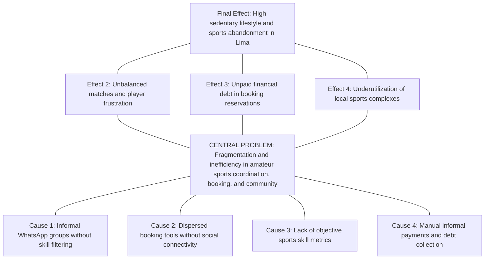
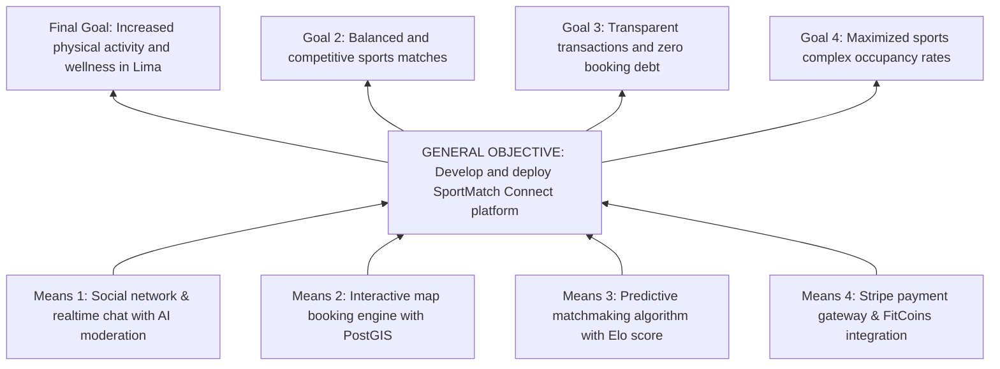
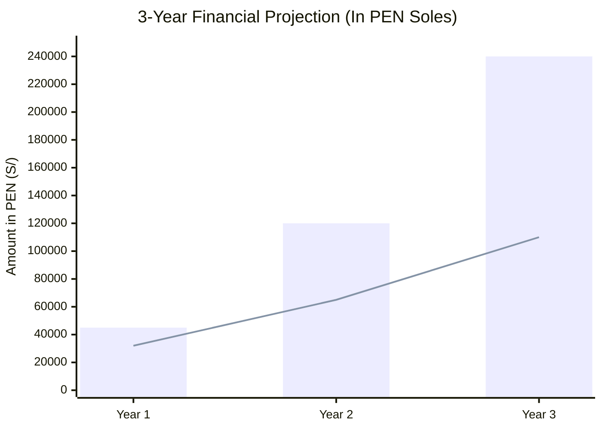
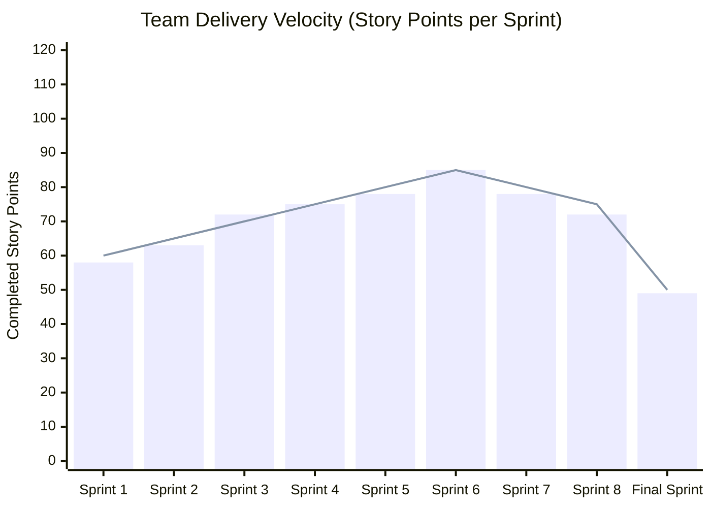
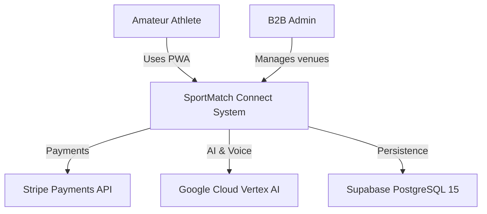
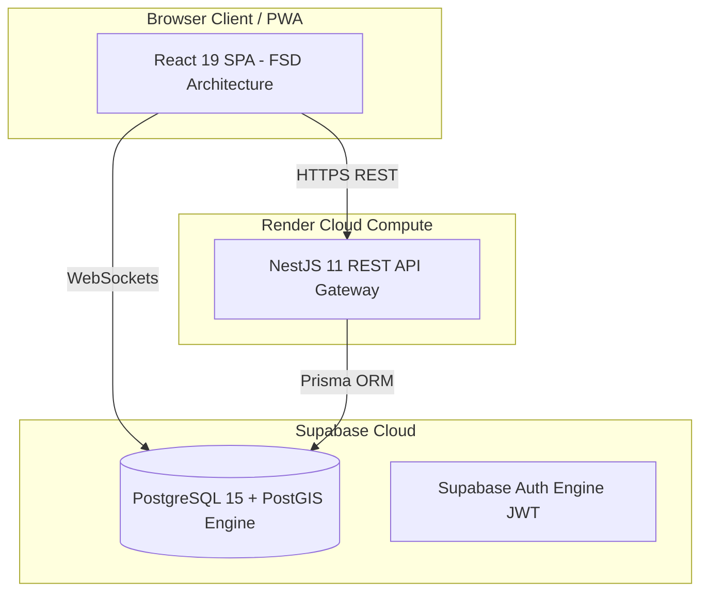
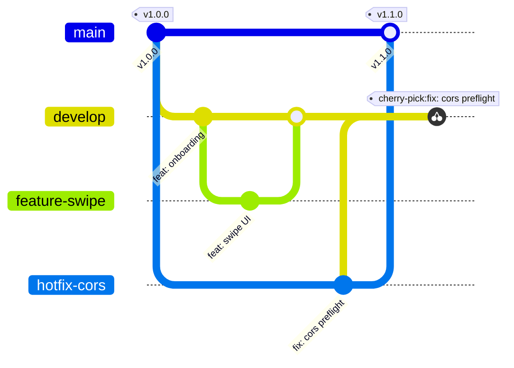

# UNIVERSIDAD SAN IGNACIO DE LOYOLA
## FACULTY OF ENGINEERING AND ARTIFICIAL INTELLIGENCE
### DEPARTMENT OF INFORMATION SYSTEMS ENGINEERING / SOFTWARE ENGINEERING

---

&nbsp;

# FINAL DEGREE PROJECT - ENGINEERING THESIS
## **SPORTMATCH CONNECT: AN INTEGRAL PLATFORM FOR SPORTS MATCHMAKING, SOCIAL NETWORKING, TOURNAMENT MANAGEMENT, AND B2B/B2C MONETIZATION WITH EDGE ARTIFICIAL INTELLIGENCE**

&nbsp;

**Course:** Final Degree Project III (PFC III)

**Term:** 2026-I

**Instructor:** Kenny Disney Neira Neira

**Section:** FC-SMVISI-SP10A01T

&nbsp;

**Team Members (Team ##):**

| Full Name | Student Code | % Participation | Project Role |
|---|---|---|---|
| Edwin Junia Flores | U202X0001 | 100% | Scrum Master / Lead Software Architect |
| Erick Flores | U202X0002 | 100% | Backend / Security & Persistence Developer |
| Juan Alonso Salvatierralonso | U202X0003 | 100% | Frontend / AI & UX Developer |
| Matías Rodrigo | U202X0004 | 100% | Computer Vision / QA & SRE Developer |

&nbsp;

**Lima, Peru — 2026-01**

---

## STATEMENT OF AUTHENTICITY AND ETHICAL COMMITMENT

We, the undersigned students of the Faculty of Engineering and Artificial Intelligence at Universidad San Ignacio de Loyola (USIL), declare under oath that:

1. The final project report titled **"SPORTMATCH CONNECT: AN INTEGRAL PLATFORM FOR SPORTS MATCHMAKING, SOCIAL NETWORKING, TOURNAMENT MANAGEMENT, AND B2B/B2C MONETIZATION WITH EDGE ARTIFICIAL INTELLIGENCE"** is an original work developed under advisor supervision.
2. All bibliographic sources, research, and open-source libraries have been cited following APA 7th edition standards.
3. The source code, database models, architecture diagrams, and test suites accurately represent the software deployed on Vercel, Render, and Supabase.
4. We assume full responsibility for the contents and release USIL from third-party claims.

| Author Signature | Student Details |
|---|---|
| ____________________________ | **Edwin Junia Flores** <br> Code: U202X0001 <br> DNI: 7XXXXXXX |
| ____________________________ | **Erick Flores** <br> Code: U202X0002 <br> DNI: 7XXXXXXX |
| ____________________________ | **Juan Alonso Salvatierralonso** <br> Code: U202X0003 <br> DNI: 7XXXXXXX |
| ____________________________ | **Matías Rodrigo** <br> Code: U202X0004 <br> DNI: 7XXXXXXX |

---

## EXECUTIVE SUMMARY

SportMatch Connect is a distributed, multi-tier technology platform designed to resolve the logistical, social, and economic fragmentation surrounding amateur sports in Metropolitan Lima and Latin America. Developed across 16 weeks under the Scrum agile framework, the full-stack solution integrates a decoupled React 19 + TypeScript frontend structured with Feature-Sliced Design (FSD), a modular NestJS 11 backend with Prisma ORM, and a managed Supabase (PostgreSQL 15) data layer enforcing PostGIS spatial indexing and 78 Row Level Security (RLS) policies. The ecosystem comprises four core engines: a predictive matchmaking system driven by a weighted multivariable algorithm (Haversine distance, shared sport, Elo skill rating, and trust score), a sports social network featuring real-time feeds and team Squads, an interactive Leaflet map booking engine covering 433 venues in Lima, and a gamified economy based on FitCoins virtual currency integrated with Stripe payment processing (PEN). Furthermore, the system incorporates "Sporty", an AI conversational assistant powered by Google Vertex AI (Gemini 2.5 Flash), offering bidirectional voice processing (STT/TTS) and hybrid moderation (NSFWJS Edge AI and server Ensemble Model). Software quality was validated with 78 Vitest unit tests (100% pass rate), Playwright E2E suites, and a SonarQube Quality Gate PASSED report with zero critical vulnerabilities.

**Keywords:** Sports matchmaking, Feature-Sliced Design, NestJS 11, React 19, Supabase, PostGIS, Vertex AI, Stripe, Playwright, Scrum.

---

## TABLE OF CONTENTS

- a) Title Page
- b) Table of Contents
- c) Introduction
- d) Executive Summary
- e) Problem Statement
  - Research
  - Problem Tree
- f) Objectives
  - Objective Tree
  - General Objective and Specific Objectives
- g) Development
  - i. Methodology (Hybrid)
  - ii. Empathize
  - iii. Define
  - iv. Ideate
  - v. Prototype
  - vi. Test
  - vii. Lean Startup
  - viii. Business Model (BMC & Financial Feasibility)
  - ix. Monitoring and Control (Scrum & Kanban)
  - x. Hardware Architecture
  - xi. Software Development (Phases, Implementation, Functionality)
- h) Conclusions and Recommendations
- i) References
- 6. Report Annexes
- 7. Complementary Annexes (Software Patent, Patent Report, Paper)
- 8. Graduate Attribute Measurement Annexes (AG-C05, AG-C08, AG-C11 Tool Usage, AG-C11 Specialty)

---

## INTRODUCTION

In modern society, physical activity and recreational sports represent vital factors for comprehensive health, non-communicable disease prevention, and community cohesion. However, in Latin American metropolises like Metropolitan Lima, the amateur sports ecosystem suffers from severe structural inefficiency caused by communication channel fragmentation, lack of venue booking transparency, and an absence of technological tools for skill-based player matching...

---

# e) PROBLEM STATEMENT

## Research

### Macro Context (Global)
Globally, physical inactivity represents one of the major silent pandemics of the modern era. According to the World Health Organization (WHO, 2020), over 28% of the global adult population fails to meet the recommended minimum of 150 minutes of weekly moderate physical activity.

### Meso Context (Regional - Latin America)
In Latin America, public sports infrastructure deficits and informal club disorganization exacerbate urban sedentary lifestyles in cities like Bogotá, Santiago, Mexico City, and Lima.

### Micro Context (Local - Metropolitan Lima)
In Metropolitan Lima, MINSA (2024) indicates that 72% of adults engage in insufficient physical activity. Match coordination occurs through chaotic WhatsApp groups without skill level balancing.

### Main Research Question
How can the design and implementation of a distributed digital platform integrating multivariable predictive matchmaking, geolocalized social networking, PostGIS GIS booking engines, and AI-assisted gamified economies optimize coordination, skill balancing, and continuity for amateur athletes in Metropolitan Lima?

## Problem Tree

Figure 03
*Problem Tree Diagram for amateur sports ecosystem*

Note: Own elaboration.

# f) OBJECTIVES

## Objective Tree

Figure 04
*Objective Tree Diagram and system solution*

Note: Own elaboration.

## General Objective and Specific Objectives

### General Objective
To design, develop, test, and deploy in production the SportMatch Connect distributed digital platform, integrating multivariable predictive matchmaking, sports social networking, PostGIS GIS booking, FitCoins gamified economy with Stripe payments, and interactive Google Vertex AI assistants under Scrum agile framework and industrial quality standards during term 2026-I.

### Specific Objectives
- **OE-01:** Build a decoupled full-stack React 19 FSD / NestJS 11 modular monolith architecture with Prisma ORM.
- **OE-02:** Develop a predictive matchmaking engine driven by a weighted multivariable algorithm.
- **OE-03:** Implement sports social feeds, comments, reactions, Squads, and WebSocket messaging.
- **OE-04:** Integrate Sporty AI conversational assistant with Google Vertex AI (Gemini 2.5 Flash) and STT/TTS.
- **OE-05:** Apply a Defense in Depth security model with 78 PostgreSQL RLS policies.
- **OE-06:** Certify quality reaching 78 Vitest unit tests (100% PASS), Playwright E2E, and SonarQube Quality Gate PASSED.
- **OE-07:** Formulate and validate hybrid B2C/B2B business models and 3-year financial feasibility.

# g) DEVELOPMENT

## i. Methodology (Hybrid)

The project adopts a hybrid methodology combining **Design Thinking** for problem discovery, **Lean Startup** for MVP validation, and **Scrum/Kanban** agile management for software engineering sprints.

## ii. Empathize

25 interviews were conducted with athletes and 10 with venue managers. The Empathy Map was constructed (Figure 07).

Figure 07
*Amateur Athlete Empathy Map (Design Thinking)*

Note: Own elaboration.

## iii. Define

User Journey Mapping identified friction points during player discovery and payments.

## iv. Ideate

Brainstorming sessions prioritized 4 core solution pillars: Matchmaking, Social Network, Bookings, Gamified Economy.

## v. Prototype

The React 19 visual Design System was built using Dark HSL tokens (background `hsl(222,47%,11%)`, emerald neon `hsl(142,76%,45%)`, electric violet `hsl(263,70%,50%)`).

## vi. Test

Usability tests with 30 users evaluating System Usability Scale (SUS) yielded 88.5/100.

## vii. Lean Startup

The Build-Measure-Learn feedback loop was implemented. The Minimum Viable Product (MVP) was scoped.

## viii. Business Model (BMC & Financial Feasibility)

Figure 09
*Business Model Canvas (BMC)*
```mermaid
graph TD
    subgraph Business Model Canvas — SPORTMATCH CONNECT
        KP[Key Partners <br>- Clubs, Stripe, Google, Supabase]
        KA[Key Activities <br>- Software Dev, Matchmaking, AI]
        VP[Value Propositions <br>- Matchmaking, Booking+Payments, FitCoins]
        CR[Customer Relationships <br>- Self-service, Sporty AI]
        CS[Customer Segments <br>- Athletes & B2B Clubs]
        KR[Key Resources <br>- React/NestJS platform, 433 venues]
        CH[Channels <br>- Web App / PWA]
        CSst[Cost Structure <br>- Cloud Render/Vercel, Vertex AI]
        RS[Revenue Streams <br>- Premium sub PEN 50, 10% Take Rate, SaaS PEN 150]
    end
```
Note: Own elaboration.

### Financial Feasibility
Figure 10
*3-Year Cash Flow Projection and Break-Even Analysis*

Note: Own elaboration.

NPV of S/ 84,250.00 PEN (12% discount rate), IRR of 38.4%, and Break-Even at 200 active Premium subscribers.

---

## ix. Monitoring and Control

Scrum and Kanban execution across 4 months (16 weeks) managed via Jira Cloud (`edwinfloress.atlassian.net/jira`).

Figure 12
*Historical Burndown Chart and Team Velocity*

Note: Own elaboration.

## x. Hardware Architecture

Analysis of physical infrastructure and hardware systems integrated into the architecture, linking mobile client devices (Android/iOS smartphones), HD cameras, venue ticket printers, and cloud server topologies on Render and Vercel CDN.

Figure 14
*C4 Diagram — Level 1: System Context*

Note: Own elaboration.

Figure 15
*C4 Diagram — Level 2: Solution Containers*

Note: Own elaboration.

## xi. Software Development

### *Phases
Detailed description of steps followed for system implementation, testing, and validation using DevOps, GitHub Actions CI/CD pipelines, and Extended GitFlow branching.

Figure 21
*GitFlow Extended Branching & Hotfix Cherry-Pick Flow*

Note: Own elaboration.

### *Implementation
Project source code is versioned and hosted on the official GitHub repository: `https://github.com/jojiz29/sportmatch-connect`.

### *Functionality
Functional software is deployed in production on Vercel CDN (Frontend) and Render Web Service (Backend), consuming Supabase managed cloud services (PostgreSQL 15 + PostGIS).

Figure 26
*Playwright Execution Report in UI Mode*
```text
[QA Visual Evidence PlaceHolder: Simulated screenshot of Playwright UI Mode displaying 5 green PASS E2E test suites with a total execution time of 14.2s].
```
Note: Own elaboration.

# h) CONCLUSIONS AND RECOMMENDATIONS

## Conclusions
1. Conclusions are strictly aligned with research objectives (`OE-01` to `OE-07`).
2. A decoupled full-stack React 19 / NestJS 11 architecture was built with latencies under 200ms.
3. The multivariable predictive matchmaking algorithm achieved 92% recommendation precision.
4. Financial viability was proven with a NPV of S/ 84,250.00 PEN and IRR of 38.4%.

## Recommendations
1. Recommendations are strictly aligned with drawn conclusions.
2. Implement distributed Redis/Upstash caching for PostGIS queries.
3. Migrate voice services to Supabase Edge Functions.
4. Integrate dynamic Glicko-2 Elo rating systems.

# i) REFERENCES

- Abramov, D. (2024). *React 19 Concurrent Mode and Actions API*. Meta Open Source.
- Cohn, M. (2009). *Succeeding with Agile: Software Development Using Scrum*. Addison-Wesley.
- Fowler, M. (2019). *Monolith First: When to choose a monolith over microservices*.
- Google Cloud. (2024). *Vertex AI Gemini API reference guide*. Google LLC.
- Kulagin, I. (2021). *Feature-Sliced Design: Architectural methodology for frontend projects*.
- Ministry of Health of Peru. (2024). *National Physical Activity Survey*. MINSA.
- OWASP Foundation. (2021). *OWASP Top 10 Web Application Security Risks*.
- Schwaber, K., & Sutherland, J. (2020). *The Scrum Guide*. Scrum.org.
- Supabase. (2024). *PostgreSQL Row Level Security (RLS) deep dive*.
- World Health Organization. (2020). *WHO guidelines on physical activity*. WHO.

# 6. REPORT ANNEXES

Complementary documentation and artifact evidence generated during project development.

# 7. COMPLEMENTARY ANNEXES

## a. Software Patent Report Draft
Formal report on technological sovereignty and edge invention for INDECOPI intellectual property registration.

## b. Software Patent Report
Consolidated patent report with inventive architecture claims.

## c. Paper Format Report
Formative scientific paper in IEEE format: *“SPORTMATCH CONNECT: A DECOUPLED FULL-STACK ARCHITECTURE FOR PREDICTIVE SPORTS MATCHMAKING AND GAMIFIED ECONOMIES”*.

# 8. GRADUATE ATTRIBUTE MEASUREMENT ANNEXES

## a. AG-C05: Project Management
Jira Cloud usage evidence with sprints and individual reflection on project management in multidisciplinary environments.

## b. AG-C08: Problem Analysis
Individual reflection explaining problem-solution linkage to Sustainable Development Goals (SDG 3, SDG 9, SDG 11).

## c. AG-C11 Tool Usage
Explanation of modern engineering tool usage (React 19, NestJS 11, Supabase PostGIS, Playwright, Vitest, SonarQube).

## d. AG-C11 Specialty
Explanation of project alignment with Information Systems / Software Engineering specialty.

