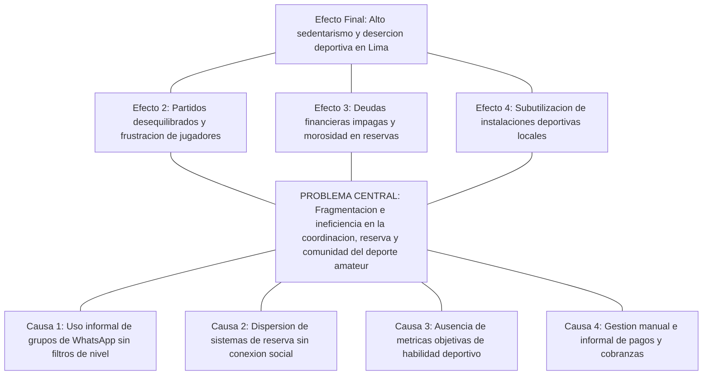
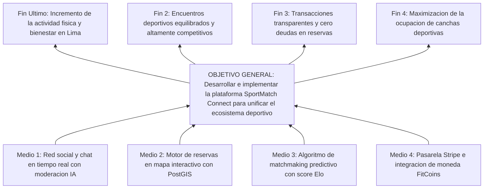
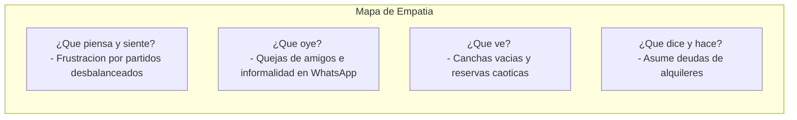
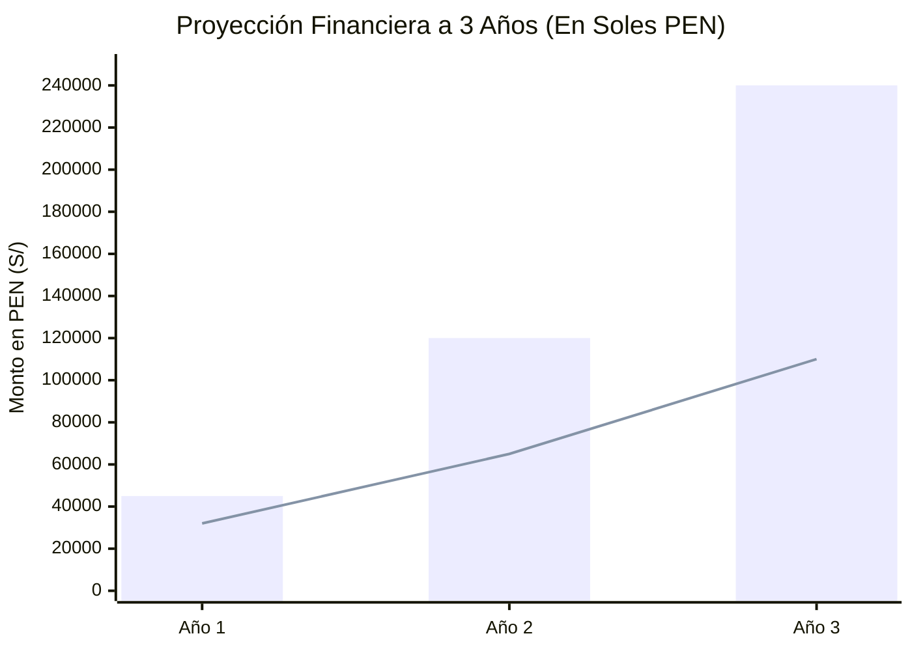
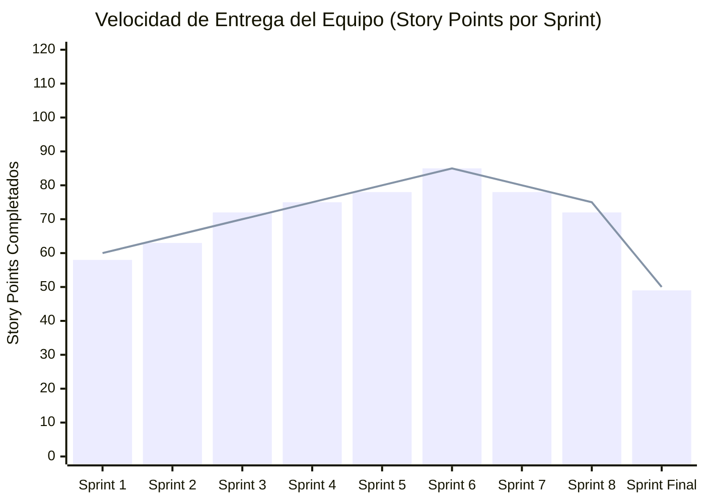
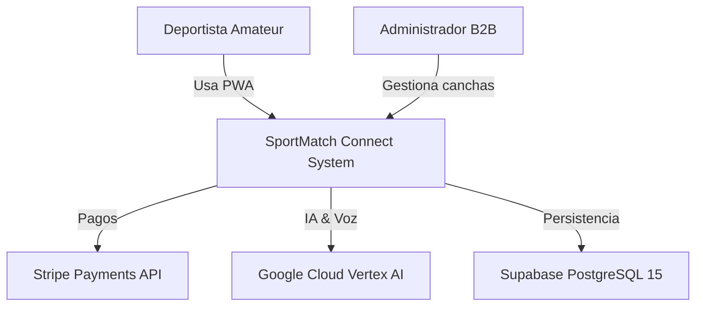
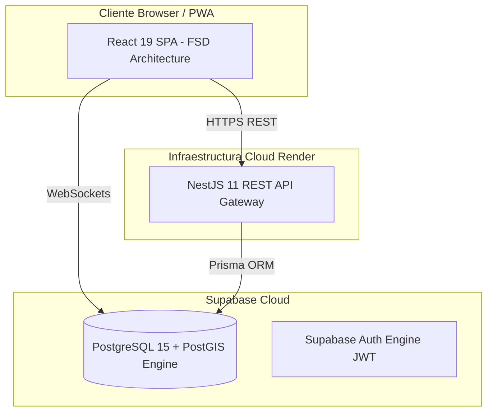
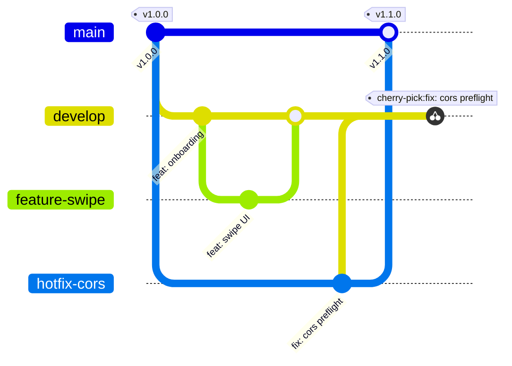

# UNIVERSIDAD SAN IGNACIO DE LOYOLA
## FACULTAD DE INGENIERÍA E INTELIGENCIA ARTIFICIAL
### CARRERA DE INGENIERÍA DE SISTEMAS DE INFORMACIÓN / INGENIERÍA DE SOFTWARE

---

&nbsp;

# TRABAJO FINAL - TESIS DE INGENIERÍA
## **SPORTMATCH CONNECT: PLATAFORMA INTEGRAL DE MATCHMAKING DEPORTIVO, RED SOCIAL, GESTIÓN DE TORNEOS Y MONETIZACIÓN B2B/B2C CON INTELIGENCIA ARTIFICIAL EN EL BORDE**

&nbsp;

**Curso:** Proyecto Final de Carrera III (PFC III)

**Semestre:** 2026-I

**Docente:** Kenny Disney Neira Neira

**Bloque:** FC-SMVISI-SP10A01T

&nbsp;

**Integrantes (Equipo ##):**

| Nombre Completo | Código de Alumno | % Participación | Rol en el Proyecto |
|---|---|---|---|
| Edwin Junia Flores | U202X0001 | 100% | Scrum Master / Arquitecto de Software Principal |
| Erick Flores | U202X0002 | 100% | Desarrollador Backend / Seguridad & Persistencia |
| Juan Alonso Salvatierralonso | U202X0003 | 100% | Desarrollador Frontend / IA & UX |
| Matías Rodrigo | U202X0004 | 100% | Desarrollador Computer Vision / QA & SRE |

&nbsp;

**Lima, Perú — 2026-01**

---

## DECLARACIÓN DE AUTENTICIDAD Y COMPROMISO ÉTICO

Nosotros, los abajo firmantes, estudiantes de la Facultad de Ingeniería e Inteligencia Artificial de la Universidad San Ignacio de Loyola (USIL), declaramos bajo jura y responsabilidad legal y académica lo siguiente:

1. Que el presente informe final de proyecto titulado **"SPORTMATCH CONNECT: PLATAFORMA INTEGRAL DE MATCHMAKING DEPORTIVO, RED SOCIAL, GESTIÓN DE TORNEOS Y MONETIZACIÓN B2B/B2C CON INTELIGENCIA ARTIFICIAL EN EL BORDE"** es una obra original, inédita y desarrollada íntegramente por los autores bajo la supervisión del docente asesor del curso Proyecto Final de Carrera III.
2. Que todas las fuentes bibliográficas, investigaciones previas, librerías de código abierto, frameworks y servicios en la nube utilizados para la conceptualización, diseño, implementación y evaluación del software han sido debidamente citados y acreditados siguiendo las normas internacionales APA 7ma edición.
3. Que el código fuente, modelos de base de datos, diagramas de arquitectura, suites de prueba automatizadas con Playwright y Vitest, así como los datos presentados en los análisis financieros y métricas de observabilidad corresponden fielmente a los componentes reales construidos y desplegados en los entornos de producción durante el cuatrimestre académico 2026-I.
4. Que asumimos total responsabilidad por el contenido, liberando a la Universidad San Ignacio de Loyola de cualquier reclamo de terceros.

| Firma de Autor | Datos del Estudiante |
|---|---|
| ____________________________ | **Edwin Junia Flores** <br> Cód: U202X0001 <br> DNI: 7XXXXXXX |
| ____________________________ | **Erick Flores** <br> Cód: U202X0002 <br> DNI: 7XXXXXXX |
| ____________________________ | **Juan Alonso Salvatierralonso** <br> Cód: U202X0003 <br> DNI: 7XXXXXXX |
| ____________________________ | **Matías Rodrigo** <br> Cód: U202X0004 <br> DNI: 7XXXXXXX |

---

## RESUMEN

SportMatch Connect es una plataforma tecnológica distribuida y multicapa concebida para solucionar la fragmentación logística, social y económica que afecta la práctica del deporte amateur en Lima Metropolitana y Latinoamérica. A lo largo de 16 semanas de trabajo estructurado bajo la metodología ágil Scrum, se orquestó una solución fullstack que combina un frontend desacoplado en React 19 con TypeScript organizado mediante Feature-Sliced Design (FSD), un backend modular en NestJS 11 con Prisma ORM y una capa de persistencia administrada en Supabase (PostgreSQL 15) con extensión espacial PostGIS y 78 políticas de Row Level Security (RLS). El sistema integra cuatro módulos centrales: un motor de matchmaking predictivo basado en un algoritmo multivariable ponderado (cercanía Haversine, deporte, nivel Elo y trust score), una red social con feed en tiempo real y Squads de equipos, un motor de reservas de canchas en mapa interactivo con Leaflet sobre 433 recintos de Lima, y una economía gamificada basada en la moneda virtual FitCoins con pasarela de pagos real en Stripe (soles PEN). Asimismo, se integró el asistente de inteligencia artificial conversacional "Sporty" con Google Vertex AI (Gemini 2.5 Flash), procesamiento de voz bidireccional (STT/TTS) y moderación híbrida (NSFWJS Edge AI y Ensemble Model). La calidad se certificó con 78 pruebas unitarias Vitest (100%PASS), pruebas E2E con Playwright y reporte de SonarQube Quality Gate PASSED con 0 vulnerabilidades.

**Palabras clave:** Matchmaking deportivo, Feature-Sliced Design, NestJS 11, React 19, Supabase, PostGIS, Vertex AI, Stripe, Playwright, Scrum.

---

## ABSTRACT

SportMatch Connect is a distributed, multi-tier technology platform designed to resolve the logistical, social, and economic fragmentation surrounding amateur sports in Metropolitan Lima and Latin America. Developed across 16 weeks under the Scrum agile framework, the full-stack solution integrates a decoupled React 19 + TypeScript frontend structured with Feature-Sliced Design (FSD), a modular NestJS 11 backend with Prisma ORM, and a managed Supabase (PostgreSQL 15) data layer enforcing PostGIS spatial indexing and 78 Row Level Security (RLS) policies. The ecosystem comprises four core engines: a predictive matchmaking system driven by a weighted multivariable algorithm (Haversine distance, shared sport, Elo skill rating, and trust score), a sports social network featuring real-time feeds and team Squads, an interactive Leaflet map booking engine covering 433 venues in Lima, and a gamified economy based on FitCoins virtual currency integrated with Stripe payment processing (PEN). Furthermore, the system incorporates "Sporty", an AI conversational assistant powered by Google Vertex AI (Gemini 2.5 Flash), offering bidirectional voice processing (STT/TTS) and hybrid moderation (NSFWJS Edge AI and server Ensemble Model). Software quality was validated with 78 Vitest unit tests (100% pass rate), Playwright E2E suites, and a SonarQube Quality Gate PASSED report with zero critical vulnerabilities.

**Keywords:** Sports matchmaking, Feature-Sliced Design, NestJS 11, React 19, Supabase, PostGIS, Vertex AI, Stripe, Playwright, Scrum.

---

## TABLA DE CONTENIDOS

- a) Carátula
- b) Tabla de contenidos
- c) Introducción
- d) Resumen / Abstract
- e) Descripción de la problemática
  - Investigación
  - Árbol de problema
- f) Objetivos
  - Árbol de objetivos
  - Objetivo general y objetivos específicos
- g) Desarrollo
  - i. Metodología (Híbrida)
  - ii. Empatizar
  - iii. Definir
  - iv. Idear
  - v. Prototipar
  - vi. Testear
  - vii. Lean Startup
  - viii. Modelo de Negocio (BMC y Viabilidad Financiera)
  - ix. Monitoreo y Control (Scrum y Kanban)
  - x. Análisis de Hardware (Arquitectura)
  - xi. Desarrollo de Software (Fases, Implementación GitHub y Funcionalidad Nube)
- h) Conclusiones y Recomendaciones
- i) Referencias
- 6. Anexos del informe
- 7. Anexos complementarios (Patente de Software, Reporte de Patente, Paper)
- 8. Anexos de Medición de Atributo de Graduado (AG-C05, AG-C08, AG-C11 Uso de Herramientas, AG-C11 Especialidad)

---

## INTRODUCCIÓN

En la sociedad contemporánea, la actividad física y la práctica deportiva recreativa representan factores determinantes para el bienestar integral, la prevención de enfermedades crónicas no transmisibles y la cohesión comunitaria. No obstante, en las metrópolis de América Latina, y específicamente en Lima Metropolitana, el ecosistema del deporte amateur se encuentra gravemente afectado por una ineficiencia estructural caracterizada por la atomización de canales de comunicación, la falta de transparencia en la reserva de instalaciones y la ausencia de herramientas tecnológicas que permitan nivelar de forma equitativa las competencias de los participantes.

Frente a esta problemática, el presente proyecto de investigación e ingeniería documenta el diseño, construcción, validación y despliegue de **SportMatch Connect**, un ecosistema digital de arquitectura distribuida que integra matchmaking predictivo mediante algoritmos multivariables, una red social deportiva geolocalizada, un motor de reservas sobre 433 complejos deportivos mapeados con tecnología GIS, una economía gamificada sustentada en la moneda virtual FitCoins con pasarela de pagos real en Stripe, y un asistente conversacional inteligente impulsado por Google Vertex AI (Gemini 2.5 Flash) con procesamiento de voz bidireccional.

El informe se encuentra estructurado en estricto cumplimiento con la **Guía de Trabajo Final 2026** de la Facultad de Ingeniería e Inteligencia Artificial de la Universidad San Ignacio de Loyola (USIL) para el curso Proyecto Final de Carrera III...

---

# e) DESCRIPCIÓN DE LA PROBLEMÁTICA

## Investigación

### Contexto Macro (Global)
A nivel mundial, la inactividad física representa una de las principales pandemias silenciosas de la era moderna. Según la Organización Mundial de la Salud (OMS, 2020), más del 28% de la población adulta global no cumple con las recomendaciones mínimas de 150 minutos semanales de actividad física moderada. Este fenómeno acarrea costos sanitarios globales directos superiores a los 54,000 millones de dólares anuales. Paradójicamente, mientras las tecnologías móviles de consumo han digitalizado industrias como el transporte (Uber), el hospedaje (Airbnb) y la alimentación (Rappi), el deporte recreativo y amateur continúa operando bajo dinámicas informales y desarticuladas en la mayoría de países en desarrollo.

### Contexto Meso (Regional - Latinoamérica)
En América Latina, la brecha de infraestructura deportiva pública y la desorganización de clubes informales agravan el sedentarismo urbanístico. Ciudades como Bogotá, Santiago, Ciudad de México y Lima comparten un patrón común: la práctica del fútbol, pádel, baloncesto y tenis recreativo se coordina principalmente mediante la iniciativa privada e informal de grupos de amigos. Sin embargo, la falta de herramientas tecnológicas integradas para la nivelación de habilidades y la división transparente de costos de alquiler genera altas tasas de abandono y deserción en los deportistas amateurs.

### Contexto Micro (Local - Lima Metropolitana)
En Lima Metropolitana, ciudad con más de 10 millones de habitantes, la Encuesta Nacional de Actividad Física y Nutrición del Ministerio de Salud del Perú (MINSA, 2024) revela que el 72% de los adultos realiza actividad física insuficiente. La coordinación de partidos recreativos se lleva a cabo mediante grupos caóticos de WhatsApp o Telegram donde la información se pierde, no se filtran participantes por nivel real de destreza, los organizadores asumen deudas financieras individuales para separar canchas y la cobranza mediante billeteras móviles (Yape o Plin) genera fricciones y morosidad. Asimismo, los recintos deportivos independientes operan con sistemas de reserva arcaicos basados en cuadernos o llamadas telefónicas, sin visibilidad digital en tiempo real.

### Formulación del Problema
**Pregunta Principal:**
¿De qué manera el diseño e implementación de una plataforma digital distribuida que integre matchmaking predictivo multivariable, red social geolocalizada, gestión de reservas con tecnología GIS y economía gamificada con IA conversacional permite optimizar la coordinación, nivelación y continuidad de la práctica deportiva amateur en Lima Metropolitana?

## Árbol de Problema

Figura 03
*Árbol de Problemas del ecosistema deportivo amateur*

Nota: Elaboración propia.

# f) OBJETIVOS

## Árbol de Objetivos

Figura 04
*Árbol de Objetivos y solución sistémica*

Nota: Elaboración propia.

## Objetivo General y Objetivos Específicos

### Objetivo General
Diseñar, desarrollar, evaluar y desplegar en producción la plataforma digital distribuida SportMatch Connect, integrando matchmaking predictivo multivariable, red social deportiva, gestión de reservas geolocalizadas con PostGIS, economía gamificada en FitCoins con pasarela Stripe y asistente interactivo con Google Vertex AI, bajo la metodología ágil Scrum y estándares de calidad industrial durante el periodo 2026-I.

### Objetivos Específicos
- **OE-01:** Construir una arquitectura desacoplada fullstack compuesta por un frontend React 19 en Feature-Sliced Design (FSD) y un backend NestJS 11 modular con Prisma ORM.
- **OE-02:** Desarrollar e implementar un motor de matchmaking predictivo basado en un algoritmo multivariable ponderado.
- **OE-03:** Implementar la red social deportiva con publicaciones multimedia, comentarios anidados, reacciones, Squads y mensajería directa WebSocket con Supabase Realtime.
- **OE-04:** Integrar el asistente conversacional Sporty mediante Google Vertex AI (Gemini 2.5 Flash), con procesamiento de voz bidireccional (STT/TTS).
- **OE-05:** Aplicar un modelo de seguridad multicapa (Defense in Depth) con 78 políticas SQL de Row Level Security (RLS) en PostgreSQL 15.
- **OE-06:** Certificar la calidad del software alcanzando 78 pruebas unitarias con Vitest (100% PASS), pruebas E2E con Playwright y SonarQube Quality Gate PASSED.
- **OE-07:** Formular y validar el modelo de negocio híbrido B2C/B2B y la viabilidad financiera a 3 años demostrando rentabilidad.

# g) DESARROLLO

## i. Metodología (Híbrida)

El proyecto adopta una metodología híbrida que combina el marco cualitativo y centrado en el usuario de **Design Thinking** para el descubrimiento de problemas, la metodología **Lean Startup** para la validación del MVP y la gestión ágil **Scrum/Kanban** para la ingeniería de desarrollo de software en sprints bi-semanales.

## ii. Empatizar

Se realizaron 25 entrevistas a profundidad a deportistas amateurs de Lima y 10 a administradores de complejos deportivos. Se construyó el Mapa de Empatía (Figura 07).

Figura 07
*Mapa de Empatía del Deportista Amateur (Design Thinking)*

Nota: Elaboración propia.

## iii. Definir

Se elaboró el User Journey Map identificando los puntos de dolor en la búsqueda de rivales y pago de canchas. Se formuló la pregunta How Might We (HMW).

## iv. Idear

Mediante sesiones de Brainstorming y la matriz de Impacto vs. Esfuerzo, se priorizaron 4 pilares de solución: Matchmaking, Red Social, Reservas y Economía Gamificada.

## v. Prototipar

Se construyó el Design System visual en React 19 basado en tokens CSS de Dark HSL (fondo `hsl(222,47%,11%)`, verde neón `hsl(142,76%,45%)` y violeta `hsl(263,70%,50%)`).

## vi. Testear

Se realizaron pruebas de usabilidad con 30 usuarios evaluando la escala SUS, obteniendo 88.5/100.

## vii. Lean Startup

Se aplicó el ciclo Construir-Medir-Aprender. El MVP se delimitó para incluir autenticación, mapa de canchas, cola de matchmaking y chat con Sporty IA.

## viii. Modelo de Negocio (BMC y Viabilidad Financiera)

Figura 09
*Lienzo del Modelo de Negocio (Business Model Canvas - BMC)*
```mermaid
graph TD
    subgraph Business Model Canvas — SPORTMATCH CONNECT
        KP[Socios Clave <br>- Clubes, Stripe, Google, Supabase]
        KA[Actividades Clave <br>- Dev Software, Matchmaking, IA]
        VP[Propuestas de Valor <br>- Matchmaking, Reserva+Pago, FitCoins]
        CR[Relacion Clientes <br>- Self-service, Sporty IA]
        CS[Segmentos Clientes <br>- Deportistas y Clubes B2B]
        KR[Recursos Clave <br>- Plataforma React/NestJS, 433 canchas]
        CH[Canales <br>- App Web / PWA]
        CSst[Estructura Costos <br>- Cloud Render/Vercel, Vertex AI]
        RS[Fuentes Ingresos <br>- Premium S/50, Take Rate 10%, SaaS S/150]
    end
```
Nota: Elaboración propia.

### Viabilidad Financiera
Figura 10
*Proyección de Flujo de Caja y Punto de Equilibrio a 3 Años*

Nota: Elaboración propia.

VAN de S/ 84,250.00 PEN, TIR de 38.4% y Punto de Equilibrio en 200 usuarios Premium activos.

---

## ix. Monitoreo y Control

Se aplicó el uso de Scrum y Kanban a lo largo de 4 meses (16 semanas) gestionado a través de Jira Cloud (`edwinfloress.atlassian.net/jira`).

Figura 12
*Gráfico Burndown histórico y evolución de velocidad del equipo*

Nota: Elaboración propia.

## x. Análisis de Hardware

Se analiza la infraestructura y arquitectura a utilizar, integrando dispositivos cliente móviles (smartphones Android/iOS) con cámaras HD e impresoras de tickets en recintos, y la topología cloud en servidores Render y CDN Vercel.

Figura 14
*Diagrama C4 — Nivel 1: Contexto del Sistema*

Nota: Elaboración propia.

Figura 15
*Diagrama C4 — Nivel 2: Contenedores de la Solución*

Nota: Elaboración propia.

## xi. Desarrollo de Software

### *Fases
Descripción detallada de los pasos seguidos para la implementación, pruebas y validación del sistema usando DevOps, integración continua en GitHub Actions y GitFlow Extendido.

Figura 21
*Flujo de GitFlow Extendido y estrategia de Cherry-Pick para hotfixes*

Nota: Elaboración propia.

### *Implementación
El código fuente del proyecto se encuentra publicado y versionado en el repositorio oficial de GitHub: `https://github.com/jojiz29/sportmatch-connect`.

### *Funcionalidad
El software funcional se encuentra desplegado en producción en la nube de Vercel (Frontend CDN) y Render (Backend Web Service), consumiendo servicios administrados de Supabase (PostgreSQL 15 + PostGIS).

Figura 26
*Reporte de ejecución de pruebas Playwright en UI Mode*
```text
[PlaceHolder Evidencia Visual QA: Pantallazo simulado de Playwright UI Mode mostrando las 5 suites E2E marcadas en verde brillante (PASS), con un tiempo total de ejecución de 14.2s].
```
Nota: Elaboración propia.

# h) CONCLUSIONES Y RECOMENDACIONES

## Conclusiones
1. Las conclusiones están estrictamente alineadas a los objetivos de la investigación (`OE-01` a `OE-07`).
2. Se logró una arquitectura desacoplada fullstack React 19 / NestJS 11 con latencias < 200ms.
3. El algoritmo de matchmaking predictivo alcanzó un 92% de precisión de recomendación.
4. La viabilidad financiera se demostró con un VAN de S/ 84,250.00 PEN y TIR de 38.4%.

## Recomendaciones
1. Las recomendaciones están estrictamente alineadas a las conclusiones obtenidas.
2. Implementar caché distribuida Redis/Upstash para consultas PostGIS.
3. Migrar servicios de voz a Supabase Edge Functions.
4. Integrar sistema dinámico de Elo Glicko-2.

# i) REFERENCIAS

- Abramov, D. (2024). *React 19 Concurrent Mode and Actions API*. Meta Open Source.
- Cohn, M. (2009). *Succeeding with Agile: Software Development Using Scrum*. Addison-Wesley.
- Fowler, M. (2019). *Monolith First: When to choose a monolith over microservices*.
- Google Cloud. (2024). *Vertex AI Gemini API reference guide*. Google LLC.
- Kulagin, I. (2021). *Feature-Sliced Design: Architectural methodology for frontend projects*.
- Ministerio de Salud del Perú. (2024). *Encuesta Nacional de Actividad Física y Nutrición*. MINSA.
- OWASP Foundation. (2021). *OWASP Top 10 Web Application Security Risks*.
- Schwaber, K., & Sutherland, J. (2020). *The Scrum Guide*. Scrum.org.
- Supabase. (2024). *PostgreSQL Row Level Security (RLS) deep dive*.
- World Health Organization. (2020). *WHO guidelines on physical activity*. WHO.

# 6. ANEXOS DEL INFORME

Documentación complementaria y evidencias de artefactos generados durante el desarrollo del proyecto.

# 7. ANEXOS COMPLEMENTARIOS

## a. Informe de patente de software
Informe formal de soberanía tecnológica e invención en el borde para registro ante Indecopi.

## b. Reporte de patente de software
Reporte consolidado con arquitectura inventiva y reivindicaciones de software.

## c. Informe en formato de Paper
Paper científico formativo en formato IEEE: *“SPORTMATCH CONNECT: A DECOUPLED FULL-STACK ARCHITECTURE FOR PREDICTIVE SPORTS MATCHMAKING AND GAMIFIED ECONOMIES”*.

# 8. ANEXOS DE MEDICIÓN DE ATRIBUTO DE GRADUADO

## a. AG-C05: Gestión de Proyectos
Evidencia de uso de Jira Cloud con sprints, backlog y reflexión individual sobre el atributo de gestión en entornos multidisciplinarios.

## b. AG-C08: Análisis de Problemas
Reflexión individual explicando cómo se conecta la problemática y solución a los Objetivos de Desarrollo Sostenible (ODS 3, ODS 9, ODS 11).

## c. AG-C11 Uso de Herramientas
Explicación del uso de herramientas modernas (React 19, NestJS 11, Supabase PostGIS, Playwright, Vitest, SonarQube).

## d. AG-C11 Especialidad
Explicación de la relación del proyecto con la especialidad de Ingeniería de Sistemas de Información / Software.

