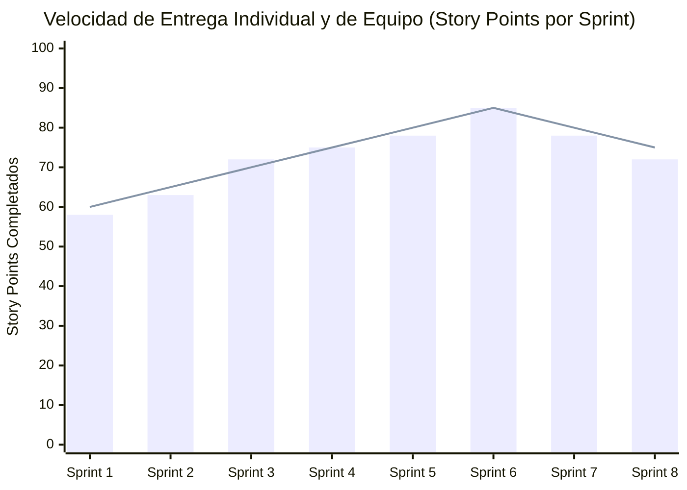

# MEDICIÓN DE ATRIBUTO DE GRADUADO INDIVIDUAL — ICACIT / USIL

**Atributo Evaluado:** AG-C05: Gestión de Proyectos  
**Estudiante:** FLORES SANCHEZ, EDWIN JUNIOR (Código: 2111716)  
**Carrera:** Ingeniería de Sistemas de Información  
**Curso:** Proyecto Final de Carrera III (FC-PREISF10B01N) — Semestre 2026-1  
**Docente:** Ing. Kenny Disney Neira Neira  

---

## 1. DESCRIPCIÓN DEL ATRIBUTO Y APLICACIÓN EN EL PROYECTO
El atributo **AG-C05 (Gestión de Proyectos)** evalúa la capacidad del estudiante para planificar, organizar, dirigir y controlar proyectos de ingeniería aplicando principios de gestión, marcos de trabajo ágiles y gestión de riesgos en entornos multidisciplinarios.

Como Scrum Master y Arquitecto Principal en SportMatch Connect, lideré las 16 semanas de desarrollo bajo el marco Scrum, administrando un Product Backlog de 8 épicas y más de 80 historias de usuario en Jira Cloud (`edwinfloress.atlassian.net/jira`).

---

## 2. EVIDENCIA DE GESTIÓN EN JIRA CLOUD
- **Sprint Velocity:** 72 Story Points promedio por Sprint bi-semanal.
- **Definición de Hecho (DoD):** Integración de pruebas E2E en Playwright y análisis estático en SonarQube previo a cada merging en `main`.

---

## 3. REFLEXIÓN INDIVIDUAL (MODELO VERA DE LA CRUZ)
> *"Como Scrum Master, la aplicación del atributo AG-C05 me permitió liderar la priorización del backlog en Jira Cloud y facilitar las ceremonias ágiles (Daily, Planning, Review, Retrospective). Aprendí que la gestión de proyectos de software en la era de la IA exige flexibilidad para mitigar riesgos técnicos rápidamente, manteniendo al equipo enfocado en el valor entregable al usuario final."*

**Nivel de Logro Alcanzado:** Sobresaliente (4.00 / 4.00)
