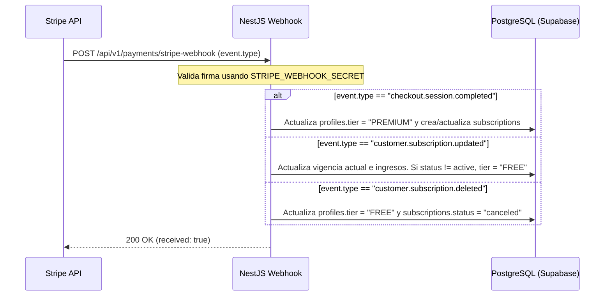

# Documentación Técnica y Comercial de Pricing Tiers (Planes de Precios)

Esta documentación detalla la estructura, configuraciones y esquema de base de datos que sustentan el modelo de monetización (Pricing Tiers) de **SportMatch Connect**, distinguiendo las capacidades y límites de la suscripción **Premium** frente al plan **Free** (Gratuito).

---

## 🏗️ 1. Diferencias Comerciales y Técnicas

SportMatch Connect ofrece dos niveles (Tiers) de servicio para los deportistas de la plataforma:

| Característica / Capacidad | Plan FREE (Gratuito) | Plan PREMIUM |
| :--- | :--- | :--- |
| **Costo Mensual** | S/ 0.00 | **S/ 50.00 PEN** |
| **Matchmaking y Partidos** | Sí | Sí |
| **Seguridad con IA (Smart Block)** | Sí (Activo para todos) | Sí (Activo para todos) |
| **Reserva Colectiva (Split Bill)** | Sí | Sí |
| **Premium Coach IA** | No (CTA / Bloqueado) | **Sí (Conversación 1-a-1)** |
| **Límites de Chat con Coach** | Bloqueado | **Ilimitado** (Límite original de 20/día removido) |
| **Recomendación de Snacks (Telemetría)** | No (Bloqueado) | **Sí (Nutricionista IA)** |
| **Retos Squad vs Squad (Apuestas FitCoins)** | No (Bloqueado) | **Sí (Capitanes de Squads)** |
| **Límite de Apuesta por Reto** | N/A | **Mínimo 100 FC - Máximo 1000 FC** |

### Notas sobre Límites Técnicos Especiales:
* **Límites de Mensajes del Coach IA:** En producción, se estableció un límite inicial de 20 mensajes al día por sesión del usuario premium. A petición del equipo de testing, este límite ha sido puenteado a **Ilimitados** para permitir conversaciones y flujos continuos sin restricciones que interrumpan la experiencia.
* **Resiliencia en Degradación (Modo Sin Conexión):** Si el servidor de base de datos de telemetría de Supabase o el backend NestJS no están disponibles, los módulos de **Coach IA** y **Snacks** entran automáticamente en modo degradado local (offline fallback), simulando respuestas inteligentes basadas en palabras clave y telemetría local, permitiendo que la interfaz siga funcionando para el usuario en lugar de congelarse en un estado de carga.

---

## 💳 2. Guía de Configuración en Stripe

La pasarela de pagos está integrada con **Stripe API** utilizando cobros recurrentes de suscripción.

### Configuración en el Dashboard de Stripe (Pruebas / Producción)
1. **Creación del Producto:**
   * Nombre: `SportMatch Connect Premium`
   * Descripción: `Acceso ilimitado a recomendaciones del Coach IA, nutrición inteligente y retos entre Squads.`
2. **Creación del Precio (Price):**
   * Tipo de cobro: **Recurrente** (Mensual)
   * Moneda: **Soles Peruanos (`pen`)**
   * Monto: **S/ 50.00**

### Variables de Entorno del Sistema
Para habilitar el cobro seguro y el portal de clientes, se deben configurar las siguientes claves en el entorno de ejecución:

#### Frontend (`.env` / Vercel):
* `VITE_STRIPE_PUBLISHABLE_KEY`: Clave pública de Stripe para inicializar Stripe Elements (`pk_test_...` o `pk_live_...`).

#### Backend (`server/.env` / Render):
* `STRIPE_SECRET_KEY`: Clave secreta para transacciones del lado del servidor (`sk_test_...` o `sk_live_...`).
* `STRIPE_WEBHOOK_SECRET`: Clave de firma para verificar la integridad de las notificaciones Webhook (`whsec_...`).

---

## 🗄️ 3. Esquema de Base de Datos (PostgreSQL / Prisma)

El estado de los planes de precios y transacciones se almacena en tres tablas del esquema relacional:

### Tabla: `profiles`
Modifica el campo de nivel de cuenta del usuario principal.
* `id` (`uuid`, PK): ID del usuario que corresponde con `auth.users.id`.
* `tier` (`character varying(255)`, default: `'FREE'`): Nivel de cuenta. Valores válidos: `'FREE'`, `'PREMIUM'`.

### Tabla: `subscriptions`
Sincroniza y almacena el estado detallado del cliente en Stripe.
```prisma
model subscriptions {
  id                     String    @id @default(uuid())
  user_id                String    @unique
  stripe_customer_id     String?
  stripe_subscription_id String?
  status                 String    // 'active', 'canceled', 'incomplete', etc.
  price_id               String?
  tier                   String    // 'FREE' o 'PREMIUM'
  current_period_end     DateTime?
  created_at             DateTime  @default(now())
  updated_at             DateTime  @updatedAt
  
  profile                profiles  @relation(fields: [user_id], references: [id], onDelete: Cascade)
}
```

### Tabla: `premium_nutrition_logs`
Almacena el historial de recomendaciones hechas por el nutricionista IA.
```prisma
model premium_nutrition_logs {
  id              String   @id @default(uuid())
  user_id         String
  match_id        String?
  sport           String
  duration        Int
  intensity       String
  calories_burned Int
  snack_name      String
  snack_image     String?
  calories        Int
  ingredients     String[]
  reasoning       String
  created_at      DateTime @default(now())

  profile         profiles @relation(fields: [user_id], references: [id], onDelete: Cascade)
}
```

---

## 🔗 4. Flujo del Webhook de Stripe en NestJS

El backend escucha y valida las firmas de Stripe en el endpoint `POST /api/v1/payments/stripe-webhook`.

### Ciclo de Eventos Soportados



### Gestión de Errores e Integridad
* Si falla la firma de Stripe (`stripe-signature`), el endpoint responde inmediatamente con `400 Bad Request` para evitar ataques de inyección de payloads.
* Todas las escrituras de actualización a `profiles.tier` y `subscriptions.status` en el webhook se ejecutan dentro de una **transacción de base de datos** para asegurar la atomicidad y evitar estados inconsistentes si el servidor se desconecta a mitad de la operación.
